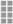

# Hinzufügen eines Lagers

Stocks ordnen Ihre Quellen den Verkaufskanälen (oder Websites) zu und stellen so einen direkten Link zu Verkaufsmengen und Produktinventaren dar.

Beim Erstellen eines benutzerdefinierten Lagers weisen Sie Websites und Quellen zu. Quellen können aktivierte und deaktivierte Quellen enthalten. Sie können beispielsweise ein Lager zu Ihrem Lager hinzufügen, indem Sie den Speicherort für die Verwaltung des Bestands vorbereiten und Sendungen abschließen.

Nach dem Hinzufügen von Quellen müssen Sie die Reihenfolge der Quellen von oben (erste) nach unten (letzte) priorisieren. Diese Bestellung wirkt sich auf Empfehlungen während des Bestellversands aus.

{width="600" zoomable="yes"}

## Lagerbestand hinzufügen

1. Wechseln Sie in der Seitenleiste _Admin_ zu **[!UICONTROL Stores]** > _[!UICONTROL Inventory]_>**[!UICONTROL Stock]**.

1. Klicken Sie auf **[!UICONTROL Add New Stock]**.

1. Erweitern Sie  den Abschnitt **[!UICONTROL General]** und geben Sie einen eindeutigen **[!UICONTROL Name]** ein, um den neuen Bestand zu identifizieren.

   {width="350" zoomable="yes"}

1. Erweitern Sie  im Abschnitt **[!UICONTROL Sales Channels]** und wählen Sie die **[!UICONTROL Websites]** aus, wo dieser Bestand verfügbar ist.

   Halten Sie bei einer Multisite-Installation die Strg-Taste (PC) oder die Befehlstaste (Mac) gedrückt und klicken Sie auf jede Website.

   >[!NOTE]
   >
   >Wenn Sie eine Website oder einen Vertriebskanal auswählen, die einem anderen Lager zugewiesen ist, wird die Zuweisung von dieser Ressource aufgehoben. Alle Sales Channel, die keinem benutzerdefinierten Lager zugewiesen sind, werden dem Standardbestand zugewiesen.

   {width="350" zoomable="yes"}

1. Erweitern Sie  den Abschnitt **[!UICONTROL Sources]** und führen Sie für alle anderen Lager als den Standard Folgendes aus:

   - Klicken Sie auf **[!UICONTROL Assign Sources]**.

   {width="350" zoomable="yes"}

   - Aktivieren Sie die Kontrollkästchen für alle Quellen, die Sie dem Lager zuweisen möchten.

   >[!IMPORTANT]
   >
   >Wenn Sie dieselbe Quelle mehreren Lagern zuweisen, könnte dies zu einem Überverkauf der Produkte führen, die dieser Quelle zugeordnet sind.

   - Klicken Sie auf **[!UICONTROL Done]**.

     Die hinzugefügten Quellen werden in Zugewiesene Quellen angezeigt.

     {width="600" zoomable="yes"}

1. Verwenden Sie das Symbol  , um die Quellen per Drag-and-Drop von oben (erste) nach unten (letzte) in eine Priorität zu ziehen.

   Die Quellbestellung ist bei Versandbestellungen wichtig.

   {width="600" zoomable="yes"}

1. Wählen Sie im Menü _[!UICONTROL Save]_() die Option **[!UICONTROL Save & Close]**.

## Feldbeschreibungen

| Feld | Beschreibung |
|--|--|
| **[!UICONTROL General]** | |
| [!UICONTROL Name] | Name des Lagers. Beispiel: `UK Stock`, `US Stock` |
| **[!UICONTROL Sales Channels]** | |
| [!UICONTROL Websites] | Definiert den [Umfang](../getting-started/websites-stores-views.md#scope-settings) des Lagers, indem der Bestand bestimmten Websites als _Verkaufskanäle_ zugewiesen wird. Wählen Sie eine oder mehrere Websites pro Lager aus. Jede Website kann nur einem Lager zugewiesen werden. |
| **[!UICONTROL Sources]** | |
| [!UICONTROL Assign Sources] | Weist diesem Bestand Inventarquellen zu. Benutzerdefinierte Quellen können nicht dem Standardbestand zugewiesen werden. |
| [!UICONTROL Assigned Sources] | Liste der zugewiesenen Quellen. Ziehen Sie die Quellen mit dem Symbol  in eine priorisierte Reihenfolge, um die Bestellung zu erfüllen und zu versenden.  **[!UICONTROL Code]**- Eindeutige Code-ID für die Quelle. **[!UICONTROL Name]** - Namensbeschreibung für die Quelle. **[!UICONTROL Unassign]**- Entfernt die zugewiesene Quelle mit dem  aus dem Lager. |
