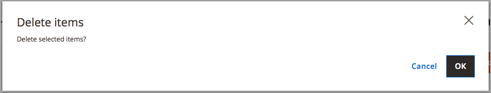

# Löschen von Lagern

Wenn Sie das Lager löschen, werden alle zugewiesenen Websites dem Standardlager zugewiesen. Es wird empfohlen, Websites vor dem Löschen anderen Stocks zuzuweisen.

>[!IMPORTANT]
>
>Das Löschen [Lagers](stocks-manage.md) kann sich auf Verkaufsmengen und nicht verarbeitete Bestellungen für einen Vertriebskanal auswirken. Wenn Sie weiterhin einen Verkaufskanal verwenden, fügen Sie den Verkaufskanal einem anderen vorhandenen oder neuen Lager hinzu.

1. Navigieren Sie in _Admin_-Seitenleiste zu **[!UICONTROL Stores]** > _[!UICONTROL Inventory]_>**[!UICONTROL Stocks]**.

1. Einen oder mehrere zu löschende Lager auswählen.

   Suchen Sie nach und aktivieren Sie die Kontrollkästchen für die Stocks, die Sie löschen möchten.

1. Wählen Sie im **[!UICONTROL Actions]** Menü **[!UICONTROL Delete]** aus.

   {width="350" zoomable="yes"}

1. Klicken Sie im Bestätigungsdialogfeld auf **[!UICONTROL OK]**.

   Der Bestand wird gelöscht und alle zugewiesenen Vertriebskanäle werden nicht zugeordnet.

   {width="350" zoomable="yes"}
