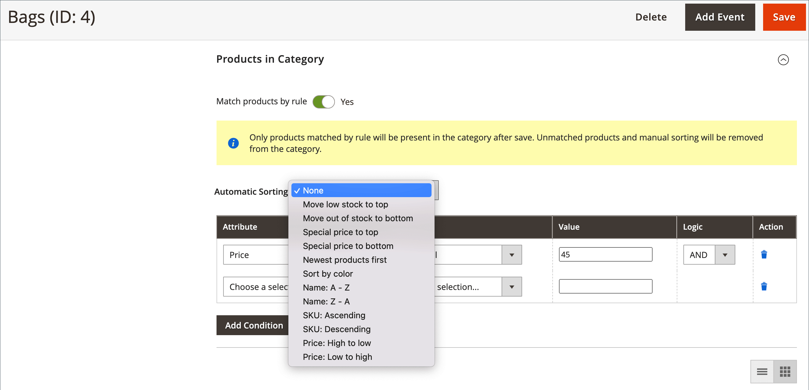

# Kategorieregeln für Merchandising

{{ee-feature}}

Kategorieregeln ändern die Produktauswahl dynamisch entsprechend einer Reihe von Bedingungen. Jede Kategorie kann nur eine Kategorieregel haben, obwohl die einzelne Regel mehrere Bedingungen aufweisen kann. Sie können beispielsweise eine Kategorieregel für eine bestimmte Marke erstellen. Produkte derselben Marke werden automatisch in die Liste aufgenommen, auch wenn sie nicht derselben Kategorie zugeordnet sind. Sie können dem Ausdruck so viele Bedingungen hinzufügen, wie erforderlich sind, um die Produkte zu beschreiben, die Sie einbeziehen möchten.

>[!TIP]
>
>Während der Einrichtung der Kategorieregel werden die Produkte _sortiert_, _abgeglichen_, _zugewiesen_ und _nicht zugewiesen_ gemäß dieser Regel **_only_**, wenn diese Kategorie gespeichert wird. Wenn Sie beispielsweise ein Produkt zum Katalog hinzufügen und es gemäß der Regel zuweisen möchten, **müssen Sie jede Kategorie erneut speichern** die so eingestellt ist, dass sie Produkten anhand der Regel entspricht. Wenn außerdem ein Produktbestandsstatus in `In Stock` oder `Out of Stock` geändert wird und Produkte in der Kategorie _sortiert_ gemäß der **[!UICONTROL Automatic Sorting]**-Regel angezeigt werden sollen, müssen Sie auf **[!UICONTROL Save Category]** klicken.

Jede Bedingung besteht aus einem Attribut, einem Wert und einem logischen Operator. Nur Attribute, bei denen die _[[!UICONTROL Use in Product Listing]](../catalog/attribute-product-create.md)_-Eigenschaft auf `Yes` gesetzt ist, können in Kategorieregeln verwendet werden. Sie müssen diese Eigenschaft für das Attribut festlegen, wenn Sie ein Attribut verwenden möchten, das nicht in den Produktlisten enthalten ist. Obwohl Datumsattribute nicht unterstützt werden, können Sie die Attribute Erstellungsdatum oder Änderungsdatum verwenden, um ein Datum oder einen Datumsbereich zu definieren. Um beispielsweise nur Produkte einzubeziehen, die in der letzten Woche erstellt wurden, setzen Sie „Erstellungsdatum“ auf den Wert `<7`.

>[!NOTE]
>
>Stellen Sie sicher, dass Sie jedes Attribut, das in der Regel verwendet wird, als [_smart_-Attribut ](smart-attributes-configure.md).

{width="600" zoomable="yes"}

Kategorienproduktregeln können den Prozess der Zuweisung spezifischer Produkte zu Kategorien beschleunigen, basierend auf Bedingungen, die bestimmen, welche Produkte in der Kategorie angezeigt werden. Die „intelligenten“ Attribute, die mit Kategorieproduktregeln verwendet werden können, sind in der Konfiguration &quot;[ Merchandiser“ ](visual-merchandiser.md).

>[!NOTE]
>
>Seien Sie vorsichtig, wenn Sie eine Kategorieproduktregel anwenden, da alle Produkte, die die Bedingung nicht erfüllen, aus der Kategorie entfernt werden. Wenn Sie beispielsweise eine Regel erstellen, die nur violette Tanktops enthält, werden alle anderen Tanktops aus der Kategorie entfernt.

## Schritt 1: Konfigurieren der _Smart_-Attribute

1. Stellen Sie für jedes Attribut, das in der Regel verwendet werden soll, sicher, dass die Eigenschaft &quot;[[!UICONTROL Use in Product Listing]](../catalog/product-attributes.md) Storefront“ auf &quot;`Yes`&quot; festgelegt ist.

   >[!NOTE]
   >
   >Stellen Sie sicher, dass das ausgewählte Attribut KEINE Mehrfachauswahl-_[!UICONTROL Input Type]_&#x200B;ist.

1. Schließen Sie die [Konfiguration](smart-attributes-configure.md) ab, um jedes _Smart_-Attribut zu identifizieren, das mit Visual Merchandiser verwendet werden soll.

## Schritt 2: Kategorieregel erstellen

1. Öffnen Sie in der Kategoriestruktur die zu bearbeitende Kategorie.

1. Legen Sie im **[!UICONTROL Products in Category]** Abschnitt **[!UICONTROL Match products by rule]** auf `Yes` fest.

   Die Optionen für die automatische Sortierung und Bedingung werden angezeigt.

1. Klicken Sie auf **[!UICONTROL Add Condition]**.

1. Wählen Sie die **[!UICONTROL Attribute]** aus, auf der die Bedingung basiert.

1. Legen Sie **[!UICONTROL Operator]** auf eine der folgenden Einstellungen fest:

   - `Equal`
   - `Not equal`
   - `Greater than`
   - `Greater than or equal to`
   - `Less than`
   - `Less than or equal to`
   - `Contains`

1. Geben Sie die **[!UICONTROL Value]** ein, die abgeglichen werden soll.

   {width="500"}

1. Wiederholen Sie diesen Vorgang für jedes Attribut, das zur Beschreibung der zu erfüllenden Bedingungen erforderlich ist.

   Gehen Sie wie folgt vor, um beispielsweise Produkte abzugleichen, die vor sieben bis 30 Tagen erstellt wurden:

   - Legen Sie **[!UICONTROL Date Created]** auf `Less than 30` fest.

   - Legen Sie **[!UICONTROL Logic]** auf `AND` fest.

     >[!NOTE]
     >
     >Wenn Sie `AND` auswählen, gilt die Regel für Produkte, bei denen alle Bedingungen erfüllt sind. Wenn Sie `OR` auswählen, gilt dies für Produkte, bei denen mindestens eine Bedingung erfüllt ist.

   - Legen Sie **[!UICONTROL Date Modified]** auf `Greater than 7` fest.

1. Um eine Sortierreihenfolge automatisch auf die dynamisch generierte Produktliste anzuwenden, legen Sie **[!UICONTROL Automatic Sorting]** fest.

   {width="600" zoomable="yes"}

   Die Sortierreihenfolgen-Optionen werden global definiert und auf der Grundlage der aktuellen Bedingungen angewendet. Sie können keine andere Sortierreihenfolge für die Ansichtsebene der Website, des Stores oder des Stores festlegen.

   | Sortieroption | Beschreibung |
   |-----------| -----------|
   | [!UICONTROL Stock quantity] | Nach Lager sortieren, von oben oder unten: `Move low stock to top` oder `Move out of stock to bottom` |
   | [!UICONTROL Special price] | Sortieren nach Preis, von oben oder unten: `Special price to top` oder `Special price to bottom` |
   | [!UICONTROL New Products] | Auflisten der neuesten Produkte: `Newest products first` |
   | [!UICONTROL Color] | Alphabetisch nach Farbe sortieren: `Sort by color` |
   | [!UICONTROL Product Names] | Sortieren nach Name in auf- oder absteigender Reihenfolge: `Name A - Z` oder `Name Z -A` |
   | [!UICONTROL SKU] | Sortieren nach SKU in auf- oder absteigender Reihenfolge: `SKU: Ascending` oder `SKU: Descending` |
   | [!UICONTROL Price] | Sortieren nach Preis in auf- oder absteigender Reihenfolge: `Price: High to low` oder `Price: Low to high` |

   {style="table-layout:auto"}

1. Klicken Sie abschließend auf **[!UICONTROL Save Category]**.

>[!NOTE]
>
>Beim Einrichten einer Kategorieregel werden die Produkte zugeordnet und der Regel zugeordnet, wenn die Kategorie gespeichert wird. Wenn Sie ein Produkt zum Katalog hinzufügen und es in die Regel aufnehmen möchten, müssen Sie jede Kategorie erneut speichern, die so eingestellt ist, dass sie Produkten anhand der Regel entspricht. Dadurch wird sichergestellt, dass das neue Produkt enthalten ist.

### Menüoptionen

- **[!UICONTROL Match products by rule]** - Bestimmt, ob die Liste der Produkte in der Kategorie durch eine Kategorieregel dynamisch generiert wird. Optionen: `Yes` / `No`

- **[!UICONTROL Automatic Sorting]** - Wendet automatisch eine Sortierreihenfolge auf die Liste der Kategorieprodukte an. Optionen: `None`, `Move low stock to top`, `Move low stock to bottom`, `Special price to top`, `Special price to bottom`, `Newest products first`, `Sort by color`, `Name: A - Z`, `Name: Z - A`, `SKU: Ascending`, `SKU: Descending`, `Price: High to Low` und `Price: Low to High`

  >[!NOTE]
  >
  >Wenn Sie über ein konfigurierbares Produkt mit untergeordneten Produkten verfügen, wird der übergeordnete Produktbestand auf der Grundlage der kombinierten Summe der untergeordneten Produktbestände berechnet. Betrachten wir ein Beispiel mit konfigurierbaren Produkten _Proteus Fitness-_) mit orangen, roten und gelben untergeordneten Produkten mit jeweils unterschiedlichen Lagerbeständen. Der Bestand an übergeordneten Produkten wird anhand des Gesamtbestands an orangen, roten und gelben untergeordneten Produkten berechnet. Bei der Option `Move low stock to top` berechnet sie den Bestand an übergeordneten Produkten, indem sie alle ihre verkaufsfähigen untergeordneten Produkte kombiniert und entsprechend sortiert.

- **[!UICONTROL Add Condition]** - Fügt eine weitere Bedingung zur Regel hinzu.

- **[!UICONTROL Attribute]** - Bestimmt das Attribut, das als Grundlage der Bedingung verwendet wird. Optionen:

  | Option | Beschreibung |
  | ------ | ----------- |
  | `Clone Category ID(s)` | Klont Produkte dynamisch, ohne Sortierung und Reihenfolge, aus mehreren Kategorien basierend auf der Kategorie-ID. |
  | `Color` | Enthält Produkte basierend auf Farbe. |
  | `Date Created (days ago)` | Enthält Produkte basierend auf der Anzahl der Tage seit dem Hinzufügen der Produkte zum Katalog. |
  | `Date Modified (days ago)` | Enthält Produkte basierend auf der Anzahl der Tage seit der letzten Änderung der Produkte. |
  | `Name` | Enthält Produkte, die auf dem Produktnamen basieren. |
  | `Price` | Enthält Produkte basierend auf dem Preis. Dieses Attribut gilt nicht für konfigurierbare Produkte, da sie keinen eigenen Preis haben. |
  | `Quantity` | Enthält Produkte basierend auf der Lagermenge. |
  | `SKU` | Enthält Produkte basierend auf SKU. |

  {style="table-layout:auto"}

  >[!NOTE]
  >
  >Die Menge eines konfigurierbaren Produkts mit untergeordneten Optionen wird berechnet, indem alle verkäuflichen untergeordneten Produktmengen kombiniert werden. Betrachten Sie ein Beispiel, bei dem Sie ein konfigurierbares Produkt _Basic Fitness Tank_ mit violetten, roten und gelben Farboptionen und unterschiedlichen Mengen von jedem haben. In diesem Fall ist die Menge des Stammprodukts (Basic Fitness Tank) die kombinierte verkaufsfähige Menge der lila-, rot- und gelbfarbenen untergeordneten Produkte.

- **[!UICONTROL Operator]** - Gibt den Operator an, der auf den Attributwert angewendet wird, um die Bedingung zu erfüllen. Sofern kein Operator angegeben ist, wird `Equal` als Standard verwendet. Optionen: `Equal`, `Not equal`, `Greater than`, `Greater than or equal to`, `Less than`, `Less than or equal to` und `Contains`

- **[!UICONTROL Value]** - Gibt den Wert an, den das Attribut aufweisen muss, um die Bedingung zu erfüllen.

- **[!UICONTROL Logic]** - Die Spalte Logik wird verwendet, um mehrere Bedingungen zu definieren, und wird nur angezeigt, wenn eine andere Bedingung hinzugefügt wird. Die Operatoren befolgen die Regeln der Priorität für MySQL [boolesche Operatoren](https://dev.mysql.com/doc/refman/8.0/en/operator-precedence.html). Optionen: `AND` / `OR`
