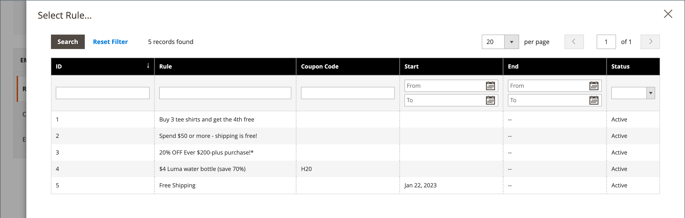
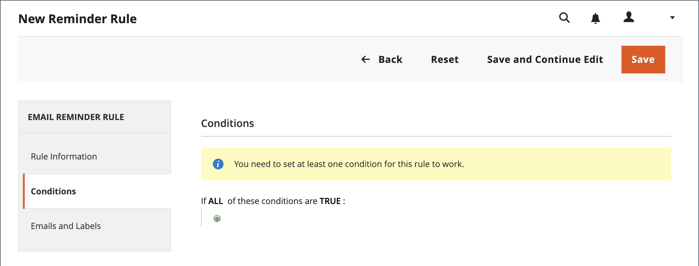
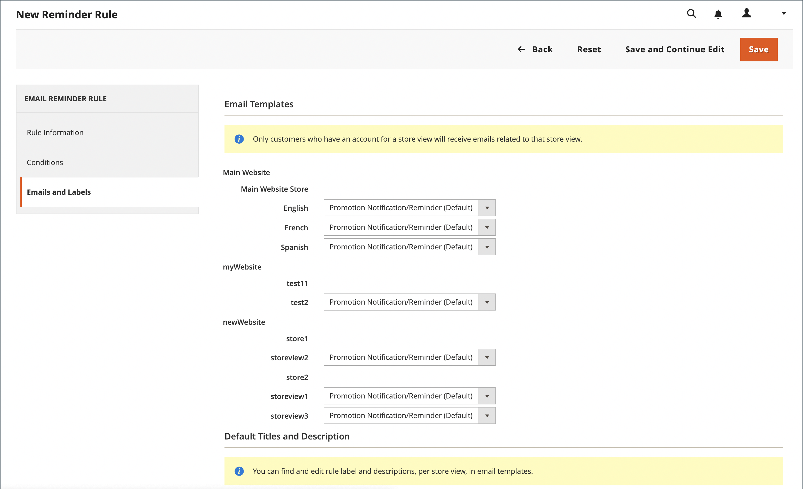

# E-Mail-Erinnerungen erstellen

Bevor Sie eine E-Mail-Erinnerungsregel einrichten, müssen Sie zunächst eine Warenkorbpreisregel einrichten, um die angebotene Promotion zu definieren. Regelbedingungen, die eine E-Mail-Erinnerung an einen Trigger richten können, können auf Warenkorbeigenschaften, Wunschlisten-Eigenschaften oder beidem basieren.

>[!NOTE]
>
>E-Mail-Erinnerungen können eine Preisregel für Warenkorb mit oder ohne Coupon bewerben. Eine Warenkorbpreisregel, die einen automatisch generierten Gutschein definiert, generiert für jeden Kunden einen zufälligen Gutscheincode.

1. Im _Admin_ Seitenleiste, navigieren Sie zu **[!UICONTROL Marketing]** > _[!UICONTROL Communications]_>**[!UICONTROL Email Reminder Rules]**.

1. Klicken Sie oben rechts auf **[!UICONTROL Add New Rule]**.

1. Führen Sie die _[!UICONTROL Rule Information]_, wie folgt:

   {width="700" zoomable="yes"}

   - Geben Sie einen **[!UICONTROL Rule Name]** , um die Regel intern zu identifizieren.

   - Kurzbeschreibung eingeben **[!UICONTROL Description]** der Regel.

   - So wählen Sie die **[!UICONTROL Cart Price Rule]** Werbeaktion, die diese Erinnerung enthält, zum Anzeigen, klicken Sie auf **[!UICONTROL Select Rule…]** und wählen Sie die Regel aus.

     {width="600" zoomable="yes"}

   - Wenn die Regel sofort in Kraft treten soll, legen Sie **[!UICONTROL Status]** nach `Active`.

   - Um einen Datumsbereich für die aktive Regel einzurichten, geben Sie die **[!UICONTROL From]** und **[!UICONTROL To]** Daten.

     Sie können auch das Datum aus dem Kalender (  ).

   - Um die Erinnerung mehrmals zu senden, geben Sie die Anzahl der Tage vor dem nächsten E-Mail-Versand in die **[!UICONTROL Repeat Schedule]** -Feld.

1. Wählen Sie im Bedienfeld auf der linken Seite **[!UICONTROL Conditions]**.

   Für die Regel muss mindestens eine Bedingung definiert sein. Der Prozess ähnelt dem Erstellen einer [Katalogpreisregel.](price-rules-catalog.md)

   {width="600" zoomable="yes"}

   Klicks _Hinzufügen_ ( ), um die Liste der Optionen anzuzeigen und eine der folgenden Bedingungen auszuwählen:

   - Wunschliste
   - Warenkorb

   >[!NOTE]
   >
   >Wenn einem Kunden mehr als eine übereinstimmende aufgegebene Warenkorb-, Wunschliste oder Kombination aus beiden vorliegt, wird die E-Mail-Erinnerung nur einmal für diesen Kunden ausgelöst. Um dieselbe E-Mail-Erinnerung erneut Trigger, verwenden Sie die _[!UICONTROL Repeat Schedule]_um die Anzahl der Tage zwischen E-Mails festzulegen.

   Füllen Sie die Bedingung aus, um das Szenario zu beschreiben, in dem die E-Mail-Erinnerung Trigger wird.

   {width="600" zoomable="yes"}

1. Wählen Sie im Bedienfeld auf der linken Seite **[!UICONTROL Emails and Labels]**.

   {width="600" zoomable="yes"}

1. Im **[!UICONTROL Email Templates]** wählen Sie die E-Mail-Vorlage aus, die für jede Website verwendet werden soll, und speichern Sie die Ansicht in Ihrer [Store-Hierarchie](../getting-started/websites-stores-views.md).

   Wenn Sie die Erinnerungsmail nicht an Kunden einer Store-Ansicht senden möchten, lassen Sie den Wert `Not Selected`.

1. Im _Standardtitel und Beschreibung_ führen Sie folgende Schritte aus:

   - Geben Sie die **[!UICONTROL Rule Title for All Store Views]**.

     >[!NOTE]
     >
     >Dieser Wert kann mithilfe der `promotion_name` -Variable.

   - Geben Sie die **[!UICONTROL Rule Description for All Store Views]**.

     {width="500" zoomable="yes"}

   - Im _[!UICONTROL Titles and Descriptions Per Store View]_eingeben.**[!UICONTROL Rule Title]**und **[!UICONTROL Description]**für die_ Standardspeicheransicht _. Geben Sie für mehrere Store-Ansichten jeweils den entsprechenden Titel und die entsprechende Beschreibung ein.

     >[!NOTE]
     >
     >Die Beschreibung kann mithilfe der Variable promotion_description in E-Mail-Vorlagen integriert werden.

     {width="500" zoomable="yes"}

1. Wenn Sie fertig sind, klicken Sie auf **[!UICONTROL Save]**.

## Bedingungen für Trigger

| Quelle | Trigger |
|--- |--- |
| [!UICONTROL Wish List] | [!UICONTROL Conditions Combination] [!UICONTROL Sharing] [!UICONTROL Number of Items] [!UICONTROL Items Sub selection] |
| [!UICONTROL Shopping Cart] | [!UICONTROL Conditions Combination] [!UICONTROL Coupon Code] [!UICONTROL Cart Line Items] [!UICONTROL Items Quantity] [!UICONTROL Virtual Only] [!UICONTROL Total Amount] [!UICONTROL Items Subselection] |

{style="table-layout:auto"}

## Feldbeschreibungen

| Feld | Beschreibung |
|--- |--- |
| [!UICONTROL Rule Name] | Der Name der automatisierten Erinnerungsregel identifiziert die Regel intern. |
| [!UICONTROL Description] | Eine Beschreibung der Regel für die interne Referenz. |
| [!UICONTROL Shopping Cart Price Rule] | Die mit dieser E-Mail-Erinnerung verknüpfte Warenkorbregel. E-Mails zum Erinnern können eine Preisregel für Warenkorb mit oder ohne Coupon bewerben. Wenn eine Warenkorbpreisregel einen automatisch generierten Coupon enthält, generiert die Erinnerungsregel einen zufälligen, eindeutigen Couponcode für jeden Kunden. |
| [!UICONTROL Assigned to Website] | Die Websites, die anhand dieser Regel eine automatische Erinnerungsmail erhalten. |
| [!UICONTROL Status] | Aktiviert die Regel. Wenn der Status inaktiv ist, werden alle anderen Einstellungen ignoriert und die Regel wird nicht ausgelöst. Optionen: `Active` / `Inactive` |
| [!UICONTROL From Date] | Das Startdatum für diese automatisierte Erinnerungsregel. Wenn kein Datum angegeben ist, wird die Regel sofort aktiv. |
| [!UICONTROL To Date] | Das Enddatum für diese automatisierte Erinnerungsregel. Wenn kein Datum angegeben ist, wird die Regel auf unbestimmte Zeit aktiv. |
| [!UICONTROL Repeat Schedule] | Die Anzahl der Tage, bevor die Regel ausgelöst wird und die Erinnerungsmail erneut gesendet wird, sofern die Bedingungen erfüllt sind. Um die Regel mehrmals Trigger, geben Sie die Anzahl der Tage vor dem nächsten E-Mail-Bruch ein, getrennt durch ein Komma. Geben Sie beispielsweise `7` um die Regel sieben Tage später erneut auslösen zu lassen; geben Sie `7,14` , damit die Regel in sieben Tagen und erneut 14 Tagen später ausgelöst wird. |
| [!UICONTROL Email Templates] | Bestimmt die E-Mail-Vorlage, die für jede Store-Ansicht verwendet werden soll. |
| [!UICONTROL Rule Title for All Store Views] | Bestimmt den Titel der Regel für jede Store-Ansicht. |
| [!UICONTROL Rule Description for All Store Views] | Bestimmt die Beschreibung der Regel für jede Store-Ansicht. |

{style="table-layout:auto"}
