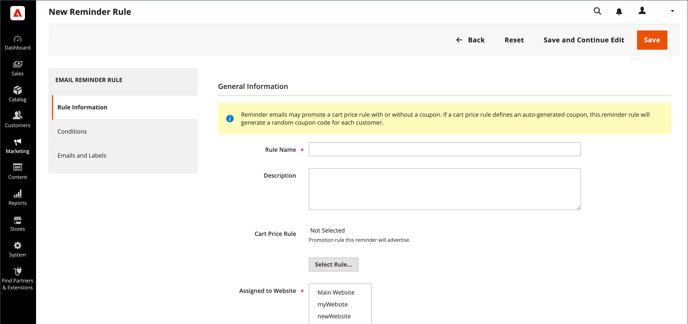

# E-Mail-Erinnerungen erstellen

Bevor Sie eine E-Mail-Erinnerungsregel einrichten, müssen Sie zunächst [eine Warenkorbpreisregel einrichten](price-rules-cart-create.md), um die angebotene Promotion zu definieren. Regelbedingungen, die eine E-Mail-Erinnerung an einen Trigger richten können, können auf Warenkorbeigenschaften, Wunschlisten-Eigenschaften oder beidem basieren.

>[!NOTE]
>
>E-Mail-Erinnerungen können eine Preisregel für Warenkorb mit oder ohne Coupon bewerben. Eine Warenkorbpreisregel, die einen automatisch generierten Gutschein definiert, generiert für jeden Kunden einen zufälligen Gutscheincode.

1. Wechseln Sie in der Seitenleiste _Admin_ zu **[!UICONTROL Marketing]** > _[!UICONTROL Communications]_>**[!UICONTROL Email Reminder Rules]**.

1. Klicken Sie in der oberen rechten Ecke auf **[!UICONTROL Add New Rule]**.

1. Vervollständigen Sie den _[!UICONTROL Rule Information]_wie folgt:

   {width="700" zoomable="yes"}

   - Geben Sie **[!UICONTROL Rule Name]** ein, um die Regel intern zu identifizieren.

   - Geben Sie eine kurze Beschreibung **[!UICONTROL Description]** der Regel ein.

   - Klicken Sie auf **[!UICONTROL Select Rule…]** und wählen Sie die Regel aus, um die **[!UICONTROL Cart Price Rule]** Promotion auszuwählen, an die diese Erinnerung gerichtet ist.

     {width="600" zoomable="yes"}

   - Wenn die Regel sofort in Kraft treten soll, setzen Sie **[!UICONTROL Status]** auf `Active`.

   - Um einen Datumsbereich festzulegen, in dem die Regel aktiv sein soll, geben Sie die **[!UICONTROL From]** - und **[!UICONTROL To]** -Daten ein.

     Sie können das Datum auch aus dem Kalender (  ) auswählen.

   - Um die Erinnerung mehrmals zu senden, geben Sie im Feld **[!UICONTROL Repeat Schedule]** die Anzahl der Tage vor dem nächsten E-Mail-Versand ein.

1. Wählen Sie im Bedienfeld auf der linken Seite **[!UICONTROL Conditions]** aus.

   Für die Regel muss mindestens eine Bedingung definiert sein. Der Prozess ähnelt dem Erstellen einer [Katalogpreisregel.](price-rules-catalog.md)

   {width="600" zoomable="yes"}

   Klicken Sie auf _Hinzufügen_ ( ), um die Liste der Optionen anzuzeigen und eine der folgenden Bedingungen auszuwählen:

   - Wunschliste
   - Warenkorb

   >[!NOTE]
   >
   >Wenn einem Kunden mehr als eine übereinstimmende aufgegebene Warenkorb-, Wunschliste oder Kombination aus beiden vorliegt, wird die E-Mail-Erinnerung nur einmal für diesen Kunden ausgelöst. Um dieselbe E-Mail-Erinnerung erneut Trigger, verwenden Sie das Feld _[!UICONTROL Repeat Schedule]_, um die Anzahl der Tage zwischen E-Mails festzulegen.  
   >
   >Dieselbe E-Mail-Erinnerung lautet **_nicht erneut ausgelöst_** für denselben Kunden für **_neue_** verlassene Warenkörbe und Wunschlisten **_nach_**, wenn der _[!UICONTROL Repeat Schedule]_-Zeitraum abgelaufen ist.

   Füllen Sie die Bedingung aus, um das Szenario zu beschreiben, in dem die E-Mail-Erinnerung Trigger wird.

   Beispiel für {width="600" zoomable="yes"}

1. Wählen Sie im Bedienfeld auf der linken Seite **[!UICONTROL Emails and Labels]** aus.

   {width="600" zoomable="yes"}

1. Wählen Sie im Abschnitt **[!UICONTROL Email Templates]** die E-Mail-Vorlage aus, die für jede Website und Store-Ansicht in Ihrer [Store-Hierarchie](../getting-started/websites-stores-views.md) verwendet werden soll.

   Wenn Sie die Erinnerungsmail nicht an Kunden einer Store-Ansicht senden möchten, belassen Sie den Wert `Not Selected`.

1. Gehen Sie im Abschnitt _Standardtitel und Beschreibung_ wie folgt vor:

   - Geben Sie den Wert **[!UICONTROL Rule Title for All Store Views]** ein.

     >[!NOTE]
     >
     >Dieser Wert kann mithilfe der Variable `promotion_name` in E-Mail-Vorlagen integriert werden.

   - Geben Sie den Wert **[!UICONTROL Rule Description for All Store Views]** ein.

     {width="500" zoomable="yes"}

   - Geben Sie im Abschnitt _[!UICONTROL Titles and Descriptions Per Store View]_die **[!UICONTROL Rule Title]**und die **[!UICONTROL Description]**für die_ standardmäßige Store-Ansicht _ein. Geben Sie für mehrere Store-Ansichten jeweils den entsprechenden Titel und die entsprechende Beschreibung ein.

     >[!NOTE]
     >
     >Die Beschreibung kann mithilfe der Variable promotion_description in E-Mail-Vorlagen integriert werden.

     {width="500" zoomable="yes"}

1. Klicken Sie nach Abschluss des Vorgangs auf **[!UICONTROL Save]**.

## Bedingungen für Trigger

| Source | Trigger |
|--- |--- |
| [!UICONTROL Wish List] | [!UICONTROL Conditions Combination] [!UICONTROL Sharing] [!UICONTROL Number of Items] [!UICONTROL Items Sub selection] |
| [!UICONTROL Shopping Cart] | [!UICONTROL Conditions Combination] [!UICONTROL Coupon Code] [!UICONTROL Cart Line Items] [!UICONTROL Items Quantity] [!UICONTROL Virtual Only] [!UICONTROL Total Amount] [!UICONTROL Items Subselection] |

{style="table-layout:auto"}

## Feldbeschreibungen

| Feld | Beschreibung |
|--- |--- |
| [!UICONTROL Rule Name] | Der Name der automatisierten Erinnerungsregel identifiziert die Regel intern. |
| [!UICONTROL Description] | Eine Beschreibung der Regel für die interne Referenz. |
| [!UICONTROL Shopping Cart Price Rule] | Die mit dieser E-Mail-Erinnerung verknüpfte Warenkorbregel. E-Mails zum Erinnern können eine Preisregel für Warenkorb mit oder ohne Coupon bewerben. Wenn eine Warenkorbpreisregel einen automatisch generierten Coupon enthält, generiert die Erinnerungsregel einen zufälligen, eindeutigen Couponcode für jeden Kunden. |
| [!UICONTROL Assigned to Website] | Die Websites, die anhand dieser Regel eine automatische Erinnerungsmail erhalten. |
| [!UICONTROL Status] | Aktiviert die Regel. Wenn der Status inaktiv ist, werden alle anderen Einstellungen ignoriert und die Regel wird nicht ausgelöst. Optionen: `Active` / `Inactive` |
| [!UICONTROL From Date] | Das Startdatum für diese automatisierte Erinnerungsregel. Wenn kein Datum angegeben ist, wird die Regel sofort aktiv. |
| [!UICONTROL To Date] | Das Enddatum für diese automatisierte Erinnerungsregel. Wenn kein Datum angegeben ist, wird die Regel auf unbestimmte Zeit aktiv. |
| [!UICONTROL Repeat Schedule] | Die Anzahl der Tage, bevor die Regel ausgelöst wird und die Erinnerungsmail erneut gesendet wird, sofern die Bedingungen erfüllt sind. Um die Regel mehrmals Trigger, geben Sie die Anzahl der Tage vor dem nächsten E-Mail-Bruch ein, getrennt durch ein Komma. Geben Sie beispielsweise `7` ein, damit die Regel sieben Tage später erneut ausgelöst wird. Geben Sie `7,14` ein, damit die Regel in sieben Tagen und erneut 14 Tagen später ausgelöst wird. |
| [!UICONTROL Email Templates] | Bestimmt die E-Mail-Vorlage, die für jede Store-Ansicht verwendet werden soll. |
| [!UICONTROL Rule Title for All Store Views] | Bestimmt den Titel der Regel für jede Store-Ansicht. |
| [!UICONTROL Rule Description for All Store Views] | Bestimmt die Beschreibung der Regel für jede Store-Ansicht. |

{style="table-layout:auto"}
