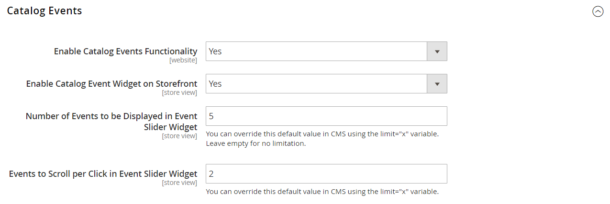
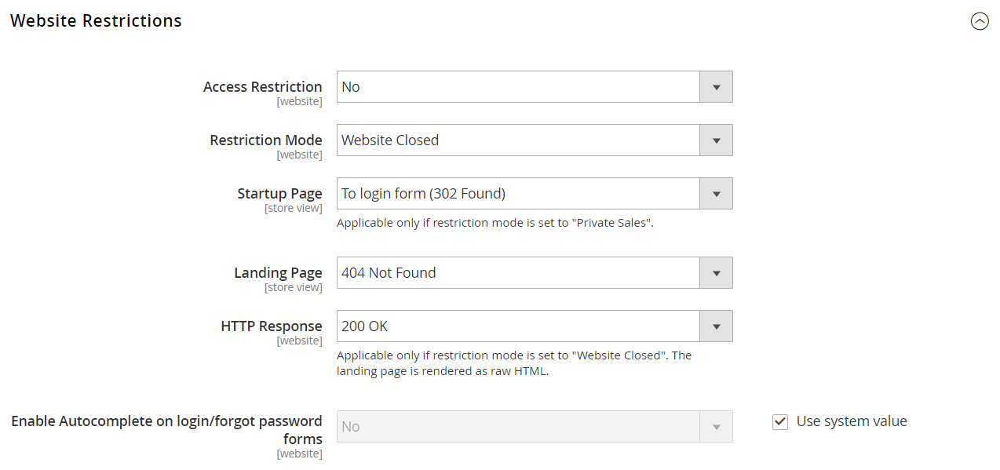

# Konfigurieren von Ereignissen

{{ee-feature}}

Bevor Sie ein Ereignis erstellen können, müssen Sie die Basiskonfiguration abschließen, um Ereignisse zu aktivieren, und den Ereignisblock in der Seitenleiste einrichten.

## Aktivieren und Konfigurieren von Ereignissen

1. Navigieren Sie in _Admin_-Seitenleiste zu **[!UICONTROL Stores]** > _[!UICONTROL Settings]_>**[!UICONTROL Configuration]**.

1. Erweitern Sie im linken Bereich **[!UICONTROL Catalog]** und wählen Sie darunter **[!UICONTROL Catalog]**.

1. Erweitern Sie  den Abschnitt **[!UICONTROL Catalog Events]** und führen Sie folgende Schritte aus:

   {width="600" zoomable="yes"}

   - Legen Sie **[!UICONTROL Enable Catalog Events Functionality]** auf `Yes` fest.

   - Legen Sie **[!UICONTROL Enable Catalog Event Widget on Storefront]** auf `Yes` fest.

   - Geben Sie die **[!UICONTROL Number of Events to be Displayed in the Event Slider Sidebar Widget]** ein. Standardmäßig ist dieser Wert auf `5` festgelegt. Wenn Sie nur jeweils ein Ereignis im Schieberegler anzeigen möchten, geben Sie `1` ein.

   - Geben Sie die Anzahl der **[!UICONTROL Events to Scroll per Click in Event Slider Sidebar Widget]** ein. Standardmäßig ist dieser Wert auf `2` festgelegt. Wenn der Schieberegler beim Klicken das nächste Ereignis in der richtigen Reihenfolge anzeigen soll, geben Sie `1` ein.

1. Klicken Sie abschließend auf **[!UICONTROL Save Config]**.

## Zugriffsbeschränkungen

Der Zugriff auf einen privaten Verkauf, eine Veranstaltung oder eine Website kann auf registrierte Kunden beschränkt sein, die sich anmelden, oder auf nicht registrierte Kunden erweitert werden, die sich registrieren müssen, bevor sie Zugriff erhalten.

{width="600" zoomable="yes"}

### Zugriff beschränken

Der Zugriff auf einen privaten Verkauf, eine Veranstaltung oder eine Website kann auf registrierte Kunden beschränkt sein, die sich anmelden, oder auf nicht registrierte Kunden erweitert werden, die sich registrieren müssen, bevor sie Zugriff erhalten.

{width="600" zoomable="yes"}

1. Navigieren Sie in _Admin_-Seitenleiste zu **[!UICONTROL Stores]** > _[!UICONTROL Settings]_>**[!UICONTROL Configuration]**.

1. Erweitern Sie im linken Bereich **[!UICONTROL General]** und wählen Sie darunter **[!UICONTROL General]**.

1. Erweitern Sie  den Abschnitt **[!UICONTROL Website Restrictions]** .

1. Legen Sie **[!UICONTROL Access Restriction]** auf `Yes` fest.

1. Legen Sie **[!UICONTROL Restriction Mode]** auf eine der folgenden Einstellungen fest:

   - `Website Closed`
   - `Private Sales: Login Only`
   - `Private Sales: Login and Register`

1. Legen Sie **[!UICONTROL Startup Page]** auf eine der folgenden Einstellungen fest:

   - `To login form (302 Found)` - Benutzer werden zum Anmeldeformular weitergeleitet, bevor sie Zugriff auf die Website erhalten.

   - `To landing page (302 Found)` - Benutzer werden zur angegebenen Landingpage weitergeleitet, bis sie sich anmelden.

     >[!IMPORTANT]
     >
     >Stellen Sie sicher, dass Sie von der Landingpage aus einen Link zur Anmeldeseite einfügen, damit sich Kunden anmelden können, um auf die Website zuzugreifen.

1. Wählen Sie die **[!UICONTROL Landing Page]** aus, die angezeigt wird, bevor sich Kunden bei der privaten Verkaufs-Website anmelden.

1. Um Suchmaschinenbots und -spinnen mitzuteilen, dass die Landingpage korrekt ist und es keine anderen Seiten auf der Website zum Indizieren gibt, setzen Sie **[!UICONTROL HTTP Response]** auf `200 OK`.

   Setzen Sie in allen anderen Fällen auf `503 Service Unavailable`.

   >[!NOTE]
   >
   >Trifft nur zu, wenn der Einschränkungsmodus auf „Website geschlossen _gesetzt_. Die Landingpage wird als unformatierter HTML gerendert.

1. Wenn Sie möchten, dass die Felder in den Kundenanmelde- und Kennwortformularen automatisch aus vorherigen Einträgen ausgefüllt werden, setzen Sie **[!UICONTROL Enable Autocomplete on login/forgot password forms]** auf `Yes`.

1. Klicken Sie abschließend auf **[!UICONTROL Save Config]**.

### Verkäufe einschränken

Standardmäßig sind Produkte, die bei anstehenden oder geschlossenen Ereignissen angezeigt werden, nicht für den allgemeinen Verkauf verfügbar und die Schaltfläche _[!UICONTROL Add to Cart]_&#x200B;wird nicht auf der Produktliste oder Produktseite angezeigt.

Um die Schaltfläche _[!UICONTROL Add to Cart]_&#x200B;für ein geschlossenes Ereignis wiederherzustellen, muss das Ereignis gelöscht werden (siehe [Ereignisse aktualisieren](event-create.md#update-events)). Wenn ein Produkt jedoch mit einer anderen Kategorie verknüpft ist, die keine Verkaufsbeschränkungen aufweist, ist die Schaltfläche auf der Produktseite verfügbar. Ebenso wird der Tickerblock nicht auf der Produktseite angezeigt, wenn das Produkt einer anderen Kategorie zugeordnet ist, für die keine Verkaufsbeschränkungen gelten.
