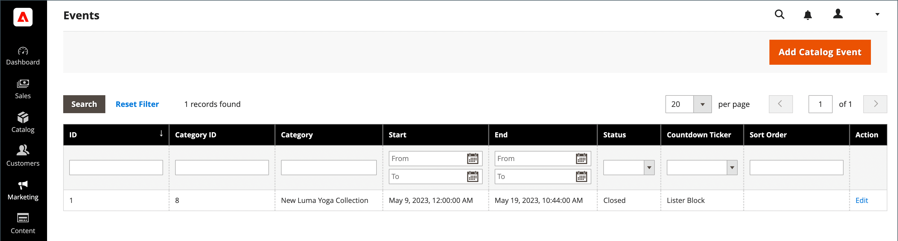

# Ereignisse erstellen und aktualisieren

{{ee-feature}}

Jedes Ereignis ist mit einer Kategorie aus Ihrem Katalog verknüpft und es kann jeweils nur ein Ereignis mit einer bestimmten Kategorie verknüpft werden. Um eine Liste bevorstehender Ereignisse in Ihrem Store anzuzeigen, müssen Sie auch eine [Karussell mit Katalogereignissen](../content-design/widget-event-carousel.md) Widget.

{width="700" zoomable="yes"}

## Ereignis erstellen

1. Im _Admin_ Seitenleiste, navigieren Sie zu **[!UICONTROL Marketing]** > _[!UICONTROL Private Sales]_>**[!UICONTROL Events]**.

1. Klicken Sie oben rechts auf **[!UICONTROL Add Catalog Event]**.

1. Wählen Sie im Kategoriebaum die Kategorie aus, die Sie mit dem Ereignis verbinden möchten.

   Da jede Kategorie nur ein Ereignis gleichzeitig haben kann, werden alle Kategorien, die bereits über ein Ereignis verfügen, deaktiviert.

   {width="500" zoomable="yes"}

1. Definieren Sie die **[!UICONTROL Catalog Event Information]**:

   {width="700" zoomable="yes"}

   - Für **[!UICONTROL Start Date]** Verwenden Sie den Kalender (), um das Datum auszuwählen. Verwenden Sie die **[!UICONTROL Hour]** und **[!UICONTROL Minute]** Regler zum Festlegen der Startzeit des Ereignisses.

   - Für **[!UICONTROL End Date]** Verwenden Sie den Kalender (), um das Datum auszuwählen. Verwenden Sie die **[!UICONTROL Hour]** und **[!UICONTROL Minute]** -Regler zum Festlegen des Zeitpunkts, zu dem das Ereignis beendet wird.

   - So laden Sie eine **[!UICONTROL Image]** Klicken Sie für das Ereignis-Widget auf **[!UICONTROL Choose File]** und wählen Sie die Bilddatei aus Ihrem Verzeichnis aus.

   - Im **[!UICONTROL Sort Order]** Geben Sie eine Zahl ein, um die Reihenfolge anzugeben, in der dieses Ereignis bei der Auflistung mit anderen Ereignissen erscheint.

   - Aktivieren Sie das Kontrollkästchen jedes Seitentyps, in dem der Countdown-Ticker angezeigt werden soll.

1. Wenn Sie fertig sind, klicken Sie auf **[!UICONTROL Save]**.

## Ereignisse aktualisieren

Ereignisse können auf der Seite Ereignisse oder in der Kategorie bearbeitet werden, die dem Ereignis zugeordnet ist. Wenn einer Kategorie ein Ereignis zugeordnet ist, wird oben rechts die Schaltfläche Ereignis bearbeiten angezeigt.

### Methode 1: Bearbeiten eines Ereignisses auf der Seite &quot;Ereignisse&quot;

1. Im _Admin_ Seitenleiste, navigieren Sie zu **[!UICONTROL Marketing]** > _[!UICONTROL Private Sales]_>**[!UICONTROL Events]**.

1. Suchen Sie das Ereignis in der Liste und öffnen Sie es im Bearbeitungsmodus.

1. Nehmen Sie die erforderlichen Änderungen am Ereignis vor.

1. Wenn Sie fertig sind, klicken Sie auf **[!UICONTROL Save]**.

### Methode 2: Bearbeiten eines Ereignisses aus einer Kategorie

1. Im _Admin_ Seitenleiste, navigieren Sie zu **[!UICONTROL Catalog]** > **[!UICONTROL Categories]**.

1. Wählen Sie in der Kategorienstruktur auf der linken Seite die Kategorie aus, die mit dem Ereignis verknüpft ist.

1. Klicken Sie oben rechts auf **[!UICONTROL Edit Even]t**.

1. Nehmen Sie die erforderlichen Änderungen am Ereignis vor.

1. Wenn Sie fertig sind, klicken Sie auf **[!UICONTROL Save]**.

## Ereignis löschen

1. Im _Admin_ Seitenleiste, navigieren Sie zu **[!UICONTROL Marketing]** > _[!UICONTROL Private Sales]_>**[!UICONTROL Events]**.

1. Suchen Sie das Ereignis in der Liste und öffnen Sie es im Bearbeitungsmodus.

1. Klicken Sie oben rechts auf **[!UICONTROL Delete]**.

1. Klicken Sie auf die Schaltfläche **[!UICONTROL OK]**.

## Feldbeschreibungen

| Feld | [Anwendungsbereich](../getting-started/websites-stores-views.md#scope-settings) | Beschreibung |
|--- |--- |--- |
| [!UICONTROL Category] | Global | Beim Erstellen eines Ereignisses verknüpft dieses Feld mit dem Kategoriebaum zurück. Beim Bearbeiten eines Ereignisses wird eine Verknüpfung zu der Kategorieseite des Ereignisses hergestellt. |
| [!UICONTROL Start Date] | Global | Startdatum und -zeit des Ereignisses in `MMDDYYYY HH;MM` Format. Klicken Sie auf das Kalendersymbol, um das Datum auszuwählen. |
| [!DNL End Date] | Global | Enddatum und -zeit des Ereignisses in `MMDDYYYY HH;MM` Format. Klicken Sie auf das Kalendersymbol, um das Datum auszuwählen. |
| [!UICONTROL Image] | Store-Ansicht | Lädt ein Bild hoch, das im [Karussell-Widget &quot;Katalogereignisse&quot;](../content-design/widget-event-carousel.md). |
| [!UICONTROL Sort Order] | Global | Bestimmt die Reihenfolge, in der dieses Ereignis angezeigt wird, wenn es mit anderen Ereignissen aufgelistet wird. |
| [!UICONTROL Display Countdown Ticker On] | Global | Zeigt den Countdown-Ticker in der Kopfzeile jeder angegebenen Seite an. Optionen: `Category Page` / `Product Page` |
| [!UICONTROL Status] | Global | Gibt den Status des Ereignisses basierend auf dem Startdatum und dem Enddatumsbereich an. Status ist ein schreibgeschützter Wert. Werte: `Open` / `Closed` / `Upcoming` |

{style="table-layout:auto"}

## Schaltflächenleiste

| Schaltfläche | Beschreibung |
|--- |--- |
| **[!UICONTROL Back]** | Kehrt zur Seite &quot;Ereignisse&quot;zurück, ohne das neue Ereignis oder Änderungen in einem vorhandenen Ereignis zu speichern. |
| **[!UICONTROL Delete]** | Löscht das Ereignis. |
| **[!UICONTROL Reset]** | Löscht das Formular nicht gespeicherter Änderungen und stellt die ursprünglichen Ereignisinformationen wieder her. |
| **[!UICONTROL Save and Continue Edit]** | Speichert alle Änderungen und öffnet das Formular im Bearbeitungsmodus. |
| **[!UICONTROL Save]** | Speichert Änderungen, schließt das Formular und kehrt zur Seite Ereignisse zurück. |

{style="table-layout:auto"}
