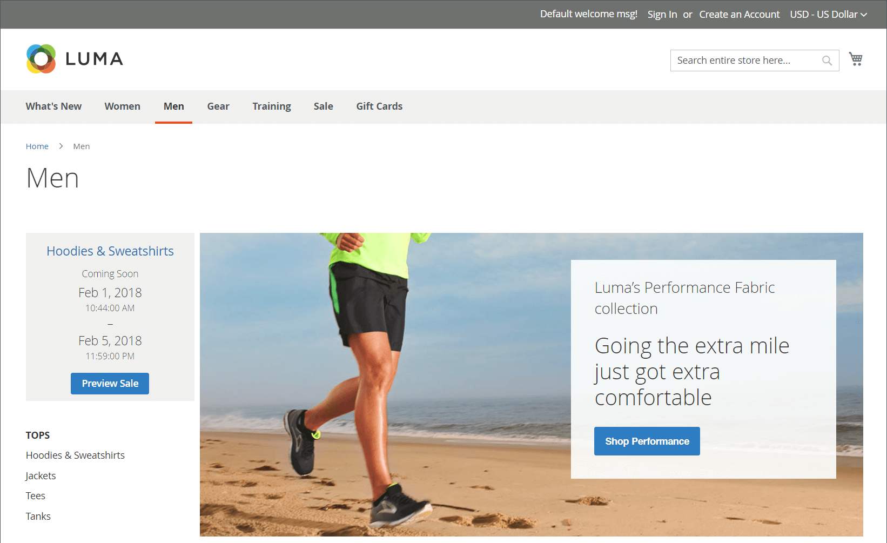

# Private Verkäufe und Veranstaltungen

{{ee-feature}}

Private Verkäufe und andere Katalogereignisse sind eine hervorragende Möglichkeit, Ihren bestehenden Kundenstamm zu nutzen, um Buzz und neue Leads zu generieren oder überschüssige Lagerbestände abzuladen. Sie können einen zeitlich begrenzten Verkauf erstellen, den Verkauf auf bestimmte Mitglieder beschränken oder eine eigenständige private Verkaufsseite erstellen. Sie können auch Einladungen und Ereignisdetails definieren. Steigern Sie die Markentreue und erzeugen Sie ein Gespräch, indem Sie Ihren besten Kunden die Behandlung mit VIP bieten. Bieten Sie exklusiven Zugriff nur auf den Verkauf durch Mitglieder oder auf den privaten Verkauf, um die Markentreue zu steigern. Sie können diese Verkäufe auch verwenden, um überschüssige Waren zu liquidieren. Kundengruppen sind nur bei der Einrichtung dieser Mitgliedertypen und bei VIP Sales hilfreich.

{width="700" zoomable="yes"}

## Komponenten des Ereignis-Managements

- **Kategorien** - Jedes Ereignis ist mit einer [Kategorie](../catalog/category-create.md) aus Ihrem Katalog verknüpft.

- **Ereignisse** - Verkauf von Veranstaltungen basiert auf einem Start- und Enddatum. Sie können einen [Countdown-Ticker](#event-ticker) verwenden, um die verbleibende Zeit anzuzeigen.

- **Karussell für Katalogereignisse** - Wenn das [Widget Katalogereignis](../content-design/widget-event-carousel.md) in der Konfiguration aktiviert ist, kann es als Liste offener und bevorstehender Ereignisse auf Store-Seiten platziert werden, sortiert nach Enddatum. Wenn zwei oder mehr Ereignisse dasselbe Enddatum haben, werden die Ereignisse nach der in der Konfiguration angegebenen Reihenfolge sortiert.

- **[!UICONTROL Websites]** - Kategorieberechtigungen basieren hauptsächlich auf [Kundengruppen](../customers/customer-groups.md).

- **Kategorieberechtigungen** - [Kategorieberechtigungen](../catalog/category-permissions.md) gibt Ihnen volle Kontrolle über die spezifischen Aktivitäten, die in einer bestimmten Kategorie stattfinden können.

- **Zugriffsbeschränkungen** - Verhindert den öffentlichen [Zugriff](event-configure.md#restrict-access) auf die Website durch Umleitung auf eine Landingpage, Anmeldeseite oder Registrierungsseite.

- **Einladungen** - E-Mail-Nachrichten werden mit einem Link gesendet, um ein Konto im Store zu erstellen. Sie können die Möglichkeit, ein Konto zu erstellen, auf diejenigen beschränken, die eine [Einladung](invitations.md) erhalten.

- **Private Verkaufsberichte** - Die [Private Verkaufsberichte](../getting-started/private-sales-reports.md) enthalten Informationen über gesendete Einladungen, eingeladene Kunden und Konversionen.

## Event-Ticker

Der Ticker-Block zeigt einen Countdown-Ticker für offene Ereignisse mit dem Start- und Enddatum für anstehende Ereignisse an. Wenn ein Ereignis geschlossen wurde, zeigt der Ticker das Anfangs- und das Enddatum an.

{width="700" zoomable="yes"}

Wenn die Kategorieseitenauswahl für ein Ereignis aktiviert ist, wird der Tickerblock oben in der Kategorieliste angezeigt. Wenn der Produktseitenticker aktiviert ist, wird der Tickerblock auch oben auf der Produktseite jedes Produkts angezeigt, das mit der Kategorie verknüpft ist.

Der Ereignisticker kann beim Erstellen von [&#x200B; aktiviert &#x200B;](event-create.md).

{width="700" zoomable="yes"}
