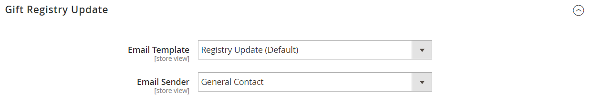

# Konfigurieren von Geschenkregistrierungen

{{ee-feature}}

Bevor Sie Ihren Kunden Geschenkregistrierungen anbieten können, müssen Sie Geschenkregistrierungen aktivieren und die entsprechenden E-Mail-Benachrichtigungen konfigurieren. Adobe Commerce sendet die folgenden E-Mail-Benachrichtigungen als Reaktion auf Ereignisse im Workflow zur Geschenkregistrierung.

- Wenn eine neue Geschenkregistrierung erstellt wird, wird eine E-Mail mit einem Link zur Registrierung an den Besitzer gesendet, die freigegeben werden kann.
- Optional kann der Store eine Benachrichtigung mit einem Link zur Geschenkregistrierung an Freunde und Familie des Besitzers der Geschenkregistrierung senden.
- Der Besitzer wird benachrichtigt, wenn Artikel aus der Geschenkregistrierung gekauft werden, aber nicht den Käufer.

Adobe Commerce verfügt über vordefinierte Vorlagen für jede dieser E-Mail-Nachrichten, die für Ihre Marke angepasst werden können.

## Schritt 1. Aktivieren von Geschenkregistern

1. Navigieren Sie in _Admin_-Seitenleiste zu **[!UICONTROL Stores]** > _[!UICONTROL Settings]_>**[!UICONTROL Configuration]**.

1. Erweitern Sie im linken Bereich **[!UICONTROL Customers]** und wählen Sie **[!UICONTROL Gift Registry]**

1. Erweitern Sie  den Abschnitt **[!UICONTROL General Options]** und führen Sie folgende Schritte aus:

   {width="600" zoomable="yes"}

   - Die Geschenkregistrierung ist standardmäßig aktiviert. Falls erforderlich, setzen Sie **[!UICONTROL Enable Gift Registry]** auf `Yes`.

   - Geben Sie **[!UICONTROL Maximum Registrants]** die maximale Anzahl von Personen ein, die zur Teilnahme an einem Geschenkregistrierungs-Event eingeladen werden können.

## Schritt 2. Konfigurieren von E-Mail-Benachrichtigungen

1. Erweitern Sie  den Abschnitt **[!UICONTROL Owner Notification]** und führen Sie folgende Schritte aus:

   {width="600" zoomable="yes"}

   - Wählen Sie die **[!UICONTROL Email Template]** aus, die Besitzer von Geschenkregistrierungen benachrichtigt, wenn ihre Registrierungen erstellt werden.

   - Wählen Sie den [Store-](../getting-started/store-details.md#store-email-addresses)), der als **[!UICONTROL Email Sender]** der Nachricht angezeigt wird.

1. Erweitern Sie  den Abschnitt **[!UICONTROL Gift Registry Sharing]** und führen Sie folgende Schritte aus:

   {width="600" zoomable="yes"}

   - Wählen Sie die **[!UICONTROL Email Template]** aus, die Empfänger von Geschenkregistrierungen benachrichtigt, wenn eine Registrierung für sie freigegeben wird.

   - Wählen Sie die Store-ID aus, die als **[!UICONTROL Email Sender]** der Nachricht angezeigt wird.

   - Geben Sie **[!UICONTROL Maximum Sent Emails Threshold]** die maximale Anzahl von E-Mails ein, die gleichzeitig gesendet werden können.

1. Erweitern Sie  den Abschnitt **[!UICONTROL Gift Registry Update]** und führen Sie folgende Schritte aus:

   {width="600" zoomable="yes"}

   - Wählen Sie die **[!UICONTROL Email Template]** aus, die Besitzer von Geschenkregistrierungen über Änderungen an der Registrierung benachrichtigt.

   - Wählen Sie die Store-ID aus, die als **[!UICONTROL Email Sender]** der Nachricht angezeigt wird.

1. Klicken Sie abschließend auf **[!UICONTROL Save Config]**.

1. Aktualisieren Sie den Cache, wenn Sie dazu aufgefordert werden.

   Nachdem der Cache aktualisiert wurde, wird die Geschenkregistrierung im Menü Stores unter Andere Einstellungen angezeigt und wird in Kundenkonten verfügbar.
