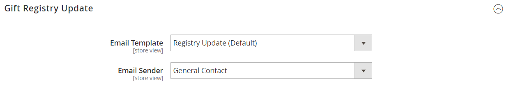

# Konfigurieren von Geschenkgutscheinen

{{ee-feature}}

Bevor Sie Ihren Kunden Geschenkgutscheine anbieten können, müssen Sie Geschenkregistern aktivieren und die entsprechenden E-Mail-Benachrichtigungen konfigurieren. Adobe Commerce sendet die folgenden E-Mail-Benachrichtigungen als Reaktion auf Ereignisse im Workflow für die Registrierung von Geschenkgutscheinen.

- Wenn eine neue Geschenkregistrierung erstellt wird, wird eine E-Mail an den Eigentümer mit einem Link zur Registrierung gesendet, der freigegeben werden kann.
- Optional kann der Laden eine Benachrichtigung mit einem Link zur Geschenkregistrierung an Freunde und Familie des Eigentümers der Geschenkregistrierung senden.
- Der Eigentümer wird benachrichtigt, wenn Artikel in der Geschenkregistrierung erworben werden, gibt jedoch nicht den Käufer an.

Adobe Commerce verfügt über vordefinierte Vorlagen für jede dieser E-Mail-Nachrichten, die für Ihre Marke angepasst werden können.

## Schritt 1. Geschenkregister aktivieren

1. Wechseln Sie in der Seitenleiste _Admin_ zu **[!UICONTROL Stores]** > _[!UICONTROL Settings]_>**[!UICONTROL Configuration]**.

1. Erweitern Sie im linken Bereich den Eintrag **[!UICONTROL Customers]** und wählen Sie **[!UICONTROL Gift Registry]** aus.

1. Erweitern Sie den Abschnitt **[!UICONTROL General Options]** des Erweiterungsselektors  und führen Sie folgende Schritte aus:

   {width="600" zoomable="yes"}

   - Die Gift Registry ist standardmäßig aktiviert. Setzen Sie bei Bedarf **[!UICONTROL Enable Gift Registry]** auf `Yes`.

   - Geben Sie für **[!UICONTROL Maximum Registrants]** die maximale Anzahl von Personen an, die zur Teilnahme an einem Geschenkregisterereignis eingeladen werden können.

## Schritt 2. E-Mail-Benachrichtigungen konfigurieren

1. Erweitern Sie den Abschnitt **[!UICONTROL Owner Notification]** des Erweiterungsselektors  und führen Sie folgende Schritte aus:

   {width="600" zoomable="yes"}

   - Wählen Sie die **[!UICONTROL Email Template]** aus, die die Besitzer der Geschenkregistrierung benachrichtigt, wenn ihre Register erstellt werden.

   - Wählen Sie den [Store contact](../getting-started/store-details.md#store-email-addresses) aus, der als **[!UICONTROL Email Sender]** der Nachricht angezeigt wird.

1. Erweitern Sie den Abschnitt **[!UICONTROL Gift Registry Sharing]** des Erweiterungsselektors  und führen Sie folgende Schritte aus:

   {width="600" zoomable="yes"}

   - Wählen Sie die **[!UICONTROL Email Template]** aus, die die Empfänger der Geschenkregistrierung benachrichtigt, wenn eine Registrierung für sie freigegeben ist.

   - Wählen Sie die Store-Kennung aus, die als **[!UICONTROL Email Sender]** der Nachricht angezeigt wird.

   - Geben Sie für &quot;**[!UICONTROL Maximum Sent Emails Threshold]**&quot;die maximale Anzahl an E-Mails an, die gleichzeitig gesendet werden können.

1. Erweitern Sie den Abschnitt **[!UICONTROL Gift Registry Update]** des Erweiterungsselektors  und führen Sie folgende Schritte aus:

   {width="600" zoomable="yes"}

   - Wählen Sie die **[!UICONTROL Email Template]** aus, die die Besitzer der Geschenkregistrierung über Änderungen an der Registrierung informiert.

   - Wählen Sie die Store-Kennung aus, die als **[!UICONTROL Email Sender]** der Nachricht angezeigt wird.

1. Klicken Sie nach Abschluss des Vorgangs auf **[!UICONTROL Save Config]**.

1. Wenn Sie dazu aufgefordert werden, aktualisieren Sie den Cache.

   Nachdem der Cache aktualisiert wurde, wird die Geschenkregistrierung im Menü Geschäfte unter Andere Einstellungen angezeigt und ist in Kundenkonten verfügbar.
