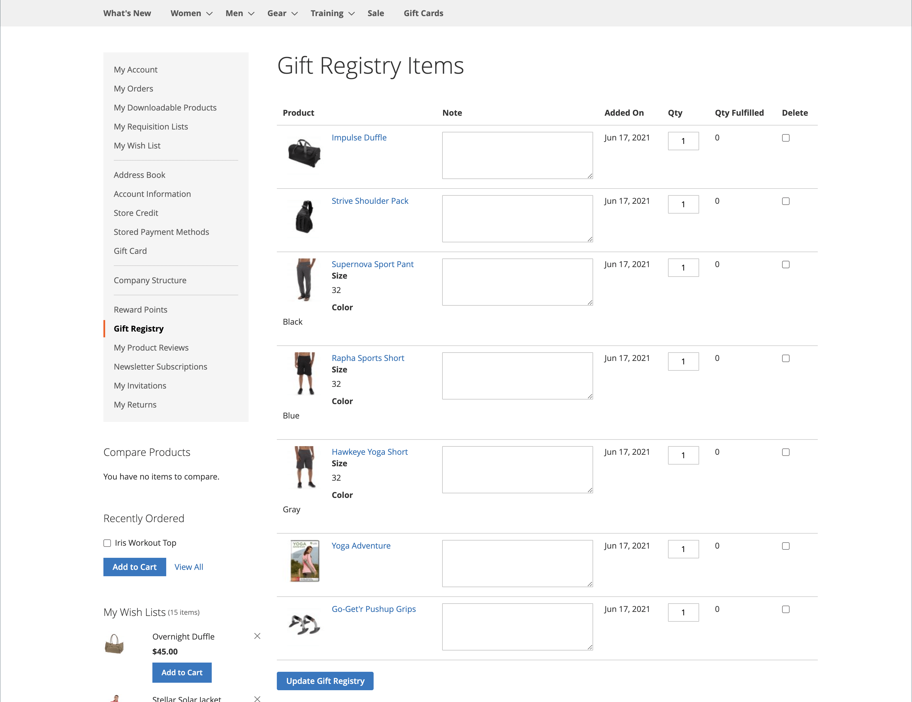

# Erlebnis mit Geschenkregistrierung-Storefront

{{ee-feature}}

Im Abschnitt [Geschenkregistrierung](gift-registries.md) des Kundenkontos werden die aktuellen Geschenkregistrierungen des Kunden und das zugehörige Ereignis aufgelistet. Kunden können die aktuellen Registrierungen verwalten und neue hinzufügen.

{width="700" zoomable="yes"}

## Informationen zur Geschenkregistrierung

Kunden können Geschenkregistrierungen über ihre Konten erstellen und verwalten. Alle Informationen, die mit jedem Registrierungstyp verbunden sind, sind über das Konto des Kunden verfügbar.

{width="700" zoomable="yes"}

| Abschnitt | Beschreibung |
|--- |--- |
| [!UICONTROL General Information] | Dieser Abschnitt enthält in der Regel den Namen des Ereignisses, eine Nachricht oder Beschreibung des Ereignisses, Datenschutzeinstellungen und den Ereignisstatus. |
| [!UICONTROL Event Information] | Dieser Abschnitt enthält Ort und Datum des Ereignisses. Bei einer Hochzeit kann auch die Anzahl der Gäste angegeben werden, die jede Person mitbringen kann. |
| [!UICONTROL Gift Registry Details] | Dazu können zusätzliche Informationen gehören, die speziell für diesen Anlass gelten. |
| [!UICONTROL Registrant Information] | Dieser Abschnitt enthält den Namen und die Kontaktinformationen jeder Person, die eine Benachrichtigung über das Register erhalten soll. Bei einer Hochzeitsregistrierung kann das Feld Rolle einbezogen werden, um den Registranten als Freund der Braut oder des Bräutigams zu verknüpfen. |
| [!UICONTROL Shipping Address] | Dieser Abschnitt zeigt an, wohin Geschenke geschickt werden sollen, und enthält die Informationen, die ein Spediteur benötigt, um das Paket zu liefern. |

{style="table-layout:auto"}

>[!NOTE]
>
>Wenn eine Geschenkregistrierung inaktiv ist, funktionieren Suche und Link für die Registrierung nicht. Wenn die Registrierung später wieder aktiviert wird, bleiben die Links beschädigt.

## Erstellen einer Geschenkregistrierung

1. Der Kunde wählt **[!UICONTROL Gift Registry]** in seinem Konto-Dashboard aus.

1. Klicken Sie auf der _Geschenkregistrierung_-Seite auf **[!UICONTROL Add New]**.

1. Wählt einen **[!UICONTROL Gift Registry Type]** aus, z. B.:

   - Geburtstag

   - Baby-Registry

   - Hochzeit

1. Klicks **[!UICONTROL Next]**.

1. Geben Sie die erforderlichen Informationen ein und klicken Sie auf **[!UICONTROL Save]**.

## Hinzufügen eines Produkts zu einer Registrierung

1. Der Kunde öffnet das Produkt, das er zum Geschenkregistrierungsereignis hinzufügen möchte.

1. Klicks **[!UICONTROL Add to Cart]**.

1. Klicks **[!UICONTROL View and Edit Cart]** auf den Miniwagen.

1. Wählen Sie auf der Seite Warenkorb das gewünschte Ereignis aus und klicken/tippen Sie auf **[!UICONTROL Add All To Gift Registry]**.

   Elemente werden zur Geschenkregistrierung des ausgewählten Ereignisses hinzugefügt.

## Freigeben einer Geschenkregistrierung

1. Vom Konto-Dashboard aus navigiert der Kunde zu **[!UICONTROL Gift Registry]**.

1. Sucht das Registrierungsereignis, das verwaltet werden soll, und klickt **[!UICONTROL Share]**.

1. Geben Sie die erforderlichen Informationen ein und klicken Sie auf **[!UICONTROL Share Gift Registry]**.

## Bearbeiten einer Geschenkregistrierung

1. Vom Konto-Dashboard aus navigiert der Kunde zu **[!UICONTROL Gift Registry]**.

1. Sucht das Registrierungsereignis, das verwaltet werden soll, und klickt **[!UICONTROL Edit]**.

1. Ändert alle Optionen nach Bedarf.

1. Bearbeitet die erforderlichen Optionen und klickt **[!UICONTROL Save]**.

## Verwalten von Geschenkregistrierungselementen

1. Vom Konto-Dashboard aus navigiert der Kunde zu **[!UICONTROL Gift Registry]**.

   {width="700" zoomable="yes"}

1. Sucht das Registrierungsereignis, wählt die Elemente aus, die sie verwalten möchten, und klickt auf **[!DNL Manage Items]**.

1. Ändert die erforderlichen Optionen, z. B. **[!UICONTROL Note]** und **[!UICONTROL Qty]**.

1. Entfernt bei Bedarf ein Element aus der Geschenkregistrierung, indem es das Kontrollkästchen aktiviert und auf **[!UICONTROL Delete]** klickt.

1. Klicken Sie auf **[!UICONTROL Update Gift Registry]** , um die Änderungen zu speichern.

## Löschen einer Geschenkregistrierung

1. Vom Konto-Dashboard aus navigiert der Kunde zu **[!UICONTROL Gift Registry]**.

1. Sucht das Registrierungsereignis, das verwaltet werden soll, und klickt **[!UICONTROL Delete]**.

1. Zum Bestätigen auf **[!UICONTROL OK]** klicken.
