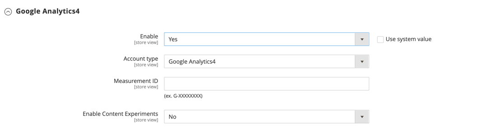
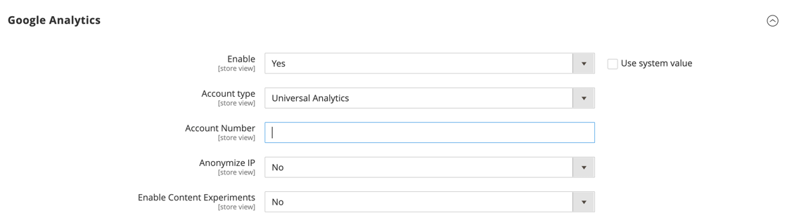

# [!DNL Google Analytics]

[!DNL Google Analytics] bietet Ihnen die Möglichkeit, zusätzliche benutzerdefinierte Dimensionen und Metriken für das Tracking zu definieren, mit Unterstützung für Offline- und Mobile-App-Interaktionen und Zugriff auf laufende Aktualisierungen. [!DNL Google Analytics] 4 ist die Messlösung der nächsten Generation von Google und ersetzt [!DNL Universal Analytics]. Am 1. Juli 2023 beenden die standardmäßigen Universal Analytics-Eigenschaften die Verarbeitung neuer Treffer.

>[!NOTE]
>
>Wenn Ihr Unternehmen Datenschutzbestimmungen wie der [Datenschutz-Grundverordnung](../getting-started/compliance-gdpr.md) und/oder dem [California Consumer Privacy Act“ unterliegt](../getting-started/compliance-ccpa.md) finden Sie weitere Informationen unter [Datenschutzeinstellungen von Google](google-tools.md#google-privacy-settings).

>[!IMPORTANT]
>
>Wenn Sie den [Cookie-Beschränkungsmodus](../getting-started/compliance-cookie-law.md) aktivieren, erfasst [!DNL Google Analytics] keine Daten über Besucher, es sei denn, diese haben Cookies akzeptiert.

## [!DNL Google Analytics] 4

{{gtag-api-note}}

### Schritt 1: Einrichten von [!UICONTROL Google Analytics] 4

Wenn Sie noch kein [!DNL Google Analytics] 4-Setup für Ihre Site haben, führen Sie eine der folgenden Methoden aus:

- [Einrichten der Analytics-Datenerfassung zum ersten Mal](https://support.google.com/analytics/answer/9304153)
- [Hinzufügen von Google Analytics 4 zu einer Site mit [!DNL Universal Analytics]](https://support.google.com/analytics/answer/9744165)

### Schritt 2: Commerce-Konfiguration abschließen

1. Melden Sie sich beim Administrator für Ihren Commerce-Store an.

1. Navigieren Sie in _Admin_-Seitenleiste zu **[!UICONTROL Stores]** > _[!UICONTROL Settings]_>**[!UICONTROL Configuration]**.

1. Erweitern Sie im linken Bereich **[!UICONTROL Sales]** und wählen Sie **[!UICONTROL Google API]**.

1. Erweitern Sie  den Abschnitt **[!UICONTROL Google GTag]** .

1. Erweitern Sie  den Unterabschnitt **[!UICONTROL Google Analytics4]** und führen Sie folgende Schritte aus:

   - Legen Sie **[!UICONTROL Enable]** auf `Yes` fest.

   - Belassen Sie die **[!UICONTROL Account type]** als `Google Analytics4`.

   - Geben Sie Ihre **[!UICONTROL Measurement ID]** ein. Weitere Informationen finden Sie in der [Google Analytics-Hilfe](https://support.google.com/analytics/answer/9539598).

   - Wenn Sie A/B-Tests und andere Leistungstests für Ihre Inhalte durchführen möchten, setzen Sie **Inhaltsexperimente** auf `Yes`.

   {width="600" zoomable="yes"}

1. Klicken Sie abschließend auf **[!UICONTROL Save Config]**.

## Google Universal Analytics

>[!IMPORTANT]
>
>Am 1. Juli 2023 werden die Daten in den standardmäßigen Universal Analytics-Eigenschaften nicht mehr verarbeitet. Wenn Sie sich weiterhin auf [!DNL Universal Analytics] verlassen, wird empfohlen, dass Sie [Google Analytics 4 verwenden](https://support.google.com/analytics/answer/10759417) in Zukunft.

### Schritt 1: Einrichten von Google Universal Analytics

Besuchen Sie die Google-Website und melden Sie sich für ein [Google Universal Analytics](https://support.google.com/analytics/answer/2817075?hl=en)-Konto an.

### Schritt 2: Commerce-Konfiguration abschließen

1. Melden Sie sich beim Administrator für Ihren Commerce-Store an.

1. Navigieren Sie in _Admin_-Seitenleiste zu **[!UICONTROL Stores]** > _[!UICONTROL Settings]_>**[!UICONTROL Configuration]**.

1. Erweitern Sie im linken Bereich **[!UICONTROL Sales]** und wählen Sie **[!UICONTROL Google API]**.

1. Erweitern Sie  den Abschnitt **[!UICONTROL Google Analytics]** und führen Sie folgende Schritte aus:

   - Legen Sie **[!UICONTROL Enable]** auf `Yes` fest.

   - Geben Sie Ihre [!DNL Google Analytics] **[!UICONTROL Account Number]** ein.

   - Wenn Sie A/B-Tests und andere Leistungstests für Ihre Inhalte durchführen möchten, setzen Sie **[!UICONTROL Content Experiments]** auf `Yes`.

   {width="600" zoomable="yes"}

1. Klicken Sie abschließend auf **[!UICONTROL Save Config]**.

## Verbesserter E-Commerce

Enhanced E-Commerce ist ein Plug-in für [!DNL Google Universal Analytics], mit dem Sie insight zum Einkaufs- und Kaufverhalten Ihrer Kunden hinzufügen können. Sie können Enhanced E-Commerce verwenden, um Berichte über wichtige Kundenaktivitäten zu erstellen, z. B. wenn Kundinnen und Kunden Artikel zum Warenkorb hinzufügen, den Checkout-Prozess starten oder einen Kauf abschließen. Sie können auch Muster von Käufern identifizieren und analysieren, die ihren Warenkorb verlassen, ohne einen Kauf zu tätigen.

Die folgenden Anweisungen zeigen, wie Sie [!DNL Google Tag Manager] mit [!DNL Universal Analytics] konfigurieren, um erweiterte E-Commerce-Daten und -Berichte zu erstellen.

### Schritt 1. Für Google-Konten anmelden

1. Melden Sie sich für ein [Google Tag Manager](google-tag-manager.md)-Konto an und schließen Sie die Commerce-Konfiguration ab.

1. Registrieren Sie sich für ein neues [Google Universal Analytics](https://support.google.com/analytics/answer/2817075?hl=en)-Konto.

### Schritt 2. Konfigurieren von Enhanced E-Commerce

1. Melden Sie sich bei Ihrem Google Universal Analytics-Konto an.

1. Erstellen Sie eine Eigenschaft für Enhanced E-Commerce Analytics mit den folgenden Einstellungen:

   - Status: EIN
   - Verwandte Produkte: EIN
   - Erweiterte eCommerce-Berichterstellung aktivieren: EIN
   - Checkout-Kennzeichnung: (nicht erforderlich)

1. Klicken Sie abschließend auf **[!UICONTROL Submit]**.

### Schritt 3. Erstellen von Tags und Triggern

1. Melden Sie sich bei Ihrem [!DNL Google Tag Manager] an und erstellen Sie die folgenden Trigger:

   | Name | Ereignistyp | Filter |
   |--- |--- |--- |
   | `addToCart` | Benutzerspezifisches Ereignis |  |
   | `checkout` | Benutzerspezifisches Ereignis |  |
   | `checkout only` | Seitenansicht | Die Seiten-URL stimmt überein mit RegEx /checkout/.* |
   | `checkoutOption` | Benutzerspezifisches Ereignis |  |
   | `gtm.dom` | Benutzerspezifisches Ereignis |  |
   | `productClick` | Benutzerspezifisches Ereignis |  |
   | `promotionClick` | Benutzerspezifisches Ereignis |  |
   | `removeFromCart` | Benutzerspezifisches Ereignis |  |

   >[!NOTE]
   >
   >Das [!UICONTROL Checkout] Ereignis wird nur für die integrierten Commerce-Basiszahlungsmethoden (wie `Check / Money Order` und `Cash On Delivery Payment`) ausgelöst. Dieses Ereignis wird nicht für `PayPal checkout` und andere externe Zahlungsmethoden ausgeführt, die eine Umleitung von externen Ressourcen zum Checkout verwenden.

1. Erstellen Sie die folgenden Universal Analytics-Tags mit derselben Basiskonfiguration.

   - Universal Analytics-Tags

     | Name | Typ | Auslösen von Triggern |
     |--- |--- |--- |
     | `Add to cart tracking` | Universal Analytics | addToCart |
     | `Checkout option tracking` | Universal Analytics | checkoutOption |
     | `Checkout tracking` | Universal Analytics | Auschecken |
     | `Pageview tracking` | Universal Analytics | gtm.dom |
     | `Product click tracking` | Universal Analytics | productClick |
     | `Promo click tracking` | Universal Analytics | PromotionClick |
     | `Remove from cart tracking` | Universal Analytics | removeFromCart |

   - Grundlegende Tag-Konfiguration

     | Einstellung | Wert |
     |--- |--- |
     | [!UICONTROL Product] | Google Analytics |
     | [!UICONTROL Tag Type] | Universal Analytics |
     | [!UICONTROL Tracking ID] | UA-XXX (Die Tracking-ID aus Ihrem Universal Analytics-Konto.) |
     | [!UICONTROL Enable Enhanced Ecommerce Features] | wahr |
     | [!UICONTROL Use data layer] | wahr |
     | [!UICONTROL Use Debug version] | wahr |

1. Füllen Sie die einzelnen Tracking-Konfigurationen aus.

   - Geben Sie die folgenden **[!UICONTROL Add to Cart]** Tracking-Einstellungen ein:

     | Einstellung | Wert |
     |--- |--- |
     | [!UICONTROL Track Type] | Ereignis |
     | [!UICONTROL Category] | E-Commerce |
     | [!UICONTROL Action] | Zum Warenkorb hinzufügen |
     | [!UICONTROL Trigger] | addToCart |

   - Geben Sie die folgenden **[!UICONTROL Checkout option]** Tracking-Einstellungen ein:

     | Einstellung | Wert |
     |--- |--- |
     | [!UICONTROL Track Type] | Ereignis |
     | [!UICONTROL Category] | E-Commerce |
     | [!UICONTROL Action] | Checkout-Option |
     | [!UICONTROL Trigger] | checkoutOption |

   - Geben Sie die folgenden **[!UICONTROL PageView]** Tracking-Einstellungen ein:

     | Einstellung | Wert |
     |--- |--- |
     | [!UICONTROL Track Type] | PageView |
     | [!UICONTROL Trigger] | gtm.dom |

   - Führen Sie die folgende **[!UICONTROL Product Click]**-Tracking-Konfiguration aus:

     | Einstellung | Wert |
     |--- |--- |
     | [!UICONTROL Track Type] | Ereignis |
     | [!UICONTROL Category] | E-Commerce |
     | [!UICONTROL Action] | Produkt-Klick |
     | [!UICONTROL Trigger] | productClick |

   - Führen Sie die folgende **[!UICONTROL Promotion Click]**-Tracking-Konfiguration aus:

     | Einstellung | Wert |
     |--- |--- |
     | [!UICONTROL Track Type] | Ereignis |
     | [!UICONTROL Category] | E-Commerce |
     | [!UICONTROL Action] | Promotion-Klick |
     | [!UICONTROL Trigger] | PromotionClick |

   - Führen Sie die folgende **[!UICONTROL Remove from Cart]**-Tracking-Konfiguration aus:

     | Einstellung | Wert |
     |--- |--- |
     | [!UICONTROL Track Type] | Ereignis |
     | [!UICONTROL Category] | E-Commerce |
     | [!UICONTROL Action] | Aus Warenkorb entfernen |
     | [!UICONTROL Trigger] | removeFromCart |

1. Wenn Sie fertig sind, klicken Sie auf **[!UICONTROL Preview]** und überprüfen Sie, ob die Tags ordnungsgemäß funktionieren.

1. Klicken Sie nach Überprüfung der Einstellungen auf **[!UICONTROL Publish]**.
