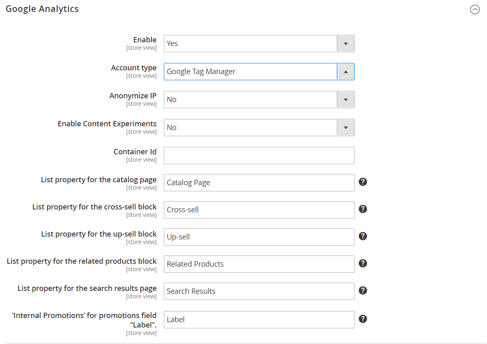

# [!DNL Google Tag Manager]

{{ee-feature}}

[!DNL Google Tag Manager] ist ein leistungsstarkes Tool, mit dem Sie verschiedene Tags (Code-Ausschnitte), die mit Ihren Marketing-Kampagnenereignissen verknüpft sind, effizient verwalten und bereitstellen können. [!DNL Google Tag Manager] bietet Ihnen die Möglichkeit, Tracking-Tags zu Ihrer Site hinzuzufügen, um die Zielgruppe zu messen oder Marketing-Initiativen für Suchmaschinen zu personalisieren, erneut anzusprechen oder durchzuführen.

[!DNL Google Tag Manager] überträgt Daten und Ereignisse direkt an [!DNL Google Analytics], Enhanced E-Commerce und andere Analyselösungen von Drittanbietern, um ein klares Bild davon zu erhalten, wie gut Ihre Site, Produkte und Promotions funktionieren.

Sie sollten über ein [!DNL Google Analytics] und ein [!DNL Tag Manager] Konto verfügen, um diesen Prozess fortzusetzen. Die folgenden Anweisungen führen Sie durch den Prozess der Konfiguration Ihrer Google-Konten, der Konfiguration Ihres Commerce-Stores und der Erstellung eines Tags.

>[!NOTE]
>
>Wenn Ihr Unternehmen Datenschutzbestimmungen wie der [Datenschutz-Grundverordnung](../getting-started/compliance-gdpr.md) und/oder dem [California Consumer Privacy Act“ unterliegt](../getting-started/compliance-ccpa.md) finden Sie weitere Informationen unter [Datenschutzeinstellungen von Google](google-tools.md#google-privacy-settings).

## Schritt 1. Konfigurieren des [!DNL Google Analytics]

Siehe [Einrichten der Site-Suche](https://support.google.com/analytics/answer/1012264) in der Hilfe zu Google für die Grundlagen, die Sie für die ersten Schritte benötigen. Siehe auch die Google-Handbücher für [Google Analytics](https://support.google.com/analytics/answer/9304153) und [Google Tag Manager](https://support.google.com/tagmanager/answer/6102821).

1. Melden Sie sich bei Ihrem [!DNL Google Analytics] Konto an.

1. Gehen Sie wie folgt vor, um **[!UICONTROL Internal Site Search Tracking]** zu aktivieren:

   - Navigieren Sie zu **[!UICONTROL Select View]** > **[!UICONTROL View Settings]**.

   - Legen Sie **[!UICONTROL Site Search Tracking]** auf `On` fest.

   - Setzen Sie **[!UICONTROL Query]** Parameter auf `q`.

   - Wenn Sie fertig sind, **[!UICONTROL Save]** Sie die Einstellungen.

1. Gehen Sie wie folgt vor, um Anzeigefunktionen zu aktivieren:

   - Wählen Sie **[!UICONTROL Property Settings]**.

   - Legen Sie unter _[!UICONTROL Advertising Features]_&#x200B;**[!UICONTROL Enable Demographics and Interest Reports]**&#x200B;auf `On` fest.

   - **[!UICONTROL Save]** der Einstellungen.

1. Gehen Sie wie folgt vor, um das E-Commerce-Tracking zu aktivieren:

   - Navigieren Sie zu **[!UICONTROL Select View]** > **[!UICONTROL Ecommerce Settings]**.

   - Legen Sie **[!UICONTROL Enable Ecommerce]** auf `On` fest.

   - Legen Sie **[!UICONTROL Enable Enhanced Ecommerce Reporting]** auf `On` fest.

   - **[!UICONTROL Save]** der Einstellungen.

1. Laden Sie die Seite neu und stellen Sie sicher, dass alle Einstellungen `On` bleiben.

   >[!NOTE]
   >
   >Wenn nicht alle Einstellungen `On` sind, wiederholen Sie die vorherigen Schritte, speichern Sie die Seite und laden Sie sie neu. Wiederholen Sie diesen Vorgang, bis alle Einstellungen auf `On` gesetzt sind.

## Schritt 2. Konfigurieren des [!DNL Google Tag Manager]

Die folgenden Anweisungen zeigen, wie Sie einen neuen Container mit den Grundeinstellungen konfigurieren. Eine Beispielkonfigurationsdatei [Composer](https://developer.adobe.com/commerce/php/development/composer/) (.json) wird verwendet, um den Prozess zu vereinfachen, indem importiert wird, um ein Tag in einem neuen Container zu generieren. In diesem Beispiel wird empfohlen, einen Container zu erstellen, anstatt einen vorhandenen Container zu ändern.

>[!NOTE]
>
>Weitere Informationen finden Sie unter Google [Container-Export und -Import](https://support.google.com/tagmanager/answer/6106997). Diese Anweisungen bieten eine Anleitung zum Importieren einer Beispiel-JSON in einen neuen Container.

1. Laden Sie die verknüpfte Datei [GTM_M2_Config_json.txt](./assets/GTM_M2_Config_json.txt) herunter, öffnen Sie die Datei in einem Editor und speichern Sie sie als `GTM_M2_Config.json`.

   Die JSON-Datei wird direkt in [!DNL Google Tag Manager] hochgeladen.

1. Navigieren Sie zu **[!UICONTROL Admin]** > **[!UICONTROL Container]** > **[!UICONTROL Import Container]**.

1. Klicken Sie auf **[!UICONTROL Choose container file]** und wählen Sie die JSON-Datei aus.

1. Klicken Sie unter **[!UICONTROL Choose workspace]** auf **[!UICONTROL New]**.

1. Geben Sie einen Titel und eine Beschreibung ein und klicken Sie dann auf **[!UICONTROL Save]**.

1. Um die Datei zu importieren, wählen Sie eine der folgenden Aktionen aus:

   - Für einen neuen Container sollte die Option **[!UICONTROL Overwrite]** ausgewählt werden.

   - Wenn Sie einen vorhandenen Container verwenden, sollte die Option **[!UICONTROL Merge]** ausgewählt werden.

1. Klicken Sie auf **[!UICONTROL Preview]** , um die Tags, Trigger und Variablen zu überprüfen.

1. Gehen Sie wie folgt vor, um die **[!UICONTROL Google Analytics ID]** zu bearbeiten, auf die in Variablen verwiesen wird:

   - Navigieren Sie zu **[!UICONTROL Variables]** > **[!UICONTROL User-Defined Variables]**.

   - Wählen Sie **[!UICONTROL Google Analytics]** und aktualisieren Sie den Platzhalter (`UA-xxxxxx-x`) mit Ihrer eigenen **[!UICONTROL GA ID]**.

1. Befolgen Sie die Anweisungen in Google zum Hinzufügen von Tags, Triggern und Variablen zum neuen Container.

   Wenn Sie Einstellungen in einem anderen Container haben, den Sie verwenden möchten, können diese in den neuen Container verschoben werden.

1. Klicken Sie nach Abschluss auf **[!UICONTROL Confirm]** .

1. Befolgen Sie die Anweisungen in Google zum Veröffentlichen des neuen Containers.

## Schritt 3. Konfigurieren des Stores

{{gtag-api-note}}

1. Melden Sie sich beim Administrator Ihres Commerce-Stores an.

1. Navigieren Sie in _Admin_-Seitenleiste zu **[!UICONTROL Stores]** > _[!UICONTROL Settings]_>**[!UICONTROL Configuration]**.

1. Erweitern Sie im linken Bereich **[!UICONTROL Sales]** und wählen Sie **[!UICONTROL Google API]**.

1. Erweitern Sie  den Abschnitt **[!UICONTROL Google Analytics]** und konfigurieren Sie Folgendes:

   {width="600" zoomable="yes"}

   - Legen Sie **[!UICONTROL Enable]** auf `Yes` fest.

   - Legen Sie **[!UICONTROL Account type]** auf `Google Tag Manager` fest.

   - Geben Sie im Feld **[!UICONTROL Container ID]** Ihre GTM-ID ein (`GTM-xxxxxx`).

   - Wenn Sie Google Analytics auch zum Erstellen von Inhaltsexperimenten verwenden, setzen Sie **Inhaltsexperimente aktivieren** auf `Yes`.

   - Verwenden Sie die Standardwerte für die verbleibenden Felder.

1. Klicken Sie abschließend auf **[!UICONTROL Save Config]**.

1. Testen Sie Ihre [!DNL Google Tag Manager] und stellen Sie sicher, dass alles korrekt funktioniert.

>[!NOTE]
>
>Jeder Container ist einer Website zugeordnet und Sie benötigen nur einen Container pro Konto. Wenn Sie über eine Commerce-Instanz mit mehreren Sites verfügen, benötigen Sie separate Container.

## Feldbeschreibungen

| Feld | Umfang | Beschreibung |
|--- |--- |--- |
| [!UICONTROL Enable] | Shop-Ansicht | Legt fest, ob Google Analytics Enhanced E-Commerce zur Analyse der Aktivitäten in Ihrem Store verwendet werden kann. Optionen: `Yes` / `No` |
| [!UICONTROL Account type] | Shop-Ansicht | Bestimmt den Google-Trackingcode, der zur Überwachung von Speicheraktivität und Traffic verwendet wird. Optionen: `Google Analytics` / `Google Tag Manager` |
| [!UICONTROL Anonymize IP] | Shop-Ansicht | Bestimmt, ob identifizierende Informationen aus IP-Adressen entfernt werden, die in den Google Analytics-Ergebnissen angezeigt werden. |
| [!UICONTROL Container Id] | Shop-Ansicht | Wenn [!DNL Google Tag Manager] bereits für Ihren Store installiert und konfiguriert ist, wird die Container-ID automatisch in diesem Feld angezeigt. |
| [!UICONTROL List property for the catalog page] | Shop-Ansicht | Identifiziert die Tag-Manager-Eigenschaft, die mit der Katalogseite verknüpft ist. Standardwert: `Catalog Page` |
| [!UICONTROL List property for the cross-sell block] | Shop-Ansicht | Gibt die Tag-Manager-Eigenschaft an, die mit dem Crosssell-Block verknüpft ist. Standardwert: `Cross-sell` |
| [!UICONTROL List property for the up-sell block] | Shop-Ansicht | Gibt die Tag-Manager-Eigenschaft an, die mit dem Upsell-Block verknüpft ist. Standardwert: `Up-sell` |
| [!UICONTROL List property for the related products block] | Shop-Ansicht | Identifiziert die Tag-Manager-Eigenschaft, die mit dem zugehörigen Produktblock verknüpft ist. Standardwert: `Related Products` |
| [!UICONTROL List property for the search results page] | Shop-Ansicht | Gibt die Tag-Manager-Eigenschaft an, die mit der Suchergebnisseite verknüpft ist. Standardwert: `Search Results` |
| [!UICONTROL "Internal Promotions" for promotions field "Label"] | Shop-Ansicht | Identifiziert die Tag-Manager-Eigenschaft, die mit den Kennzeichnungen für interne Promotions verknüpft ist. Standardwert: `Label` |

{style="table-layout:auto"}

## Erstellen eines Tags zum Tracking von Konversionen

Wenn Sie über ein Google AdWords-Konto verfügen, können Sie ein Tag erstellen, mit dem Konversionen verfolgt werden. Das folgende Beispiel zeigt, wie Sie sowohl [!DNL Google Tag Manager] als auch [!DNL Google Analytics] verwenden, um ein Tag zu erstellen, das auf der Konversionsseite _Shops ausgelöst_.

### Schritt 1. Erstellen eines Tags

1. Melden Sie sich bei Ihrem [!DNL Google Tag Manager]-Konto an und klicken Sie auf den Link für den Container, den Sie für Ihren Store erstellt haben.

1. Klicken Sie im **[!UICONTROL New Tag]** auf **[!UICONTROL Add a new tag]**.

1. Die folgenden Informationen erhalten Sie von Ihrem AdWords-Konto:

   - Konversions-ID
   - Titel der Konversion

   Wenn Sie Hilfe benötigen, besuchen Sie die [Support-Site](https://support.google.com/tagmanager/answer/6105160) von Google.

1. Klicken Sie im [!DNL Google Tag Manager]-Dashboard auf **[!UICONTROL Google AdWords]** und führen Sie folgende Schritte aus:

   - Klicken Sie auf den Platzhalter Titel und geben Sie einen Namen für das neue Tag ein.

   - Wählen Sie unter **[!UICONTROL Choose Product]** die Option **[!UICONTROL Google AdWords]**.

   - Wählen Sie unter _[!UICONTROL Choose a Tag Type]_&#x200B;die Option **[!UICONTROL AdWords Conversion Tracking]**&#x200B;aus und klicken Sie auf **[!UICONTROL Continue]**.

1. Geben Sie die **[!UICONTROL Conversion ID]** und **[!UICONTROL Conversion Label]** aus Ihrem AdWords-Konto ein und klicken Sie auf **[!UICONTROL Continue]**.

### Schritt 2. Erstellen einer Regel

Im nächsten Schritt erstellen Sie über das [!DNL Google Tag Manager]-Dashboard eine Regel, die das -Tag auf der Konversionsseite auslöst.

1. Klicken Sie unter **[!UICONTROL Fire On]** auf **[!UICONTROL Some Pages]**.

1. Füllen Sie im Abschnitt _[!UICONTROL Choose Pages]_&#x200B;die folgenden Einstellungen aus:

   - **[!UICONTROL Name]** - Geben Sie einen Namen für die Seitenbeschreibung ein.

   - **[!UICONTROL Variable]** `url`

   - **operation** - `matches RegEx`

     Weitere Informationen finden Sie unter [Regex- und CSS-Selektoroperatoren](https://support.google.com/tagmanager/answer/7679109) in der Google Tag Manager-Hilfe.

   - **[!UICONTROL Value]** - `checkout/success.*`

1. Aktivieren Sie das grüne Kontrollkästchen und klicken Sie auf **[!UICONTROL Save]**.

   Der von Ihnen eingerichtete Trigger wird im Abschnitt Auslösen bei als blaue Schaltfläche angezeigt.

1. Klicken Sie abschließend auf **[!UICONTROL Save Tag]**.

### Schritt 3. Vorschau und Veröffentlichung

Der nächste Schritt im Prozess besteht in der Vorschau des Tags. Bei jeder Vorschau des Tags wird ein Schnappschuss der Version gespeichert. Wenn Sie mit den Ergebnissen zufrieden sind, wechseln Sie zur Version, die Sie verwenden möchten, und klicken Sie auf **[!UICONTROL Publish]**.

## Benutzerdefiniertes HTML-Tag mit JavaScript

In diesem Abschnitt wird erläutert, wie Sie eine CSP-Nonce zum benutzerdefinierten HTML Tag JavaScript hinzufügen, um sie auf der Kaufseite auszuführen und so die Einhaltung der Anforderungen der Content Security Policy (CSP) sicherzustellen. Dieser Zusatz erhöht die Sicherheit der Site, indem er die Ausführung nicht autorisierter Skripte verhindert. Weitere Informationen finden Sie in der Dokumentation [Content Security Policy](https://developer.adobe.com/commerce/php/development/security/content-security-policies) .

>[!NOTE]
>
>Der Import der globalen `cspNonce`-Variablen in Google Tag Manager wird nur ab Adobe Commerce-Version 2.4.8 unterstützt.

>[!WARNING]
>
>Das Hinzufügen unbekannter Skripte zu Ihrem Store kann das Risiko von Datenkompromittierungen bergen. Skripte, die auf der Checkout-Seite autorisiert sind, können vertrauliche Kundeninformationen, einschließlich Zahlungsdetails, stehlen. Sie müssen unbedingt Vorsichtsmaßnahmen treffen, um Ihr Google Tag Manager-Konto zu schützen. Fügen Sie nur vertrauenswürdige Skripte hinzu, überprüfen Sie Ihre Tags regelmäßig und implementieren Sie strenge Sicherheitsmaßnahmen wie Zwei-Faktor-Authentifizierung (2FA) und Zugriffssteuerung.

### Schritt 1. Erstellen einer CSP-Nonce-Variablen

Sie können eine CSP-Nonce-Variable erstellen, die in Ihrem Google Tag Manager verwendet werden kann, indem Sie die Variablenkonfiguration importieren oder manuell konfigurieren.

#### Importieren der Variablenkonfiguration

Die CSP-Nonce-Variable ist im Beispiel-Container [GTM_M2_Config_json.txt](./assets/GTM_M2_Config_json.txt) enthalten. Sie können die Variable erstellen, indem Sie diesen Code in Ihren Arbeitsbereich importieren.

#### Variable manuell erstellen

Wenn Sie die Variablenkonfiguration nicht importieren können, führen Sie die folgenden Schritte aus, um sie zu erstellen.

1. Navigieren Sie in Ihrem Arbeitsbereich zum Abschnitt **Variablen** in der Seitenleiste.
1. Klicken Sie auf **Neu** Schaltfläche unten auf der Seite im Abschnitt **Benutzerdefinierte Variablen** .
1. Benennen Sie die Variable `gtmNonce`.
1. Klicken Sie auf das Stiftsymbol, um die Variable zu bearbeiten.
1. Wählen Sie **JavaScript** aus dem Abschnitt **Seitenvariable** aus.
1. Geben Sie **Feld „Globaler**&quot; `window.cspNonce` ein.
1. Speichern Sie die Variable.

Weitere Informationen zu [Google Tag Manager-Variablen](https://support.google.com/tagmanager/answer/7683056?hl=en) finden Sie unter [Benutzerdefinierte Variablentypen für das Web](https://support.google.com/tagmanager/answer/7683362?hl=en) in der Dokumentation zu Google. Diese Dokumentation bietet detaillierte Anleitungen zum Erstellen und Verwalten benutzerdefinierter Variablen, um Ihr Tag-Management auf spezifische Marketing- und Analyseanforderungen anzupassen.

### Schritt 2. Erstellen eines benutzerdefinierten HTML-Tags

1. Navigieren Sie in Ihrem Arbeitsbereich zum Abschnitt **Tags** in der Seitenleiste.
1. Klicken Sie auf die **Neu**-Schaltfläche.
1. Wählen Sie **Abschnitt** Tag-Konfiguration“ **Benutzerdefiniertes HTML-Tag** aus.
1. Geben Sie die erforderliche JavaScript im Textbereich ein und fügen Sie dem öffnenden `<script>`-Tag ein nonce-Attribut hinzu, das auf die Variable verweist, die Sie im vorherigen Schritt erstellt haben. Beispiel:

   ```html
   <script nonce="{{gtmNonce}}">
       // Your JavaScript code here
   </script>
   ```

1. Wählen Sie **Support document.write** aus.
1. Wählen Sie **Abschnitt** den gewünschten Trigger aus. Beispiel: **Einverständnisinitialisierung - Alle Seiten**.

Weitere Informationen zu [Tags](https://support.google.com/tagmanager/answer/3281060) im Tag-Manager von Google finden Sie unter [Benutzerdefinierte Tags](https://support.google.com/tagmanager/answer/6107167) in der Dokumentation zu Google.
