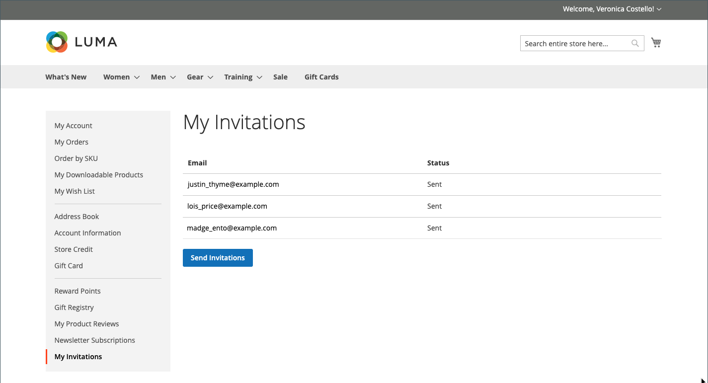
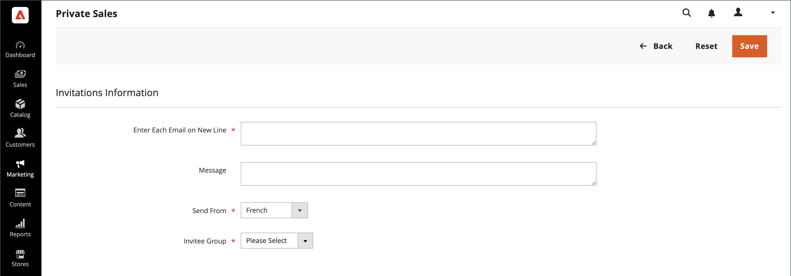

# Ereigniseinladungen

{{ee-feature}}

Wenn Einladungen aktiviert sind, können Kundinnen und Kunden Einladungen über das Dashboard ihrer Kundenkonten senden und anzeigen. Die Einladungs-E-Mail enthält einen Link zur Kunden-Anmeldeseite Ihres Stores.

## Meine Einladungen

Im Abschnitt _[!UICONTROL My Invitations]_des Kundenkontos sind alle vom Kunden gesendeten Einladungen aufgeführt. Kunden können Einladungen an Freunde und Familie für Store-Events, Geschenkregistrierungen, Wunschlisten usw. senden.

{width="700" zoomable="yes"}

### Einladungs-Workflow

1. **Kunde bereitet Einladungen vor**: Vom Konto-Dashboard aus bereitet der Kunde die Empfängerliste vor und vervollständigt die Einladung. Abhängig von der Konfiguration kann eine benutzerdefinierte Nachricht eingefügt werden.
1. **Kunde sendet Einladungen**: Wenn er bereit ist, klickt der Kunde auf die Schaltfläche &quot;_[!UICONTROL Send Invitations]_&quot;.
1. **System verwaltet die**: Das System sendet Einladungen stapelweise, entsprechend der in der Konfiguration festgelegten Nummer.
1. **Antwort der Kundenüberwachung**: Die Kundin oder der Kunde überwacht den Status jeder Einladung über das Konto-Dashboard, `Sent`, `Accepted` oder `Canceled`.

### Einladung senden

1. In der Seitenleiste des Kontos in der Storefront wählt der Kunde **[!UICONTROL My Invitations]** aus.

1. Klicken Sie auf _Seite_ Meine Einladung **[!UICONTROL Send Invitation]** auf .

1. Definiert das neue Einladungselement:

   - Ergänzt die E-Mail-Informationen.

   - (Optional) Erstellt eine Einladung mit mehreren Adressen, indem auf **+** geklickt und eine weitere E-Mail-Adresse hinzugefügt wird.

     Für eine Einladung gilt ein Limit von fünf E-Mail-Adressen.

   - (Optional) Gibt eine begleitende Nachricht ein.

1. Wenn Sie fertig sind, klicken Sie **[!UICONTROL Send Invitation]**.

Eine Einladungsbenachrichtigung wird an die E-Mail-Adresse des eingeladenen Benutzers mit einem Link zur Einrichtung des Kontos gesendet.

>[!NOTE]
>
>Ein Benutzer kann nur eine Einladung an eine bestimmte E-Mail-Adresse senden. Wenn Sie versuchen, eine Einladung erneut an dieselbe E-Mail-Adresse zu senden, wird eine Fehlermeldung angezeigt und die Einladung wird nicht gesendet.

## Einladungen für Ihren Shop aktivieren

Die Einladungskonfiguration aktiviert Einladungen für den Store und bestimmt, wie sie gesendet werden.

1. Navigieren Sie in _Admin_-Seitenleiste zu **[!UICONTROL Stores]** > _[!UICONTROL Settings]_>**[!UICONTROL Configuration]**.

1. Erweitern Sie im linken Bereich **[!UICONTROL Customers]** und wählen Sie **[!UICONTROL Invitations]**.

1. Erweitern Sie  den Abschnitt **[!UICONTROL General]** .

   {width="600" zoomable="yes"}

1. Legen Sie **[!UICONTROL Enable Invitations Functionality]** auf `Yes` fest.

1. Damit Kunden Einladungen aus der Storefront verwalten können, setzen Sie **Einladungen in der Storefront aktivieren** auf `Yes`.

1. Legen Sie **[!UICONTROL Referred Customer Group]** auf eine der folgenden Einstellungen fest:

   - `Same as Inviter`
   - `Default Customer Group from Configuration`

1. Legen Sie **[!UICONTROL New Accounts Registration]** auf eine der folgenden Einstellungen fest:

   - `By Invitation Only`
   - `Available to All`

1. Wählen Sie zum **[!UICONTROL Allow Customers to Add Custom Message to Invitation Email]** `Yes` aus.

1. Um die Anzahl der Einladungen zu begrenzen, die gleichzeitig gesendet werden können, geben Sie die Zahl in das Feld **[!UICONTROL Max Invitations Allowed to be Sent at One Time]** ein.

1. Erweitern Sie  den Abschnitt **[!UICONTROL Email]** und führen Sie folgende Schritte aus:

   {width="600" zoomable="yes"}

   - Wählen Sie die Store-Identität aus, die als **[!UICONTROL Customer Invitation Email Sender]** verwendet werden soll.

   - Wählen Sie die **[!UICONTROL Customer Invitation Email Template]** aus, die für die gesendeten Einladungen verwendet werden sollen.

1. Klicken Sie abschließend auf **[!UICONTROL Save Config]**.

## Einladungen im Administrator senden und verwalten

Im Abschnitt [Private Verkaufsberichte](../getting-started/private-sales-reports.md) sehen Sie die Anzahl der Einladungen, die während eines bestimmten Zeitraums gesendet wurden, oder die der Kunden, an die Sie Einladungen gesendet haben.

### Erstellen einer Einladung in der Admin Console

1. Navigieren Sie in _Admin_-Seitenleiste zu **[!UICONTROL Marketing]** > _[!UICONTROL Private Sales]_>**[!UICONTROL Invitations]**.

1. Klicken Sie oben rechts auf **[!UICONTROL Add Invitations]**.

1. Geben Sie im nächsten Bildschirm E-Mail-Adressen ein, um neue Kunden einzuladen, fügen Sie eine benutzerdefinierte Nachricht hinzu, wählen Sie einen Absender aus und wählen Sie eine eingeladene Gruppe aus.

   Wenn Sie über mehrere Store-Ansichten verfügen, verwenden Sie die Option **[!UICONTROL Send From]** , um die Store-Ansicht anzugeben, von der eine Einladung gesendet wird.

   {width="700" zoomable="yes"}

1. Klicken Sie abschließend auf **[!UICONTROL Save]**.

### Einladungen für einzelne Entität verwerfen

1. Navigieren Sie in _Admin_-Seitenleiste zu **[!UICONTROL Marketing]** > _[!UICONTROL Private Sales]_>**[!UICONTROL Invitations]**.

1. Suchen Sie mithilfe von Filtern die gewünschte Einladung und öffnen Sie sie im Bearbeitungsmodus.

1. Klicken Sie oben rechts auf **[!UICONTROL Discard Invitation]**.

1. Um die Aktion zu bestätigen, klicken Sie auf **[!UICONTROL OK]**.

### Einladungen für mehrere Entitäten verwerfen

1. Navigieren Sie in _Admin_-Seitenleiste zu **[!UICONTROL Marketing]** > _[!UICONTROL Private Sales]_>**[!UICONTROL Invitations]**.

1. Suchen Sie die Einladungen, die verworfen werden sollen, und wählen Sie sie aus.

1. Wählen Sie oben links im Menü **[!UICONTROL Actions]** die Option **[!UICONTROL Discard Selected]** aus und klicken Sie auf **[!UICONTROL Submit]**.

1. Um die Aktion zu bestätigen, klicken Sie auf **[!UICONTROL OK]**.

### Feldbeschreibungen

| Feld | Beschreibung |
|--- |--- |
| [!UICONTROL Select] | Aktivieren Sie das Kontrollkästchen, um die Einladungen auszuwählen, die einer Aktion unterzogen werden sollen, oder verwenden Sie die Auswahlsteuerung in der Spaltenüberschrift. Optionen: `Select All` /` Deselect All` / `Select Visible` / `Unselect Visible` |
| [!UICONTROL ID] | Die interne ID-Nummer einer Einladung |
| [!UICONTROL Email] | Eine entsprechende Kunden-E-Mail-Adresse |
| [!UICONTROL Invitee] | E-Mail für eingeladene Benutzer |
| [!UICONTROL Sent] | Uhrzeit und Datum, an dem eine Einladung gesendet wurde |
| [!UICONTROL Registered] | Zeit und Daten, zu der ein Kunde registriert wurde |
| [!UICONTROL Status] | Einladungsstatus. Optionen: `Sent` / `Not Sent` / `Accepted` / `Discarded` |
| [!UICONTROL Valid Website] | Die entsprechende Website |
| [!UICONTROL Invitee Group] | Eine Kundengruppe eines Eingeladenen |

{style="table-layout:auto"}
