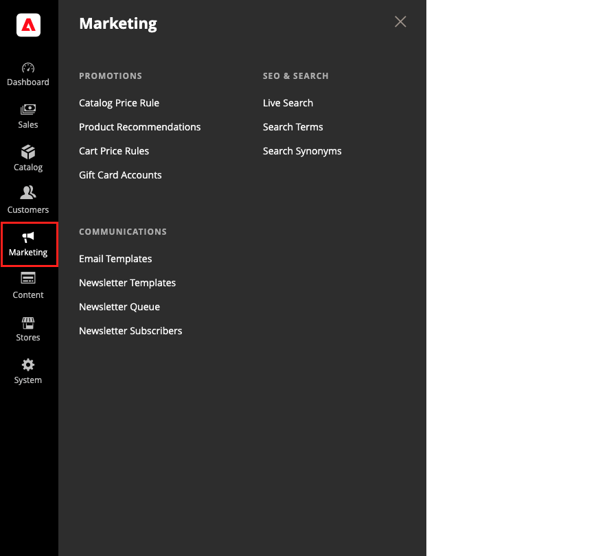

# Menü [!UICONTROL Marketing]

Das [!UICONTROL Marketing] bietet Zugriffstools zum Verwalten von Promotions, Kommunikation, SEO und benutzergenerierten Inhalten.

>[!BEGINTABS]

>[!TAB Adobe Commerce]

[!BADGE Nur PaaS]{type=Informative url="https://experienceleague.adobe.com/de/docs/commerce/user-guides/product-solutions" tooltip="Gilt nur für Adobe Commerce in Cloud-Projekten (von Adobe verwaltete PaaS-Infrastruktur) und lokale Projekte."}

{width="600" zoomable="yes"}

>[!TAB Adobe Commerce as a Cloud Service]

[!BADGE nur SaaS]{type=Positive url="https://experienceleague.adobe.com/de/docs/commerce/user-guides/product-solutions" tooltip="Gilt nur für Adobe Commerce as a Cloud Service- und Adobe Commerce Optimizer-Projekte (von Adobe verwaltete SaaS-Infrastruktur)."}

{width="600" zoomable="yes"}

>[!ENDTABS]

## Anzeigen des [!UICONTROL Marketing]

Klicken Sie in der _Admin_-Seitenleiste auf **[!UICONTROL Marketing]**.

## Hauptabschnitte

### [!UICONTROL Promotions]

Erstellen Sie [Katalog](price-rules-catalog.md) und [Warenkorb](price-rules-cart.md) Preisregeln, die Trigger Rabatte basierend auf verschiedenen Bedingungen gewähren. Richten Sie [Promotions](introduction.md#promotions) ein, die aktiv werden, wenn die erforderlichen Bedingungen erfüllt sind.

 (nur Adobe Commerce) [Verwandte Produktregeln erstellen](product-related-rules.md) und (Geschenkkartenkonten[ verwalten](../stores-purchase/product-gift-card-accounts.md).

### [!UICONTROL Private Sales]

[!BADGE Nur PaaS]{type=Informative url="https://experienceleague.adobe.com/de/docs/commerce/user-guides/product-solutions" tooltip="Gilt nur für Adobe Commerce in Cloud-Projekten (von Adobe verwaltete PaaS-Infrastruktur) und lokale Projekte."}

{{ee-feature}}

Private Verkäufe und andere Katalogveranstaltungen sind eine hervorragende Möglichkeit, Ihren bestehenden Kundenstamm zu nutzen, um Buzz und neue Leads mit exklusivem Zugriff nur für Mitglieder oder auf Einladung zu generieren.

### [!UICONTROL Communications]

Passen Sie alle Benachrichtigungen an, die von Ihrem Geschäft gesendet werden. Erstellen [Newsletter](newsletters.md) und veröffentlichen Sie [RSS](social-rss.md#rss-feeds)-Feeds.

 (nur Adobe Commerce) Richten Sie Regeln ein, die [E-Mail-Erinnerungen](email-reminder-rules.md) an Kunden senden, wenn die Bedingungen erfüllt sind.

### [!UICONTROL SEO & Search]

Analysieren Sie [Suchbegriffe](../catalog/search-terms.md) und [Synonyme](../catalog/search-terms.md#search-synonyms), um Kunden dabei zu helfen, Produkte im Store zu finden, [Meta-Daten](meta-data.md) zu verwalten und eine [-Sitemap zu erstellen](sitemap-xml.md). Verwenden Sie [Umleitungen](url-rewrite.md) um URL-Änderungen zu verwalten und fehlerhafte Links zu vermeiden.

### [!UICONTROL User Content]

[!BADGE Nur PaaS]{type=Informative url="https://experienceleague.adobe.com/de/docs/commerce/user-guides/product-solutions" tooltip="Gilt nur für Adobe Commerce in Cloud-Projekten (von Adobe verwaltete PaaS-Infrastruktur) und lokale Projekte."}

Integrieren Sie benutzergenerierte [Produktbewertungen](product-reviews.md), um ein Gemeinschaftsgefühl zu schaffen und den Umsatz zu steigern.
