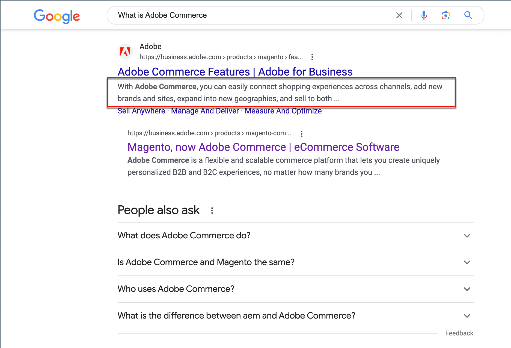
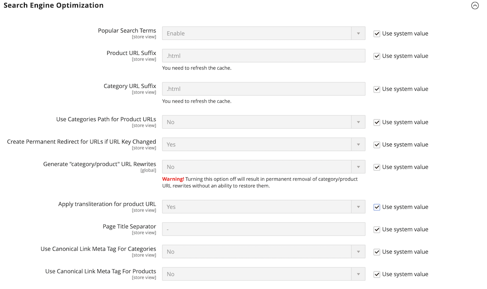

# Metadaten

>[!TIP]
>
>Informationen zu Adobe Commerce as a Cloud Service finden Sie unter [Metadatenrichtlinien](https://experienceleague.adobe.com/developer/commerce/storefront/setup/seo/metadata/) in der Dokumentation zu Commerce Storefront

Ihr Store enthält Orte, an denen Sie schlüsselwortreiche Metadaten eingeben können, um die Art und Weise zu verbessern, wie Suchmaschinen Ihre Site indizieren. Beim Einrichten Ihres Stores geben Sie möglicherweise vorläufige Metadaten ein, die Sie später abschließen möchten. Im Laufe der Zeit können Sie die Metadaten entsprechend den Kaufmustern und -präferenzen Ihrer Kunden anpassen.

{width="700" zoomable="yes"}

## Meta-Titel

Der Meta-Titel wird in der Titelleiste und auf der Registerkarte der Browser- und Suchergebnislisten angezeigt. Der Meta-Titel sollte für die Seite eindeutig sein und weniger als 70 Zeichen lang sein.

{width="600"}

## Meta-Schlüsselwörter

Obwohl einige Suchmaschinen Meta-Keywords ignorieren, verwenden andere diese weiterhin. Derzeit empfiehlt es sich, hochwertige Keywords in den Metatitel und die Metabeschreibung einzubinden.

{width="500"}

## Meta-Beschreibung

Meta-Beschreibungen bieten einen kurzen Überblick über die Seite für Suchergebnislisten. Eine Meta-Beschreibung sollte idealerweise zwischen 150 und 160 Zeichen lang sein, obwohl das Feld bis zu 255 Zeichen lang sein kann.

## Rich Snippets

Rich-Snippets bieten detaillierte Informationen für Suchergebnislisten und andere Anwendungen. Standardmäßig wird das strukturierte Daten-Markup, das auf dem Standard [schema.org][1] basiert, zur Produktvorlage Ihres Stores hinzugefügt. Infolgedessen stehen für Suchmaschinen weitere Informationen zur Verfügung, die als _Snippets in_ Produktlisten aufgenommen werden können.

## Kanonisches Meta-Tag

Einige Suchmaschinen bestrafen Websites, die mehrere URLs haben, die auf denselben Inhalt verweisen. Das kanonische Meta-Tag teilt Suchmaschinen mit, welche Seite indiziert werden soll, wenn mehrere URLs identische oder ähnliche Inhalte haben. Die Verwendung des kanonischen Meta-Tags kann das Ranking Ihrer Site verbessern und Seitenansichten aggregieren. Das kanonische Meta-Tag wird im `<head>` Block einer Produkt- oder Kategorieseite platziert. Sie enthält einen Link zu Ihrer bevorzugten URL, sodass Suchmaschinen ihr mehr Gewicht verleihen.

### Beispiel 1: Kategoriepfad erstellt doppelte URLs

Wenn Ihr Katalog beispielsweise so konfiguriert ist, dass er den Kategoriepfad in Produkt-URLs enthält, generiert Ihr Store mehrere URLs, die auf dieselbe Produktseite verweisen.

    http://mystore.com/gear/bags/driven-backpack.html
    http://mystore.com/driven-backpack.html

### Beispiel 2: Vollständige URL der Kategorieseite

Wenn kanonische Meta-Tags für Kategorien aktiviert sind, enthält die Kategorieseite Ihres Stores eine kanonische URL zur vollständigen Kategorie-URL:

    http://mystore.com/gear/bags/

### Beispiel 3: Vollständige URL der Produktseite

Wenn kanonische Meta-Tags für Produkte aktiviert sind, enthält die Produktseite eine kanonische URL zum Domain-Namen/Produkt-URL-Schlüssel, da Produkt-URL-Schlüssel global eindeutig sind.

    http://mystore.com/driven-backpack.html

Wenn Sie den Kategoriepfad auch in Produkt-URLs einbeziehen, bleibt die kanonische URL Domain-Name/Produkt-URL-Schlüssel. Der Zugriff auf das Produkt ist jedoch auch über die vollständige URL möglich, zu der die Kategorie gehört. Wenn der Produkt-URL-Schlüssel beispielsweise `driven-backpack` ist und der Kategorie Zahnrad > Beutel zugewiesen ist, kann das Produkt über eine der beiden URLs aufgerufen werden.

Sie können vermeiden, von Suchmaschinen bestraft zu werden, indem Sie die Kategorie in der URL weglassen oder das kanonische Meta-Tag verwenden, um Suchmaschinen anzuweisen, entweder nach Produkt oder Kategorie zu indizieren. Als Best Practice wird empfohlen, kanonische Meta-Tags für sowohl Kategorien als auch Produkte zu aktivieren.

### Kanonisches Meta-Tag aktivieren

1. Navigieren Sie in _Admin_-Seitenleiste zu **[!UICONTROL Stores]** > _[!UICONTROL Settings]_>**[!UICONTROL Configuration]**.

1. Erweitern Sie im linken Bereich **[!UICONTROL Catalog]** und wählen Sie darunter **[!UICONTROL Catalog]**.

1. Erweitern Sie  den Abschnitt **Suchmaschinenoptimierung** .

   Um Feldwerte zu ändern, müssen Sie zunächst das Kontrollkästchen **Systemwert verwenden** nach jedem Feld deaktivieren.

   {width="600" zoomable="yes"}

1. Wenn Sie möchten, dass Suchmaschinen nur Kategorieseiten mit dem vollständigen Kategoriepfad indizieren, gehen Sie wie folgt vor:

   - Legen Sie **Verwenden eines kanonischen Link-Meta-Tags für Kategorien** auf `Yes` fest.

   - Legen **Verwenden eines kanonischen Link-Meta-Tags für Produkte** auf `No` fest.

1. Wenn Sie möchten, dass Suchmaschinen Produktseiten nur mit dem Domain-Namen-/Produkt-URL-Schlüsselformat indizieren, gehen Sie wie folgt vor:

   - Legen **Verwenden eines kanonischen Link-Meta-Tags für Produkte** auf `Yes` fest.

   - Legen Sie **Verwenden eines kanonischen Link-Meta-Tags für Kategorien** auf `No` fest.

1. Klicken Sie abschließend auf **[!UICONTROL Save Config]**.

## Metadaten-Demo

In diesem Video erfahren Sie mehr über die Verwaltung von SEO-Metadaten:

>[!VIDEO](https://video.tv.adobe.com/v/343750?quality=12&learn=on)

[1]: https://schema.org/
