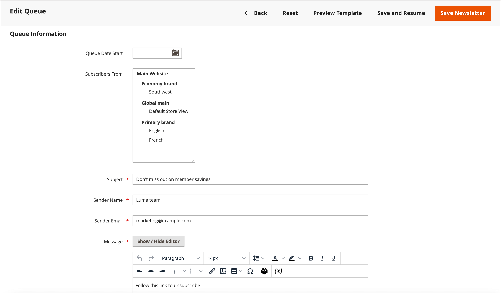

# Newsletter-Warteschlangen

Um die Last auf dem Server zu bewältigen, werden Newsletter mit vielen Abonnenten in einer Warteschlange aus mehreren Batches gesendet. Sie können die Newsletter-Warteschlange regelmäßig überprüfen, um den Status zu überprüfen und zu sehen, wie viele verarbeitet wurden. Probleme, die während der Übertragung auftreten, werden im Bericht _Newsletter-Problem_ angezeigt.

## Senden eines Newsletters

1. Gehen Sie _Menü_ Admin“ zu **[!UICONTROL Marketing]** > _[!UICONTROL Communications]_>**[!UICONTROL Newsletter Template]**.

1. Suchen Sie im Raster nach der [Newsletter-Vorlage](newsletter-template.md) die gesendet werden soll, und legen Sie die **[!UICONTROL Action]** Spalte auf `Queue Newsletter` fest.

1. Wählen Sie **[!UICONTROL Queue Date Start]** aus dem Kalender das Datum, an dem die Übertragung beginnen soll ().

1. Wählen Sie **[!UICONTROL Subscribers From]** jede Store-Ansicht aus, die in den E-Mail-Blastan aufgenommen werden soll.

1. Füllen Sie die E-Mail-Kopfzeileninformationen aus:

   - Geben Sie eine kurze Beschreibung des Newsletters in die **[!UICONTROL Subject]** Zeile der E-Mail-Kopfzeile ein.

   - Geben Sie die **[!UICONTROL Sender Name]** ein.

   - Geben Sie **[!UICONTROL Sender Email]** die E-Mail-Adresse des Absenders ein.

     Der Standardname und die E-Mail-Adresse des Absenders werden in der Konfiguration angegeben.

     {width="600" zoomable="yes"}

1. Falls zutreffend, geben Sie einen Hinweis in das **[!UICONTROL Message]** Feld über der Anleitung zum Abmelden ein.

   >[!NOTE]
   >
   >Entfernen Sie nicht die Anweisungen, die in vielen Rechtssystemen gesetzlich vorgeschrieben sind.

1. Um benutzerdefinierte Stile auf einen Newsletter anzuwenden, fügen Sie sie in das Feld **[!UICONTROL Newsletter Styles]** ein.

1. Klicken Sie abschließend auf **[!UICONTROL Save and Resume]**.

   Der Newsletter wird in der Warteschlange angezeigt und wartet auf die Verarbeitung.

## Auf Probleme prüfen

Gehen Sie _Menü_ Admin“ zu **[!UICONTROL Reports]** > _[!UICONTROL Marketing]_>**[!UICONTROL Newsletter Problem Reports]**.

## Schaltflächenleiste

| Schaltfläche | Beschreibung |
|--- |--- |
| **[!UICONTROL Back]** | Kehrt zur Seite Newsletter-Vorlagen zurück, ohne die Änderungen zu speichern. |
| **[!UICONTROL Reset]** | Setzt alle nicht gespeicherten Änderungen im Warteschlangeninformationsformular auf ihre vorherigen Werte zurück. |
| **[!UICONTROL Preview Template]** | Öffnet eine Vorschauseite auf einer separaten Registerkarte. |
| **[!UICONTROL Save and Resume]** | Speichert alle vorgenommenen Änderungen. Stellt den Newsletter in die Warteschlange. |
| **[!UICONTROL Save Newsletter]** | Speichert alle vorgenommenen Änderungen. Stellt den Newsletter in die Warteschlange. |

{style="table-layout:auto"}

## Spalten

| Spalte | Beschreibung |
|--- |--- |
| [!UICONTROL ID] | Eine eindeutige numerische Kennung, die jeder Newsletter-Vorlage zugewiesen wird. |
| [!UICONTROL Queue Start] | Das Datum, an dem der Newsletter versendet wurde. |
| [!UICONTROL Queue End] | Das Datum, an dem der Newsletter abgesendet wurde. |
| [!UICONTROL Subject] | Betreff der Newsletter-Vorlage. |
| [!UICONTROL Status] | Zeigt den Status des Newsletter-Versands an. Mögliche Werte: `Sent`, `Canceled`, `Not Sent`, `Sending` oder `Paused`. |
| [!UICONTROL Processed] | Gibt an, wie viele Newsletter versendet wurden. |
| [!UICONTROL Recipients] | Gibt an, wie viele Newsletter von Abonnentinnen und Abonnenten empfangen wurden. |
| [!UICONTROL Actions] | **[!UICONTROL Preview]**: Öffnet ein separates Fenster, in dem Sie eine Vorschau der Vorlage anzeigen können. |

{style="table-layout:auto"}
