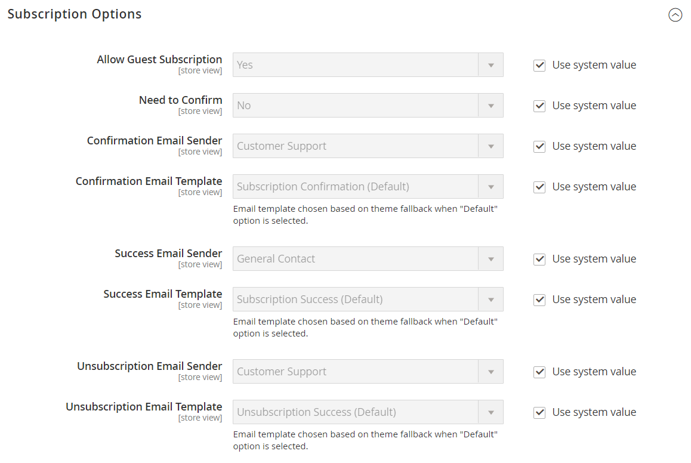

# Newsletter und Abonnements

Die regelmäßige Veröffentlichung eines Newsletters gilt als eines der leistungsfähigsten und erschwinglichsten verfügbaren Marketing-Tools. Commerce bietet Ihnen die Möglichkeit, Newsletter zu veröffentlichen und an Kunden zu verteilen, die sich angemeldet haben. Darüber hinaus erhalten Sie Tools zur Erstellung Ihres Newsletters, zur Erstellung und Verwaltung Ihrer Abonnentenliste, zur Entwicklung von Inhalten und zur Bereitstellung von Traffic zu Ihrem Store. Sie können auch [Seitenhierarchie) verwenden](../content-design/page-hierarchy.md) um ein Archiv vergangener Probleme zu erstellen.

>[!NOTE]
>
>Sie können Funktionen hinzufügen, indem Sie Ihre Commerce-Instanz mit einem Newsletter-Dienstanbieter eines Drittanbieters integrieren und Erweiterungen hinzufügen. Weitere Informationen finden Sie unter [Commerce Marketplace](../getting-started/commerce-marketplace.md).

Der erste Schritt beim Erstellen von Newslettern besteht darin, die Newsletter-Einstellungen für Ihre Site zu konfigurieren. Sie können Kunden auffordern, auf einen Bestätigungs-Link zu klicken, der per E-Mail gesendet wird, um das Abonnement zu bestätigen. Bei dieser Double-Opt-in-Methode müssen Kundinnen und Kunden zweimal bestätigen, dass sie Ihren Newsletter erhalten möchten, und die Möglichkeit, dass er als Spam eingestuft wird, wird verringert.

## Newsletter aktivieren

1. Navigieren Sie in _Admin_-Seitenleiste zu **[!UICONTROL Stores]** > _[!UICONTROL Settings]_>**[!UICONTROL Configuration]**.

1. Erweitern Sie im linken Bereich **[!UICONTROL Customers]** und wählen Sie **[!UICONTROL Newsletter]**.

1. Erweitern Sie  den Abschnitt **[!UICONTROL General Options]** .

1. Um Newsletter für den Bereich der Store-Ansicht zu aktivieren, setzen Sie **[!UICONTROL Enabled]** auf `Yes`.

Nach der Aktivierung der Newsletter-Funktion wird der Abschnitt _[!UICONTROL Subscription Options]_angezeigt.

## Konfigurieren der Abonnementoptionen

1. Navigieren Sie in _Admin_-Seitenleiste zu **[!UICONTROL Stores]** > _[!UICONTROL Settings]_>**[!UICONTROL Configuration]**.

1. Erweitern Sie im linken Bereich **[!UICONTROL Customers]** und wählen Sie **[!UICONTROL Newsletter]**.

1. Ändern Sie bei [ den Konfigurationsbereich, ](../getting-started/websites-stores-views.md#scope-settings) die Newsletter-Konfigurationsänderungen auf eine bestimmte Site-/Store-Ansicht anzuwenden.

1. Erweitern Sie  den Abschnitt **[!UICONTROL Subscription Options]** und führen Sie folgende Schritte aus:

   {width="600" zoomable="yes"}

   - Bestätigen Sie die E-Mail-Vorlage und den Absender jeder der folgenden E-Mail-Nachrichten, die an Abonnenten gesendet werden:

      - [!UICONTROL Success email]
      - [!UICONTROL Confirmation email]
      - [!UICONTROL Unsubscribe email]

   - Um die Anmeldung mit zweifacher Bestätigung zu bestätigen, setzen Sie **[!UICONTROL Need to Confirm]** auf `Yes`.

   - Damit sich Personen, die kein Konto bei Ihrem Geschäft haben, für den Newsletter anmelden können, legen Sie **[!UICONTROL Allow Guest Subscription]** auf `Yes` fest.

1. Klicken Sie abschließend auf **[!UICONTROL Save Config]**.
