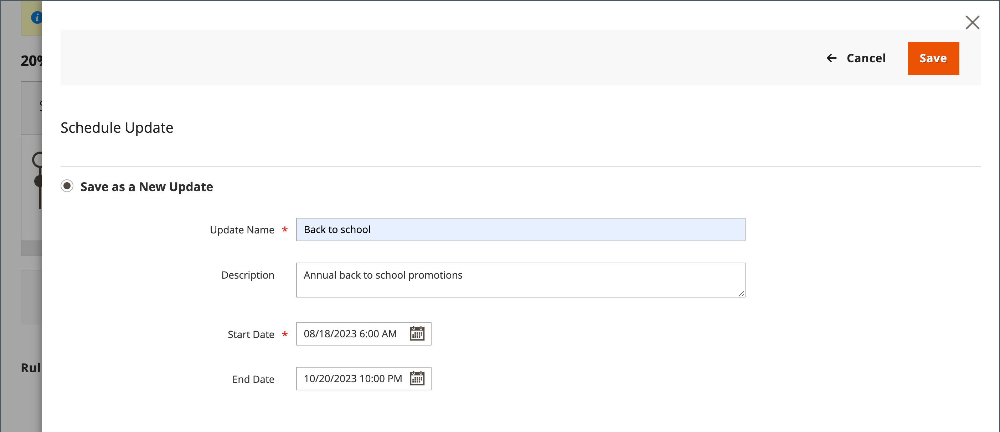

# Geplante Änderungen für Katalogpreisregeln

{{ee-feature}}

Das Feld Geplante Änderungen wird oben auf der Seite angezeigt, wenn eine neue Preisregel gespeichert oder aktualisiert wird. Katalogpreisregeln können planmäßig im Rahmen einer Kampagne angewendet und mit anderen Inhaltsänderungen gruppiert werden. Sie können eine Kampagne auf der Grundlage geplanter Änderungen an einer Preisregel erstellen oder die Änderungen auf eine vorhandene Kampagne anwenden.

>[!NOTE]
>
>Die Felder [!UICONTROL From] und [!UICONTROL To] wurden in  Adobe Commerce entfernt und können nicht direkt über die Katalogpreisregel geändert werden. Für diese Aktivierungen muss ein geplantes Update erstellt werden.

>[!NOTE]
>
>Alle geplanten Aktualisierungen werden nacheinander angewendet. Das bedeutet, dass jede Entität zu einem bestimmten Zeitpunkt nur eine geplante Aktualisierung haben kann. Jede geplante Aktualisierung wird auf alle Store-Ansichten innerhalb ihres Zeitrahmens angewendet. Daher kann eine Entität nicht gleichzeitig verschiedene geplante Aktualisierungen für verschiedene Store-Ansichten haben. Alle Entitätsattributwerte in allen Store-Ansichten, die nicht von der aktuellen geplanten Aktualisierung betroffen sind, werden aus den Standardwerten übernommen, nicht aus der vorherigen geplanten Aktualisierung.

Wenn in derselben Kampagne mehrere Preisregeln ausgeführt werden, bestimmt die Einstellung „Priorität“ der Preisregel, welche Regel Vorrang hat. Weitere Informationen finden Sie unter [Inhaltsbereitstellung](../content-design/content-staging.md).

>[!IMPORTANT]
>
>Wenn eine aktive Kampagne anfänglich ohne Enddatum erstellt wird, kann die Kampagne nicht später bearbeitet werden, um ein Enddatum einzuschließen. In diesem Fall müssen Sie eine doppelte Kampagne erstellen und das erforderliche Enddatum eingeben.

{width="600" zoomable="yes"}

## Planen einer Aktualisierung für eine Katalogpreisregel

1. Navigieren Sie in _Admin_-Seitenleiste zu **[!UICONTROL Marketing]** > _[!UICONTROL Promotions]_>**Katalogpreisregel**.

1. Öffnen Sie die Regel im Bearbeitungsmodus.

1. Klicken Sie im **[!UICONTROL Scheduled Changes]** oben auf der Seite auf **[!UICONTROL Schedule New Update]**.

1. Führen Sie bei ausgewählter Option **[!UICONTROL Save as a New Update]** die folgenden Schritte aus:

   - Geben Sie **[!UICONTROL Update Name]** einen Namen für die Aktualisierung der Regel ein.

   - Geben Sie einen kurzen **[!UICONTROL Description]** der Aktualisierung ein, einschließlich der Art und Weise der Anwendung.

   - Verwenden Sie _Kalender_ (), um die **[!DNL Start Date]** und **[!UICONTROL End Date]** auszuwählen, damit die geplante Änderung wirksam wird. Um eine unbefristete Änderung zu erstellen, lassen Sie das Enddatum leer.

   {width="600" zoomable="yes"}

   >[!NOTE]
   >
   >Start- und Enddatum/-uhrzeit werden durch Datum/Uhrzeit und Zeitzone des standardmäßigen Admin-Panels bestimmt und nicht durch die Zeitzone einer bestimmten Website. Betrachten Sie die Zeitzone der Website, um Start- und Endzeiten ordnungsgemäß zu bestimmen. Erstellen Sie separate Regeln für Websites in verschiedenen Zeitzonen, die zu bestimmten lokalen Zeiten beginnen und/oder enden müssen.

1. Scrollen Sie nach unten zum Abschnitt **[!UICONTROL Rule Information]** und ändern Sie die Regel nach Bedarf.

   Sie können Änderungen für beliebige Regelparameter planen, einschließlich der Websites (Umfang)/Kundengruppen für die Regel, Bedingungen der Regel und von der Regel angewendete Aktionen. Weitere Informationen finden Sie unter [Erstellen einer Katalogpreisregel](price-rules-catalog-create.md).

   >[!NOTE]
   >
   >Wenn Sie zu einem der Regelinformationsparameter wechseln, stellen Sie sicher, dass der _[!UICONTROL Status]_&#x200B;richtig eingestellt ist. Wenn die Änderung zu einer aktiv angewendeten Regel führen soll, sollte der Status lauten`Active`.

1. Klicken Sie abschließend auf **[!UICONTROL Save]**.

   Die geplante Änderung wird oben auf der Seite mit dem Start- und Enddatum der Kampagne angezeigt.

## Geplante Regeländerung bearbeiten

1. Klicken Sie im **[!UICONTROL Scheduled Changes]** oben auf der Seite auf **[!UICONTROL View/Edit]**.

1. Nehmen Sie die erforderlichen Änderungen an der geplanten Aktualisierung vor.

   >[!NOTE]
   >
   >Wenn eine Kampagne mit mehr als einer Katalogpreisregel verknüpft ist, kann die Kampagne nur über das [Inhalts-Staging-Dashboard“ bearbeitet &#x200B;](../content-design/content-staging-dashboard.md).

1. Klicken Sie auf **[!UICONTROL Save]**.

## Vorschau der geplanten Regeländerung

1. Klicken Sie im **[!UICONTROL Scheduled Changes]** oben auf der Seite auf **[!UICONTROL Preview]**.

   Die Vorschau öffnet eine neue Browser-Registerkarte, die Ihre Storefront mit der angewendeten geplanten Änderung lädt. Navigieren Sie zu einem Produkt, das von der Änderung betroffen ist.

   {width="600" zoomable="yes"}

1. Klicken Sie oben links im Vorschaufenster auf **[!UICONTROL Calendar]**.

   Das Kalenderdetail zeigt andere Kampagnen an, die für denselben Tag geplant sind. Jeder Datensatz in der Liste ist eine separate Regelaktualisierung.

   {width="600" zoomable="yes"}

1. **[!UICONTROL Date & Time]** Um eine Vorschau eines anderen Tages oder einer anderen Uhrzeit anzuzeigen, klicken Sie auf das  und führen Sie folgende Schritte aus:

   - Wählen Sie ein anderes Datum und/oder eine andere Uhrzeit.

   - Klicken Sie auf **[!UICONTROL Preview]**.

1. Um zum Kalender zurückzukehren, klicken Sie auf **[!UICONTROL Calendar]** in der Kopfzeile der Seite Vorschau .

   Von hier aus können Sie Folgendes tun:

   **Freigeben eines Links zur Vorschau**

   Um einen Link zur Store-Vorschau für Ihre Kollegen freizugeben, klicken Sie auf **[!UICONTROL Share]**. Kopieren Sie den Link in die Zwischenablage und fügen Sie ihn in den Textkörper einer E-Mail-Nachricht ein.

   >[!NOTE]
   >
   >Um eine freigegebene Vorschau anzuzeigen, ist ein Administratorkonto erforderlich. Wenn Ihre [Rolle Zugriff hat](../systems/permissions-user-roles.md) müssen Sie vor der Freigabe das Konto für einen neuen Benutzer erstellen, um ein Administratorbenutzerkonto zu erstellen.

   **Ändern des Umfangs der Vorschau**

   Um geplante Änderungen für verschiedene Store-Ansichten anzuzeigen, klicken Sie in der Kopfzeile der Seite „Vorschau“ auf **[!UICONTROL Scope]**. Wählen Sie die Website-, Store- oder Store-Ansicht aus, die Sie in der Vorschau anzeigen möchten.

1. Kehren Sie bei Bedarf zum Kalender zurück und klicken Sie in der Spalte _[!UICONTROL Action]_&#x200B;auf **[!UICONTROL View/Edit]**, um eine weitere geplante Aktualisierung zu öffnen.
