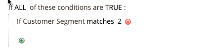

# Beispiel einer Preisregel für den Warenkorb - Rabatt mit Erstkauf

{{ee-feature}}

Mit den Preisregeln für Warenkorb können Kunden automatisch einen Rabatt auf ihren ersten Kauf anbieten, ohne dass ein Gutschein erforderlich ist.

Um einen Rabatt für Erstkunden anzubieten, können Sie:

- Erstellen Sie ein Kundensegment, das als _Käufer ohne Bestellungen_, und dann
- Erstellen Sie eine Warenkorbpreisregel, die auf das neue Kundensegment ausgerichtet ist.

>[!NOTE]
>
>Stellen Sie sicher, dass die Funktion Kundensegmente aktiviert ist. Siehe Abschnitt [Kundensegment erstellen](../customers/customer-segment-create.md).

## Schritt 1. Kundensegment erstellen

1. Im _Admin_ Seitenleiste, navigieren Sie zu **[!UICONTROL Customers]** > **[!UICONTROL Segments]**.

1. Klicken Sie oben rechts auf **[!UICONTROL Add Segment]**.

1. Definieren Sie die **[!UICONTROL General Properties]**.

   - Geben Sie einen **[!UICONTROL Segment Name]** zur Identifizierung des Kundensegments (Beispiel: _Erstmaliger Kunde_).

   - Für **[!UICONTROL Assigned to Website]** wählen Sie die Website aus, auf der das Kundensegment verwendet werden kann.

   - Für **[!UICONTROL Status]** auswählen `Active`.

   - Für **[!UICONTROL Apply to]** auswählen `Visitors and Registered Customers`.

   - Wenn Sie fertig sind, klicken Sie auf **[!UICONTROL Save and Continue Edit]**.

     Im Bedienfeld auf der linken Seite stehen zusätzliche Optionen zur Verfügung.

   {width="600" zoomable="yes"}

1. Definieren Sie die **[!UICONTROL Conditions]**.

   In diesem Beispiel zielt die Bedingung auf Kunden ab, für die _Die Gesamtanzahl der Bestellungen beträgt weniger als 1._ ist True.

   - Wählen Sie im Bedienfeld auf der linken Seite **[!UICONTROL Conditions]**.

     Die Standardbedingung beginnt mit &quot;Wenn ALLE dieser Bedingungen TRUE sind:&quot;

   - Klicks _Hinzufügen_ () und wählen Sie `Number of Orders`.

   - Klicks **[!UICONTROL is]** und wählen `less than`.

   - Klicks **...** und eingeben `1` im Feld.

   - Klicken Sie auf das grüne Häkchen (  ), um die Bedingungseinstellung zu speichern.

   {width="600" zoomable="yes"}

1. Klicken **[!UICONTROL Save]**.

Das Kundensegment wird erstellt und im _[!UICONTROL Customer Segments]_Gitter.

>[!TIP]
>
>Notieren Sie sich die Segment-ID. Sie verwenden diese ID-Nummer, um die Preisregel für den Warenkorb zu erstellen.

## Schritt 2. Erstellen der Preisregel für den Warenkorb

1. Im _Admin_ Seitenleiste, navigieren Sie zu **[!UICONTROL Marketing]** > _[!UICONTROL Promotions]_>**[!UICONTROL Cart Price Rule]**.

1. Klicken Sie oben rechts auf **[!UICONTROL Add New Rule]**.

   Die **[!UICONTROL Rule Information]** -Abschnitt wird standardmäßig mit erweiterbaren Abschnitten für **[!UICONTROL Conditions]** und **[!UICONTROL Conditions]**.

1. Definieren Sie die **[!UICONTROL Rule Information]**.

   - Führen Sie die **[!UICONTROL Rule Name]** und **[!UICONTROL Description]** -Felder. Diese Felder dienen nur Ihrer internen Referenz.

   - Für **[!UICONTROL Websites]** wählen Sie die Website aus, auf der die Regel verfügbar sein soll.

   - Für **[!UICONTROL Customer Groups]** wählen Sie die Kundengruppe aus, für die diese Regel gilt.

     Um mehrere Gruppen auszuwählen, halten Sie die Strg-Taste (PC) oder die Befehlstaste (Mac) gedrückt und klicken Sie auf jede Option.

     >[!NOTE]
     >
     >Die Optionen in dieser Liste hängen von den in **[!UICONTROL Customers]** > **[!UICONTROL Customer Groups]**.

   - Für **[!UICONTROL Coupon]** auswählen `No Coupon`.

   - Für **[!UICONTROL Uses per Customer]**, eingeben `1`.

   - Für **[!UICONTROL Priority]** eine Zahl eingeben, um die Priorität dieser Regel in Bezug auf andere Regeln festzulegen.

     >[!NOTE]
     >
     >Die Einstellung Priorität ist wichtig, wenn dasselbe Katalogprodukt die Bedingungen für mehr als eine Preisregel erfüllt. Die Regel mit der Einstellung &quot;höchste Priorität&quot;wird für den Kunden aktiv. Die höchste Priorität ist 1. Geben Sie in diesem Beispiel `1` bedeutet, dass diese Regel vor jeder anderen Preisregel angewendet wird. Dieser Wert wird von der **[!UICONTROL Discard Subsequent Rules]** -Einstellung in **[!UICONTROL Action]** Abschnitt.

   - Wenn Sie fertig sind, klicken Sie auf **[!UICONTROL Save and Continue Edit]**.

     Im Bedienfeld auf der linken Seite stehen zusätzliche Optionen zur Verfügung.

   {width="600" zoomable="yes"}

1. Definieren Sie die **[!UICONTROL Conditions]**.

   - Hinunter scrollen und erweitern  die **[!UICONTROL Conditions]** Abschnitt.

     Die Standardregel beginnt mit &quot;Wenn ALLE dieser Bedingungen TRUE sind:&quot;.

   - Klicks _Hinzufügen_ () und wählen Sie `Customer Segment`.

     Das Qualifikationsfeld wird standardmäßig auf `matches`.

   - Klicks **...** und geben Sie die Segment-ID des Kundensegments ein, das Sie als Ziel auswählen möchten.

     In diesem Beispiel lautet die Segment-ID für das in Schritt 1 erstellte neue Segment `2`.

     >[!NOTE]
     >
     >Wenn Sie die Segment-ID nicht kennen, klicken Sie auf das Auswahlsymbol (  ), um die Kundensegmentliste anzuzeigen. Sie können die ID manuell in das Feld eingeben oder das Kontrollkästchen für das gewünschte Segment aktivieren, um das Feld automatisch auszufüllen.

   - Klicken Sie auf das grüne Häkchen (  ), um die Bedingungseinstellung zu speichern.

   - Wenn Sie fertig sind, klicken Sie auf **[!UICONTROL Save and Continue Edit]**.

     Diese Zeile der Regel gilt für alle Kunden, die mit der Kundensegment-ID 2 übereinstimmen.

   {width="400"}

1. Hinunter scrollen und erweitern die **[!UICONTROL Conditions]** und definieren Sie die Aktionen für die Regel.

   In diesem Abschnitt definieren Sie die Art des Rabatts und den Wert/Betrag des Rabatts, den Sie für Erstkunden anwenden möchten. In diesem Beispiel wird ein Rabatt von 10 % für alle Kunden definiert, die die definierte Bedingung erfüllen. Informationen zu anderen verfügbaren Optionen finden Sie unter [Erstellen einer Preisregel für Warenkorb](price-rules-cart-create.md).

   - Für **[!UICONTROL Apply]**, wählen Sie Prozent des Produktpreisrabatts aus.

   - Für **[!UICONTROL Discount Amount]**, eingeben `10`.

   - Um diese Preisregel nur auf Produktmengen anzuwenden, legen Sie **[!UICONTROL Apply to Shipping Amount]** nach `No`.

   - Um zu verhindern, dass das System mehrere Preisregeln auf dasselbe Produkt anwendet, legen Sie **[!UICONTROL Discard Subsequent Rules]** nach `Yes`.

   - Wenn Sie fertig sind, klicken Sie auf **[!UICONTROL Save]**.

   {width="600" zoomable="yes"}

Die neue Regel ist normalerweise innerhalb einer Stunde verfügbar. Testen Sie die Regel, um sicherzustellen, dass sie wie definiert funktioniert.

## Schritt 3: Speichern und testen Sie die Regel

{{new-price-rule}}

1. Klicken Sie nach Abschluss der Regel auf **[!UICONTROL Save Rule]**.

1. Testen Sie die Regel, um sicherzustellen, dass sie ordnungsgemäß funktioniert.
