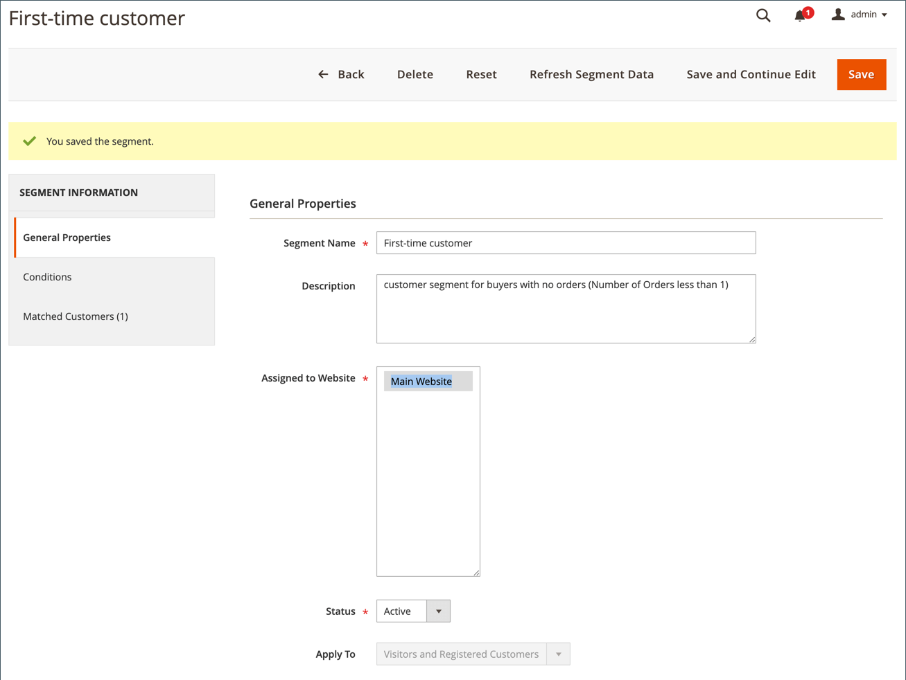
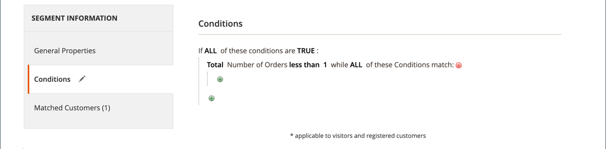
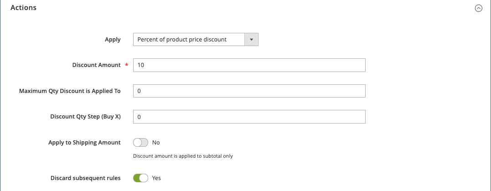

# Beispiel für Warenkorb-Preisregel - Rabatt beim ersten Kauf

{{ee-feature}}

Die Preisregeln für den Warenkorb können verwendet werden, um Kunden beim ersten Kauf automatisch einen Rabatt anzubieten, ohne dass ein Coupon erforderlich ist.

Um einen Rabatt für Erstkunden anzubieten, haben Sie folgende Möglichkeiten:

- Erstellen Sie ein Kundensegment, das als &quot;_ohne Bestellungen“ definiert_, und
- Erstellen Sie eine Warenkorb-Preisregel, die auf das neue Kundensegment abzielt.

>[!NOTE]
>
>Stellen Sie sicher, dass die Funktion Kundensegmente aktiviert ist. Siehe [Erstellen eines Kundensegments](../customers/customer-segment-create.md).

## Schritt 1. Erstellen eines Kundensegments

1. Navigieren Sie in der _Admin_-Seitenleiste zu **[!UICONTROL Customers]** > **[!UICONTROL Segments]**.

1. Klicken Sie oben rechts auf **[!UICONTROL Add Segment]**.

1. Definieren Sie die **[!UICONTROL General Properties]**.

   - Geben Sie eine **[!UICONTROL Segment Name]** ein, um das Kundensegment zu identifizieren (Beispiel _„Erstkunde_).

   - Wählen Sie **[!UICONTROL Assigned to Website]** die Website aus, auf der das Kundensegment verwendet werden kann.

   - Wählen Sie **[!UICONTROL Status]** `Active` aus.

   - Wählen Sie **[!UICONTROL Apply to]** `Visitors and Registered Customers` aus.

   - Klicken Sie abschließend auf **[!UICONTROL Save and Continue Edit]**.

     Zusätzliche Optionen werden im Bedienfeld auf der linken Seite verfügbar.

   {width="600" zoomable="yes"}

1. Definieren Sie die **[!UICONTROL Conditions]**.

   In diesem Beispiel zielt die Bedingung auf Kunden ab, für die _Gesamtzahl der Bestellungen kleiner als 1 ist_ „true“ ist.

   - Wählen Sie im Bedienfeld auf der linken Seite **[!UICONTROL Conditions]**.

     Die Standardbedingung beginnt mit „Wenn alle diese Bedingungen erfüllt sind:“

   - Klicken Sie _Hinzufügen_ () und wählen Sie `Number of Orders` aus.

   - Klicken Sie auf **[!UICONTROL is]** und wählen Sie `less than` aus.

   - Klicken Sie auf **…** und geben Sie `1` in das Feld ein.

   - Klicken Sie auf das grüne Häkchen (  ), um die Einstellung der Bedingung zu speichern.

   {width="600" zoomable="yes"}

1. Klicken Sie auf **[!UICONTROL Save]**.

Das Kundensegment wird erstellt und im _[!UICONTROL Customer Segments]_Raster angezeigt.

>[!TIP]
>
>Notieren Sie sich die Segment-ID. Mit dieser ID-Nummer erstellen Sie die Preisregel für den Warenkorb.

## Schritt 2. Erstellen der Warenkorb-Preisregel

1. Navigieren Sie in _Admin_-Seitenleiste zu **[!UICONTROL Marketing]** > _[!UICONTROL Promotions]_>**[!UICONTROL Cart Price Rule]**.

1. Klicken Sie oben rechts auf **[!UICONTROL Add New Rule]**.

   Standardmäßig wird der Abschnitt **[!UICONTROL Rule Information]** mit erweiterbaren Abschnitten für **[!UICONTROL Conditions]** und **[!UICONTROL Conditions]** angezeigt.

1. Definieren Sie die **[!UICONTROL Rule Information]**.

   - Füllen Sie die Felder **[!UICONTROL Rule Name]** und **[!UICONTROL Description]** aus. Diese Felder dienen nur als interne Referenz.

   - Wählen Sie **[!UICONTROL Websites]** die Website aus, auf der die Regel verfügbar sein soll.

   - Wählen Sie **[!UICONTROL Customer Groups]** die Kundengruppe aus, für die diese Regel gilt.

     Zur Auswahl mehrerer Gruppen halten Sie die Strg-Taste (PC) bzw. die Befehlstaste (Mac) gedrückt und klicken auf die einzelnen Optionen.

     >[!NOTE]
     >
     >Die Optionen in dieser Liste hängen von den Kundengruppen ab, die in **[!UICONTROL Customers]** > **[!UICONTROL Customer Groups]** erstellt und verwaltet werden.

   - Wählen Sie **[!UICONTROL Coupon]** `No Coupon` aus.

   - Geben Sie **[!UICONTROL Uses per Customer]** `1` ein.

   - Geben Sie **[!UICONTROL Priority]** eine Zahl ein, um die Priorität dieser Regel gegenüber anderen Regeln festzulegen.

     >[!NOTE]
     >
     >Die Einstellung „Priorität“ ist wichtig, wenn dasselbe Katalogprodukt die Bedingungen für mehr als eine Preisregel erfüllt. Die Regel mit der höchsten Prioritätseinstellung wird für den Kunden aktiv. Die höchste Priorität ist 1. Wenn Sie für dieses Beispiel `1` eingeben, wird diese Regel vor jeder anderen Preisregel angewendet. Dieser Wert wird von der Einstellung **[!UICONTROL Discard Subsequent Rules]** im Abschnitt **[!UICONTROL Action]** verwendet.

   - Klicken Sie abschließend auf **[!UICONTROL Save and Continue Edit]**.

     Zusätzliche Optionen werden im Bedienfeld auf der linken Seite verfügbar.

   {width="600" zoomable="yes"}

1. Definieren Sie die **[!UICONTROL Conditions]**.

   - Scrollen Sie nach unten und erweitern Sie  den Abschnitt **[!UICONTROL Conditions]** .

     Die Standardregel beginnt mit „Wenn alle diese Bedingungen erfüllt sind:“.

   - Klicken Sie _Hinzufügen_ () und wählen Sie `Customer Segment` aus.

     Das Feld „Kennzeichner“ ist standardmäßig auf `matches` eingestellt.

   - Klicken Sie auf **…** und geben Sie die Segment-ID des Kundensegments ein, das Sie ansprechen möchten.

     In diesem Beispiel wird die Segment-ID für das neue Segment, das in Schritt 1 erstellt wurde, `2`.

     >[!NOTE]
     >
     >Wenn Sie die Segment-ID nicht kennen, klicken Sie auf das Auswahlsymbol (  ), um die Liste der Kundensegmente anzuzeigen. Sie können die ID manuell in das Feld eingeben oder das Kontrollkästchen für das gewünschte Segment aktivieren, um das Feld automatisch auszufüllen.

   - Klicken Sie auf das grüne Häkchen (  ), um die Einstellung der Bedingung zu speichern.

   - Klicken Sie abschließend auf **[!UICONTROL Save and Continue Edit]**.

     Diese Regelzeile gilt für alle Kunden, die der Kundensegment-ID 2 entsprechen.

   {width="400"}

1. Scrollen Sie nach unten und erweitern Sie  den Abschnitt **[!UICONTROL Conditions]** und definieren Sie die Aktionen für die Regel.

   In diesem Abschnitt definieren Sie die Art des Rabatts und den Wert/Betrag des Rabatts, den Sie für Erstkunden anwenden möchten. In diesem Beispiel wird ein Rabatt von 10 % für alle Kunden definiert, die die definierte Bedingung erfüllen. Weitere Informationen zu anderen verfügbaren Optionen finden Sie unter [Erstellen einer Warenkorb-Preisregel](price-rules-cart-create.md).

   - Wählen Sie **[!UICONTROL Apply]** „Prozent des Produktpreisrabatts“ aus.

   - Geben Sie **[!UICONTROL Discount Amount]** `10` ein.

   - Um diese Preisregel nur auf Produktbeträge anzuwenden, setzen Sie **[!UICONTROL Apply to Shipping Amount]** auf `No`.

   - Um zu verhindern, dass das System mehrere Preisregeln auf dasselbe Produkt anwendet, setzen Sie **[!UICONTROL Discard Subsequent Rules]** auf `Yes`.

   - Klicken Sie abschließend auf **[!UICONTROL Save]**.

   {width="600" zoomable="yes"}

Die neue Regel ist normalerweise innerhalb einer Stunde verfügbar. Testen Sie die Regel, um sicherzustellen, dass sie wie definiert funktioniert.

## Schritt 3: Speichern und Testen der Regel

{{new-price-rule}}

1. Wenn Ihre Regel abgeschlossen ist, klicken Sie auf **[!UICONTROL Save Rule]**.

1. Testen Sie die Regel, um sicherzustellen, dass sie korrekt funktioniert.
