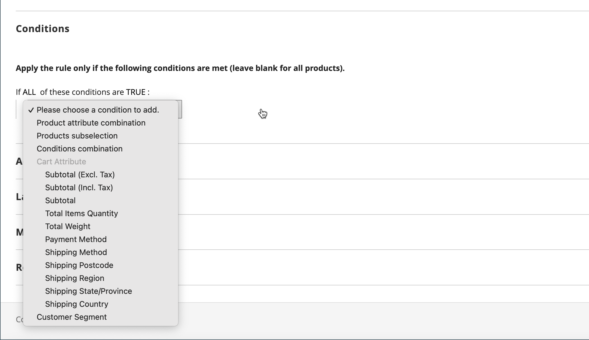

# Beispiel einer Warenkorbpreisregel - Rabatt mit Mindestkauf

Mit den Regeln zum Warenkorbpreis können Sie einen prozentualen Rabatt auf der Grundlage eines Mindestkäufs anbieten. Im folgenden Beispiel wird ein Rabatt von 25 % auf alle Käufe über 200,00 USD in einer bestimmten Kategorie angewendet. Der Rabatt hat folgendes Format:

X % aller Y (Kategorie) über Z Dollar

## Schritt 1. Eine Warenkorbregel erstellen

Grundlegende [instructions](price-rules-cart.md) , um eine Warenkorbregel zu erstellen.

## Schritt 2. Bedingungen definieren

1. Hinunter scrollen und erweitern  die **[!UICONTROL Conditions]** Abschnitt.

1. Klicks _Hinzufügen_ () und wählen Sie **[!UICONTROL Product Attribute Combination]**.

   {width="500" zoomable="yes"}

1. Klicks _Hinzufügen_ () am Anfang der nächsten Zeile und in der Liste unter **[!UICONTROL Product Attribute]** auswählen **[!UICONTROL Category]**.

   - Klicken Sie auf (**...**) _more_ -Link, um weitere Optionen anzuzeigen.

     {width="600" zoomable="yes"}

   - Klicken Sie auf _Auswahl_ (), um die verfügbaren Kategorien anzuzeigen. Aktivieren Sie im Kategoriebaum das Kontrollkästchen der Kategorien, die Sie einbeziehen möchten. Klicken Sie auf das Häkchen, um die Kategorieauswahlen zu akzeptieren.

     {width="600" zoomable="yes"}

1. Klicks _Hinzufügen_ () am Anfang der nächsten Zeile und gehen Sie wie folgt vor:

   - In der Liste unter **[!UICONTROL Cart Item Attribute]** auswählen **[!UICONTROL Price in cart]**.

     {width="500"}

   - Klicks **is** und wählen `equals or greater than`.

   - Klicks **...** und geben Sie den Betrag ein, der vom Preis im Warenkorb benötigt wird, um die Bedingung zu erfüllen. Geben Sie beispielsweise `30`.

     {width="500"}

1. Klicken **[!UICONTROL Save and Continue Edit]**.

## Schritt 3. Aktionen definieren

1. Erweitern  die **[!UICONTROL Actions]** und führen Sie folgende Schritte aus:

   {width="600" zoomable="yes"}

   - Satz **[!UICONTROL Apply]** nach `Percent of product price discount`.

   - Geben Sie die **[!UICONTROL Discount Amount]**. Geben Sie beispielsweise `10` für einen 10% Rabatt.

   - Um zu verhindern, dass zusätzliche Promotions auf den Kauf angewendet werden, legen Sie **[!UICONTROL Discard subsequent rules]** nach `Yes`.

1. Klicks **[!UICONTROL Save and Continue Edit]** und führen Sie die Regel nach Bedarf aus.

## Schritt 4. Bezeichnungen ausfüllen

Fertig [Schritt 4](price-rules-cart.md) der Preisregel des Warenkorbs, um alle Bezeichnungen einzugeben, die beim Checkout erscheinen.

## Schritt 5: Speichern und testen Sie die Regel

{{new-price-rule}}

1. Klicken Sie nach Abschluss der Regel auf **[!UICONTROL Save Rule]**.

1. Testen Sie die Regel, um sicherzustellen, dass sie ordnungsgemäß funktioniert.
