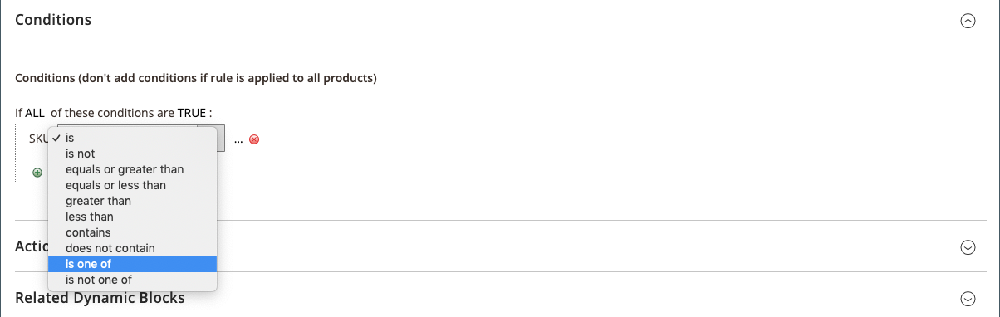
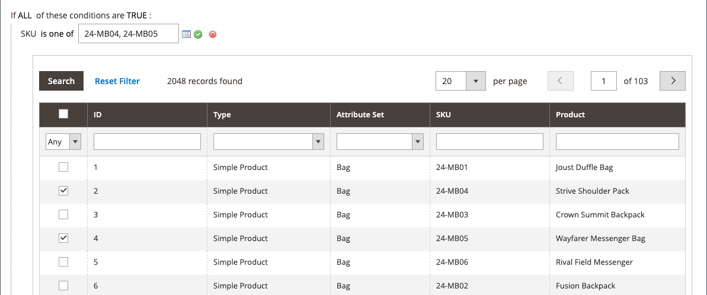

# Katalogpreisregel mit mehreren SKUs

Eine einzige Katalogpreisregel kann auf mehrere SKUs angewendet werden, wodurch es möglich ist, verschiedene Promotions basierend auf einem Produkt, einer Marke oder einer Kategorie zu erstellen. Beim Erstellen dieser Regel sollten Sie Bedingungen festlegen, die den ausgewählten SKUs entsprechen. Beim Erstellen der Regel können Sie SKUs einfach im Raster durchsuchen und auswählen.

## Schritt 1. Überprüfen der Storefront-Eigenschaften des Produktattributs

Bevor Sie beginnen, stellen Sie sicher, [ die „Storefront](../catalog/attribute-product-create.md#step-4-describe-the-storefront-properties)-Eigenschaften des `sku`-Attributs auf `Use in Promo Rules` festgelegt sind.

1. Navigieren Sie in _Admin_-Seitenleiste zu **[!UICONTROL Stores]** > _[!UICONTROL Attributes]_>**[!UICONTROL Product]**.

1. Geben Sie im Suchfilter oben in der Spalte _[!UICONTROL Attribute Code]_&#x200B;den Wert `sku` ein und klicken Sie auf **[!UICONTROL Search]**.

1. Klicken Sie, um das Attribut `sku` im Bearbeitungsmodus zu öffnen.

1. Klicken Sie im linken Bedienfeld auf **[!UICONTROL Storefront Properties]** und stellen Sie sicher, dass **[!UICONTROL Use for Promo Rule Conditions]** auf `Yes` gesetzt ist.

1. Wenn Sie den Wert der Eigenschaft geändert haben, klicken Sie auf **[!UICONTROL Save Attribute]**.

## Schritt 2. Preisregel auf mehrere SKUs anwenden

1. Navigieren Sie in _Admin_-Seitenleiste zu **[!UICONTROL Marketing]** > _[!UICONTROL Promotions]_>**[!UICONTROL Catalog Price Rules]**.

1. Führen Sie einen der folgenden Schritte aus:

   - Befolgen Sie die Anweisungen zum Erstellen [Katalogpreisregel](price-rules-catalog.md).
   - Öffnen Sie eine vorhandene Katalogpreisregel.

1. Erweitern Sie  den Abschnitt **[!UICONTROL Conditions]** und führen Sie folgende Schritte aus:

   - Setzen Sie in der ersten Zeile den ersten Parameter auf `ANY`.

     {width="600" zoomable="yes"}

   - Klicken Sie _Hinzufügen_ () am Anfang der nächsten Zeile und klicken Sie in der Liste unter **[!UICONTROL Product Attribute]** auf `SKU`.

     {width="600" zoomable="yes"}

   - Für den Vergleich haben Sie Optionen. Wenn Sie mindestens eine SKU aus einer Liste von SKUs suchen möchten, `select is one of` Sie. Wenn Sie eine Gruppe von SKUs suchen möchten, für die alle gefunden werden müssen, wählen Sie `is` aus. Wir empfehlen die Auswahl von `is one of`.

     {width="600" zoomable="yes"}

   - Um die Bedingung abzuschließen, klicken Sie auf den Link Mehr (**…**) und klicken Sie auf _Auswahl_ () für die Liste der verfügbaren Produkte.

     {width="600" zoomable="yes"}

   - Durchsuchen, filtern oder suchen Sie nach den SKUs, die Sie hinzufügen möchten. Aktivieren Sie in der Liste das Kontrollkästchen jedes Produkts, das einbezogen werden soll.

   - Klicken Sie auf **[!UICONTROL Save and Apply]** , um der Bedingung die SKUs hinzuzufügen.

     {width="600" zoomable="yes"}

1. Schließen Sie die Regel einschließlich aller [Aktionen](price-rules-catalog.md) ab, die ausgeführt werden sollen, wenn die Bedingungen erfüllt sind.

1. Wenn Ihre Regel abgeschlossen ist, klicken Sie auf **[!UICONTROL Save]**.

{{new-price-rule}}
