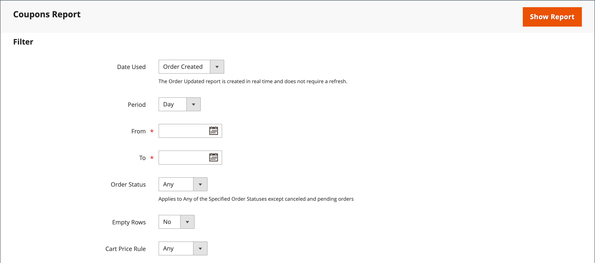

# Couponcodes

Coupons-Codes werden mit [Warenkorbpreisregeln](price-rules-cart.md) verwendet, um einen Rabatt anzuwenden, wenn eine Reihe von Bedingungen erfüllt ist. So kann beispielsweise ein Gutscheincode für eine bestimmte Kundengruppe oder für jeden Benutzer erstellt werden, der einen Kauf über einen bestimmten Betrag tätigt. Um den Gutschein auf einen Kauf anzuwenden, kann der Kunde den Gutscheincode in den Warenkorb oder möglicherweise in die Kasse Ihres _Stein- und Mörtel_-Geschäfts eingeben. Im Folgenden finden Sie einige Möglichkeiten, Gutscheine in Ihrem Geschäft zu verwenden:

- E-Mail-Gutscheine an Kunden
- Generieren gedruckter Gutscheine
- Erstellen von In-Store-Gutscheinen für Mobilbenutzer

Couponcodes können per E-Mail oder in Newslettern, Katalogen und Anzeigen versendet werden. Die Liste der Gutscheincodes kann exportiert und an einen kommerziellen Drucker gesendet werden. Sie können auch In-Store-Gutscheine mit einem Schnellantwort-Code erstellen, den Kunden mit ihren Smartphones scannen können. Der QR-Code kann mit einer Seite auf Ihrer Site verlinken, die weitere Informationen zur Promotion enthält.

Ab Commerce 2.4.7 können Käufer mehrere Gutscheine auf einen Warenkorb anwenden. Händler können auch mehrere Coupons mithilfe von Shopping-Hilfe anwenden.

>[!NOTE]
>
>Preisregeln für Warenkorb mit derselben Priorität führen nicht zu einem kombinierten Rabatt. Jede Regel (Coupon) wird entsprechend der in der Datenbank enthaltenen Regel-ID für den Warenkorbpreis einzeln auf übereinstimmende Produkte angewendet. Um die Reihenfolge zu steuern, in der Rabatte angewendet werden, empfiehlt Adobe, für jede hinzugefügte Preisregel einen anderen Wert festzulegen.

## Gutscheincodes konfigurieren

Die Länge und das Format der automatisch generierten Couponcodes werden durch die Konfiguration gesteuert. Die Zeichen können auf alle Zahlen, alle Buchstaben oder eine Kombination gesetzt werden. Sie können einen Bindestrich in festgelegten Intervallen einfügen, um das Lesen zu vereinfachen, und ein Präfix und Suffix hinzufügen, um den Code mit einer bestimmten Kampagne oder Initiative zu verknüpfen.

1. Wechseln Sie in der Seitenleiste _Admin_ zu **[!UICONTROL Stores]** > _[!UICONTROL Settings]_>**[!UICONTROL Configuration]**.

1. Erweitern Sie im linken Bereich den Wert **[!UICONTROL Customers]** und wählen Sie **[!UICONTROL Promotions]** aus.

   {width="600" zoomable="yes"}

1. Erweitern Sie den Abschnitt **[!UICONTROL Auto Generated Specific Coupon Codes]** .

   {width="600" zoomable="yes"}

1. Geben Sie den Wert **[!UICONTROL Code Length]** ein, einschließlich Präfix, Suffix und Trennzeichen.

1. Setzen Sie den **[!UICONTROL Code Format]** auf einen der folgenden Werte:

   - `Alphanumeric`
   - `Alphabetical`
   - `Numeric`

1. Geben Sie für &quot;**[!UICONTROL Code Prefix]**&quot;den Wert ein, der am Anfang aller Coupon-Codes angezeigt werden soll.

1. Geben Sie für &quot;**[!UICONTROL Code Suffix]**&quot;den Wert ein, der am Ende aller Couponcodes angezeigt werden soll.

1. Geben Sie für &quot;**[!UICONTROL Dash Every X Characters]**&quot;die Anzahl der Zeichen zwischen den einzelnen Bindestrichen ein.

   Couponcodes mit unterschiedlichen Bindestrichmustern werden als unterschiedliche Codes betrachtet, auch wenn die Zahlen identisch sind.

1. Klicken Sie nach Abschluss des Vorgangs auf **[!UICONTROL Save Config]**.

## Gutscheine erstellen

>[!NOTE]
>
>Bevor Sie Gutscheine erstellen, überprüfen Sie mit dem Befehl `bin/magento cron:run` , ob Cron ausgeführt wird. Weitere Informationen finden Sie unter [cron über die Befehlszeile ausführen](https://experienceleague.adobe.com/docs/commerce-operations/configuration-guide/cli/configure-cron-jobs.html#run-cron-from-the-command-line) im _Konfigurationshandbuch_ .

### Methode 1: Erstellen eines bestimmten Gutscheins

1. Befolgen Sie die Anweisungen zum Erstellen einer [Warenkorbpreisregel](price-rules-cart.md).

1. Setzen Sie im Abschnitt **[!UICONTROL Rule Information]** **[!UICONTROL Coupon]** auf `Specific Coupon`.

1. Geben Sie eine **[!UICONTROL Coupon Code]** ein, die mit der Promotion verwendet werden soll.

   Das Format des Codes (numerisch, alphanumerisch oder alphabetisch) wird durch die [Konfiguration](#configure-coupon-codes) bestimmt.

1. Gehen Sie wie folgt vor, um die Anzahl der Verwendungsmöglichkeiten des Gutscheins zu begrenzen:

   - Geben Sie die Anzahl von **[!UICONTROL Uses per Coupon]** ein.
   - Geben Sie die Anzahl von **[!UICONTROL Uses per Customer]** ein.

   Lassen Sie diese Felder für eine unbegrenzte Verwendung leer.

   {width="600" zoomable="yes"}

   >[!NOTE]
   >
   >Wenn derselbe Gutschein gleichzeitig von mehreren Kunden verwendet wird, kann es sein, dass die festgelegte Nutzungsbeschränkung aufgrund einer verzögerten Couponverarbeitung überschritten werden kann.

1. Gehen Sie wie folgt vor, um den Gutschein für einen Zeitraum gültig zu machen:

   -  (nur Magento Open Source) Füllen Sie die Datumsangaben **Von** und **bis** aus. Um das Datum auszuwählen, klicken Sie neben jedem Feld auf das Symbol **Kalender** (). Wenn Sie den Datumsbereich leer lassen, läuft die Regel nicht ab.

   -  (nur Adobe Commerce) Führen Sie einen der folgenden Schritte aus:

     **Option 1:** Neues Update planen

      - Klicken Sie oben rechts auf der Seite auf **[!UICONTROL Schedule New Update]** .

        {width="600" zoomable="yes"}

      - Geben Sie die Werte **[!UICONTROL Update Name]** und **[!UICONTROL Description]** ein.

      - Wählen Sie das **Startdatum** und das **[!UICONTROL End Date]** aus dem Kalender (  ). Wenn Sie den Datumsbereich leer lassen, läuft die Regel nicht ab.

      - Klicken Sie nach Abschluss des Vorgangs auf **[!UICONTROL Save]**.

        {width="600" zoomable="yes"}

     **Option 2:** Einer vorhandenen Aktualisierung zuweisen:

      - Wählen Sie **[!UICONTROL Assign to Another Update]** aus.

      - Suchen Sie die Aktualisierung in der Liste und klicken Sie auf **[!UICONTROL Select]**.

1. Füllen Sie nach Bedarf die Regel [Warenkorbpreis](price-rules-cart.md) aus.

### Methode 2: Generieren eines Gutscheinstapels

Die Generierung von Discount-Gutscheinen ist ein asynchroner Vorgang, der im Hintergrund ausgeführt wird, sodass Sie die Arbeit im Admin fortsetzen können, ohne auf den Abschluss des Vorgangs warten zu müssen. Das System zeigt eine Meldung an, wenn die Aufgabe abgeschlossen ist.

1. Befolgen Sie die Anweisungen zum Erstellen einer [Warenkorbpreisregel](price-rules-cart.md).

1. Aktivieren Sie unter **[!UICONTROL Coupon Code]** das Kontrollkästchen **[!UICONTROL Use Auto Generation]** .

1. Geben Sie die Anzahl der **[!UICONTROL Uses per Customer]** ein, um die Anzahl der Verwendungen des Gutscheins durch jeden Kunden zu begrenzen.

   {width="600" zoomable="yes"}

   >[!NOTE]
   >
   >Wenn derselbe Gutschein gleichzeitig von mehreren Kunden verwendet wird, kann es sein, dass die festgelegte Nutzungsbeschränkung aufgrund einer verzögerten Couponverarbeitung überschritten werden kann.

1. Scrollen Sie nach unten und erweitern Sie den Abschnitt **[!UICONTROL Manage Coupon Codes]** um den  und gehen Sie folgendermaßen vor:

   {width="600" zoomable="yes"}

   - Geben Sie für &quot;**[!UICONTROL Coupons Qty]**&quot;die Anzahl der Gutscheine ein, die Sie generieren möchten.

   - Geben Sie den Wert **[!UICONTROL Code Length]** ein, ohne Präfix, Suffix oder Trennzeichen.

   - Setzen Sie den **[!UICONTROL Code Format]** auf einen der folgenden Werte:

      - `Alphanumeric`
      - `Alphabetical`
      - `Numeric`

   - (Optional) Geben Sie einen **[!UICONTROL Code Prefix]** ein, der am Anfang des Codes hinzugefügt werden soll.

   - (Optional) Geben Sie einen **[!UICONTROL Code Suffix]** ein, der am Ende des Codes hinzugefügt werden soll.

   - (Optional) Geben Sie für &quot;**[!UICONTROL Dash Every X Characters]**&quot;die Anzahl der Zeichen zwischen den einzelnen Bindestrichen ein. Wenn der Code beispielsweise 12 Zeichen lang ist und alle vier Zeichen einen Bindestrich enthält, sieht er wie `xxxx-xxxx-xxxx` aus. Gedankenstriche erleichtern das Lesen und Eingeben von Codes.

1. Klicken Sie nach Abschluss des Vorgangs auf **[!UICONTROL Generate]**.

   Das System zeigt `Message is added to queue, wait to get your coupons soon` an.

   Nach Abschluss des Cron-Auftrags wird die Liste der generierten Codes angezeigt.

   | Feld | Beschreibung |
   |-------------|-------------|
   | [!UICONTROL Coupon Code] | Ein eindeutiger Couponcode, der erstellt wurde und für den Empfang von Sonderbedingungen verwendet werden kann. |
   | [!UICONTROL Created] | Das Datum der Erstellung des Gutscheincodes. |
   | [!UICONTROL Used] | Gibt an, ob der Coupon verwendet wurde. |
   | [!UICONTROL Times Used] | Gibt an, wie oft der Couponcode verwendet wurde. |

   {style="table-layout:auto"}

Sie können Gutscheincodes in eine CSV- oder Excel-XML-Datei exportieren, indem Sie das Dateiformat auswählen und auf &quot;**[!UICONTROL Export]**&quot; klicken.

Um Couponcodes zu löschen, wählen Sie einen oder mehrere Codes aus der Liste aus. Wählen Sie `Delete` aus dem **[!UICONTROL Actions]** -Selektor und klicken Sie dann auf **[!UICONTROL Submit]**.

>[!NOTE]
>
>Commerce ermöglicht zwar die Konfiguration mehrerer Couponcodes, doch kann ein Kunde nur einen Couponcode im Warenkorb verwenden. Um die gleichzeitige Verwendung von mehr als einem Couponcode im Warenkorb zu ermöglichen, können Sie eine entsprechende Erweiterung von [Commerce Marketplace](https://marketplace.magento.com/) in Erwägung ziehen.

## Couponbericht

Der Bericht _Coupons_ aggregiert Daten aus jedem Gutschein, der innerhalb eines bestimmten Datumsbereichs verwendet wird. Da Gutscheine aus dem Warenkorb angewendet werden, enthält der Bericht Daten aus allen eingelösten Gutscheinen, unabhängig vom [Bestellstatus](../stores-purchase/order-status.md). Daher kann der Bericht sowohl projizierte als auch tatsächliche Summen enthalten. Der Bericht kann nach einer bestimmten Store-Ansicht, einem bestimmten Zeitraum, einem bestimmten Bestellstatus und einer bestimmten Preisregel für den Warenkorb gefiltert werden.

Im folgenden Beispiel wurde der Gutscheincode &quot;H20&quot;von zwei Kunden verwendet. Eine der Bestellungen wird in Rechnung gestellt, die andere ist jedoch immer noch _ausstehend_. In den Spalten &quot;Zwischensumme der Verkäufe&quot;, &quot;Rabatt&quot;und &quot;Gesamtverkäufe&quot;werden die aggregierten Beträge aus beiden Bestellungen angezeigt, aber in den Spalten &quot;Zwischensumme&quot;, &quot;Rabatt&quot;und &quot;Gesamtsumme&quot;wird nur die tatsächlich in Rechnung gestellte Bestellung angezeigt. Jede Zeile im Bericht stellt eine einzelne Coupon-Promotion dar.

{width="600" zoomable="yes"}

### Bericht ausführen

1. Wechseln Sie in der Seitenleiste _Admin_ zu **[!UICONTROL Reports]** > _[!UICONTROL Sales]_>**[!UICONTROL Coupons]**.

1. Wenn Sie mehrere Store-Ansichten haben, setzen Sie &quot;**[!DNL Store View]**&quot;in der oberen linken Ecke, um den Umfang des Berichts festzulegen.

1. Um die Verkaufsstatistiken [für den Tag zu aktualisieren, klicken Sie oben im Arbeitsbereich auf die Meldung _Zuletzt aktualisiert_ .](../getting-started/sales-reports.md#refresh-statistics)

   Klicken Sie anschließend auf das Kontrollkästchen **[!UICONTROL Coupons]** und klicken Sie auf **[!UICONTROL Refresh]**.

   {width="600" zoomable="yes"}

1. Gehen Sie wie folgt vor, um die Daten zu filtern:

   {width="600" zoomable="yes"}

   - Setzen Sie **[!UICONTROL Date Used]** auf einen der folgenden Werte:

      - `Order Created`
      - `Order Updated`

     Der Bericht _Bestellung aktualisiert_ wird in Echtzeit erstellt und erfordert keine Aktualisierung.

   - Um den Berichtszeitraum zu definieren, setzen Sie **[!UICONTROL Period]** auf einen der folgenden Werte:

      - `Day`
      - `Month`
      - `Year`

   - Um den Datumsbereich des Berichts zu definieren, geben Sie die Datumsangaben **Von** und **bis** im Format M/D/YY ein.

   - Um einen Bericht für einen bestimmten [Bestellstatus](../stores-purchase/order-status.md) zu drucken, setzen Sie **[!UICONTROL Order Status]** auf `Specified` und wählen Sie den Bestellstatus aus der Liste aus.

   - Wenn Sie Zeilen ohne Daten aus dem Bericht auslassen möchten, setzen Sie **[!UICONTROL Empty Rows]** auf `No`.

   - Führen Sie einen der folgenden Schritte aus, um die im Bericht enthaltene Gutscheinaktivität zu definieren:

      - Um alle Coupon-Aktivitäten aus allen Preisregeln einzubeziehen, setzen Sie **[!UICONTROL Cart Price Rule]** auf `Any`.
      - Um nur Aktivitäten einzubeziehen, die sich auf eine bestimmte Preisregel beziehen, setzen Sie **[!UICONTROL Cart Price Rule]** auf `Specified` und wählen Sie die Regel für den Warenkorbpreis in der Liste aus.

1. Wenn Sie bereit sind, den Bericht auszuführen, klicken Sie auf **[!UICONTROL Show Report]**.

   Der Bericht wird unten auf der Seite angezeigt.

### Filteroptionen

| Feld | Beschreibung |
|--- |--- |
| [!UICONTROL Date Used] | Identifiziert das Datumsfeld, das als Berichtsgrundlage verwendet wird. Optionen: **[!UICONTROL Order Created]**: Generiert den Bericht basierend auf dem Datum, an dem die Bestellung vom Kunden aufgegeben wurde. Um sicherzustellen, dass die aktuellsten Daten enthalten sind, klicken Sie auf den Link in der Nachricht, um die Statistiken zu aktualisieren. **[!UICONTROL Order Updated]**: Erzeugt den Bericht basierend auf dem Datum, an dem die Bestellungen zuletzt aktualisiert wurden. Dieser Bericht verwendet Echtzeitdaten und erfordert keine Aktualisierung von Statistiken. |
| [!UICONTROL Period] | Bestimmt den Typ des Datumsbereichs, der für den Bericht verwendet wird. Optionen: `Day` / `Month` / `Year` |
| [!UICONTROL From] | Gibt das erste Datum im Bereich der Bestelldaten an, das im Bericht enthalten ist. |
| [!UICONTROL To] | Gibt das letzte Datum im Bereich der Bestelldaten an, die im Bericht enthalten sind. |
| [!UICONTROL Order Status] | Filtert den Bericht nach Bestellstatus. Der Bericht kann für alle Bestellungen generiert oder auf einen bestimmten Bestellstatus beschränkt werden. Optionen:  **[!UICONTROL Any]**: Umfasst alle Bestellungen unabhängig vom Status. **[!UICONTROL Specified]**: Umfasst nur Bestellungen mit dem angegebenen Status. Abgebrochene Bestellungen sind nicht im Bericht enthalten. |
| [!UICONTROL Empty Rows] | Bestimmt, ob der Bericht Zeilen mit leeren Daten enthält, die möglicherweise abgerufen werden. Optionen: `Yes` / `No` |
| [!UICONTROL Cart Price Rules] | Bestimmt, welche Coupon-Promotions im Bericht enthalten sind. Optionen: **[!UICONTROL Any]**: Enthält Bestellinformationen für jede Coupon-Promotion, die innerhalb des angegebenen Datumsbereichs verwendet wurde. **[!UICONTROL Specified]**: Enthält nur Bestellinformationen für die ausgewählte Coupon-Promotion im angegebenen Datumsbereich. |

{style="table-layout:auto"}

### Berichtsspalten

| Spalte | Beschreibung |
|--- |--- |
| [!UICONTROL Interval] | Gibt den Datumsbereich der Gutscheinnutzung an, der in den Bericht aufgenommen werden soll. Das Intervall kann ein bestimmter Tag, Monat, Jahr oder Datumsbereich sein. Das Intervalldatum wird wie in den folgenden Beispielen formatiert, entsprechend dem in der Einstellung **[!UICONTROL Period]** festgelegten Wert: `Day`: 6/21/19 `Month`: 6/2019 `Year`: 2019 |
| [!UICONTROL Coupon Code] | Der Rabattcode, der von Kunden in den Warenkorb eingegeben wird, um den Rabatt zu erhalten. |
| [!UICONTROL Price Rule] | Der Name der Preisregel, die mit dem Coupon verknüpft ist. |
| [!UICONTROL Uses] | Die Häufigkeit, mit der der Gutschein in dem für den Bericht angegebenen Datumsbereich verwendet wurde. |
| [!UICONTROL Sales Subtotal] | Die projizierte Zwischensumme aller Bestellungen, die mit dem Gutschein platziert wurden.  Die Zwischensumme der Verkäufe stellt die aggregierte Zwischensumme aller qualifizierten Bestellungen dar und enthält `Pending` Verkaufsaufträge, die noch nicht in Rechnung gestellt wurden. |
| [!UICONTROL Sales Discount] | Der prognostizierte Rabattbetrag aus allen Bestellungen, die mit dem Gutschein platziert wurden.  Der Rabatt stellt den aggregierten Abzinsungsbetrag aus allen qualifizierten Bestellungen dar und umfasst `Pending` Verkaufsaufträge, die noch nicht in Rechnung gestellt wurden. |
| [!UICONTROL Sales Total] | Die prognostizierte Gesamtsumme aus allen Bestellungen, die mit dem Gutschein platziert wurden. Die Gesamtverkaufskosten beinhalten alle Versand- und Bearbeitungsgebühren abzüglich des Rabatts.  Die Gesamtsumme der Verkäufe stellt den aggregierten Gesamtbetrag aller qualifizierten Bestellungen dar und enthält `Pending` Verkaufsaufträge, die noch nicht in Rechnung gestellt wurden. Der Wert enthält die Zwischensumme zuzüglich Versand- und Bearbeitungskosten abzüglich des Rabatts zuzüglich Steuern.   Berechnet durch: `((Subtotal + Shipping & Handling) - Discount) + Tax` |
| [!UICONTROL Subtotal] | Die aggregierte Zwischensumme aller fakturierten Bestellungen, die den Gutschein verwendet haben. |
| [!UICONTROL Discount] | Der aggregierte Rabatt von allen fakturierten Bestellungen, die den Gutschein verwendet haben. |
| [!UICONTROL Total] | Die aggregierte Bestellsumme aller fakturierten Bestellungen, die den Gutschein verwendet haben. |

{style="table-layout:auto"}
