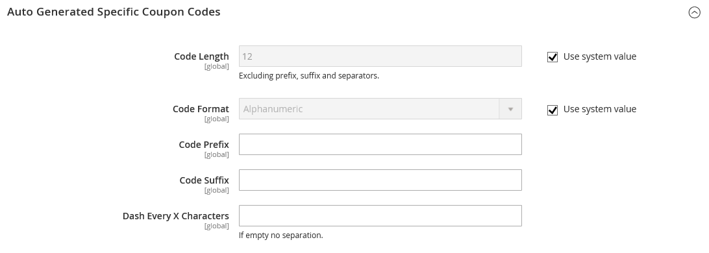

# Couponcodes

Couponcodes werden mit [Warenkorbpreisregeln](price-rules-cart.md) verwendet, um einen Rabatt anzuwenden, wenn eine Reihe von Bedingungen erfüllt ist. Beispielsweise kann ein Gutscheincode für eine bestimmte Kundengruppe oder für jede Person erstellt werden, die einen Kauf über einen bestimmten Betrag tätigt. Um den Coupon auf einen Kauf anzuwenden, kann der Kunde den Couponcode im Warenkorb oder möglicherweise an der Kasse Ihres _-Mörtel-_ eingeben. Im Folgenden finden Sie einige Möglichkeiten, wie Sie Gutscheine in Ihrem Store verwenden können:

- Gutscheine per E-Mail an Kunden senden
- Produzieren gedruckter Coupons
- Erstellen von Gutscheinen für mobile Benutzer im Geschäft

Couponcodes können per E-Mail gesendet oder in Newslettern, Katalogen und Werbung eingeschlossen werden. Die Liste der Gutscheincodes kann exportiert und an eine kommerzielle Druckerei gesendet werden. Sie können auch Gutscheine im Geschäft mit einem schnellen Antwort-Code erstellen, den Käufer mit ihrem Smartphone scannen können. Der QR-Code kann auf eine Seite auf Ihrer Website mit weiteren Informationen über die Promotion verlinken.

Ab Commerce 2.4.7 können Käufer mehrere Coupons auf einen Warenkorb anwenden. Händler können auch mehrere Gutscheine mit Shopping-Hilfe beantragen.

>[!NOTE]
>
>Regeln für den Warenkorbpreis, die dieselbe Priorität haben, führen nicht zu einem kombinierten Rabatt. Jede Regel (Coupon) wird separat auf übereinstimmende Produkte angewendet, und zwar einzeln entsprechend der Warenkorb-Preisregel-ID in der Datenbank. Um die Reihenfolge zu steuern, in der Rabatte angewendet werden, empfiehlt Adobe, für jede hinzugefügte Warenkorbpreisregel eine andere Priorität festzulegen.

## Gutscheincodes konfigurieren

Die Länge und das Format der automatisch generierten Couponcodes werden von der Konfiguration gesteuert. Die Zeichen können auf alle Zahlen, alle Buchstaben oder eine Kombination festgelegt werden. Sie können in festgelegten Abständen einen Bindestrich einfügen, um die Lektüre zu vereinfachen, und ein Präfix und ein Suffix hinzufügen, um den Code mit einer bestimmten Kampagne oder Initiative zu verknüpfen.

1. Navigieren Sie in _Admin_-Seitenleiste zu **[!UICONTROL Stores]** > _[!UICONTROL Settings]_>**[!UICONTROL Configuration]**.

1. Erweitern Sie im linken Bereich **[!UICONTROL Customers]** und wählen Sie **[!UICONTROL Promotions]**.

   {width="600" zoomable="yes"}

1. Erweitern Sie den Abschnitt **[!UICONTROL Auto Generated Specific Coupon Codes]** .

   {width="600" zoomable="yes"}

1. Geben Sie die **[!UICONTROL Code Length]** ein, einschließlich Präfix, Suffix und Trennzeichen.

1. Legen Sie die **[!UICONTROL Code Format]** auf einen der folgenden Werte fest:

   - `Alphanumeric`
   - `Alphabetical`
   - `Numeric`

1. Geben Sie **[!UICONTROL Code Prefix]** den Wert ein, der am Anfang aller Couponcodes angezeigt werden soll.

1. Geben Sie **[!UICONTROL Code Suffix]** den Wert ein, der am Ende aller Couponcodes angezeigt werden soll.

1. Geben Sie **[!UICONTROL Dash Every X Characters]** die Anzahl der Zeichen zwischen den einzelnen Bindestrichen ein.

   Couponcodes mit unterschiedlichen Bindestrichmustern werden als unterschiedliche Codes betrachtet, auch wenn die Zahlen gleich sind.

1. Klicken Sie abschließend auf **[!UICONTROL Save Config]**.

## Erstellen von Gutscheinen

>[!NOTE]
>
>Bevor Sie Gutscheine erstellen, verwenden Sie den `bin/magento cron:run`-Befehl, um zu überprüfen, ob cron ausgeführt wird. Weitere Informationen finden [ unter „Ausführen von ](https://experienceleague.adobe.com/docs/commerce-operations/configuration-guide/cli/configure-cron-jobs.html?lang=de#run-cron-from-the-command-line) über die Befehlszeile _im Konfigurationshandbuch_.

### Methode 1: Erstellen eines bestimmten Coupons

1. Befolgen Sie die Anweisungen zum Erstellen [Warenkorb-Preisregel](price-rules-cart.md).

1. Legen Sie im **[!UICONTROL Rule Information]** Abschnitt **[!UICONTROL Coupon]** auf `Specific Coupon` fest.

1. Geben Sie einen **[!UICONTROL Coupon Code]** ein, der für die Promotion verwendet werden soll.

   Das Format des Codes (numerisch, alphanumerisch oder alphabetisch) wird durch die [Konfiguration“ ](#configure-coupon-codes).

1. Gehen Sie wie folgt vor, um zu begrenzen, wie oft der Coupon verwendet werden kann:

   - Geben Sie die Anzahl der **[!UICONTROL Uses per Coupon]** ein.
   - Geben Sie die Anzahl der **[!UICONTROL Uses per Customer]** ein.

   Lassen Sie diese Felder leer, um sie unbegrenzt zu verwenden.

   {width="600" zoomable="yes"}

   >[!NOTE]
   >
   >Wird ein Coupon von mehreren Kunden gleichzeitig verwendet, kann es vorkommen, dass die festgelegte Nutzungsbeschränkung aufgrund einer verzögerten Verarbeitung des Coupons überschritten wird.

1. Gehen Sie wie folgt vor, um den Gutschein für einen bestimmten Zeitraum gültig zu machen:

   -  (nur Magento Open Source) Vervollständigen Sie die **Von** und **Bis**. Um das Datum auszuwählen, klicken Sie auf das Symbol **Kalender** () neben jedem Feld. Wenn Sie den Datumsbereich leer lassen, läuft die Regel nicht ab.

   -  (nur Adobe Commerce) Führen Sie einen der folgenden Schritte aus:

     **Option 1:** Planen einer neuen Aktualisierung

      - Klicken Sie oben rechts auf der Seite auf **[!UICONTROL Schedule New Update]** .

        {width="600" zoomable="yes"}

      - Geben Sie den **[!UICONTROL Update Name]** und die **[!UICONTROL Description]** ein.

      - Wählen Sie **Startdatum** und **[!UICONTROL End Date]** Sie im Kalender aus (  ). Wenn Sie den Datumsbereich leer lassen, läuft die Regel nicht ab.

      - Klicken Sie abschließend auf **[!UICONTROL Save]**.

        {width="600" zoomable="yes"}

     **Option 2:** einer bestehenden Aktualisierung zuweisen:

      - Wählen Sie **[!UICONTROL Assign to Another Update]** aus.

      - Suchen Sie das Update in der Liste und klicken Sie auf **[!UICONTROL Select]**.

1. Füllen Sie [Warenkorb-Preisregel](price-rules-cart.md) nach Bedarf aus.

### Methode 2: Erzeugen eines Couponbatches

Die Erstellung von Rabattgutscheinen ist ein asynchroner Vorgang, der im Hintergrund ausgeführt wird, damit Sie in der Admin weiterarbeiten können, ohne auf den Abschluss des Vorgangs zu warten. Wenn die Aufgabe abgeschlossen ist, wird eine Meldung angezeigt.

1. Befolgen Sie die Anweisungen zum Erstellen [Warenkorb-Preisregel](price-rules-cart.md).

1. Aktivieren Sie unter **[!UICONTROL Coupon Code]** das Kontrollkästchen **[!UICONTROL Use Auto Generation]** .

1. Geben Sie die Anzahl der **[!UICONTROL Uses per Customer]** ein, um zu begrenzen, wie oft jeder Kunde den Coupon verwenden kann.

   {width="600" zoomable="yes"}

   >[!NOTE]
   >
   >Wird ein Coupon von mehreren Kunden gleichzeitig verwendet, kann es vorkommen, dass die festgelegte Nutzungsbeschränkung aufgrund einer verzögerten Verarbeitung des Coupons überschritten wird.

1. Scrollen Sie nach unten und erweitern Sie  den Abschnitt **[!UICONTROL Manage Coupon Codes]** und führen Sie die folgenden Schritte aus:

   {width="600" zoomable="yes"}

   - Geben Sie **[!UICONTROL Coupons Qty]** die Anzahl der Coupons ein, die Sie generieren möchten.

   - Geben Sie die **[!UICONTROL Code Length]** ein, ohne Präfix, Suffix oder Trennzeichen.

   - Legen Sie die **[!UICONTROL Code Format]** auf einen der folgenden Werte fest:

      - `Alphanumeric`
      - `Alphabetical`
      - `Numeric`

   - (Optional) Geben Sie einen **[!UICONTROL Code Prefix]** ein, der am Anfang des Codes hinzugefügt werden soll.

   - (Optional) Geben Sie einen **[!UICONTROL Code Suffix]** ein, der am Ende des Codes hinzugefügt werden soll.

   - (Optional) Geben Sie **[!UICONTROL Dash Every X Characters]** die Anzahl der Zeichen zwischen den einzelnen Bindestrichen ein. Wenn der Code beispielsweise 12 Zeichen lang ist und alle vier Zeichen ein Bindestrich vorhanden ist, sieht es wie `xxxx-xxxx-xxxx` aus. Bindestriche erleichtern das Lesen und die Eingabe von Codes.

1. Klicken Sie abschließend auf **[!UICONTROL Generate]**.

   Das System zeigt `Message is added to queue, wait to get your coupons soon` an.

   Nach Abschluss des Cron-Auftrags wird die Liste der generierten Codes angezeigt.

   | Feld | Beschreibung |
   |-------------|-------------|
   | [!UICONTROL Coupon Code] | Ein eindeutiger Code von Coupons, der erstellt wurde und für den Empfang spezieller Bedingungen verwendet werden kann. |
   | [!UICONTROL Created] | Das Datum, an dem der Couponcode erstellt wurde. |
   | [!UICONTROL Used] | Gibt an, ob der Coupon verwendet wurde. |
   | [!UICONTROL Times Used] | Gibt an, wie oft der Couponcode verwendet wurde. |

   {style="table-layout:auto"}

Sie können Gutscheincodes in eine CSV- oder Excel-XML-Datei exportieren, indem Sie das Dateiformat auswählen und auf **[!UICONTROL Export]** klicken.

Um Gutscheincodes zu löschen, wählen Sie einen oder mehrere Codes aus der Liste aus. Wählen Sie in der **[!UICONTROL Actions]**-Auswahl die Option `Delete` aus, und klicken Sie dann auf **[!UICONTROL Submit]**.

>[!NOTE]
>
>Obwohl Commerce die Konfiguration mehrerer Gutscheincodes ermöglicht, kann eine Kundin oder ein Kunde nur einen Gutscheincode im Warenkorb verwenden. Um die gleichzeitige Verwendung von mehr als einem Couponcode im Warenkorb zu ermöglichen, können Sie eine entsprechende Erweiterung von [Commerce Marketplace](https://marketplace.magento.com/) verwenden.

## Bericht zu Coupons

Der _Coupons_-Bericht aggregiert Daten aus jedem Coupon, der während eines bestimmten Datumsbereichs verwendet wird. Da Gutscheine aus dem Warenkorb angewendet werden, enthält der Bericht Daten aus allen eingelösten Gutscheinen, unabhängig vom [ (Bestellstatus](../stores-purchase/order-status.md). Daher kann der Bericht sowohl die projizierten als auch die tatsächlichen Gesamtwerte enthalten. Der Bericht kann nach einer bestimmten Store-Ansicht, einem bestimmten Zeitraum, einem Bestellstatus und einer Warenkorb-Preisregel gefiltert werden.

Im folgenden Beispiel wurde der Couponcode „H20“ von zwei Kunden verwendet. Eine der Bestellungen wird fakturiert, die andere ist jedoch noch _ausstehend_. Die Spalten Projizierte Umsatzzwischensumme, Verkaufsrabatt und Verkaufssumme zeigen die aggregierten Beträge aus beiden Aufträgen an, aber nur der tatsächlich fakturierte Auftrag wird in den Spalten Zwischensumme, Rabatt und Gesamtsumme angezeigt. Jede Zeile im Bericht stellt eine einzelne Gutscheinaktion dar.

{width="600" zoomable="yes"}

### Bericht ausführen

1. Navigieren Sie in _Admin_-Seitenleiste zu **[!UICONTROL Reports]** > _[!UICONTROL Sales]_>**[!UICONTROL Coupons]**.

1. Wenn Sie mehrere Store-Ansichten haben, **[!DNL Store View]** Sie links oben ein, um den Umfang des Berichts festzulegen.

1. Um die Verkaufs[Statistiken](../getting-started/sales-reports.md#refresh-statistics) für den Tag zu aktualisieren, klicken Sie oben im Arbeitsbereich auf _Letzte_).

   Aktivieren Sie anschließend das Kontrollkästchen **[!UICONTROL Coupons]** und klicken Sie auf **[!UICONTROL Refresh]**.

   {width="600" zoomable="yes"}

1. Gehen Sie wie folgt vor, um die Daten zu filtern:

   {width="600" zoomable="yes"}

   - Legen Sie **[!UICONTROL Date Used]** auf eine der folgenden Einstellungen fest:

      - `Order Created`
      - `Order Updated`

     Der _Auftrag aktualisiert_-Bericht wird in Echtzeit erstellt und erfordert keine Aktualisierung.

   - Um den vom Bericht abgedeckten Zeitraum zu definieren, legen Sie **[!UICONTROL Period]** auf einen der folgenden Werte fest:

      - `Day`
      - `Month`
      - `Year`

   - Um den Datumsbereich des Berichts zu definieren, geben Sie die Daten **Von** und **Bis** im M/D/JJ-Format ein.

   - Um einen Bericht für einen bestimmten [Bestellstatus) zu drucken](../stores-purchase/order-status.md) legen Sie **[!UICONTROL Order Status]** auf `Specified` fest und wählen Sie den Bestellstatus aus der Liste aus.

   - Um Zeilen ohne Daten aus dem Bericht wegzulassen, setzen Sie **[!UICONTROL Empty Rows]** auf `No`.

   - Um die im Bericht enthaltenen Couponaktivitäten zu definieren, führen Sie einen der folgenden Schritte aus:

      - Um alle Couponaktivitäten aus allen Preisregeln einzubeziehen, setzen Sie **[!UICONTROL Cart Price Rule]** auf `Any`.
      - Um nur Aktivitäten einzubeziehen, die sich auf eine bestimmte Preisregel beziehen, setzen Sie **[!UICONTROL Cart Price Rule]** auf `Specified` und wählen Sie die Warenkorb-Preisregel in der Liste aus.

1. Wenn Sie bereit sind, den Bericht auszuführen, klicken Sie auf **[!UICONTROL Show Report]**.

   Der Bericht wird unten auf der Seite angezeigt.

### Filteroptionen

| Feld | Beschreibung |
|--- |--- |
| [!UICONTROL Date Used] | Gibt das Datumsfeld an, das als Grundlage für den Bericht verwendet wird. Optionen:  **[!UICONTROL Order Created]**: Erzeugt den Bericht basierend auf dem Datum, an dem die Bestellung vom Kunden aufgegeben wurde. Um sicherzustellen, dass die aktuellen Daten enthalten sind, klicken Sie auf den Link in der Nachricht, um die Statistiken zu aktualisieren. **[!UICONTROL Order Updated]**: Erstellt den Bericht basierend auf dem Datum der letzten Aktualisierung der Bestellungen. Dieser Bericht verwendet Echtzeitdaten und erfordert keine Aktualisierung von Statistiken. |
| [!UICONTROL Period] | Bestimmt den Typ des Datumsbereichs, der für den Bericht verwendet wird. Optionen: `Day` / `Month` / `Year` |
| [!UICONTROL From] | Gibt das erste Datum im Bereich der Bestelldaten an, die im Bericht enthalten sind. |
| [!UICONTROL To] | Gibt das letzte Datum im Bereich der Bestelldaten an, die im Bericht enthalten sind. |
| [!UICONTROL Order Status] | Filtert den Bericht nach Bestellstatus. Der Bericht kann für alle Bestellungen generiert oder auf einen bestimmten Bestellstatus beschränkt werden. Optionen:  **[!UICONTROL Any]**: Umfasst alle Bestellungen unabhängig vom Status. **[!UICONTROL Specified]**: Umfasst nur Bestellungen mit dem angegebenen Status. Stornierte Bestellungen sind nicht im Bericht enthalten. |
| [!UICONTROL Empty Rows] | Bestimmt, ob der Bericht Zeilen mit leeren Daten enthält, die möglicherweise abgerufen werden. Optionen: `Yes` / `No` |
| [!UICONTROL Cart Price Rules] | Legt fest, welche Gutscheinaktionen in den Bericht aufgenommen werden. Optionen:  **[!UICONTROL Any]**: Enthält Bestellinformationen für jede Gutscheinaktion, die während des angegebenen Datumsbereichs verwendet wurde. **[!UICONTROL Specified]**: Enthält nur Bestellinformationen für die ausgewählte Gutscheinaktion während des angegebenen Datumsbereichs. |

{style="table-layout:auto"}

### Berichtsspalten

| Spalte | Beschreibung |
|--- |--- |
| [!UICONTROL Interval] | Gibt den Datumsbereich der Couponnutzung an, die in den Bericht aufgenommen werden soll. Das Intervall kann ein bestimmter Tag, Monat, Jahr oder Datumsbereich sein. Das Intervalldatum wird entsprechend dem in **[!UICONTROL Period]** Einstellung festgelegten Wert wie in den folgenden Beispielen formatiert: `Day`: 6/21/19 `Month`: 6/2019 `Year`: 2019 |
| [!UICONTROL Coupon Code] | Der Rabattcode, den Kunden in den Warenkorb eingeben, um den Rabatt zu erhalten. |
| [!UICONTROL Price Rule] | Der Name der Preisregel, die mit dem Coupon verknüpft ist. |
| [!UICONTROL Uses] | Die Häufigkeit, mit der der Coupon im für den Bericht angegebenen Datumsbereich verwendet wurde. |
| [!UICONTROL Sales Subtotal] | Die voraussichtliche Zwischensumme aller Bestellungen, die mit dem Coupon aufgegeben wurden.  Die Zwischensumme „Verkauf“ stellt die aggregierte Zwischensumme aller qualifizierten Aufträge dar und umfasst `Pending` noch nicht fakturierten Aufträge. |
| [!UICONTROL Sales Discount] | Der voraussichtliche Rabattbetrag aus allen Bestellungen, die mit dem Coupon aufgegeben wurden.  Der Rabatt stellt den aggregierten Rabattbetrag aus allen qualifizierten Aufträgen dar und umfasst `Pending` Aufträge, die noch nicht fakturiert wurden. |
| [!UICONTROL Sales Total] | Die prognostizierte Gesamtsumme aller Bestellungen, die mit dem Coupon aufgegeben wurden. Die Verkaufssumme beinhaltet alle Versand- und Bearbeitungsgebühren abzüglich des Rabattbetrags.  Die Verkaufssumme stellt den aggregierten Gesamtgesamtbetrag aus allen qualifizierten Aufträgen dar und umfasst `Pending` noch nicht fakturierten Aufträge. Der Wert beinhaltet die Zwischensumme plus Versand und Bearbeitung, abzüglich des Rabatts, plus Steuer.   Berechnet von: `((Subtotal + Shipping & Handling) - Discount) + Tax` |
| [!UICONTROL Subtotal] | Die aggregierte Zwischensumme aller fakturierten Aufträge, die den Coupon verwendet haben. |
| [!UICONTROL Discount] | Der aggregierte Rabatt aller fakturierten Aufträge, die den Coupon verwendet haben. |
| [!UICONTROL Total] | Die aggregierte Bestellsumme aus allen fakturierten Aufträgen, die den Coupon verwendet haben. |

{style="table-layout:auto"}
