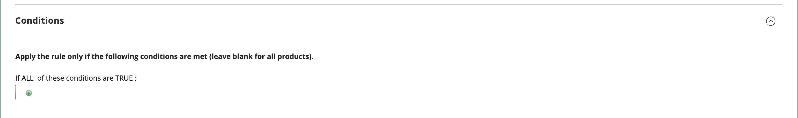

# Erstellen einer Warenkorb-Preisregel

Führen Sie die folgenden Schritte aus, um eine Regel hinzuzufügen, die Bedingungen zu beschreiben und die Aktionen zu definieren. Füllen Sie auch die Kennzeichnungen aus und testen Sie die Regel. Preisregelbedingungen können auf Warenkorb- oder [Produktattributen](../catalog/product-attributes.md) oder [Real-Time CDP-Zielgruppen](#use-real-time-cdp-audiences-to-set-a-condition) basieren, jedoch nicht auf [anpassbaren Optionen](../catalog/settings-advanced-custom-options.md).

## Schritt 1: Regel hinzufügen

1. Navigieren Sie in _Admin_-Seitenleiste zu **[!UICONTROL Marketing]** > _[!UICONTROL Promotions]_>**[!UICONTROL Cart Price Rules]**.

1. Klicken Sie auf **[!UICONTROL Add New Rule]** und führen Sie folgende Schritte aus:

   - Füllen Sie unter _[!UICONTROL Rule Information]_&#x200B;die **[!UICONTROL Rule Name]**&#x200B;und die **[!UICONTROL Description]**&#x200B;aus.

   - Wenn die Regel nicht sofort in Kraft treten soll, setzen Sie **[!UICONTROL Active]** auf `No`.

   {width="600" zoomable="yes"}

1. Gehen Sie wie folgt vor[ um den ](../getting-started/websites-stores-views.md#scope-settings)Umfang“ der Regel festzulegen:

   - Die **[!UICONTROL Websites]** auswählen, in der die Promotion verfügbar sein soll.

   - Wählen Sie die **[!UICONTROL Customer Groups]** aus, für die die Promotion gilt.

     Wenn die Promotion nur für registrierte Kunden verfügbar sein soll, wählen **_nicht_** die Option `NOT LOGGED IN` .

1. Legen Sie die Regel fest, die mit oder ohne [Coupon](price-rules-cart-coupon.md) gelten soll:

   - Wenn Sie die Warenkorbregel ohne Couponcode anwenden möchten, setzen Sie **[!UICONTROL Coupon]** auf `No Coupon` und fahren Sie mit Schritt 5 fort.

   - Um einen Coupon mit einer Preisregel zu verknüpfen, setzen Sie **[!UICONTROL Coupon]** auf `Specific Coupon` und gehen Sie wie folgt vor:

      - Geben Sie eine Freitext-**[!UICONTROL Coupon Code]** ein, die der Kunde eingeben muss, um den Rabatt zu erhalten.

      - Um festzulegen, wie oft der Coupon verwendet werden kann, füllen Sie die folgenden Optionen aus:

     | Option | Beschreibung |
     |------|-----------|
     | `Uses per Coupon` | Bestimmt, wie oft der Gutscheincode verwendet werden kann. Wenn es keine Beschränkung gibt, lassen Sie das Feld leer. |
     | `Uses per Customer` | Bestimmt, wie oft die Warenkorbpreisregel von demselben registrierten Kunden verwendet werden kann, der zu einer der ausgewählten Kundengruppen gehört. Die Einstellung gilt nicht für Gasteinkäufer, die Mitglieder der Kundengruppe NOT LOGGED IN sind, oder für Kunden, die einkaufen, ohne sich bei ihren Konten anzumelden. Wenn es keine Beschränkung gibt, lassen Sie das Feld leer. |

     {style="table-layout:auto"}

     Weitere Informationen finden Sie unter [Gutscheincodes](price-rules-cart-coupon.md).

     {width="600" zoomable="yes"}

   -  (nur Magento Open Source) Verwenden Sie _Kalender_ (), um den **[!UICONTROL From]** und **[!UICONTROL To]** Datumsbereich für die Promotion auszuwählen.

1. Geben Sie eine Zahl ein, um die **[!UICONTROL Priority]** dieser Preisregel in Bezug auf die Aktionseinstellungen anderer Preisregeln zu definieren, die gleichzeitig aktiv sind.

   >[!NOTE]
   >
   >Die _[!UICONTROL Priority]_&#x200B;ist wichtig, wenn zwei Warenkorb-Regeln oder Coupon-Codes gleichzeitig für dasselbe Produkt gültig sind. Die Regel mit der höchsten [!UICONTROL Priority] zur Steuerung der Warenkorbaktion.  Die Prioritäten von der höchsten zur niedrigsten sind `0,1,2,3...`. Siehe_ Nachfolgende Preisregeln verwerfen _im Schritt_[ Definieren der Aktionen ](#step-3-define-the-actions)_.

   >[!NOTE]
   >
   >Regeln für den Warenkorbpreis, die dieselbe Priorität haben, führen nicht zu einem kombinierten Rabatt. Jede Regel (Coupon) wird separat auf übereinstimmende Produkte angewendet, und zwar einzeln entsprechend der Warenkorb-Preisregel-ID in der Datenbank. Um die Reihenfolge zu steuern, in der Rabatte angewendet werden, empfiehlt Adobe, für jede zusätzliche Warenkorb-Preisregel eine andere Priorität festzulegen.

1. Um die Regel auf veröffentlichte (RSS[Feeds) anzuwenden](social-rss.md#rss-feeds) setzen Sie **Öffentlich im RSS-Feed** auf `Yes`.

1. Klicken Sie auf **[!UICONTROL Save and Continue Edit]**.

   -  (nur Magento Open Source) Nach dem Speichern der Regel wird der Name der Warenkorbpreisregel oben auf der Seite angezeigt.

   -  (nur Adobe Commerce) Nach dem Speichern der Regel werden der Name der Warenkorbpreisregel und das Feld [Geplante ](price-rule-cart-scheduled-changes.md)&quot; oben auf der Seite angezeigt.

     {width="600" zoomable="yes"}

## Schritt 2: Bedingungen beschreiben

In diesem Schritt werden die Bedingungen beschrieben, die für eine Bestellung erfüllt sein müssen, um sich für die Promotion zu qualifizieren. Die Regel wird aktiv, wenn der Satz von Bedingungen erfüllt ist.

Wenn Sie Zielgruppen aus Real-Time CDP verwenden, fahren Sie mit [diesem Abschnitt](#use-real-time-cdp-audiences-to-set-a-condition) fort.

>[!NOTE]
>
>Die Preisregel für den Warenkorb wird auf **_jedes_** Produkt im Warenkorb angewendet, wenn die auf der Registerkarte _[!UICONTROL Conditions]_&#x200B;festgelegten Bedingungen erfüllt sind. Fügen Sie Bedingungen auf der Registerkarte&#x200B;_[!UICONTROL Actions]_ hinzu, um die Anzahl der Produkte zu begrenzen, die von der Warenkorbpreisregel betroffen sind.

>[!NOTE]
>
>Wenn mindestens ein bedingtes Produktattribut einen leeren Wert aufweist, wird die Warenkorbpreisregel nicht auf das Produkt angewendet.

1. Wählen Sie im linken Bedienfeld **[!UICONTROL Conditions]** aus.

   {width="600" zoomable="yes"}

   Die erste Bedingung wird standardmäßig angezeigt und weist folgende Status auf:

   `If **ALL** of these conditions are **TRUE**:`

   Die Anweisung enthält zwei fett gedruckte Links, auf die Sie klicken können, um die Auswahl der Optionen für diesen Teil der Anweisung anzuzeigen. Sie können unterschiedliche Bedingungen erstellen, indem Sie die Kombination dieser Werte ändern. Führen Sie einen der folgenden Schritte aus:

   - Klicken Sie auf **[!UICONTROL ALL]** und wählen Sie `ALL` oder `ANY` aus.
   - Klicken Sie auf **[!UICONTROL TRUE]** und wählen Sie `TRUE` oder `FALSE` aus.
   - Lassen Sie die Bedingung unverändert, um die Regel auf alle Produkte anzuwenden.

1. Klicken Sie _Hinzufügen_ () am Anfang der nächsten Zeile und wählen Sie eine Option für die Bedingung aus, z. B. Warenkorbattribut, Produktunterauswahl oder Kombination.

   Für dieses Beispiel schließen Sie den nächsten Teil der Bedingung wie folgt ab:

   - Wenn Sie zum **[!UICONTROL Choose the condition to add]** aufgefordert werden, wählen Sie `Products Subselection` aus.

     {width="600" zoomable="yes"}

   - Klicken Sie in der Bedingungsanweisung auf **[!UICONTROL total quantity]** und wählen Sie `total quantity` oder `total amount` aus.

   >[!IMPORTANT]
   >
   >[!UICONTROL Total amount] ist eine Zeilensumme, sodass keine Steuern in den `total amount` für die Preisregel für den [!UICONTROL Products Subselection] enthalten sind. Verwenden Sie die [!UICONTROL Subtotal (Incl. Tax)] Bedingung, um Steuern einzubeziehen.

   - Klicken Sie in der Bedingungsanweisung auf **[!UICONTROL is]** und wählen Sie `greater than` aus.

1. Wenn der nächste Teil der Bedingung angezeigt wird, klicken Sie auf die Elemente der Anweisung, damit Sie sehen können, wo sich die einzelnen Links mit Variablenwerten befinden.

1. Klicken Sie auf den Link „Mehr“ (…) und geben Sie `100` ein.

   Diese Bedingung erfordert, dass die Gesamtmenge des Warenkorbs `101` oder größer ist.

   {width="600" zoomable="yes"}

1. Klicken Sie **Hinzufügen** () am Anfang der nächsten Zeile und fügen Sie dann eine Bedingung hinzu, die auf „Kategorie **basiert**.

   {width="600" zoomable="yes"}

1. Klicken Sie im nächsten Teil der Bedingung auf den Link _mehr_ (**…**), um das Eingabefeld anzuzeigen, und öffnen Sie dann die _Auswahl_ (), um die Kategoriestruktur anzuzeigen.

1. Aktivieren Sie das Kontrollkästchen der Kategorie, die Sie als Bedingung für die Preisregel verwenden möchten, und klicken Sie auf das Symbol , um die Kategorieauswahl zu akzeptieren.

   Die Bedingung kann auf einer beliebigen Kategorie basieren, die ein untergeordnetes Element der [Stammkategorie“ des Stores ](../catalog/category-root.md).

   {width="600" zoomable="yes"}

1. Um weitere Bedingungen hinzuzufügen, klicken Sie auf _Hinzufügen_ () und definieren Sie eine weitere Bedingung.

   Sie können den Vorgang so oft wie nötig wiederholen, um die Bedingungen zu beschreiben, die für die Preisregel erfüllt werden müssen. Im Folgenden finden Sie einige Beispiele:

   **Beispiel 1:** regionale Preisregel

   Um eine regionale Preisregel zu erstellen, verwenden Sie eines der folgenden Warenkorbattribute:

   - `Shipping Postcode`
   - `Shipping Region`
   - `Shipping State/Province`
   - `Shipping Country`

   **Beispiel 2:** Warenkorbsummen

   Um die Bedingung auf die Gesamtwerte des Warenkorbs zu stützen, verwenden Sie eines der folgenden Attribute für den Warenkorb:

   - `Subtotal`
   - `Total Items Quantity`
   - `Total Weight`

>[!NOTE]
>
>Bei mehreren parallelen Promotions wird die Bedingung _Zwischensumme_ auf die Zwischensumme _Basis_ des Warenkorbs angewendet, **_Rabatte_**.

>[!IMPORTANT]
>
>**Nur für Bestellungen**: Wenn eine Warenkorbpreisregel auf der Grundlage einer oder mehrerer spezifischer Zahlungsmethoden festgelegt wird, wird der Rabatt auf die Gesamtsumme angewendet, wenn eine Bestellung erstellt wird. Nachdem die Bestellung erstellt wurde, bleibt der Rabatt auf die Summe angewendet, wenn die Zahlungsmethode in eine geändert wird, die nicht von der Warenkorb-Preisregel abgedeckt wird.

### Hinzufügen eines Produktattributs zu Warenkorb-Preisregeln

1. Wechseln Sie zu **[!UICONTROL Stores]** > _[!UICONTROL Attributes]_>**[!UICONTROL Product]**&#x200B;und öffnen Sie das Produktattribut.

1. Wählen Sie im linken Bedienfeld **[!UICONTROL Storefront Properties]** aus.

1. Legen Sie **[!UICONTROL Use for Promo Rule Conditions]** auf `Yes` fest.

1. Klicken Sie auf **[!UICONTROL Save Attribute]**.

1. Navigieren Sie zu **[!UICONTROL Marketing]** > **[!UICONTROL Cart Price Rules]** und öffnen Sie die erforderliche Warenkorb-Preisregel.

1. Erweitern Sie  den Abschnitt **[!UICONTROL Condition]** und wählen Sie **[!UICONTROL Product attribute combination]** aus.

1. Legen Sie diese Bedingung auf einen der folgenden Werte fest:

   - Klicken Sie auf **[!UICONTROL FOUND]** und wählen Sie `FOUND` oder `NOT FOUND` aus.

   - Klicken Sie auf **[!UICONTROL ALL]** und wählen Sie `ALL` oder `ANY` aus.

1. Klicken Sie auf _Hinzufügen_ () und wählen Sie die **[!UICONTROL Product Attribute]** aus, die Sie für Bedingungen für Promotions-Regeln eingerichtet haben.

1. Klicken Sie auf **[!UICONTROL Save]**.

>[!NOTE]
>
>Wenn Sie die `is not one of` Bedingung mit einem _SKU_-Produktattribut und einem konfigurierbaren Produkt verwenden, müssen sowohl die übergeordneten als auch die untergeordneten Produkt-SKUs ausgewählt werden. Um zu vermeiden, dass alle untergeordneten SKUs in der Regel aufgelistet werden, können Sie die `does not contain` Bedingung mit gemeinsamen SKU-Teilen eines konfigurierbaren Produkts und dessen untergeordneten Produkten verwenden.

### Verwenden von Real-Time CDP-Zielgruppen zum Festlegen einer Bedingung

Sie können eine Bedingung für eine Warenkorb-Preisregel basierend auf einer Real-Time CDP (Zielgruppe[ festlegen](../customers/audience-activation.md).

1. Erweitern Sie **[!UICONTROL Conditions]**, klicken Sie auf das Symbol &quot;+&quot; und wählen Sie **[!UICONTROL Real-Time CDP Audience]** aus der Liste aus.

   {width="300"}

1. Wählen Sie das Symbol _Mehr_ (**…**) aus, klicken Sie auf **[!UICONTROL Open Chooser]** und zeigen Sie alle verfügbaren Real-Time CDP-Zielgruppen an.

   {width="600" zoomable="yes"}

1. Wählen Sie die Real-Time CDP-Zielgruppe aus, die Sie für die Warenkorb-Preisregel verwenden möchten.

   | Option | Beschreibung |
   |------|-----------|
   | `ID` | Eine interne Kennung der im Admin verwendeten Zielgruppe |
   | `Real-Time CDP Audience ID` | Eindeutige Kennung der Zielgruppe, als sie in Experience Platform erstellt wurde |
   | `Name` | Name der Zielgruppe, z. B. `Orders over $50` |
   | `Description` | Beschreibung der Zielgruppe, z. B. `People who placed an order over $50 in the last month.`. |
   | `Source` | Gibt an, woher die Zielgruppe stammt, z. B. `Experience Platform`. |
   | `Website` | Gibt an, welche Website Sie mit dem Datenstrom verknüpft haben, der die Zielgruppen enthält. Sie erstellen diesen Link, wenn Sie Ihre Commerce-Instanz über die [[!DNL Data Connection]](https://experienceleague.adobe.com/docs/commerce/data-connection/fundamentals/connect-data.html) mit der Experience Platform verbinden. |

   {style="table-layout:auto"}

Im nächsten Schritt definieren Sie die Aktion, die ausgeführt werden soll, wenn die Bedingung erfüllt ist.

## Schritt 3: Definieren der Aktionen

Die Preisregelaktionen für den Warenkorb beschreiben, wie Preise aktualisiert werden, wenn die Bedingungen erfüllt sind.

1. Scrollen Sie nach unten zu **[!UICONTROL Actions]** und erweitern Sie  den Abschnitt.

   {width="600" zoomable="yes"}

1. Legen Sie **[!UICONTROL Apply]** auf eine der folgenden Rabattoptionen fest:

   | Option | Beschreibung |
   |------|-----------|
   | `Percent of product price discount` | Rabattposition durch Abziehen eines Prozentsatzes vom ursprünglichen Preis. Der Rabatt gilt für jeden qualifizierten Artikel im Warenkorb. Beispiel: Geben Sie `10` in [!UICONTROL Discount Amount] für einen aktualisierten Preis ein, der 10 % unter dem ursprünglichen Preis liegt. |
   | `Fixed amount discount` | Rabattartikel, indem ein fester Betrag vom ursprünglichen Preis jedes qualifizierten Artikels im Warenkorb abgezogen wird. Beispiel: Geben Sie `10` in [!UICONTROL Discount Amount] für einen aktualisierten Preis ein, der 10 $ unter dem ursprünglichen Preis liegt. |
   | Fester Rabatt für den gesamten Warenkorb | Rabatte auf den gesamten Warenkorb, indem ein fester Betrag von der Summe des Warenkorbs abgezogen wird. Beispiel: Geben Sie 10 in [!UICONTROL Discount Amount] ein, um 10 $ von der Gesamtsumme des Warenkorbs abzuziehen. Standardmäßig gilt der Rabatt nur für die Zwischensumme des Warenkorbs. Um den Rabatt auf die Zwischensumme und den Versand separat anzuwenden, verwenden Sie die Option _[!UICONTROL Apply to Shipping Amount]_. |
   | `Buy X get Y free` | Definiert eine Menge X, die der Kunde erwerben muss, um eine Menge Y **desselben Produkts/derselben Variante)** erhalten. (Der [!UICONTROL Discount Amount] ist Y.) Eine Gesamtmenge von X+Y desselben Artikels muss im Warenkorb vorhanden/hinzugefügt werden, damit der Rabatt angewendet werden kann. |

   {style="table-layout:auto"}

   - Geben Sie die **[!UICONTROL Discount Amount]** als eine Zahl ohne Symbole ein. Je nach ausgewählter Rabattoption kann die Zahl 10 beispielsweise einen Prozentsatz, einen festen Betrag oder eine Menge von Artikeln angeben.

   - Geben Sie für einen _X-Rabatt erhalten_ die Menge in das Feld &quot;**[!UICONTROL Discount Qty Step (Buy X)]**&quot; eines einzelnen Produkts/einer einzelnen Artikelnummer/eines einzelnen Artikels ein, den der Kunde erwerben muss, um den Rabatt auf die Y-Menge zu erhalten. Sowohl X als auch Y beziehen sich auf Mengen derselben SKU. Diese spezifische Menge (Varianten eines konfigurierbaren Produkts werden separat gezählt) des Artikels muss dem Warenkorb manuell hinzugefügt werden.

   - Geben Sie in das Feld **[!UICONTROL Maximum Qty Discount is Applied To]** die maximale Menge desselben Produkts ein, die für den Rabatt im selben Kauf qualifiziert sein kann.

   - Stellen Sie **[!UICONTROL Apply to Shipping Amount]** () wie folgt ein:

     | Option | Beschreibung |
     |------|-----------|
     | `Yes` | Wendet den Rabattbetrag separat auf die Zwischensumme und die Versandbeträge an. |
     | `No` | Wendet den Rabattbetrag nur auf die Zwischensumme an. |

     {style="table-layout:auto"}

   - Um die Verarbeitung anderer Regeln nach der Anwendung dieser Regel zu stoppen, setzen Sie **[!UICONTROL Discard Subsequent Rules]** () auf `Yes`. Diese Einstellung verhindert, dass mehrere Rabatte auf dasselbe Produkt angewendet werden.

     | Option | Beschreibung |
     |------|-----------|
     | `Yes` | Verhindert die Anwendung anderer Preisregeln, die möglicherweise auf ein Produkt angewendet werden. Wenn mehrere Preisregeln für dasselbe Produkt gelten, wird nur die Preisregel mit der höchsten definierten Priorität (in einem [!UICONTROL Priority]) auf das qualifizierte Produkt angewendet. Dadurch wird verhindert, dass mehrere Preisregeln gestapelt werden und unbeabsichtigte zusätzliche Rabatte bereitgestellt werden. |
     | `No` | Ermöglicht die Anwendung mehrerer Preisregeln auf dasselbe Produkt. Dies kann dazu führen, dass der Listenpreis gestapelt und mit mehreren Rabatten versehen wird. |

     {style="table-layout:auto"}

     >[!IMPORTANT]
     >
     >Um nachfolgende Regeln zu verwerfen, muss eine Preisregel die definierten Prioritäten verwenden, die im Feld Priorität jeder Regel festgelegt sind. Außerdem sollten für mehrere Regeln nicht dieselbe Priorität definiert sein. Siehe **[!UICONTROL Priority]** im Schritt _Neue Regel hinzufügen_.

1. Um die **_exakten_** Produkte im Warenkorb zu definieren, die von der Warenkorbpreisregel betroffen sind, fügen Sie die **_zusätzlichen_** Bedingungen hinzu, die für die Aktion erforderlich sind.

   Um festzustellen, ob auf Bestellungen, die die Bedingungen erfüllen, ein kostenloser Versand angewendet wird, legen Sie **[!UICONTROL Free Shipping]** auf einen der folgenden Werte fest:

   | Option | Beschreibung |
   |------|-----------|
   | `No` | Kostenloser Versand ist nicht verfügbar. |
   | `For matching items only` | Kostenloser Versand ist nur für Artikel verfügbar, die den Bedingungen der Regel entsprechen. |
   | `For shipment with matching items` | Kostenloser Versand ist für jede Sendung verfügbar, die passende Artikel enthält. Die Versandmethode [Kostenloser Versand](../stores-purchase/shipping-free.md) muss aktiviert sein, um diese Option verwenden zu können. |

   {style="table-layout:auto"}

1.  (nur Adobe Commerce) Geben Sie **[!UICONTROL Add Rewards Points]** die feste Anzahl von Punkten ein, die der Kunde **_einmal_** pro Bestellung verdient, wenn die Warenkorb-Preisregel angewendet wird.

   Wenn die Belohnungspunkte nicht aktiviert sind, lassen Sie dieses Feld leer.

1. Klicken Sie abschließend auf **[!UICONTROL Save and Continue Edit]**.

## Schritt 4: Vervollständigen Sie die Beschriftungen

Die Bezeichnung wird im Abschnitt „Gesamtsummen“ der Bestellung angezeigt, um den Rabatt anzugeben. Der Titeltext ist nach dem Wort `Discount` in Klammern eingeschlossen. Sie können eine Standardbeschriftung für alle Shop-Ansichten eingeben oder für jede Ansicht eine andere Beschriftung eingeben.

{width="600"}

1. Scrollen Sie nach unten zu **[!UICONTROL Labels]** und erweitern Sie  den Abschnitt .

1. Geben Sie den Text ein, der als **[!UICONTROL Default Rule Label for All Store Views]** verwendet werden soll.

   {width="600" zoomable="yes"}

1. Wenn Ihr Store mehrere Ansichten oder mehrere Websites mit mehreren Ansichten hat, geben Sie den entsprechenden Beschriftungstext für jede Ansicht ein.

   Wenn sich beispielsweise jede Shop-Ansicht in einer anderen Sprache befindet, geben Sie die Übersetzung der Beschriftung für jede Ansicht ein.

   {width="600" zoomable="yes"}

## Schritt 5: Zugehörige dynamische Blöcke hinzufügen (optional)

{{ee-feature}}

[Dynamische Blöcke](../content-design/dynamic-blocks.md) die mit der Regel verknüpft sind, werden in der Storefront angezeigt, wenn die Bedingungen erfüllt sind.

1. Erweitern Sie  den Abschnitt **[!UICONTROL Related Dynamic Blocks]** .

1. Verwenden Sie die [Suchfilter](../getting-started/admin-workspace.md) um die Blöcke zu finden, die Sie mit der Regel verknüpfen möchten.

1. Aktivieren Sie das Kontrollkästchen in der ersten Spalte, um den Block mit der Regel zu verknüpfen.

   Weitere Informationen finden Sie unter [Dynamische Blöcke in Preisregeln](../content-design/dynamic-blocks-price-rules.md).

## Schritt 6: Speichern und Testen der Regel

1. Klicken Sie abschließend auf **[!UICONTROL Save Rule]**.

1. Testen Sie die Regel, um sicherzustellen, dass sie korrekt funktioniert.

   Preisregeln werden jede Nacht automatisch mit anderen Systemregeln verarbeitet. Wenn Sie eine Preisregel erstellen, warten Sie, bis sie in das System aufgenommen wurde. Testen Sie auch die Regel, um sicherzustellen, dass sie korrekt funktioniert. Mit der Einführung neuer Regeln berechnet Commerce die Preise und Prioritäten entsprechend neu.

## Demo der Warenkorbpreisregel

In diesem Video erfahren Sie mehr über das Erstellen von Regeln für den Warenkorbpreis:

>[!VIDEO](https://video.tv.adobe.com/v/343835?quality=12&learn=on)

## Feldbeschreibungen

### [!UICONTROL Rule Information]

| Feld | Beschreibung |
|--- |--- |
| [!UICONTROL Rule Name] | (Erforderlich) Der Name der Regel dient als interne Referenz. |
| [!UICONTROL Description] | Eine Beschreibung der Regel sollte den Zweck der Regel enthalten und erklären, wie sie verwendet wird. |
| [!UICONTROL Active] | (Erforderlich) Bestimmt, ob die Regel im Store aktiv ist. Optionen: `Yes` / `No` |
| [!UICONTROL Websites] | (Erforderlich) Gibt die Websites an, auf denen die Regel verwendet werden kann. |
| [!UICONTROL Customer Groups] | (Erforderlich) Identifiziert die Kundengruppen, für die die Regel gilt. |
| [!UICONTROL Coupon] | (Erforderlich) Zeigt an, ob der Regel ein Coupon zugeordnet ist. Optionen:  **[!UICONTROL No Coupon]**- Der Regel ist kein Coupon zugeordnet. **[!UICONTROL Specific Coupon]** - Der Regel ist ein bestimmter Coupon zugeordnet.  **[!UICONTROL Coupon Code]**: Geben Sie bei Aufforderung den Gutscheincode ein, den der Kunde eingeben muss, um die Promotion nutzen zu können. **[!UICONTROL Use Auto Generation]** - Aktivieren Sie das Kontrollkästchen, um automatisch mehrere Gutscheincodes zu generieren, die mit der Promotion verwendet werden können.  **[!UICONTROL Auto]**- Zeigt den _[!UICONTROL Manage Coupon Codes]_&#x200B;an, um das Format der zu generierenden Couponcodes zu definieren. |
| [!UICONTROL Uses per Coupon] | Bestimmt, wie oft der Gutscheincode verwendet werden kann. Wenn es keine Beschränkung gibt, lassen Sie das Feld leer. |
| [!UICONTROL Uses per Customer] | Bestimmt, wie oft die Warenkorb-Preisregel von demselben registrierten Kunden verwendet werden kann, der zu einer ausgewählten Kundengruppe gehört. Gilt nicht für Gasteinkäufer, die Mitglieder der Kundengruppe NOT LOGGED IN sind, oder für Kunden, die einkaufen, ohne sich bei ihren Konten anzumelden. Für keine Beschränkung lassen Sie das Feld leer. |
| [!UICONTROL Priority] | Eine Zahl, die die Priorität dieser Regel im Verhältnis zu anderen angibt. Die Prioritäten von der höchsten zur niedrigsten sind `0,1,2,3...` |
| [!UICONTROL Public in RSS Feed] | Legt fest, ob die Promotion im öffentlichen RSS-Feed Ihres Stores enthalten ist. Optionen:  `Yes`/`No` |
| [!UICONTROL From] |  (nur Magento Open Source) Das erste Datum, an dem der Coupon verwendet werden kann. |
| [!UICONTROL To] |  (nur Magento Open Source) Das letzte Datum, an dem der Coupon verwendet werden kann. |

{style="table-layout:auto"}

### [!UICONTROL Conditions]

Gibt die Bedingungen an, die erfüllt sein müssen, bevor die Warenkorbpreisregel in Kraft tritt. Wenn Sie das Feld leer lassen, gilt die Regel für alle Produkte im Warenkorb. Bedingungen können auf einer beliebigen Kombination aus Warenkorb- und Produktattributen basieren. Auf [anpassbaren Optionen](../catalog/settings-advanced-custom-options.md) kann jedoch nicht in Warenkorb-Preisregelbedingungen verwiesen werden.

| Feld | Beschreibung |
|--- |--- |
| [!UICONTROL **Warenkorb-Artikelattribut**] |  |
| [!UICONTROL Price in cart] | Produktpreis. Die Regel gilt, wenn der Produktpreis in der Warenkorbbedingung erfüllt ist. |
| [!UICONTROL Quantity in cart] | Produktmenge. Die Regel gilt, wenn die Produktmenge in der Warenkorbbedingung erfüllt ist. |
| [!UICONTROL Row total in cart] | Summe der Produktzeilen. Die Regel gilt, wenn die Bedingung für die gesamte Produktzeile im Warenkorb erfüllt ist. |
| [!UICONTROL **Produktattribut**] |  |
| [!UICONTROL Attribute Set] | Produktattribut festgelegt. Die Regel gilt, wenn das Produkt die Produktattributbedingung erfüllt. |
| [!UICONTROL Category/Other attribute] | Produktkategorie/anderes Attribut. Die Regel gilt, wenn entweder das Produkt selbst oder die untergeordneten Elemente die Kategorie-/andere Attributbedingung erfüllen. Für das Attribut muss `Yes` festgelegt [!UICONTROL Use for Promo Rule Conditions]. |
| [!UICONTROL Category/Other attribute (Children Only)] | Untergeordnete Produktkategorie/anderes Attribut Die Regel gilt, wenn nur die untergeordneten Produkteigenschaften die Kategorie-/andere Attributbedingung erfüllen (das Produkt selbst ist hier nicht markiert). Das Attribut muss [!UICONTROL Use for Promo Rule Conditions] zu `Yes` haben. |
| [!UICONTROL Category/Other attribute (Parent Only)] | Übergeordnete Produktkategorie/anderes Attribut. Die Regel gilt nur, wenn das Produkt selbst die Kategorie-/andere Attributbedingung erfüllt (untergeordnete Produkte sind hier nicht markiert). Für das Attribut muss `Yes` festgelegt [!UICONTROL Use for Promo Rule Conditions]. |
| [!UICONTROL **Warenkorb-Attribut**] |  |
| [!UICONTROL Subtotal (Excl. Tax)] | Zwischensumme zum Warenkorb (ohne Steuer). Die Regel gilt, wenn der Warenkorb die Bedingung „Zwischensumme (ohne Steuer)“ erfüllt. |
| [!UICONTROL Subtotal (Incl. Tax)] | Warenkorb-Zwischensumme (einschließlich Steuer). Die Regel gilt, wenn der Warenkorb die Bedingung für Zwischensummen (einschließlich Steuern) erfüllt. |
| [!UICONTROL Subtotal] | Warenkorb-Zwischensumme. Die Regel gilt, wenn der Warenkorb eine Teilsummenbedingung erfüllt. Scheck schließt Steuern gemäß den aktuellen Steuereinstellungen ein oder aus. |
| [!UICONTROL Total Items Quantity] | Gesamtmenge aller Produkte im Warenkorb. Die Regel gilt, wenn der Warenkorb eine Bedingung für die Gesamtmenge der Artikel erfüllt. |
| [!UICONTROL Total Weight] | Gesamtgewicht aller Produkte im Warenkorb. Die Regel gilt, wenn der Warenkorb die Bedingung für das Gesamtgewicht erfüllt. |
| [!UICONTROL Payment Method] | Bei der Kasse ausgewählte Zahlungsmethode. Die Regel gilt, wenn die Bedingung für die Zahlungsmethode erfüllt ist. |
| [!UICONTROL Shipping Method] | Bei der Kasse ausgewählte Versandart. Die Regel gilt, wenn die Bedingung für die Versandmethode erfüllt ist. |
| [!UICONTROL Shipping Postcode] | Postleitzahl der Lieferadresse. Die Regel gilt, wenn die Lieferadresse die Postleitzahl-Bedingung erfüllt. |
| [!UICONTROL Shipping Region] | Region der Versandadresse. Die Regel gilt, wenn die Lieferadresse die Regionsbedingung erfüllt. |
| [!UICONTROL Shipping State/Province] | Lieferadresse Bundesland/Region. Die Regel gilt, wenn die Lieferadresse die Bedingung Bundesland/Provinz erfüllt. |
| [!UICONTROL Shipping Country] | Lieferadresse Land. Die Regel gilt, wenn die Lieferadresse die Landesbedingung erfüllt. |
| [!UICONTROL Customer Segment] | Die Regel gilt, wenn ein registrierter oder Gast-Kunde die Kundensegmentbedingung erfüllt. |

### [!UICONTROL Actions]

| Feld | Beschreibung |
|--- |--- |
| [!UICONTROL Apply] | Bestimmt die Art der Berechnung, die auf den Kauf angewendet wird. Optionen:  **[!UICONTROL Percent of product price discount]**- Rabattartikel, indem ein Prozentsatz vom ursprünglichen Preis abgezogen wird. Beispiel: Geben Sie `10` in _[!UICONTROL Discount Amount]_&#x200B;für einen aktualisierten Preis ein, der 10 % unter dem ursprünglichen Preis liegt. **[!UICONTROL Fixed amount discount]**- Rabattartikel, indem ein fester Betrag vom ursprünglichen Preis jedes qualifizierten Artikels im Warenkorb abgezogen wird. Beispiel: Geben Sie `10` in&#x200B;_[!UICONTROL Discount Amount]_ für einen aktualisierten Preis ein, der 10 $ unter dem ursprünglichen Preis liegt.  **[!UICONTROL Fixed amount discount for whole cart]**- Rabatte für den gesamten Warenkorb, indem ein fester Betrag von der Zwischensumme des Warenkorbs subtrahiert wird. Beispiel: Geben Sie `10` in _[!UICONTROL Discount Amount]_&#x200B;ein, um $10 von der Zwischensumme des Warenkorbs abzuziehen. Standardmäßig gilt der Rabatt nur für die Zwischensumme des Warenkorbs. Um den Rabatt auf die Zwischensumme und den Versand separat anzuwenden, siehe_Auf Versandbetrag anwenden _. **[!UICONTROL Buy X Get Y Free (discount amount is Y)]**- Definiert eine Menge, die der Kunde erwerben muss, um eine Menge kostenlos zu erhalten. (Der&#x200B;_[!UICONTROL Discount Amount]_ ist Y.) |
| [!UICONTROL Discount Amount] | (Erforderlich) Der Rabattbetrag, der angeboten wird. |
| [!UICONTROL Maximum Qty Discount is Applied To] | Legt die maximale Anzahl von Produkten fest, auf die der Rabatt im selben Kauf angewendet werden kann. |
| [!UICONTROL Discount Qty Step (Buy X)] | Legt die Anzahl der Produkte fest, die von `X` in einer `Buy X Get Y Free`-Promotion repräsentiert werden. Außerdem definiert, wie viele Produkte in Stapeln zum Warenkorb hinzugefügt werden müssen, um `Fixed amount discount`- und `Percent of product price discount`-Aktionen anzuwenden. |
| [!UICONTROL Apply to Shipping Amount] | Legt fest, ob der Rabatt separat auf die Zwischensumme und die Versandbeträge angewendet wird. Andernfalls wird sie nur auf die Zwischensumme angewendet. Optionen: `Yes` / `No` |
| [!UICONTROL Discard Subsequent Rules] | Bestimmt, ob Regeln niedrigerer Priorität (1 ist die höchste Priorität) auf das Produkt angewendet werden können, wenn diese Warenkorb-Preisregel eine Übereinstimmung aufweist. Aktivieren Sie diese Option, um zu verhindern, dass mehrere Rabatte auf dasselbe Produkt angewendet werden. Optionen: `Yes` / `No` |
| [!UICONTROL Free Shipping] | Legt fest, ob der kostenlose Versand in der Promotion enthalten ist und falls ja, für welche Artikel. Optionen:  **[!UICONTROL No]**- Kostenloser Versand ist für die aktuelle Regel nicht verfügbar. **[!UICONTROL For matching items only]** - Kostenloser Versand ist nur für bestimmte Artikel im Warenkorb verfügbar, die der Regel entsprechen.  **[!UICONTROL For shipment with matching items]**- Kostenloser Versand ist für alle Artikel im Warenkorb verfügbar. Die Versandmethode [Kostenloser Versand](../stores-purchase/shipping-free.md) muss aktiviert sein, um diese Option verwenden zu können. |
| [!UICONTROL Add Reward Points] |  (nur Adobe Commerce) Gibt die Anzahl der [Belohnungspunkte](rewards-loyalty.md) an, die der Kunde bei Anwendung der Preisregel verdient. |

{style="table-layout:auto"}

### [!UICONTROL Labels]

| Feld | Beschreibung |
|--- |--- |
| [!UICONTROL Default Rule Label for All Store Views] | Eine Standardbeschriftung, die den Rabatt angibt und für alle Store-Ansichten verwendet werden kann. |
| [!UICONTROL Store View Specific Labels] | Gibt ggf. eine andere Beschriftung an, um den Rabatt für jede Shop-Ansicht anzugeben. |

{style="table-layout:auto"}

### [!UICONTROL Related Dynamic Blocks]

{{ee-feature}}

Identifiziert alle [dynamischen Blöcke](../content-design/dynamic-blocks.md), die mit der Regel verknüpft sind.
