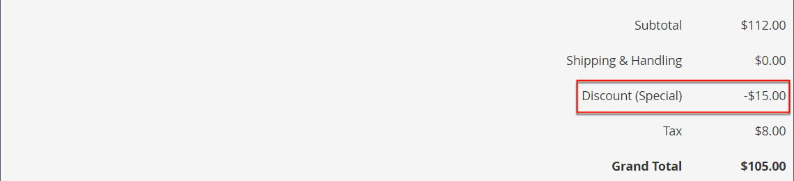

# Erstellen einer Preisregel für den Warenkorb

Führen Sie die folgenden Schritte aus, um eine Regel hinzuzufügen, die Bedingungen zu beschreiben und die Aktionen zu definieren. Füllen Sie auch die Beschriftungen aus und testen Sie die Regel. Preisregelbedingungen können auf Warenkorb- oder [Produktattributen](../catalog/product-attributes.md) oder [Real-Time CDP-Zielgruppen](#use-real-time-cdp-audiences-to-set-a-condition) basieren, jedoch nicht auf [anpassbaren Optionen](../catalog/settings-advanced-custom-options.md).

## Schritt 1: Hinzufügen einer Regel

1. Wechseln Sie in der Seitenleiste _Admin_ zu **[!UICONTROL Marketing]** > _[!UICONTROL Promotions]_>**[!UICONTROL Cart Price Rules]**.

1. Klicken Sie auf **[!UICONTROL Add New Rule]** und führen Sie die folgenden Schritte aus:

   - Führen Sie unter _[!UICONTROL Rule Information]_die **[!UICONTROL Rule Name]**und **[!UICONTROL Description]**aus.

   - Wenn die Regel nicht sofort in Kraft treten soll, setzen Sie **[!UICONTROL Active]** auf `No`.

   {width="600" zoomable="yes"}

1. Gehen Sie wie folgt vor, um den [Perimeter](../getting-started/websites-stores-views.md#scope-settings) der Regel festzulegen:

   - Wählen Sie die **[!UICONTROL Websites]** aus, für die die Promotion verfügbar sein soll.

   - Wählen Sie die **[!UICONTROL Customer Groups]** aus, für die die Promotion gilt.

     Wenn Sie möchten, dass die Promotion nur registrierten Kunden zur Verfügung steht, wählen Sie **_nicht_** die Option `NOT LOGGED IN` aus.

1. Legen Sie die Regel, die mit oder ohne [Coupon](price-rules-cart-coupon.md) angewendet werden soll, wie folgt fest:

   - Damit die Warenkorbregel ohne Verwendung eines Gutscheincodes angewendet wird, setzen Sie **[!UICONTROL Coupon]** auf `No Coupon` und fahren Sie mit Schritt 5 fort.

   - Um einen Gutschein mit einer Preisregel zu verknüpfen, setzen Sie **[!UICONTROL Coupon]** auf `Specific Coupon` und führen Sie folgende Schritte aus:

      - Geben Sie einen freien Text **[!UICONTROL Coupon Code]** ein, den der Kunde eingeben muss, um den Rabatt zu erhalten.

      - Um die Anzahl der Verwendungsmöglichkeiten des Gutscheins zu begrenzen, führen Sie die folgenden Optionen aus:

     | Option | Beschreibung |
     |------|-----------|
     | `Uses per Coupon` | Bestimmt, wie oft der Gutscheincode verwendet werden kann. Wenn keine Begrenzung vorhanden ist, lassen Sie das Feld leer. |
     | `Uses per Customer` | Bestimmt, wie oft die Warenkorbpreisregel von demselben registrierten Kunden verwendet werden kann, der zu einer der ausgewählten Kundengruppen gehört. Die Einstellung gilt nicht für Gastkäufer, die Mitglieder der NOT LOGGED IN-Kundengruppe sind, oder für Kunden, die einkaufen, ohne sich bei ihren Konten anzumelden. Wenn keine Begrenzung vorhanden ist, lassen Sie das Feld leer. |

     {style="table-layout:auto"}

     Weitere Informationen finden Sie unter [Couponcodes](price-rules-cart-coupon.md).

     {width="600" zoomable="yes"}

   -  (nur Magento Open Source) Verwenden Sie den _Kalender_ (), um den Datumsbereich **[!UICONTROL From]** und **[!UICONTROL To]** für die Promotion auszuwählen.

1. Geben Sie eine Zahl ein, um die **[!UICONTROL Priority]** dieser Preisregel in Bezug auf die Aktionseinstellungen anderer Preisregeln zu definieren, die gleichzeitig aktiv sind.

   >[!NOTE]
   >
   >Die Einstellung Priorität ist wichtig, wenn zwei Warenkorbregeln/Couponcodes für dasselbe Produkt gleichzeitig gültig sind. Die Regel mit der höchsten Prioritätseinstellung (`1`) steuert die Warenkorbaktion. Siehe _Nachfolgende Preisregeln verwerfen_ im Schritt _Aktionen definieren_ .

   >[!NOTE]
   >
   >Preisregeln für Warenkorb mit derselben Priorität führen nicht zu einem kombinierten Rabatt. Jede Regel wird einzeln auf übereinstimmende Produkte angewendet, und zwar einzeln.

1. Um die Regel auf veröffentlichte [RSS-Feeds](social-rss.md#rss-feeds) anzuwenden, setzen Sie **Öffentlich im RSS-Feed** auf `Yes`.

1. Klicken Sie auf **[!UICONTROL Save and Continue Edit]**.

   -  (Nur Magento Open Source) Nach dem Speichern der Regel wird der Name der Warenkorbpreisregel oben auf der Seite angezeigt.

   -  (Nur Adobe Commerce) Nach dem Speichern der Regel werden der Name der Warenkorbpreisregel und das Feld [Geplante Änderungen](price-rule-cart-scheduled-changes.md) oben auf der Seite angezeigt.

     {width="600" zoomable="yes"}

## Schritt 2: Beschreibung der Bedingungen

In diesem Schritt werden die Bedingungen beschrieben, die erfüllt sein müssen, damit eine Bestellung für die Promotion qualifiziert wird. Die Regel wird immer dann aktiv, wenn der Bedingungssatz erfüllt ist.

Wenn Sie Zielgruppen aus Real-Time CDP verwenden, überspringen Sie zu [diesem Abschnitt](#use-real-time-cdp-audiences-to-set-a-condition).

>[!NOTE]
>
>Die Preisregel für den Warenkorb wird auf **_jedes_** Produkt im Warenkorb angewendet, wenn die Bedingungen auf der Registerkarte _[!UICONTROL Conditions]_erfüllt sind. Fügen Sie im Tab_[!UICONTROL Actions]_ Bedingungen hinzu, um die Anzahl der von der Regel für den Warenkorbpreis betroffenen Produkte zu begrenzen.

>[!NOTE]
>
>Wenn mindestens ein bedingtes Produktattribut einen leeren Wert hat, wird die Preisregel für den Warenkorb nicht auf das Produkt angewendet.

1. Wählen Sie im linken Bereich **[!UICONTROL Conditions]** aus.

   {width="600" zoomable="yes"}

   Die erste Bedingung wird standardmäßig und in den folgenden Status angezeigt:

   `If **ALL** of these conditions are **TRUE**:`

   Die Anweisung enthält zwei fette Links, auf die Sie klicken können, um die Auswahl der Optionen für diesen Teil der Anweisung anzuzeigen. Sie können unterschiedliche Bedingungen erstellen, indem Sie die Kombination dieser Werte ändern. Führen Sie einen der folgenden Schritte aus:

   - Klicken Sie auf **[!UICONTROL ALL]** und wählen Sie `ALL` oder `ANY` aus.
   - Klicken Sie auf **[!UICONTROL TRUE]** und wählen Sie `TRUE` oder `FALSE` aus.
   - Lassen Sie die Bedingung unverändert, um die Regel auf alle Produkte anzuwenden.

1. Klicken Sie am Anfang der nächsten Zeile auf _Hinzufügen_ () und wählen Sie eine Option für die Bedingung aus, z. B. ein Warenkorbattribut, eine Unterauswahl des Produkts oder eine Kombination.

   Führen Sie für dieses Beispiel den nächsten Teil der Bedingung wie folgt aus:

   - Wählen Sie bei Aufforderung zu **[!UICONTROL Choose the condition to add]** die Option `Products Subselection`.

     {width="600" zoomable="yes"}

   - Klicken Sie in der Bedingungsanweisung auf **[!UICONTROL total quantity]** und wählen Sie `total quantity` oder `total amount` aus.

   >[!IMPORTANT]
   >
   >[!UICONTROL Total amount] ist eine Zeilensumme, sodass Steuern nicht in die `total amount` für die Bedingung der Preisregel für den [!UICONTROL Products Subselection] Warenkorb einbezogen werden. Verwenden Sie die Bedingung [!UICONTROL Subtotal (Incl. Tax)] , um Steuern einzubeziehen.

   - Klicken Sie in der Bedingungsanweisung auf **[!UICONTROL is]** und wählen Sie `greater than` aus.

1. Wenn der nächste Teil der Bedingung angezeigt wird, klicken Sie auf die Elemente der Anweisung, damit Sie sehen können, wo sich jeder Link mit Variablenwerten befindet.

1. Klicken Sie auf den Link &quot;Mehr&quot;(..) und geben Sie `100` ein.

   Für diese Bedingung muss die Gesamtmenge des Warenkorbs `101` oder höher sein.

   {width="600" zoomable="yes"}

1. Klicken Sie am Anfang der nächsten Zeile auf **Hinzufügen** () und fügen Sie dann eine Bedingung hinzu, die auf **Kategorie** basiert.

   {width="600" zoomable="yes"}

1. Klicken Sie im nächsten Teil der Bedingung auf den Link _more_ (**...**), um das Eingabefeld anzuzeigen, und öffnen Sie dann den Link _Chooser_ (), um die Kategorienstruktur anzuzeigen.

1. Aktivieren Sie das Kontrollkästchen der Kategorie, die Sie als Bedingung für die Preisregel verwenden möchten, und klicken Sie auf das Symbol  , um die Kategorieauswahlen zu akzeptieren.

   Die Bedingung kann auf jeder Kategorie basieren, die ein untergeordnetes Element der [Stammkategorie](../catalog/category-root.md) des Stores ist.

   {width="600" zoomable="yes"}

1. Um weitere Bedingungen hinzuzufügen, klicken Sie auf _Hinzufügen_ () und definieren Sie eine weitere Bedingung.

   Sie können den Prozess so oft wie nötig wiederholen, um die Bedingungen zu beschreiben, die für die Preisregel erfüllt sein müssen. Im Folgenden finden Sie einige Beispiele:

   **Beispiel 1:** Regionale Preisregel

   Verwenden Sie eines der folgenden Warenkorbattribute, um eine regionale Preisregel zu erstellen:

   - `Shipping Postcode`
   - `Shipping Region`
   - `Shipping State/Province`
   - `Shipping Country`

   **Beispiel 2:** Gesamtsummen des Warenkorbs

   Verwenden Sie eines der folgenden Warenkorbattribute, um die Bedingung auf den Gesamtwerten des Warenkorbs zu basieren:

   - `Subtotal`
   - `Total Items Quantity`
   - `Total Weight`

>[!NOTE]
>
>Bei mehreren parallelen Promotions wird die Bedingung _Zwischensumme_ auf die Zwischensumme _base_ des Warenkorbs **_vor_** angewendet.

>[!IMPORTANT]
>
>**Nur für Bestellungen im Warenkorb**: Wenn eine Regel für den Warenkorbpreis auf der Grundlage einer oder mehrerer spezifischer Zahlungsmethoden festgelegt wird, wird der Rabatt auf den Gesamtbetrag angewendet, wenn eine Bestellung erstellt wird. Nach der Erstellung der Bestellung bleibt der Rabatt auf den Gesamtbetrag angewendet, wenn die Zahlungsmethode in eine Methode geändert wird, die nicht von der Preisregel des Warenkorbs abgedeckt wird.

### Produktattribut zu Preisregeln für Warenkorb hinzufügen

1. Gehen Sie zu **[!UICONTROL Stores]** > _[!UICONTROL Attributes]_>**[!UICONTROL Product]**und öffnen Sie das Produktattribut.

1. Wählen Sie im linken Bereich **[!UICONTROL Storefront Properties]** aus.

1. Setzen Sie **[!UICONTROL Use for Promo Rule Conditions]** auf `Yes`.

1. Klicken Sie auf **[!UICONTROL Save Attribute]**.

1. Gehen Sie zu **[!UICONTROL Marketing]** > **[!UICONTROL Cart Price Rules]** und öffnen Sie die gewünschte Warenkorbpreisregel.

1. Erweitern Sie  im Abschnitt **[!UICONTROL Condition]** und wählen Sie **[!UICONTROL Product attribute combination]** aus.

1. Legen Sie diese Bedingung auf einen der folgenden Werte fest:

   - Klicken Sie auf **[!UICONTROL FOUND]** und wählen Sie `FOUND` oder `NOT FOUND` aus.

   - Klicken Sie auf **[!UICONTROL ALL]** und wählen Sie `ALL` oder `ANY` aus.

1. Klicken Sie auf das Symbol _Hinzufügen_ () und wählen Sie den **[!UICONTROL Product Attribute]** aus, den Sie für die Bedingungen von Werberegeln eingerichtet haben.

1. Klicken Sie auf **[!UICONTROL Save]**.

>[!NOTE]
>
>Bei Verwendung der `is not one of` -Bedingung mit dem Produktattribut _SKU_ und dem konfigurierbaren Produkt müssen sowohl die übergeordneten als auch die untergeordneten Produkt-SKUs ausgewählt werden. Um zu vermeiden, dass alle untergeordneten SKUs in der Regel aufgelistet werden, können Sie die `does not contain` -Bedingung mit gängigen SKU-Teilen eines konfigurierbaren Produkts und dessen untergeordneten Produkten verwenden.

### Verwenden von Real-Time CDP-Zielgruppen zum Festlegen einer Bedingung

Sie können eine Bedingung für eine Warenkorbpreisregel festlegen, die auf einer Real-Time CDP [audience](../customers/audience-activation.md) basiert.

1. Erweitern Sie **[!UICONTROL Conditions]**, klicken Sie auf das &quot;+&quot;-Symbol und wählen Sie **[!UICONTROL Real-Time CDP Audience]** aus der Liste aus.

   {width="300"}

1. Wählen Sie das Symbol _Mehr_ (**...**), klicken Sie auf **[!UICONTROL Open Chooser]** und zeigen Sie alle verfügbaren Real-Time CDP-Zielgruppen an.

   {width="600" zoomable="yes"}

1. Wählen Sie die Real-Time CDP-Zielgruppe aus, die Sie für die Preisregel des Warenkorbs verwenden möchten.

   | Option | Beschreibung |
   |------|-----------|
   | `ID` | Interne Kennung der Audience, die innerhalb des Administrators verwendet wird |
   | `Real-Time CDP Audience ID` | Eindeutige Kennung der Audience bei ihrer Erstellung in Experience Platform |
   | `Name` | Name der Zielgruppe, z. B. `Orders over $50` |
   | `Description` | Beschreibung der Zielgruppe, z. B. `People who placed an order over $50 in the last month.`. |
   | `Source` | Gibt an, woher die Zielgruppe stammt, z. B. `Experience Platform`. |
   | `Website` | Gibt an, welche Website Sie mit dem Datastream verknüpft haben, der die Zielgruppen enthält. Sie erstellen diesen Link, wenn Sie Ihre Commerce-Instanz über die Erweiterung [[!DNL Data Connection]](https://experienceleague.adobe.com/docs/commerce-merchant-services/data-connection/fundamentals/connect-data.html) mit dem Experience Platform verbinden. |

   {style="table-layout:auto"}

Im nächsten Schritt definieren Sie die Aktion, die ausgeführt werden soll, wenn die Bedingung erfüllt ist.

## Schritt 3: Aktionen definieren

Die Aktionen der Preisregel für Warenkorb beschreiben, wie Preise aktualisiert werden, wenn die Bedingungen erfüllt sind.

1. Scrollen Sie nach unten zu &quot;**[!UICONTROL Actions]**&quot;und erweitern Sie den Abschnitt mit dem Erweiterungsselektor 

   {width="600" zoomable="yes"}

1. Legen Sie **[!UICONTROL Apply]** auf eine der folgenden Rabattoptionen fest:

   | Option | Beschreibung |
   |------|-----------|
   | `Percent of product price discount` | Rabattartikel durch Abzug eines Prozentsatzes vom ursprünglichen Preis. Der Rabatt gilt für jeden qualifizierenden Artikel im Warenkorb. Beispiel: Geben Sie `10` in [!UICONTROL Discount Amount] ein, um einen aktualisierten Preis zu erhalten, der 10 % unter dem ursprünglichen Preis liegt. |
   | `Fixed amount discount` | Rabattartikel durch Abzug eines festen Betrags vom ursprünglichen Preis jedes qualifizierten Artikels im Warenkorb. Beispiel: Geben Sie `10` in [!UICONTROL Discount Amount] ein, wenn der aktualisierte Preis 10 USD unter dem ursprünglichen Preis liegt. |
   | Fester Rabatt auf den gesamten Warenkorb | Ermäßigt den gesamten Warenkorb durch Abzug eines festen Betrags von der Gesamtsumme des Warenkorbs. Beispiel: Geben Sie 10 in [!UICONTROL Discount Amount] ein, um 10 USD von der Warenkorbsumme abzuziehen. Standardmäßig gilt der Rabatt nur für die Zwischensumme des Warenkorbs. Um den Rabatt auf die Zwischensumme und den Versand separat anzuwenden, verwenden Sie die Option _[!UICONTROL Apply to Shipping Amount]_. |
   | `Buy X get Y free` | Definiert eine Menge X, die der Kunde kaufen muss, um eine Menge Y **desselben Produkts/derselben Variante** kostenlos zu erhalten. (Der Wert [!UICONTROL Discount Amount] ist Y.) Damit der Rabatt angewendet werden kann, muss eine Gesamtmenge von X+Y desselben Artikels im Warenkorb vorhanden bzw. im Warenkorb hinzugefügt werden. |

   {style="table-layout:auto"}

   - Geben Sie den **[!UICONTROL Discount Amount]** als Zahl ohne Symbole ein. Beispielsweise kann die Zahl 1 je nach ausgewählter Rabattoption einen Prozentsatz, einen festen Betrag oder eine Menge an Artikeln angeben.

   - Für einen Rabatt von _X kaufen erhalten Sie Y Free_ geben Sie die Menge im Feld **[!UICONTROL Discount Qty Step (Buy X)]** eines einzelnen Produkts/SKU/Zeileneintrags ein, den der Kunde kaufen muss, um den Rabatt auf die Y-Menge zu erhalten. Sowohl X als auch Y beziehen sich auf Mengen derselben SKU, und diese spezifische Menge (Variationen konfigurierbarer Produkte werden separat gezählt) des Artikels muss manuell zum Warenkorb hinzugefügt werden.

   - Geben Sie im Feld **[!UICONTROL Maximum Qty Discount is Applied To]** die maximale Menge desselben Produkts ein, die für den Rabatt beim selben Kauf infrage kommen kann.

   - Legen Sie **[!UICONTROL Apply to Shipping Amount]** () wie folgt fest:

     | Option | Beschreibung |
     |------|-----------|
     | `Yes` | Wendet den Rabattbetrag getrennt auf die Zwischensumme und die Versandkosten an. |
     | `No` | Wendet den Rabattbetrag nur auf die Zwischensumme an. |

     {style="table-layout:auto"}

   - Um die Verarbeitung anderer Regeln zu beenden, nachdem diese Regel angewendet wurde, setzen Sie **[!UICONTROL Discard Subsequent Rules]** () auf `Yes`. Diese Einstellung verhindert, dass mehrere Rabatte auf dasselbe Produkt angewendet werden.

     | Option | Beschreibung |
     |------|-----------|
     | `Yes` | Verhindert die Anwendung anderer Preisregeln, die für ein Produkt gelten. Wenn für dasselbe Produkt mehrere Preisregeln gelten, wird nur die Preisregel mit der höchsten definierten Priorität (in einem Feld mit der Regel [!UICONTROL Priority] ) auf das qualifizierende Produkt angewendet. Dadurch wird verhindert, dass mehrere Preisregeln stapeln und unbeabsichtigte zusätzliche Rabatte bieten. |
     | `No` | Ermöglicht die Anwendung mehrerer Preisregeln auf dasselbe Produkt. Dies kann zu einer Stapelung und zur Bereitstellung mehrerer Rabatte führen, die auf Ihren Listenpreis angewendet werden. |

     {style="table-layout:auto"}

     >[!IMPORTANT]
     >
     >Um nachfolgende Regeln zu verwerfen, muss eine Preisregel die definierten Prioritäten verwenden, die im Feld Priorität jeder Regel festgelegt sind, und mehrere Regeln sollten nicht dieselbe Priorität haben. Siehe **[!UICONTROL Priority]** im Schritt _Neue Regel hinzufügen_ .

1. Um die **_exakten_** Produkte im Warenkorb zu definieren, die von der Warenkorbpreisregel betroffen sind, fügen Sie die für die Aktion erforderlichen **_zusätzlichen_** Bedingungen hinzu.

   Um festzustellen, ob der kostenlose Versand auf Bestellungen angewendet wird, die die Bedingungen erfüllen, setzen Sie **[!UICONTROL Free Shipping]** auf einen der folgenden Werte:

   | Option | Beschreibung |
   |------|-----------|
   | `No` | Kostenloser Versand ist nicht verfügbar. |
   | `For matching items only` | Kostenloser Versand ist nur für Artikel verfügbar, die den Bedingungen der Regel entsprechen. |
   | `For shipment with matching items` | Kostenloser Versand ist für jede Lieferung verfügbar, die die entsprechenden Artikel enthält. Die Versandmethode [Kostenloser Versand](../stores-purchase/shipping-free.md) muss aktiviert sein, damit diese Option verwendet werden kann. |

   {style="table-layout:auto"}

1.  (nur Adobe Commerce) Geben Sie für **[!UICONTROL Add Rewards Points]** die feste Anzahl von Punkten ein, die der Kunde bei Anwendung der Preisregel für den Warenkorb **_einmal_** pro Bestellung erhält.

   Wenn die Belohnungspunkte nicht aktiviert sind, lassen Sie dieses Feld leer.

1. Klicken Sie nach Abschluss des Vorgangs auf **[!UICONTROL Save and Continue Edit]**.

## Schritt 4: Bezeichnungen ausfüllen

Der Titel wird im Abschnitt &quot;Gesamtsummen&quot;der Bestellung angezeigt, um den Rabatt zu ermitteln. Der Beschriftungstext wird in Klammern nach dem Wort `Discount` eingefügt. Sie können eine Standardbeschriftung für alle Store-Ansichten eingeben oder für jede Ansicht eine andere Beschriftung eingeben.

{width="600"}

1. Scrollen Sie nach unten zu &quot;**[!UICONTROL Labels]**&quot;und erweitern Sie den Abschnitt mit der Erweiterungsauswahl 

1. Geben Sie den Text ein, den Sie als **[!UICONTROL Default Rule Label for All Store Views]** verwenden möchten.

   {width="600" zoomable="yes"}

1. Wenn Ihr Store mehrere Ansichten oder mehrere Websites mit mehreren Ansichten hat, geben Sie den entsprechenden Beschriftungstext für jede Seite ein.

   Wenn sich beispielsweise jede Store-Ansicht in einer anderen Sprache befindet, geben Sie die Übersetzung der Beschriftung für jede Ansicht ein.

   {width="600" zoomable="yes"}

## Schritt 5: Zugehörige dynamische Bausteine hinzufügen (optional)

{{ee-feature}}

[Dynamische Blöcke](../content-design/dynamic-blocks.md), die mit der Regel verknüpft sind, werden in der Storefront angezeigt, sobald die Bedingungen erfüllt sind.

1. Erweitern Sie  im Abschnitt **[!UICONTROL Related Dynamic Blocks]** .

1. Verwenden Sie die [Suchfilter](../getting-started/admin-workspace.md), um die Blöcke zu finden, die Sie mit der Regel verknüpfen möchten.

1. Aktivieren Sie das Kontrollkästchen in der ersten Spalte, um den Block mit der Regel zu verknüpfen.

   Weitere Informationen finden Sie unter [Dynamische Blöcke in Preisregeln](../content-design/dynamic-blocks-price-rules.md).

## Schritt 6: Speichern und testen Sie die Regel

1. Klicken Sie nach Abschluss des Vorgangs auf **[!UICONTROL Save Rule]**.

1. Testen Sie die Regel, um sicherzustellen, dass sie ordnungsgemäß funktioniert.

   Preisregeln werden jede Nacht automatisch mit anderen Systemregeln verarbeitet. Wenn Sie eine Preisregel erstellen, lassen Sie genügend Zeit, um in das System zu gelangen. Testen Sie auch die Regel, um sicherzustellen, dass sie ordnungsgemäß funktioniert. Da neue Regeln hinzugefügt werden, berechnet Commerce die Preise und Prioritäten entsprechend neu.

## Demo zur Warenkorbpreisregel

Sehen Sie sich dieses Video an, um mehr über das Erstellen von Preisregeln für Warenkorb zu erfahren:

>[!VIDEO](https://video.tv.adobe.com/v/343835?quality=12)

## Feldbeschreibungen

### [!UICONTROL Rule Information]

| Feld | Beschreibung |
|--- |--- |
| [!UICONTROL Rule Name] | (Erforderlich) Der Name der Regel dient als interne Referenz. |
| [!UICONTROL Description] | Eine Beschreibung der Regel sollte den Zweck der Regel enthalten und erläutern, wie sie verwendet wird. |
| [!UICONTROL Active] | (Erforderlich) Bestimmt, ob die Regel im Store aktiv ist. Optionen: `Yes` / `No` |
| [!UICONTROL Websites] | (Erforderlich) Identifiziert die Websites, auf denen die Regel verwendet werden kann. |
| [!UICONTROL Customer Groups] | (Erforderlich) Identifiziert die Kundengruppen, für die die Regel gilt. |
| [!UICONTROL Coupon] | (Erforderlich) Gibt an, ob ein Coupon mit der Regel verknüpft ist. Optionen:  **[!UICONTROL No Coupon]**- Der Regel ist kein Coupon zugeordnet. **[!UICONTROL Specific Coupon]** - Ein bestimmter Coupon ist mit der Regel verknüpft.  **[!UICONTROL Coupon Code]**- Geben Sie bei Aufforderung den Coupon-Code ein, den der Kunde eingeben muss, um die Promotion nutzen zu können. **[!UICONTROL Use Auto Generation]** - Aktivieren Sie das Kontrollkästchen, um automatisch mehrere Coupon-Codes zu generieren, die mit der Promotion verwendet werden können.  **[!UICONTROL Auto]**- Zeigt den Abschnitt _[!UICONTROL Manage Coupon Codes]_an, um das Format der zu erzeugenden Couponcodes zu definieren. |
| [!UICONTROL Uses per Coupon] | Bestimmt, wie oft der Gutscheincode verwendet werden kann. Wenn keine Begrenzung vorhanden ist, lassen Sie das Feld leer. |
| [!UICONTROL Uses per Customer] | Bestimmt, wie oft die Warenkorbpreisregel von demselben registrierten Kunden verwendet werden kann, der zu einer ausgewählten Kundengruppe gehört. Gilt nicht für Gastkäufer, die Mitglieder der NOT LOGGED IN-Kundengruppe sind, oder für Kunden, die einkaufen, ohne sich bei ihren Konten anzumelden. Lassen Sie das Feld leer, wenn keine Beschränkung festgelegt wurde. |
| [!UICONTROL Priority] | Eine Zahl, die die Priorität dieser Regel im Verhältnis zu anderen angibt. Die höchste Priorität ist die Zahl `1`. |
| [!UICONTROL Public in RSS Feed] | Bestimmt, ob die Promotion im öffentlichen RSS-Feed Ihres Stores enthalten ist. Optionen:  `Yes` / `No` |
| [!UICONTROL From] |  (nur Magento Open Source) Das erste Datum, an dem der Gutschein verwendet werden kann. |
| [!UICONTROL To] |  (nur Magento Open Source) Das letzte Datum, an dem der Gutschein verwendet werden kann. |

{style="table-layout:auto"}

### [!UICONTROL Conditions]

Gibt die Bedingungen an, die erfüllt sein müssen, bevor die Preisregel für den Warenkorb in Kraft tritt. Wenn Sie das Feld leer lassen, gilt die Regel für alle Produkte im Warenkorb. Bedingungen können auf einer beliebigen Kombination von Warenkorb- und Produktattributen basieren. Allerdings können in Bedingungen für Warenkorbpreise nicht auf [anpassbare Optionen](../catalog/settings-advanced-custom-options.md) verwiesen werden.

| Feld | Beschreibung |
|--- |--- |
| [!UICONTROL **Attribut für Warenkorbartikel**] |  |
| [!UICONTROL Price in cart] | Produktpreis. Die Regel gilt, wenn der Produktpreis in Warenkorbbedingungen erfüllt ist. |
| [!UICONTROL Quantity in cart] | Produktmenge. Die Regel gilt, wenn die Produktmenge in Warenkorbbedingungen erfüllt ist. |
| [!UICONTROL Row total in cart] | Gesamtsumme der Produktzeilen. Die Regel gilt, wenn die Gesamtsumme der Produktzeile in der Warenkorbbedingung erfüllt ist. |
| [!UICONTROL **Produktattribut**] |  |
| [!UICONTROL Attribute Set] | Produktattributsatz. Die Regel gilt, wenn das Produkt die Produktattributbedingung erfüllt. |
| [!UICONTROL Category/Other attribute] | Produktkategorie/anderes Attribut. Die Regel gilt, wenn entweder das Produkt selbst oder die untergeordneten Elemente die Kategorie-/andere Attributbedingung erfüllen. Für das Attribut muss [!UICONTROL Use for Promo Rule Conditions] auf `Yes` gesetzt sein. |
| [!UICONTROL Category/Other attribute (Children Only)] | Untergeordnete Produktkategorie/anderes Attribut. Die Regel gilt, wenn nur die untergeordneten Produktelemente die Kategorie-/andere Attributbedingung erfüllen (das Produkt selbst ist hier nicht überprüft). Das Attribut muss [!UICONTROL Use for Promo Rule Conditions] bis `Yes` haben. |
| [!UICONTROL Category/Other attribute (Parent Only)] | Übergeordnete Produktkategorie/anderes Attribut. Die Regel gilt, wenn nur das Produkt selbst die Kategorie-/sonstige Attributbedingung erfüllt (untergeordnete Produkte sind hier nicht überprüft). Für das Attribut muss [!UICONTROL Use for Promo Rule Conditions] auf `Yes` gesetzt sein. |
| [!UICONTROL **Warenkorbattribut**] |  |
| [!UICONTROL Subtotal (Excl. Tax)] | Teilsumme Warenkorb (ohne Steuern). Die Regel gilt, wenn der Warenkorb die Bedingung der Zwischensumme (ohne Steuern) erfüllt. |
| [!UICONTROL Subtotal (Incl. Tax)] | Untersumme Warenkorb (inkl. Steuer). Die Regel gilt, wenn der Warenkorb die Bedingung der Zwischensumme (einschließlich Steuern) erfüllt. |
| [!UICONTROL Subtotal] | Zwischensumme Warenkorb. Die Regel gilt, wenn der Warenkorb eine Zwischenbedingung erfüllt. Durch die Option wird die Steuer entsprechend den aktuellen Steuereinstellungen ein- oder ausgeschlossen. |
| [!UICONTROL Total Items Quantity] | Gesamtmenge aller Produkte im Warenkorb. Die Regel gilt, wenn der Warenkorb eine Bedingung für die Gesamtmenge der Artikel erfüllt. |
| [!UICONTROL Total Weight] | Gesamtgewicht aller Produkte im Warenkorb. Die Regel gilt, wenn der Warenkorb die Gesamtgewichtsbedingung erfüllt. |
| [!UICONTROL Payment Method] | Zahlungsmethode beim Checkout ausgewählt. Die Regel gilt, wenn die Zahlungsmethode-Bedingung erfüllt ist. |
| [!UICONTROL Shipping Method] | Versandmethode beim Checkout ausgewählt. Die Regel gilt, wenn die Versandmethodenbedingung erfüllt ist. |
| [!UICONTROL Shipping Postcode] | Postleitzahl der Versandadresse. Die Regel gilt, wenn die Lieferadresse die Postleitzahl-Bedingung erfüllt. |
| [!UICONTROL Shipping Region] | Versandadressenbereich. Die Regel gilt, wenn die Lieferadresse die Regionsbedingung erfüllt. |
| [!UICONTROL Shipping State/Province] | Versandadresse Bundesland/-staat Die Regel gilt, wenn die Lieferadresse die Bundesland-/Bundesbedingung erfüllt. |
| [!UICONTROL Shipping Country] | Land der Versandadresse. Die Regel gilt, wenn die Lieferadresse den Landesbedingungen entspricht. |
| [!UICONTROL Customer Segment] | Die Regel gilt, wenn ein registrierter oder Gastkunden die Bedingung für das Kundensegment erfüllt. |

### [!UICONTROL Actions]

| Feld | Beschreibung |
|--- |--- |
| [!UICONTROL Apply] | Bestimmt den Berechnungstyp, der auf den Kauf angewendet wird. Optionen:  **[!UICONTROL Percent of product price discount]**- Rabattartikel durch Abzug eines Prozentsatzes vom ursprünglichen Preis. Beispiel: Geben Sie `10` in _[!UICONTROL Discount Amount]_ein, um einen aktualisierten Preis zu erhalten, der 10 % unter dem ursprünglichen Preis liegt. **[!UICONTROL Fixed amount discount]**- Rabattartikel durch Abzug eines festen Betrags vom ursprünglichen Preis jedes qualifizierten Artikels im Warenkorb. Beispiel: Geben Sie `10` in_[!UICONTROL Discount Amount]_ ein, wenn der aktualisierte Preis 10 USD unter dem ursprünglichen Preis liegt.  **[!UICONTROL Fixed amount discount for whole cart]**- Ermäßigt den gesamten Warenkorb durch Abzug eines festen Betrags von der Zwischensumme des Warenkorbs. Beispiel: Geben Sie `10` in _[!UICONTROL Discount Amount]_ein, um $10 von der Zwischensumme des Warenkorbs abzuziehen. Standardmäßig gilt der Rabatt nur für die Zwischensumme des Warenkorbs. Informationen zum separaten Anwenden des Rabatts auf die Zwischensumme und den Versand finden Sie unter_Auf Versandbetrag anwenden _. **[!UICONTROL Buy X Get Y Free (discount amount is Y)]**- Definiert eine Menge, die der Kunde kaufen muss, um eine Menge kostenlos zu erhalten. (Der_[!UICONTROL Discount Amount]_ ist Y.) |
| [!UICONTROL Discount Amount] | (Erforderlich) Die Höhe des angebotenen Rabatts. |
| [!UICONTROL Maximum Qty Discount is Applied To] | Legt die maximale Anzahl von Produkten fest, auf die der Rabatt im selben Kauf angewendet werden kann. |
| [!UICONTROL Discount Qty Step (Buy X)] | Legt die Anzahl der Produkte fest, die durch `X` in einer `Buy X Get Y Free` -Promotion dargestellt werden. Außerdem wird definiert, wie viele Produkte in Stapeln zum Warenkorb hinzugefügt werden müssen, um `Fixed amount discount` - und `Percent of product price discount` -Promotions anzuwenden. |
| [!UICONTROL Apply to Shipping Amount] | Bestimmt, ob der Rabatt getrennt auf die Zwischensumme und die Versandbeträge angewendet wird. Andernfalls wird sie nur auf die Zwischensumme angewendet. Optionen: `Yes` / `No` |
| [!UICONTROL Discard Subsequent Rules] | Bestimmt, ob Regeln mit niedrigerer Priorität (1 ist die höchste Priorität) auf das Produkt angewendet werden können, wenn diese Preisregel für den Warenkorb eine Übereinstimmung ist. Aktivieren Sie diese Option, um zu verhindern, dass mehrere Rabatte auf dasselbe Produkt angewendet werden. Optionen: `Yes` / `No` |
| [!UICONTROL Free Shipping] | Bestimmt, ob die kostenlose Lieferung in der Promotion enthalten ist und wenn ja, für welche Artikel. Optionen:  **[!UICONTROL No]**- Kostenloser Versand ist für die aktuelle Regel nicht verfügbar. **[!UICONTROL For matching items only]** - Kostenloser Versand ist nur für bestimmte Artikel im Warenkorb verfügbar, die mit der Regel übereinstimmen.  **[!UICONTROL For shipment with matching items]**- Kostenloser Versand ist für alle Artikel im Warenkorb verfügbar. Die Versandmethode [Kostenloser Versand](../stores-purchase/shipping-free.md) muss aktiviert sein, damit diese Option verwendet werden kann. |
| [!UICONTROL Add Reward Points] |  (nur Adobe Commerce) Gibt die Anzahl der [Belohnungspunkte](rewards-loyalty.md) an, die der Kunde erhält, sobald die Preisregel angewendet wird. |

{style="table-layout:auto"}

### [!UICONTROL Labels]

| Feld | Beschreibung |
|--- |--- |
| [!UICONTROL Default Rule Label for All Store Views] | Eine Standardbeschriftung, die den Rabatt angibt und für alle Store-Ansichten verwendet werden kann. |
| [!UICONTROL Store View Specific Labels] | Gibt ggf. eine andere Bezeichnung an, um den Rabatt für jede Store-Ansicht zu identifizieren. |

{style="table-layout:auto"}

### [!UICONTROL Related Dynamic Blocks]

{{ee-feature}}

Identifiziert alle [dynamischen Bausteine](../content-design/dynamic-blocks.md), die mit der Regel verknüpft sind.
