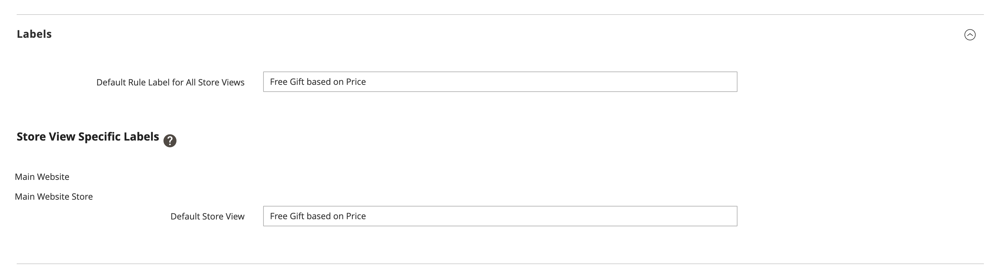

# Kostenlose Geschenkaktion

Die *Gratis-Geschenk*-Aktion ermöglicht es Ihnen, eine [Warenkorb-Preisregel](price-rules-cart.md) festzulegen, die unter bestimmten Bedingungen einen kostenlosen Artikel zum Warenkorb hinzufügt.

>[!NOTE]
>
>Diese Funktion wird in Luma-Storefronts nicht unterstützt. Es ist über [GraphQL](https://developer.adobe.com/commerce/webapi/graphql/schema/cart/mutations/select-free-gift/) zugänglich und in Edge Delivery Services (EDS)-Storefronts verfügbar.

## Erstellen einer kostenlosen Geschenkaktion

In diesem Abschnitt wird beschrieben, wie Sie eine kostenlose Geschenkaktion im folgenden Format erstellen:

**Kaufen Sie X Produkt, erhalten Sie Y Produkt kostenlos**

1. [Erstellen Sie eine Warenkorb-Preisregel](price-rules-cart.md#step-1-add-a-rule) mit einer kostenlosen Geschenkaktion.

1. [Beschreiben Sie die Bedingungen](price-rules-cart.md#step-2-describe-the-conditions) der Warenkorbanweisungen, um die Bedingungen für die Preisregel zu definieren. Dies ist die erste von mehreren Bedingungen, die der Regel hinzugefügt werden können, und bestimmt, wann die Regel ausgelöst wird. Sie kann auf einer Kombination der folgenden Elemente basieren:

   - Produktattribute
   - PRODUCT
   - Warenkorb-Attribute
   - Adobe Commerce-Kundensegmente

   Wenn Sie das Feld leer lassen, wird die Regel für jeden Warenkorb ausgelöst.

   {width="600" zoomable="yes"}

1. Definieren Sie die Aktionen für die Warenkorb-Preisregel:

   1. Erweitern Sie  Abschnitt **[!UICONTROL Actions]** (../assets/icon-display-expand.png) und geben Sie die folgenden Informationen ein:

   - Legen Sie **[!UICONTROL Apply]** auf `Free Gift` fest.
   - Wählen Sie **[!UICONTROL Gift SKU(s)]** eine oder mehrere SKUs aus, die der Kunde als kostenloses Geschenk auswählen kann.
   - **[!UICONTROL Free Gift Discount Type]** auf **[!UICONTROL Price Based]** oder **[!UICONTROL Discount Based]** festlegen.
   - Geben Sie **[!UICONTROL Gift Qty]** die Menge des kostenlosen Geschenks ein, das der Kunde erhält. Geben Sie beispielsweise `2` ein, wenn der Kunde zwei kostenlose Artikel erhalten soll.
   - Um zu verhindern, dass andere Rabatte angewendet werden, setzen Sie **[!UICONTROL Discard subsequent rules]** auf `Yes`.

   1. Klicken Sie auf **[!UICONTROL Save and Continue Edit]** und vervollständigen Sie den Rest der Regel nach Bedarf.

1. [Füllen Sie den Titel &#x200B;](price-rules-cart.md) der Anleitung zur Warenkorbpreisregel aus, um den Titel einzugeben, der während des Checkouts angezeigt wird.

{width="600" zoomable="yes"}

{{new-price-rule}}

1. Wenn Ihre Regel abgeschlossen ist, klicken Sie auf **[!UICONTROL Save Rule]**.

## Varianten

Sie können die Regeln für den Warenkorbpreis auf viele verschiedene Arten anpassen. Die Funktion „Freies Geschenk“ kann mit zwei verschiedenen Rabatttypen konfiguriert werden:

- **Preisbasiert** : Ein Geschenkposten wird zu einem Preis von `0` hinzugefügt.
- **Rabattbasiert** : Auf den Geschenkposten wird ein vollständiger Rabatt angewendet.
