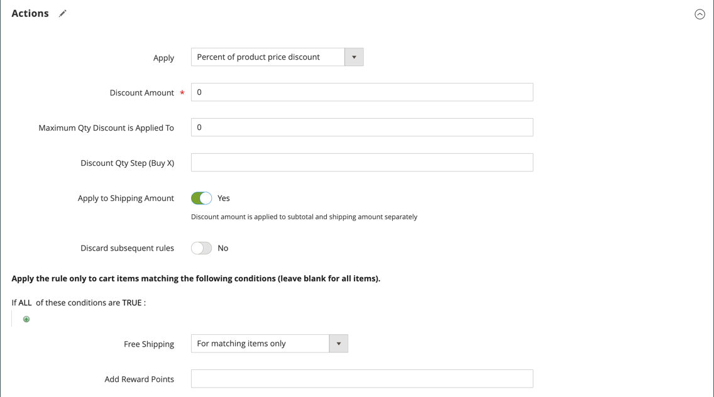

# Beispiel einer Warenkorbpreisregel - kostenlose Versandaktion

Kostenloser Versand kann als Promotion angeboten werden, entweder mit oder ohne [Coupon](price-rules-cart-coupon.md). Ein kostenloser Liefergutschein oder Gutschein kann auch auf Kundenabholaufträge angewendet werden, sodass die Bestellung fakturiert und versandt werden kann, um die [Workflow](../stores-purchase/order-processing.md#order-workflow-and-processing).

Einige Konfigurationen von Versandunternehmen ermöglichen Ihnen, kostenlosen Versand auf Basis einer Mindestbestellung anzubieten. Um diese grundlegende Funktion zu erweitern, können Sie mithilfe von Preisregeln für Warenkorb komplexe Bedingungen erstellen, die auf mehreren Produktattributen, Warenkorbinhalten und Kundengruppen basieren.

## Schritt 1. Kostenlosen Versand aktivieren

1. Aktivieren [kostenloser Versand](../stores-purchase/shipping-free.md) in Ihrer Store-Konfiguration.

1. Füllen Sie die kostenlosen Versandeinstellungen für alle [Trägerdienst](../stores-purchase/carriers.md) die Sie für den kostenlosen Versand verwenden möchten.

## Schritt 2. Erstellen einer Preisregel für den Warenkorb

Im _Admin_ Seitenleiste, navigieren Sie zu **[!UICONTROL Marketing]** > _[!UICONTROL Promotions]_>**[!UICONTROL Cart Price Rules]**.

Gehen Sie wie folgt vor, um die Art der kostenlosen Versandaktion einzurichten, die Sie anbieten möchten.

### Beispiel 1: Kostenloser Versand für jede Bestellung

1. Führen Sie die **[!UICONTROL Rule Information]** wie folgt:

   - Geben Sie einen **[!UICONTROL Rule Name]** für interne Referenzzwecke.
   - Kurzbeschreibung eingeben **[!UICONTROL Description]** , um die Regel zu beschreiben.
   - Satz **[!UICONTROL Active]** nach `Yes`.
   - Im **[!UICONTROL Websites]** wählen Sie jede Website aus, auf der der kostenlose Versand-Coupon verfügbar sein soll.
   - Wählen Sie die **[!UICONTROL Customer Groups]** für die die Regel gilt.
   - Satz **[!UICONTROL Coupon]** auf einen der folgenden Werte zu:
      - Um eine kostenlose Versandaktion ohne Coupon anzubieten, akzeptieren Sie die Standardeinstellung (`No Coupon`).
      - Um einen Gutschein mit der Preisregel zu verwenden, wählen Sie `Specific Coupon`. Führen Sie bei Bedarf die Anweisungen zum Einrichten einer [Coupon](price-rules-cart-coupon.md).

1. Hinunter scrollen und erweitern  die **[!UICONTROL Actions]** und führen Sie folgende Schritte aus:

   - Satz **[!UICONTROL Apply]** nach `Percent of product price discount`.
   - Satz **[!UICONTROL Apply to Shipping Amount]** nach `Yes`.
   - Satz **[!UICONTROL Free Shipping]** nach `For matching items only`.

   {width="600" zoomable="yes"}

### Beispiel 2: Kostenloser Versand für Bestellungen über $

1. Führen Sie die **[!UICONTROL General Information]** -Einstellungen wie im vorherigen Beispiel beschrieben.

1. Hinunter scrollen und erweitern  die **[!UICONTROL Conditions]** Abschnitt.

1. Klicks _Hinzufügen_ (), um eine Bedingung einzufügen, und führen Sie die folgenden Schritte aus:

   - In der Liste unter **[!UICONTROL Cart Attribute]** auswählen `Subtotal`.
   - Klicks **[!UICONTROL is]** und wählen `equals or greater than`.
   - Klicks **...** und geben Sie einen Schwellenwert für die Zwischensumme ein, z. B. `100`, um die Bedingung abzuschließen.

   {width="600" zoomable="yes"}

1. Erweitern Sie ggf.  die **[!UICONTROL Actions]** und führen Sie folgende Schritte aus:

   - Satz **[!UICONTROL Apply]** nach `Percent of product price discount`.
   - Satz **[!UICONTROL Apply to Shipping Amount]** nach `Yes`.
   - Satz **[!UICONTROL Free Shipping]** nach `For matching items only`.

## Schritt 3. Bezeichnungen ausfüllen

Fertig [Schritt 4](price-rules-cart.md) der Preisregel des Warenkorbs, um alle Bezeichnungen einzugeben, die beim Checkout erscheinen.

## Schritt 4. Speichern und testen Sie die Regel

{{new-price-rule}}

1. Klicken Sie nach Abschluss der Regel auf **[!UICONTROL Save Rule]**.

1. Testen Sie die Regel, um sicherzustellen, dass sie ordnungsgemäß funktioniert.
