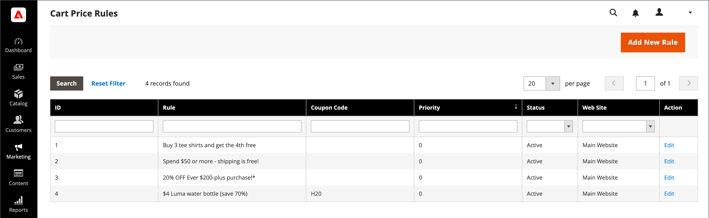

# Warenkorb-Preisregeln

Die Regeln für den Warenkorbpreis wenden Rabatte auf Artikel im Warenkorb an, die auf einer Reihe von Bedingungen basieren. Der Rabatt kann automatisch angewendet werden, wenn die Bedingungen erfüllt sind oder wenn der Kunde einen gültigen Gutscheincode eingibt. Wenn angewendet, wird der Rabatt im Warenkorb unter der Zwischensumme angezeigt. Eine Warenkorb-Preisregel kann bei Bedarf für eine Saison oder Promotion verwendet werden, indem ihr Status und ihr Datumsbereich geändert werden.

>[!NOTE]
>
>Wenn die Warenkorbregel für Coupons Bedingungen enthält, die Checkout-Optionen angeben, z. B. bestimmte Versand- oder Zahlungsmethoden, werden die Bedingungen erst beim Checkout erfüllt, nachdem die spezifischen Versand-/Zahlungsmethoden ausgewählt wurden. In diesem Fall kann der Coupon an der Kasse im letzten Schritt angewendet werden.

{width="600" zoomable="yes"}

## Preisregeln für Warenkorb aufrufen

1. Navigieren Sie in _Admin_-Seitenleiste zu **[!UICONTROL Marketing]** > _[!UICONTROL Promotions]_>**[!UICONTROL Cart Price Rules]**.

   {width="700" zoomable="yes"}

1. Wenn Sie über viele Regeln verfügen, verwenden Sie die Filteroptionen oben in jeder Spalte, um die Liste zu optimieren, und klicken Sie auf **[!UICONTROL Search]** , um die Filter anzuwenden.

1. Um alle Filteroptionen zu löschen und die vollständige Liste anzuzeigen, klicken Sie auf **[!UICONTROL Reset Filter]**.

1. Aktualisieren von Eigenschaften für eine Regel:

   -  (nur Adobe Commerce) Klicken Sie auf **[!UICONTROL Edit]** , um die Seite mit den Regelinformationen anzuzeigen.

   -  (nur Magento Open Source) Klicken Sie auf die Regel in der Liste, um die Seite mit den Regelinformationen anzuzeigen.

   Dort können Sie die Einstellungen für die Regel ändern (ähnlich wie beim Erstellen einer Regel).

## Optionen nach Spalte filtern

| Spalte | Beschreibung |
|--- |--- |
| [!UICONTROL ID] | Geben Sie einen Text ein, um die Liste nach einer bestimmten Regel-ID-Nummer zu filtern. |
| [!UICONTROL Rule] | Geben Sie einen Text ein, um die Liste nach dem Regelnamen zu filtern, der bei der Erstellung der Regel definiert wurde. |
| [!UICONTROL Coupon Code] | Geben Sie einen Text ein, um die Liste nach dem bei der Regelerstellung definierten Codenamen zu filtern. |
| [!UICONTROL Priority] | Ein Freitextfeld, das die Liste nach der für eine Regel definierten Priorität filtert. |
| [!UICONTROL Status] | Verwenden Sie diese Option, um die Liste nach Regelstatus (`Active` oder `Inactive`) zu filtern. |
| [!UICONTROL Web Site] | Verwenden Sie diese Option, um die Liste nach für eine Regel definierten Websites zu filtern. |
| [!UICONTROL Action] |  (nur Adobe Commerce) Klicken Sie auf **[!UICONTROL Edit]**, um die Seite &quot;_[!UICONTROL Rule Information]_&quot; anzuzeigen und die Regeleinstellungen zu aktualisieren (ähnlich wie beim Erstellen einer Regel). |
| [!UICONTROL Start] |  (nur Magento Open Source) Verwenden Sie die dynamischen Kalenderfelder (_[!UICONTROL To:]_und_[!UICONTROL From:]_), um die Liste nach dem Startdatum für die Regel zu filtern, wie es bei der Erstellung der Regel definiert wurde. |
| [!UICONTROL End] |  (nur Magento Open Source) Verwenden Sie die dynamischen Kalenderfelder (_[!UICONTROL To:]_und_[!UICONTROL From:]_), um die Liste nach dem Enddatum für die Regel zu filtern, wie es zum Zeitpunkt der Regelerstellung definiert wurde. |

{style="table-layout:auto"}

## Verwenden Sie Real-Time CDP-Zielgruppen, um die Preisregeln für den Warenkorb zu informieren

Erfahren Sie, wie [ Real-Time CDP](../customers/audience-activation.md)Zielgruppen in Ihrer Adobe Commerce-Instanz aktivieren, um über die Regeln für den Warenkorbpreis zu informieren.
