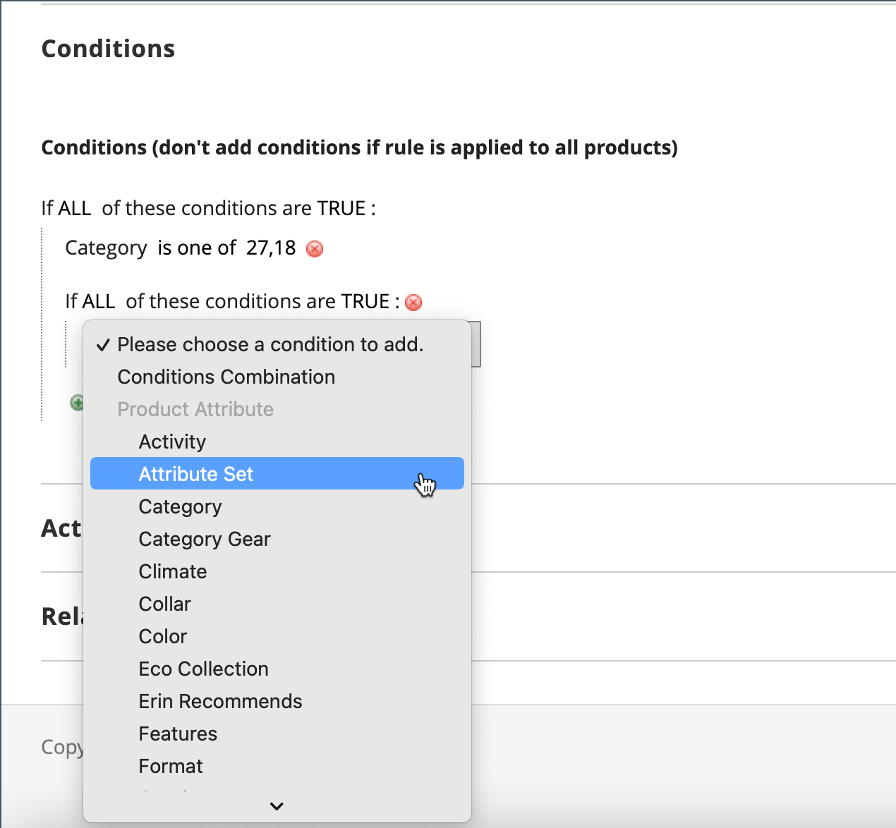
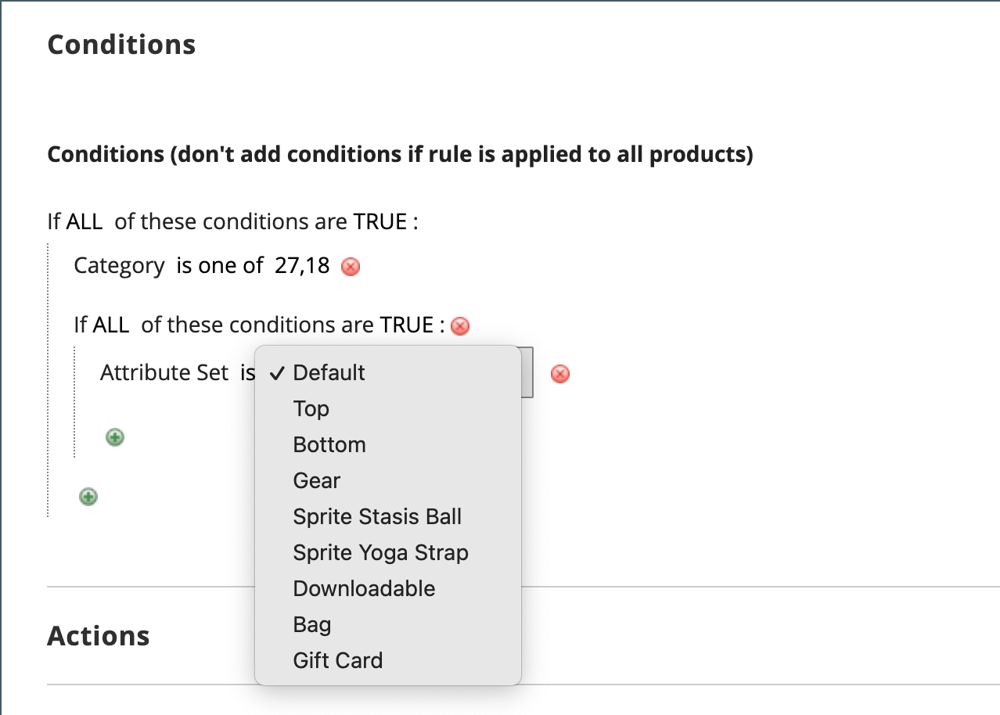
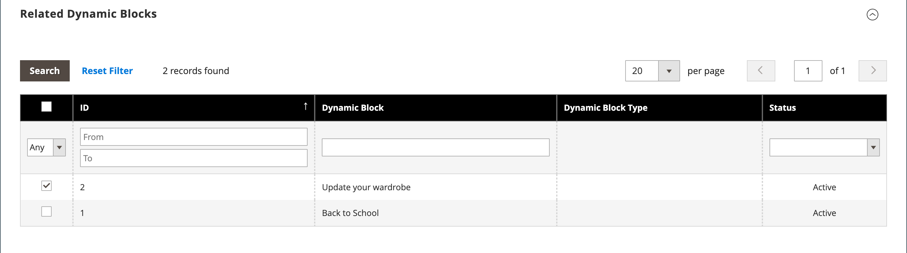
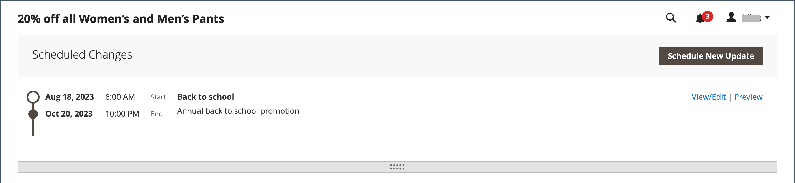

# Erstellen einer Katalogpreisregel

Folgen Sie diesen Anweisungen, um einen Rabatt auf bestimmte Produkte anzuwenden, wenn eine Reihe von Bedingungen erfüllt ist. Die Preisregel für den Katalog tritt in Kraft, bevor das Produkt in den Warenkorb gelegt wird.

## Schritt 1: Regel hinzufügen

1. Navigieren Sie in _Admin_-Seitenleiste zu **[!UICONTROL Marketing]** > _[!UICONTROL Promotions]_>**[!UICONTROL Catalog Price Rule]**.

1. Klicken Sie oben rechts auf **[!UICONTROL Add New Rule]**.

   Der Abschnitt _[!UICONTROL Rule Information]_&#x200B;enthält erweiterbare Abschnitte für **[!UICONTROL Conditions]**&#x200B;und **[!UICONTROL Actions]**.

   {width="700" zoomable="yes"}

1. Füllen Sie die Felder **[!UICONTROL Rule Name]** und **[!UICONTROL Description]** aus.

   Diese Felder dienen nur als interne Referenz.

1. Legen Sie die **[!UICONTROL Status]** der Preisregel nach Bedarf fest.

   Standardmäßig ist der Status `Inactive`.

   Nachdem die Regel erstellt wurde, kann ihr Status aktualisiert werden, indem der Status nach Bedarf in `Active` oder `Inactive` geändert wird.

1. Wählen Sie die **[!UICONTROL Websites]** aus, in der die Regel verfügbar sein soll.

1. Wählen Sie die **[!UICONTROL Customer Groups]** aus, für die diese Regel gilt.

   - Die zur Auswahl verfügbaren Optionen hängen von den Kundengruppen ab, die in _Kunden_ > _Kundengruppen_ erstellt und verwaltet werden.
   - Zur Auswahl mehrerer Gruppen halten Sie die Strg-Taste (PC) bzw. die Befehlstaste (Mac) gedrückt und klicken auf die einzelnen Optionen.

1.  (nur Magento Open Source) Geben Sie **[!UICONTROL From]** und **[!UICONTROL To]** ein, um zu bestimmen, wann die Preisregel in Kraft ist.

   Sie können die Daten eingeben oder die **[!UICONTROL Calendar]** (, um die Daten auszuwählen. Wenn Sie die Datumsangaben leer lassen, wird die Regel beim Speichern der Preisregel aktiviert.

1. Geben Sie eine Zahl ein, um die **[!UICONTROL Priority]** dieser Regel im Verhältnis zu anderen Regeln festzulegen.

   Die **[!UICONTROL Priority]** bestimmt, welche Regel gilt, wenn ein Produkt Bedingungen für mehrere Preisregeln erfüllt. Die Regel mit der höchsten Priorität (niedrigste Zahl, z. B. 0, 1, 2, 3 usw.) wird wirksam.

## Schritt 2: Bedingungen definieren

Die meisten verfügbaren Bedingungen basieren auf vorhandenen Attributwerten. Um die Regel auf alle Produkte anzuwenden, lassen Sie die Bedingungen leer.

- Wenn mindestens ein bedingtes Produktattribut einen leeren Wert aufweist, wird die Katalogpreisregel nicht auf das Produkt angewendet.

- Wenn Sie `[!UICONTROL Category]` Produktattributbedingung zu Paketen oder gruppierten Produkten hinzufügen, wird die Preisregel nur dann korrekt angewendet, wenn alle untergeordneten Elemente dieselbe Kategorie teilen. Wenn die untergeordneten Artikel nicht in derselben Kategorie sind, verwenden Sie stattdessen eine [Warenkorb-Preisregel](price-rules-cart-create.md)-Promotion.“

1. Scrollen Sie nach unten und erweitern Sie  den Abschnitt **[!UICONTROL Conditions]** .

   Die erste Bedingung wird standardmäßig angezeigt und weist folgende Status auf:

   `If **ALL** of these conditions are **TRUE**:`

   {width="400"}

   Die Anweisung enthält zwei fett gedruckte Links, auf die Sie klicken können, um die Auswahl der Optionen für diesen Teil der Anweisung anzuzeigen. Sie können unterschiedliche Bedingungen erstellen, indem Sie die Kombination dieser Werte ändern.

1. Ändern Sie die Anweisung wie folgt:

   - Klicken Sie auf **[!UICONTROL ALL]** und wählen Sie `ALL` oder `ANY` aus.
   - Klicken Sie auf **[!UICONTROL TRUE]** und wählen Sie `TRUE` oder `FALSE` aus.
   - Lassen Sie die Bedingung unverändert, um die Regel auf alle Produkte anzuwenden.

   Sie können unterschiedliche Bedingungen erstellen, indem Sie die Kombination dieser Werte ändern. In diesem Beispiel wird die Standardbedingung verwendet.

1. Klicken Sie auf _Hinzufügen_ () am Anfang der nächsten Zeile und wählen Sie eine Option für die Bedingung aus, z. B. ein Produktattribut oder eine Kombination.

1. Wählen Sie in der Liste unter **[!UICONTROL Product Attribute]** das Attribut aus, das Sie als Grundlage für die Bedingung verwenden möchten.

   Für dieses Beispiel ist die Bedingung `Attribute Set`.

   {width="400"}

   >[!NOTE]
   >
   >Damit ein Attribut in der Liste angezeigt wird, muss es für die Verwendung in Bedingungen für Werberegeln konfiguriert sein. Weitere Informationen finden Sie unter [Produktattribute](../catalog/product-attributes.md).

   >[!NOTE]
   >
   >Wenn Sie die `is not one of` Bedingung mit einem _SKU_-Produktattribut und einem konfigurierbaren Produkt verwenden, müssen sowohl die übergeordneten als auch die untergeordneten Produkt-SKUs ausgewählt werden. Um zu vermeiden, dass alle untergeordneten SKUs in der Regel aufgelistet werden, können Sie die `does not contain` Bedingung mit gemeinsamen SKU-Teilen eines konfigurierbaren Produkts und dessen untergeordneten Produkten verwenden.

   Die ausgewählte Bedingung wird in der Anweisung angezeigt, gefolgt von zwei weiteren fett gedruckten Links. Die Optionen unterscheiden sich je nach dem von Ihnen ausgewählten Bedingungsattribut. In der Erklärung heißt es jetzt:

   `If **ALL** of these conditions are **TRUE**:  Attribute Set **is** …`

1. Klicken Sie auf **[!UICONTROL is]** und wählen Sie den Vergleichsoperator aus, der die zu erfüllende Bedingung beschreibt.

   Diese Optionen können eine Option für verschiedene Vergleiche enthalten. In diesem Beispiel sind die Optionen `is` und `is not`.

1. Wählen Sie Werte für die Bedingung aus oder geben Sie Werte ein.

   Je nach Bedingung können Sie Produkte aus einem Raster oder einer Liste auswählen, einen numerischen Wert eingeben usw.

   {width="400"}

   Das ausgewählte Element wird in der Anweisung angezeigt, um die Bedingung abzuschließen.

   `If **ALL** of these conditions are **TRUE**:   Attribute Set **is Default**`

1. Um eine weitere Bedingungszeile zur Anweisung hinzuzufügen, klicken Sie auf das Symbol _Hinzufügen_ () und wählen Sie eine der folgenden Optionen aus:

   - `Conditions Combination`
   - `Product Attribute`

   Wiederholen Sie diesen Vorgang, bis alle gewünschten Bedingungen erfüllt sind.

   Wenn Sie zu irgendeinem Zeitpunkt einen Teil der Bedingungsanweisung löschen möchten, klicken Sie auf das **[!UICONTROL Delete]** ( am Ende der Zeile.

## Schritt 3: Definieren der Aktionen

1. Erweitern Sie  den Abschnitt **[!UICONTROL Actions]** und führen Sie folgende Schritte aus:

   {width="600" zoomable="yes"}

1. Legen Sie **[!UICONTROL Apply]** unter **[!UICONTROL Pricing Structure Rules]** auf eine der folgenden Einstellungen fest:

   - `Apply as percentage of original` - Rabattposition durch Abzug eines Prozentsatzes vom regulären Preis. Beispiel: Geben Sie 10 als Rabattbetrag für einen Endpreis ein, der um 10 % unter dem regulären Preis liegt.
   - `Apply as fixed amount` - Rabattposten durch Abzug eines festen Betrags vom regulären Preis. Beispiel: Geben Sie 10 als Rabattbetrag für einen Endpreis ein, der 10 $ unter dem regulären Preis liegt.
   - `Adjust final price to this percentage` - Passt den Endpreis um einen Prozentsatz des regulären Preises an. Beispiel: Geben Sie 25 als Rabattbetrag ein, um einen Endpreis zu erhalten, der um 75 % unter dem regulären Preis liegt.
   - `Adjust final price to discount value` - Setzt den Endpreis auf einen festen, diskontierten Betrag. Beispiel: Geben Sie 20 als Rabattbetrag für einen Endpreis von 20,00 € ein.

   >[!NOTE]
   >
   >Um Festbetragsrabatte einheitlich auf Websites mit unterschiedlichen Währungen anzuwenden (ohne von der globalen Basiswährung zu konvertieren), setzen Sie die Option **[!UICONTROL Catalog Price Scope]** auf `Website` und definieren Sie eine Basiswährung für jede Website.

   >[!NOTE]
   >
   >_Regulärer Preis_ bezieht sich auf den Basispreis des Produkts ohne Vorzugspreise (Sonder-/Stufen-/Gruppenrabatte) oder Werberabatte. _Endpreis_ bezieht sich auf den ermäßigten Preis, der im Warenkorb angezeigt wird.  Der **_Endprodukt_** Preis wird als **_Mindestpreis)_** folgender Formel berechnet:  `Final Price=Min(Regular(Base) Price, Group(Tier) Price, Special Price, Catalog Price Rule) + Sum(Min Price per each required custom option)`

   >[!NOTE]
   >
   >**_Festpreis_** Anpassbare Produktoptionen werden _nicht_ durch Gruppenpreis-, Stufenpreis-, Sonderpreis- oder Katalogpreisregeln beeinflusst.

1. Geben Sie die **[!UICONTROL Discount Amount]** ein.

1. Um die Verarbeitung anderer Regeln nach der Anwendung dieser Regel zu stoppen, setzen Sie **[!UICONTROL Discard Subsequent Rules]** auf `Yes`.

   Wenn Sie diesen Wert auf `Yes` setzen, verhindern Sie, dass das System mehrere Rabatte (Regeln) auf dasselbe Produkt anwendet.

## Schritt 4: Zugehörige dynamische Blöcke hinzufügen

{{ee-feature}}

[Dynamische Blöcke](../content-design/dynamic-blocks.md) die mit einer Katalogpreisregel verknüpft sind, werden in der Storefront angezeigt, wenn die Bedingungen erfüllt sind. Dies ist ein optionaler Schritt.

1. Erweitern Sie  den Abschnitt **[!UICONTROL Related Dynamic Blocks]** .

1. Verwenden Sie die [Suchfilter](../getting-started/admin-workspace.md) um die dynamischen Blöcke zu finden, die Sie mit der Regel verknüpfen möchten.

1. Aktivieren Sie das Kontrollkästchen in der ersten Spalte, um den dynamischen Block mit der Regel zu verknüpfen.

   {width="600" zoomable="yes"}

1. Klicken Sie auf **[!UICONTROL Save and Continue Edit]**.

## Schritt 5: Regel planen

{{ee-feature}}

>[!NOTE]
>
>Das Festlegen der Regel auf „aktiv“ muss als geplante Aktualisierung hinzugefügt werden. Weitere Informationen finden Sie unter [Geplante Änderungen](price-rule-catalog-scheduled-changes.md).

1. Klicken _im Feld „Geplante_&quot; oben im Feld auf &quot;**[!UICONTROL Schedule New Update]**&quot;.

   Wenn die Regel bereits über eine geplante Aktualisierung verfügt, können Sie rechts neben der aufgelisteten Änderung auf **[!UICONTROL View/Edit]** klicken.

   Sie können entweder die vorhandene Aktualisierung bearbeiten oder die Katalogpreisregel einer anderen Kampagne zuweisen. Die Option **Vorhandenes Update bearbeiten** ist standardmäßig ausgewählt.

1. Um die Regel zu planen, geben Sie die **[!UICONTROL Start Date]** ein und **[!UICONTROL End Date]** Sie, dass die Preisregel aktiv sein soll.

   Sie können die Daten entweder eingeben oder die Daten aus dem _Kalender_ auswählen ().

   {width="600" zoomable="yes"}

1. Klicken Sie auf **[!UICONTROL Save]**.

1. Legen _im Abschnitt &quot;_&quot; den **[!UICONTROL Status]** auf `active` fest.

## Schritt 6: Speichern und Testen der Regel

1. Wenn Sie fertig sind, speichern Sie die Regel.

   -  (nur Magento Open Source) Klicken Sie auf **[!UICONTROL Save and Apply]**.

   -  (nur Adobe Commerce) Klicken Sie auf **[!UICONTROL Save]**.

     Auf der Seite „Regelinformationen“ wird eine aktualisierte Zeitleiste in den geplanten Änderungen für die Regel angezeigt.

     {width="600" zoomable="yes"}

1. Aktualisieren von Eigenschaften für eine Regel:

   -  (nur Adobe Commerce) Klicken Sie auf **[!UICONTROL Edit]** , um die _[!UICONTROL Rule Information]_&#x200B;anzuzeigen.

   -  (nur Magento Open Source) Klicken Sie auf die Regel in der Liste, um die _[!UICONTROL Rule Information]_&#x200B;anzuzeigen.

1. Testen Sie die Regel, um sicherzustellen, dass sie korrekt funktioniert.

   Preisregeln werden jede Nacht automatisch mit anderen Systemregeln verarbeitet. Wenn Sie eine Preisregel erstellen, lassen Sie ausreichend Zeit, damit sie in das System aufgenommen wird, bevor Sie die Regel testen, um ihre ordnungsgemäße Funktionsweise sicherzustellen. Mit der Einführung neuer Regeln berechnet Commerce die Preise und Prioritäten entsprechend neu.

## Demo zur Katalogpreisregel

In diesem Video erfahren Sie mehr über das Erstellen von Katalogpreisregeln:

>[!VIDEO](https://video.tv.adobe.com/v/343834?quality=12&learn=on)

## Feldbeschreibungen

### [!UICONTROL Rule Information]

| Feld | Beschreibung |
|-----|-----------|
| [!UICONTROL Rule name] | (Erforderlich) Der Name der Regel dient als interne Referenz. |
| [!UICONTROL Description] | Eine Beschreibung der Regel sollte den Zweck der Regel enthalten und erläutern, wie sie verwendet wird. |
| [!UICONTROL Websites] | (Erforderlich) Gibt die Websites an, auf denen die Regel verwendet werden kann. |
| [!UICONTROL Customer Groups] | (Erforderlich) Identifiziert die Kundengruppen, für die die Regel gilt. |
| [!UICONTROL Priority] | Eine Zahl, die die Priorität dieser Regel im Verhältnis zu anderen angibt. Die Prioritäten von der höchsten zur niedrigsten sind `0,1,2,3...` |
| [!UICONTROL Status] |  (nur Magento Open Source) Bestimmt, ob die Regel im Store aktiv ist. Optionen: `Yes` / `No` |
| [!UICONTROL From] |  (nur Magento Open Source) Gibt den ersten Tag an, an dem die Preisregel in Kraft ist. Wenn Sie das Feld leer lassen, wird die Preisregel beim Speichern wirksam. |
| [!UICONTROL To] |  (nur Magento Open Source) Gibt den letzten Tag an, an dem die Preisregel in Kraft ist. Wenn dies leer gelassen wird, wird die Preisregel auf unbestimmte Zeit fortgesetzt. |

{style="table-layout:auto"}

### [!UICONTROL Conditions]

Gibt die Bedingungen an, die erfüllt sein müssen, bevor die Katalogpreisregel in Kraft tritt. Wenn Sie das Feld leer lassen, gilt die Regel für alle Produkte.

### [!UICONTROL Actions]

| Feld | Beschreibung |
|-----|-----------|
| [!UICONTROL Apply] | Bestimmt die Art der Berechnung, die auf den Kauf angewendet wird. Optionen:  **[!UICONTROL Apply as percentage of original]**- Rabattartikel durch Subtraktion eines Prozentsatzes vom regulären Preis. **[!UICONTROL Apply as fixed amount]** - Rabattposten durch Abzug eines festen Betrags vom regulären Preis.  **[!UICONTROL Adjust final price to this percentage]**- Passt den Endpreis um einen Prozentsatz des regulären Preises an. **[!UICONTROL Adjust final price to discount value]** - Setzt den Endpreis auf einen festen, diskontierten Betrag.   **_Hinweis _**&#x200B;Der reguläre Preis bezieht sich auf den Basispreis des Produkts ohne Vorzugspreise (Sonderpreis/Stufe/Gruppe) oder Rabatte auf Werbeaktionen. Der Endpreis bezieht sich auf den ermäßigten Preis, der im Warenkorb angezeigt wird.  Der&#x200B;**_Endprodukt _**&#x200B;Preis wird als&#x200B;**_Mindestpreis)_**&#x200B;folgender Formel berechnet:  `Final Price=Min(Regular(Base) Price, Group(Tier) Price, Special Price, Catalog Price Rule) + Sum(Min Price per each required custom option)` |
| [!UICONTROL Discount Amount] | (Erforderlich) Der Rabattbetrag, der angeboten wird. |
| [!UICONTROL Discard Subsequent Rules] | Legt fest, ob zusätzliche Regeln auf diesen Kauf angewendet werden können. Um zu verhindern, dass mehrere Rabatte auf denselben Kauf angewendet werden, wählen Sie `Yes` aus. Optionen: `Yes` / `No` |

{style="table-layout:auto"}

### [!UICONTROL Related Dynamic Blocks]

{{ee-feature}}

Identifiziert alle [dynamischen Blöcke](../content-design/dynamic-blocks.md), die mit der Regel verknüpft sind.
