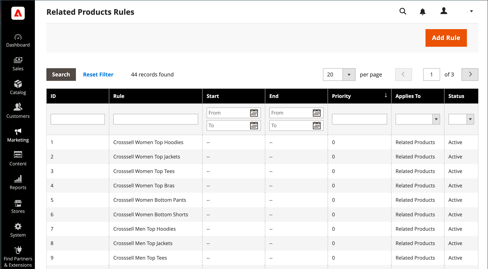

# Zugehörige Produktregeln (Zielregeln)

{{ee-feature}}

Mit verwandten Produktregeln können Sie die Auswahl von Produkten auswählen, die Kunden als verwandte Produkte, Upsells und Querverkäufe präsentiert werden. Jede Produktregel kann mit einem [Kundensegment](../customers/customer-segments.md) verknüpft werden, um eine dynamische Anzeige zielgerichteter Merchandising-Aktionen zu erzeugen.

Da mehrere aktive Regeln gleichzeitig ausgelöst werden können, können Sie für jede Regel eine Priorität festlegen. Sie definiert die Reihenfolge, in der Regeln angewendet und Produkte auf der Seite angezeigt werden.

Um auf die zugehörigen Produktregeln zuzugreifen, gehen Sie zu &quot;**[!UICONTROL Marketing]**&quot;> &quot;_[!UICONTROL Promotions]_&quot;> &quot;**[!UICONTROL Related Product Rules]**&quot;.

{width="700" zoomable="yes"}

## Spaltenbeschreibungen

| Spalte | Beschreibung |
|--- |--- |
| [!UICONTROL ID] | Eine eindeutige numerische Kennung, die jeder zugehörigen Produktregel zugewiesen ist |
| [!UICONTROL Rule] | Der Name der zugehörigen Produktregel |
| [!UICONTROL Start] | Verwenden Sie die dynamischen Kalenderfelder (_[!UICONTROL To:]_und_[!UICONTROL From:]_), um die Liste nach dem Startdatum für die Regel zu filtern, das bei der Erstellung der Regel definiert wurde. |
| [!UICONTROL End] | Verwenden Sie die dynamischen Kalenderfelder (_[!UICONTROL To:]_und_[!UICONTROL From:]_), um die Liste nach dem Enddatum für die Regel zu filtern, das bei der Regelerstellung definiert wurde. |
| [!UICONTROL Priority] | Geben Sie Text in dieses Feld ein, um die Liste nach der für eine Regel definierten Priorität zu filtern. |
| [!UICONTROL Applies To] | Diese Option filtert die Liste der Regeln, die für `Related Products`, `Up-sells` und `Cross-sells` gelten. |
| [!UICONTROL Status] | Verwenden Sie diese Option, um die Liste nach Regelstatus (`Active` oder `Inactive`) zu filtern. |

{style="table-layout:auto"}

## Regelpriorität

Es kann jederzeit mehrere aktive Regeln geben, die ausgelöst werden können, um verwandte Produkte, Upsells und Querverkäufe anzuzeigen. Die Priorität jeder Regel bestimmt die Reihenfolge, in der die Produkte auf der Seite angezeigt werden. Der Wert kann auf eine beliebige Ganzzahl eingestellt werden, wobei `1` die höchste Priorität hat.

Die Anzahl der Produkt-IDs, die in eine Regel für Produktbeziehungen aufgenommen werden können, wird durch den Wert `Result Limit` bestimmt, der maximal 20 beträgt. Der Wert `Result Limit` wird in Kombination mit dem Wert `Configurable Maximum` für die spezifische regelbasierte Produktwerbung zum Wert `Real Limit` und bestimmt die tatsächliche Anzahl der übereinstimmenden Produkte, die in der Liste angezeigt werden können.

[Ergebnislimit] + [Konfigurierbares Maximum] = [reales Limit]

Angenommen, Sie haben drei Regeln mit der Priorität `1`, `2` und `3`.

- Es werden zwei übereinstimmende Produkte für _Regel 1_, sechs passende Produkte für _Regel 2_ und 20 passende Produkte für _Regel 3_ zurückgegeben.
- In der Konfiguration wird _[!UICONTROL Maximum Number of Products for Related Products List]_auf `6` gesetzt.

  | Regeln | Priorität | Übereinstimmende Produkte |
  |---|---|-----|
  | Regel 1 | `1` | `2` |
  | Regel 2 | `2` | `6` |
  | Regel 3 | `3` | `20` |

Wenn die erste Regel mehr übereinstimmende Produkte zurückgibt, als durch das konfigurierbare Maximallimit _erlaubt sind, jedoch weniger als das tatsächliche Limit_ 3}, werden die übereinstimmenden Produkte aus den anderen Regeln verwendet (in der Reihenfolge der Priorität), bis das tatsächliche Limit _5} erreicht ist.___

Die von _Regel 1_ zurückgegebenen übereinstimmenden Produkte können mit Priorität zuerst alle 26 verfügbaren Slots ausgefüllt werden. Da Regel 1 nur zwei übereinstimmende Produkte zurückgab, sind noch 24 weitere Produkte möglich. _Regel 2_ hat die nächsthöhere Priorität und gibt sechs weitere übereinstimmende Produkte zurück. Es stehen nun 18 Slots zur Verfügung, die ausgefüllt werden können. _Regel 3_ hat die nächste Priorität, mit genügend passenden Produkten, um die verbleibenden 18 Slots zu füllen. Wenn alle verfügbaren Slots ausgefüllt sind und je nach eingestelltem Rotationsmodus Produkte innerhalb jeder Priorität nach ID gemischt oder geordnet werden und dann auf das konfigurierbare Limit reduziert werden. In diesem Fall erscheinen die restlichen sechs Produkte im Laden.

>[!NOTE]
>
>Die ausgewählten Produkte werden unabhängig vom Rotationsmodus immer vor den regelbasierten Produkten angezeigt.

## Regelbasierte Produktbeziehungen konfigurieren

Das Verhalten von Regeln für Produktbeziehungen und die Anzeige übereinstimmender Produkte wird durch die Konfigurationseinstellungen bestimmt. Diese Einstellungen bestimmen, wie viele der Produkte, die der Regel entsprechen, angezeigt werden können und in welcher Reihenfolge sie angezeigt werden.

1. Wechseln Sie in der Seitenleiste _Admin_ zu **[!UICONTROL Stores]** > _[!UICONTROL Settings]_>**[!UICONTROL Configuration]**.

1. Erweitern Sie im Bedienfeld auf der linken Seite **[!UICONTROL Catalog]** und wählen Sie danach **[!UICONTROL Catalog]** darunter.

1. Erweitern Sie den Abschnitt **[!UICONTROL Rules-Based Product Relations]** um .

   {width="600" zoomable="yes"}

1. Geben Sie den Wert **[!UICONTROL Maximum Number of Products in the Related Products List]** ein.

1. Setzen Sie **[!UICONTROL Show Related Products]** auf einen der folgenden Werte:

   - `Both Selected and Rule Based`
   - `Selected Only`
   - `Rule-Based Only`

1. Setzen Sie **[!UICONTROL Rotation Mode for Products in Related Product List]** auf einen der folgenden Werte:

   - `By Priority, Then by ID`
   - `By Priority, Then Random`
   - `Weighted Random`

1. Gehen Sie wie folgt vor, um die Cross-Sell-Produkteinstellungen abzuschließen:

   - Geben Sie den Wert **[!UICONTROL Maximum Number of Products in the Cross-Sell Product List]** ein.

   - Setzen Sie **[!UICONTROL Show Cross-Sell Products]** auf einen der folgenden Werte:

      - `Both Selected and Rule Based`
      - `Selected Only`
      - `Rule-Based Only`

   - Setzen Sie **[!UICONTROL Rotation Mode for Products in Cross-Sell Product List]** auf einen der folgenden Werte:

      - `By Priority, Then by ID`
      - `By Priority, Then Random`
      - `Weighted Random`

1. Gehen Sie wie folgt vor, um die Upsell-Produkteinstellungen abzuschließen:

   - Geben Sie den Wert **[!UICONTROL Maximum Number of Products in the Upsell Product List]** ein.

   - Setzen Sie **[!UICONTROL Show Upsell Products]** auf einen der folgenden Werte:

      - `Both Selected and Rule Based`
      - `Selected Only`
      - `Rule-Based Only`

   - Setzen Sie **[!UICONTROL Rotation Mode for Products in Upsell Product List]** auf einen der folgenden Werte:

      - `By Priority, Then by ID`
      - `By Priority, Then Random`
      - `Weighted Random`

1. Klicken Sie nach Abschluss des Vorgangs auf **[!UICONTROL Save Config]**.

### Drehmodi

| Modus | Beschreibung |
|---|---|
| [!UICONTROL By Priority, Then by ID] | Produkte werden nach Priorität sortiert und dann innerhalb jeder Priorität nach Kennung neu angeordnet. Produkte aus der Regel mit niedrigerer Priorität werden nur angezeigt, wenn sie keine Produkte sind, die von der Regel mit höherer Priorität zum Ausfüllen der verfügbaren Slots übrig bleiben. |
| [!UICONTROL By Priority, Then Random] | Produkte werden nach Priorität sortiert und dann in jede Priorität randomisiert. Produkte aus der Regel mit niedrigerer Priorität werden nur angezeigt, wenn sie keine Produkte sind, die von der Regel mit höherer Priorität zum Ausfüllen der verfügbaren Slots übrig bleiben. |
| [!UICONTROL Weighted Random] | Produkte werden randomisiert, sodass Produkte, die zu einer Regel mit höherer Priorität gehören, mit höherer Wahrscheinlichkeit angezeigt werden als Produkte, die zu einer Regel mit niedrigerer Priorität gehören. Die Produkte werden dann auf die konfigurierbare Höchstgrenze reduziert und nach Priorität wieder gruppiert. Dieser Modus bietet die Möglichkeit, dass Produkte mit niedrigerer Priorität manchmal auch dann angezeigt werden, wenn die verbleibenden Slots mit Produkten aus einer Regel mit höherer Priorität gefüllt werden können |

{style="table-layout:auto"}

## Verwenden von Real-Time CDP-Zielgruppen zur Information verwandter Produktregeln

>[!NOTE]
>
>Diese Funktion befindet sich in der Beta-Phase. Wenn Sie dem Betaprogramm beitreten möchten, senden Sie eine Anfrage an [dataconnection@adobe.com](mailto:dataconnection@adobe.com).

Erfahren Sie, wie Sie Real-Time CDP-Zielgruppen [aktivieren](../customers/audience-activation.md) in Ihrer Adobe Commerce-Instanz aktivieren, um zugehörige Produktregeln zu informieren.
