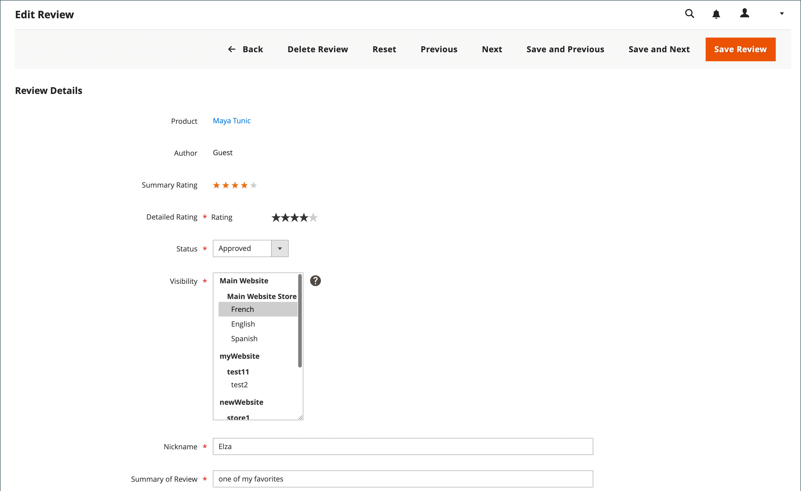

# Moderate Produktbewertungen

Für Commerce-Produktüberprüfungen muss eine gesendete Produktüberprüfung genehmigt werden, bevor sie angezeigt werden kann. Dadurch wird sichergestellt, dass Bewertungen für die öffentliche Präsentation Ihres Stores geeignet sind. Eine gesendete Überprüfung hat den Status &quot;`Pending`&quot;, bis sie genehmigt oder abgelehnt wird.

## Produktbewertungen im Admin-Bereich anzeigen

Gehen Sie wie folgt vor, um alle Bewertungen für ein bestimmtes Produkt in Admin anzuzeigen:

1. Navigieren Sie in der _Admin_-Seitenleiste zu **[!UICONTROL Catalog]** > **[!UICONTROL Products]**.

1. Suchen Sie das Produkt, das Sie anzeigen möchten, und klicken Sie in der Spalte _[!UICONTROL Action]_&#x200B;auf **[!UICONTROL Edit]**.

1. Scrollen Sie auf der Produktseite nach unten und erweitern Sie  den Abschnitt **[!UICONTROL Product Reviews]** .

   In diesem Raster können Sie die spezifische Überprüfung auch ändern, indem Sie auf den Link **[!UICONTROL Edit]** in der Spalte _[!UICONTROL Action]_&#x200B;klicken.

## Aktualisierungsstatus für Überprüfungen

1. Navigieren Sie in _Admin_-Seitenleiste zu **[!UICONTROL Marketing]** > _[!UICONTROL User Content]_>**[!UICONTROL Pending Reviews]**&#x200B;oder **[!UICONTROL All Reviews]**.

1. Klicken Sie in der Liste auf eine ausstehende Überprüfung, um die Details anzuzeigen und bei Bedarf zu bearbeiten.

1. Ändern Sie die **[!UICONTROL Status]** entsprechend Ihrer Bewertung:

   - Um eine ausstehende Überprüfung zu genehmigen, wählen Sie `Approved` aus.

   - Um eine Überprüfung abzulehnen, wählen Sie `Not Approved` aus. Nicht genehmigte Reviews verschwinden aus der Liste _[!UICONTROL Pending Reviews]_&#x200B;Seite.

   >[!NOTE]
   >
   >Überprüfungen mit dem Status `Pending` und `Not Approved` werden nicht in der Storefront angezeigt.

1. Legen Sie ggf. den **[!UICONTROL Visibility]** einer Produktüberprüfung für das Erscheinen in verschiedenen Store-Ansichten fest.

1. Ändern Sie bei Bedarf die Werte für **[!UICONTROL Detailed Rating]**, **[!UICONTROL Nickname]** und **[!UICONTROL Summary of Review]**.

   Um die Store-Ansicht zu ändern, in der eine Überprüfung verfügbar ist, wählen Sie die gewünschte Store-Ansicht in der Spalte _[!UICONTROL Visibility]_&#x200B;aus.

   {width="600" zoomable="yes"}

1. Klicken Sie abschließend auf **[!UICONTROL Save Review]**.

## Batch-Aktualisierung

Sie können mehrere Reviews gleichzeitig aktualisieren oder löschen:

1. Navigieren Sie in _Admin_-Seitenleiste zu **[!UICONTROL Marketing]** > _[!UICONTROL User Content]_>**[!UICONTROL All Reviews]**.

1. Wählen Sie die Bewertungen aus, die Sie aktualisieren möchten.

1. Verwenden Sie die _[!UICONTROL Action]_&#x200B;oben links, um eine Aktion anzuwenden.

1. **[!UICONTROL Submit]** klicken

## Löschen einer Produktüberprüfung

1. Navigieren Sie in _Admin_-Seitenleiste zu **[!UICONTROL Marketing]** > _[!UICONTROL User Content]_>**[!UICONTROL All Reviews]**.

1. Suchen Sie die zu löschende Produktüberprüfung und öffnen Sie sie im Bearbeitungsmodus.

1. Klicken Sie in der Menüleiste auf **[!UICONTROL Delete Review]** Schaltfläche.

1. Um die Aktion zu bestätigen, klicken Sie auf **[!UICONTROL OK]**.

## Schaltflächenleiste

| Schaltfläche | Beschreibung |
|----------|--------------|
| **[!UICONTROL Back]** | Kehrt zur Seite Überprüfungen zurück, ohne die Änderungen zu speichern |
| **[!UICONTROL Delete Review]** | Löscht die Überprüfung |
| **[!UICONTROL Reset]** | Setzt alle nicht gespeicherten Änderungen im Überprüfungsformular auf ihre vorherigen Werte zurück |
| **[!UICONTROL Previous]** | Öffnet die vorherige Überprüfung |
| **[!UICONTROL Next]** | Öffnet die nächste Überprüfung |
| **[!UICONTROL Save and Previous]** | Speichert aktuelle Änderungen und öffnet die vorherige Überprüfung. Diese Schaltfläche wird angezeigt, wenn andere Reviews vorhanden sind. |
| **[!UICONTROL Save and Next]** | Speichert die aktuellen Änderungen und öffnet die nächste Ansicht. Diese Schaltfläche wird angezeigt, wenn andere Reviews vorhanden sind. |
| **[!UICONTROL Save Review]** | Speichert Änderungen und schließt die Bearbeitungsseite für die Überprüfung |
