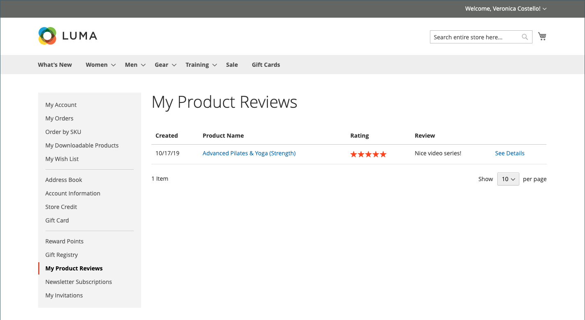

# Produktbewertungen

Produktbewertungen tragen dazu bei, ein Gemeinschaftsgefühl aufzubauen, und werden als glaubwürdiger angesehen, als jedes Werbegeld kaufen kann. Tatsächlich geben einige Suchmaschinen Sites mit Produktbewertungen ein höheres Ranking als die ohne. Für diejenigen, die Ihre Site durch die Suche nach einem bestimmten Produkt finden, ist eine Produktbewertung im Wesentlichen die Landingpage Ihres Stores. Produktbewertungen helfen Kunden, Ihren Laden zu finden, sie bei der Stange zu halten und führen oft zum Verkauf.

Commerce enthält eine native Funktion zur Produktüberprüfung, die Sie über den Administrator verwalten können. Sie können auch eine Erweiterung aus der [Commerce Marketplace](../getting-started/commerce-marketplace.md) verwenden, um ein gehostetes Überprüfungsverwaltungssystem zu verwenden.

>[!NOTE]
>
>Die Versionen 2.4.0 bis 2.4.3 von Adobe Commerce und Magento Open Source enthielten die vom Yotpo-Anbieter entwickelte Erweiterung. Ab Version 2.4.4 ist diese Erweiterung nicht mehr im Bundle der Hauptversion enthalten und muss von der Commerce Marketplace installiert und aktualisiert werden. Der Marketplace bietet außerdem Zugriff auf die aktuelle Dokumentation, die vom Erweiterungsentwickler bereitgestellt wird.
>>  
>>Wenn Sie die gebündelte Erweiterung aktiviert und konfiguriert haben, müssen Sie Ihre Datei „composer.json“ im Rahmen des Upgrade-Prozesses auf 2.4.4 aktualisieren, um zukünftige Erweiterungs-Updates zu verwalten. Siehe [Upgrade-Module](https://experienceleague.adobe.com/docs/commerce-operations/upgrade-guide/modules/upgrade.html) im _Upgrade-Handbuch_ für weitere Informationen.

## Produktbewertungen in der Storefront

Wenn die native Funktion für Produktbewertungen aktiviert ist, können Kunden für jedes Produkt in Ihrem Katalog Bewertungen schreiben. Bewertungen können über die Produktseite geschrieben werden, indem Sie auf Folgendes klicken:

- **Fügen Sie Ihre Bewertung** für Produkte mit vorhandenen Bewertungen hinzu.

- **Seien Sie der erste, der dieses Produkt bewertet** für Produkte ohne bestehende Bewertungen.

Auf der Registerkarte [!UICONTROL Reviews] werden alle aktuellen Überprüfungen und das Formular aufgelistet, das zum Senden einer Überprüfung verwendet wurde.

Ihre Konfiguration bestimmt, ob Kundinnen und Kunden ein Konto bei Ihrem Store eröffnen müssen, bevor sie Produktbewertungen schreiben, oder ob sie Bewertungen als Gäste senden können. Die Anforderung, dass Überprüfende ein Konto eröffnen müssen, verhindert anonyme Übermittlungen und verbessert die Qualität der Überprüfungen.

{width="700" zoomable="yes"}

Die Anzahl der Sterne gibt die Zufriedenheitsbewertung des Produkts an. Besucher können auf den Link klicken, um die Rezensionen zu lesen und ihre eigenen zu schreiben. Als Anreiz können Kunden Prämienpunkte für die Einreichung einer Bewertung erhalten. Wenn eine Überprüfung eingereicht wird, wird sie zur Moderation an den Administrator gesendet. Nach der Genehmigung wird die Überprüfung in Ihrem Store veröffentlicht.

{width="700" zoomable="yes"}

### [!UICONTROL My Product Reviews]

Im Abschnitt _[!UICONTROL My Product Reviews]_des Kundenkonto-Dashboards werden alle vom Kunden eingereichten und zur Veröffentlichung genehmigten Bewertungen aufgelistet. Jede Überprüfungszusammenfassung enthält das Datum, an dem die Überprüfung eingereicht wurde, Links zur Produktseite und Details zur Überprüfung.

{width="700" zoomable="yes"}

1. In der Seitenleiste seines Kontos wählt der Kunde **[!UICONTROL My Product Reviews]** aus.

1. Um die vollständige Überprüfung anzuzeigen, klicken Sie auf **[!UICONTROL See Details]**.

   {width="700" zoomable="yes"}

## Produktüberprüfungsfunktionen aktivieren

Die Commerce-Produktüberprüfungsfunktion ist standardmäßig aktiviert.

>[!NOTE]
>
>Um diese Felder zum `No` und Deaktivieren von Commerce-Produktüberprüfungen festzulegen, müssen Sie die Kontrollkästchen **Systemwert verwenden** deaktivieren.

1. Navigieren Sie in _Admin_-Seitenleiste zu **[!UICONTROL Stores]** > _[!UICONTROL Settings]_>**[!UICONTROL Configuration]**.

1. Erweitern Sie im linken Bereich **[!UICONTROL Catalog]** und wählen Sie darunter **[!UICONTROL Catalog]** aus.

1. Erweitern Sie  den Abschnitt **[!UICONTROL Product Reviews]** .

   {width="600" zoomable="yes"}

1. Legen Sie **[!UICONTROL Enabled]** auf `Yes` fest.

   Dies ist die Standardeinstellung, die Produktüberprüfungen ermöglicht.

1. Legen Sie **[!UICONTROL Allow Guests to Write Reviews]** auf `Yes` fest.

   Dies ist die Standardeinstellung, die bestimmt, ob Kunden ein Konto bei Ihrem Geschäft eröffnen müssen, um Produktbewertungen schreiben zu können.

1. Klicken Sie abschließend auf **[!UICONTROL Save Config]**.

## Erstellen benutzerdefinierter Bewertungen

Mit den Commerce-Produktbewertungen können Kunden Bewertungen zuweisen, wenn sie eine Produktbewertung senden. Die Standardbewertungen sind Qualität, Preis und Wert. Darüber hinaus können Sie Ihre eigenen benutzerdefinierten Bewertungen hinzufügen. Die fünf Sterne, die auf Katalogseiten angezeigt werden, werden für jedes Produkt gemittelt.

{width="700" zoomable="yes"}

1. Navigieren Sie in _Admin_-Seitenleiste zu **[!UICONTROL Stores]** > _[!UICONTROL Attributes]_>**[!UICONTROL Rating]**.

1. Klicken Sie oben rechts auf **[!UICONTROL Add New Rating]**.

   {width="700" zoomable="yes"}

1. Geben Sie im Abschnitt _[!UICONTROL Rating Title]_die **[!UICONTROL Default Value]**für die neue Bewertung ein.

   Geben Sie gegebenenfalls auch die Übersetzung für jede Shop-Ansicht ein.

   {width="600" zoomable="yes"}

1. Legen _im Abschnitt „Rating_ Sichtbarkeit“ **[!UICONTROL Visibility In]** auf die Store-Ansicht fest, in der die Bewertung verwendet werden soll.

   Um mehrere Store-Ansichten auszuwählen, halten Sie die Strg-Taste (PC) bzw. die Befehlstaste (Mac) gedrückt und klicken Sie auf die einzelnen Elemente.

   >[!NOTE]
   >
   >Bewertungen sind nur sichtbar, wenn sie einer Store-Ansicht zugewiesen sind.

1. Geben Sie **[!UICONTROL Sort Order]** eine Zahl ein, um die Reihenfolge dieser Bewertung zu bestimmen, wenn sie mit anderen aufgelistet wird.

1. Wenn Sie Ihre Bewertung auf der Storefront anzeigen möchten, aktivieren Sie das Kontrollkästchen **[!UICONTROL Is Active]** .

   {width="600" zoomable="yes"}

1. Klicken Sie abschließend auf **[!UICONTROL Save Rating]**.

   Die durchschnittliche Bewertung für alle Bewertungen wird für jedes Produkt auf der Seite Katalogproduktraster angezeigt.

   {width="700" zoomable="yes"}
