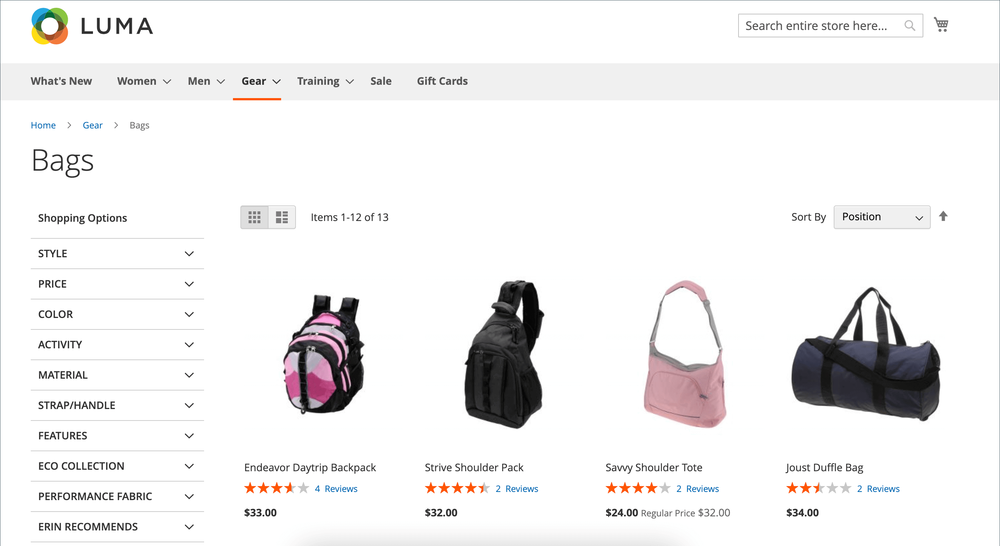

# Produktübersichten

Produktüberprüfungen helfen, ein Gefühl der Community zu schaffen, und werden als glaubwürdiger angesehen, als jedes Werbegeld kaufen kann. Tatsächlich geben einige Suchmaschinen Sites mit Produktbewertungen einen höheren Rang als solche ohne. Diejenigen, die Ihre Site finden, indem sie nach einem bestimmten Produkt suchen, ist eine Produktüberprüfung im Wesentlichen die Landingpage Ihres Stores. Produktüberprüfungen helfen den Leuten dabei, Ihr Geschäft zu finden, sie zu binden und oft zum Verkauf zu führen.

Commerce enthält eine native Produktüberprüfungsfunktion, die Sie über den Administrator verwalten können. Sie können auch eine Erweiterung aus dem [Commerce Marketplace](../getting-started/commerce-marketplace.md) , um ein gehostetes Überprüfungsmanagementsystem zu verwenden.

>[!NOTE]
>
>Die Versionen 2.4.0 bis 2.4.3 von Adobe Commerce und Magento Open Source umfassten die vom Yotpo-Anbieter entwickelte Erweiterung. Ab Version 2.4.4 ist diese Erweiterung nicht mehr im Paket mit der Kernversion enthalten und muss über die Commerce Marketplace installiert und aktualisiert werden. Der Marketplace bietet außerdem Zugriff auf die aktuelle Dokumentation, die vom Erweiterungsentwickler bereitgestellt wird.
>  
>Wenn Sie die gebündelte Erweiterung aktiviert und konfiguriert haben, müssen Sie Ihre Composer.json-Datei im Rahmen des Aktualisierungsprozesses von 2.4.4 aktualisieren und zukünftige Erweiterungs-Updates verwalten. Siehe [Upgrade-Module](https://experienceleague.adobe.com/docs/commerce-operations/upgrade-guide/modules/upgrade.html) im _Upgrade-Handbuch_ für weitere Informationen.

## Produktüberprüfungen auf der Storefront

Wenn die native Funktion &quot;Produktüberprüfungen&quot;aktiviert ist, können Kunden Bewertungen für jedes Produkt in Ihrem Katalog schreiben. Bewertungen können über die Produktseite geschrieben werden, indem Sie auf Folgendes klicken:

- **Review hinzufügen** für Produkte mit bestehenden Bewertungen.

- **Seien Sie der Erste, der dieses Produkt überprüft** für Produkte ohne bestehende Überprüfungen.

Die [!UICONTROL Reviews] -Registerkarte listet alle aktuellen Überprüfungen und das Formular auf, das zum Senden einer Überprüfung verwendet wurde.

Ihre Konfiguration bestimmt, ob Kunden ein Konto bei Ihrem Store öffnen müssen, bevor sie Produktüberprüfungen schreiben, oder ob sie Bewertungen als Gäste einreichen können. Die Anforderung, dass Überprüfer ein Konto öffnen müssen, verhindert anonyme Übermittlungen und verbessert die Qualität von Überprüfungen.

{width="700" zoomable="yes"}

Die Anzahl der Sterne zeigt die Zufriedenheitsbewertung des Produkts. Besucher können auf den Link klicken, um die Bewertungen zu lesen und ihre eigenen zu schreiben. Als Anreiz können Kunden Belohnungspunkte für die Einreichung einer Überprüfung erhalten. Wenn eine Überprüfung gesendet wird, wird sie zur Moderation an den Administrator gesendet. Nach der Genehmigung wird die Überprüfung in Ihrem Store veröffentlicht.

{width="700" zoomable="yes"}

### [!UICONTROL My Product Reviews]

Die _[!UICONTROL My Product Reviews]_im Dashboard des Kundenkontos werden alle vom Kunden eingereichten und zur Veröffentlichung genehmigten Rezensionen aufgelistet. Jede Reviewzusammenfassung enthält das Datum, an dem die Überprüfung eingereicht wurde, Links zur Produktseite und Reviewdetails.

{width="700" zoomable="yes"}

1. In der Seitenleiste seines Kontos wählt der Kunde **[!UICONTROL My Product Reviews]**.

1. Um die vollständige Überprüfung anzuzeigen, klicken Sie auf **[!UICONTROL See Details]**.

   {width="700" zoomable="yes"}

## Funktionen zur Produktüberprüfung aktivieren

Die Funktion Commerce Product Reviews ist standardmäßig aktiviert.

>[!NOTE]
>
>So legen Sie diese Felder fest `No` und die Option &quot;Commerce Product Reviews&quot;deaktivieren, müssen Sie die **Systemwert verwenden** Kontrollkästchen.

1. Im _Admin_ Seitenleiste, navigieren Sie zu **[!UICONTROL Stores]** > _[!UICONTROL Settings]_>**[!UICONTROL Configuration]**.

1. Erweitern Sie im linken Bereich **[!UICONTROL Catalog]** und wählen **[!UICONTROL Catalog]** darunter.

1. Erweitern  die **[!UICONTROL Product Reviews]** Abschnitt.

   {width="600" zoomable="yes"}

1. Satz **[!UICONTROL Enabled]** nach `Yes`.

   Dies ist die Standardeinstellung, die Produktüberprüfungen ermöglicht.

1. Satz **[!UICONTROL Allow Guests to Write Reviews]** nach `Yes`.

   Dies ist die Standardeinstellung, die bestimmt, ob Kunden ein Konto mit Ihrem Store öffnen müssen, um Produktüberprüfungen schreiben zu können.

1. Wenn Sie fertig sind, klicken Sie auf **[!UICONTROL Save Config]**.

## Benutzerdefinierte Bewertungen erstellen

Mit den Commerce-Produktüberprüfungen können Kunden Bewertungen zuweisen, wenn sie eine Produktüberprüfung einreichen. Die Standardbewertungen sind Qualität, Preis und Wert. Zusätzlich können Sie Ihre eigenen benutzerdefinierten Bewertungen hinzufügen. Die auf den Katalogseiten angezeigten Fünf-Sterne-Bewertungen werden für jedes Produkt im Durchschnitt ermittelt.

{width="700" zoomable="yes"}

1. Im _Admin_ Seitenleiste, navigieren Sie zu **[!UICONTROL Stores]** > _[!UICONTROL Attributes]_>**[!UICONTROL Rating]**.

1. Klicken Sie oben rechts auf **[!UICONTROL Add New Rating]**.

   {width="700" zoomable="yes"}

1. Im _[!UICONTROL Rating Title]_eingeben.**[!UICONTROL Default Value]**für das neue Rating.

   Geben Sie ggf. auch die Übersetzung für jede Store-Ansicht ein.

   {width="600" zoomable="yes"}

1. Im _Rating-Sichtbarkeit_ Abschnitt, festlegen **[!UICONTROL Visibility In]** in die Store-Ansicht, in der die Bewertung verwendet werden soll.

   Um mehrere Store-Ansichten auszuwählen, halten Sie die Strg-Taste (PC) oder die Befehlstaste (Mac) gedrückt und klicken Sie auf jedes Element.

   >[!NOTE]
   >
   >Bewertungen sind nur sichtbar, wenn sie einer Store-Ansicht zugewiesen sind.

1. Für **[!UICONTROL Sort Order]** eingeben, geben Sie eine Zahl ein, um die Reihenfolge dieser Bewertung zu bestimmen, wenn sie mit anderen aufgelistet wird.

1. Wenn Sie Ihre Bewertung auf der Storefront anzeigen möchten, wählen Sie die **[!UICONTROL Is Active]** aktivieren.

   {width="600" zoomable="yes"}

1. Wenn Sie fertig sind, klicken Sie auf **[!UICONTROL Save Rating]**.

   Die durchschnittliche Bewertung aller Bewertungen wird für jedes Produkt auf der Raster-Seite des Katalogprodukts angezeigt.

   {width="700" zoomable="yes"}
