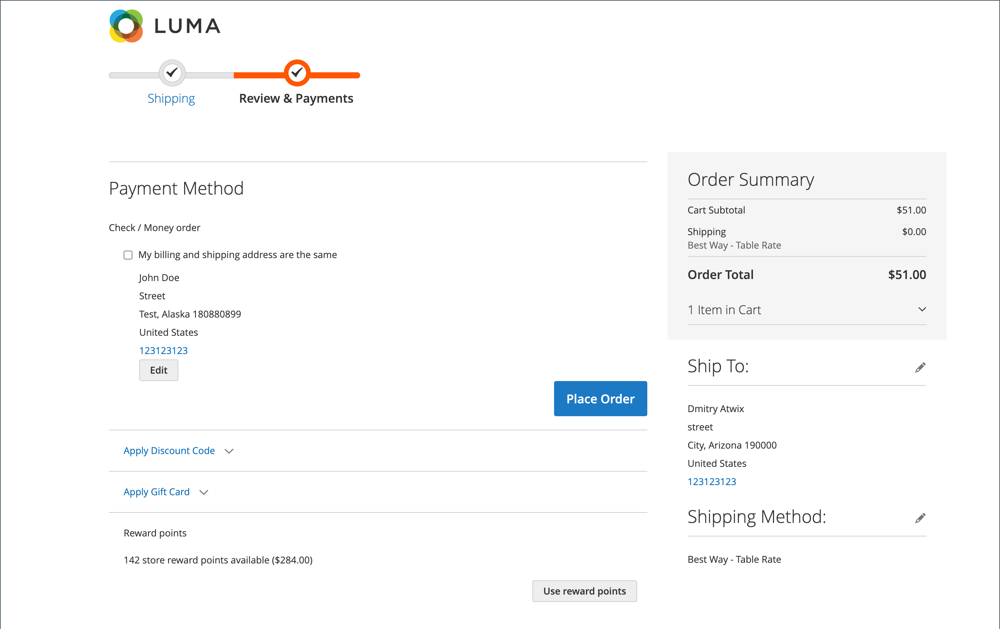

# Prämienpunkte für Storefront-Erlebnis

{{ee-feature}}

Der Abschnitt [Belohnungspunkte](rewards-loyalty.md) des Kundenkontos zeigt, dass der aktuelle Saldo der vom Kunden verdienten Belohnungspunkte und eine Historie seines Belohnungspunktkontos vorliegen.

{width="700" zoomable="yes"}

## Lösen Sie die Prämienpunkte während des Checkouts ein

Wenn [Reward Exchange Rate](reward-exchange-rates.md) mit `Points to Currency` Richtung konfiguriert ist, können Kunden während des Checkouts Prämienpunkte verwenden.

1. Nachdem alle benötigten Produkte zum Warenkorb hinzugefügt wurden, navigiert der Kunde zur Kasse.

1. Gibt alle erforderlichen Versandinformationen ein und navigiert zum Schritt _Überprüfen und Zahlungen_ .

1. Im _[!UICONTROL Reward points]_&#x200B;Abschnitt prüft die Anzahl der verfügbaren Punkte und deren Währungswert.

1. Klicks **[!UICONTROL Use reward points]**.

{width="700" zoomable="yes"}

Der verfügbare Punkterabatt wird auf die Zwischensumme angewendet.

>[!NOTE]
>
>Ist der verfügbare Saldo größer als die Gesamtsumme der Bestellung, ist keine andere Zahlungsmethode erforderlich.
