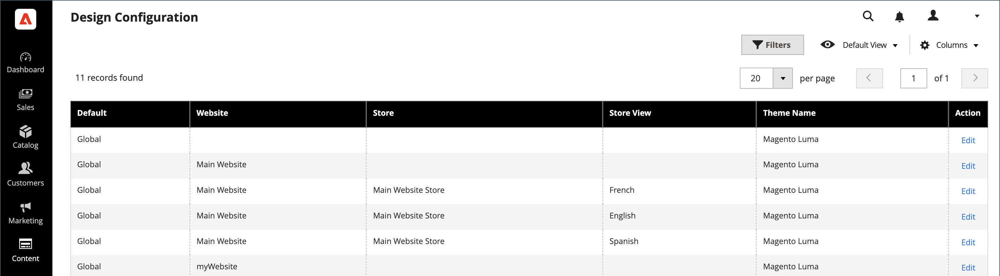

# SEO-Übersicht

_Suchmaschinenoptimierung_ (SEO) ist die Praxis der Feinabstimmung des Inhalts und der Präsentation einer Site, um die Art und Weise zu verbessern, wie die Seiten von Suchmaschinen indiziert werden. Commerce bietet verschiedene Funktionen zur Unterstützung Ihrer fortlaufenden SEO-Bemühungen.

>[!TIP]
>
>Informationen zu Adobe Commerce as a Cloud Service finden Sie in den [SEO-Richtlinien](https://experienceleague.adobe.com/developer/commerce/storefront/setup/seo/indexing/) in der Dokumentation zu Commerce Storefront

## Metadaten

[!BADGE Nur PaaS]{type=Informative url="https://experienceleague.adobe.com/en/docs/commerce/user-guides/product-solutions" tooltip="Gilt nur für Adobe Commerce in Cloud-Projekten (von Adobe verwaltete PaaS-Infrastruktur) und lokale Projekte."}

Erfahren Sie mehr über das Hinzufügen und Verbessern von [ (Metadaten](meta-data.md) für Ihre Site und Ihren Store.

## Verwenden einer Sitemap

[!BADGE Nur PaaS]{type=Informative url="https://experienceleague.adobe.com/en/docs/commerce/user-guides/product-solutions" tooltip="Gilt nur für Adobe Commerce in Cloud-Projekten (von Adobe verwaltete PaaS-Infrastruktur) und lokale Projekte."}

Eine [Sitemap](sitemap-xml.md) verbessert die Art und Weise, wie Ihr Store von Suchmaschinen indiziert wird, und wurde entwickelt, um Seiten zu finden, die von Webcrawlern übersehen werden könnten. Eine Sitemap kann so konfiguriert werden, dass alle Seiten und Bilder indiziert werden.

## URL-Neuschreibungen

[!BADGE Nur PaaS]{type=Informative url="https://experienceleague.adobe.com/en/docs/commerce/user-guides/product-solutions" tooltip="Gilt nur für Adobe Commerce in Cloud-Projekten (von Adobe verwaltete PaaS-Infrastruktur) und lokale Projekte."}

Mit dem [URL Rewrite](url-rewrite.md)-Tool können Sie jede URL ändern, die mit einem Produkt, einer Kategorie oder einer CMS-Seite verknüpft ist.

## Suchmaschinenroboter

Die Commerce-Konfiguration enthält Einstellungen zum Generieren und Verwalten von Anweisungen für Webcrawler und Bots, die Ihre Site indizieren. Wenn die Anfrage für `robots.txt` Commerce erreicht (und keine physische Datei), wird sie dynamisch an den Robots-Controller weitergeleitet. Die Anweisungen sind Anweisungen, die von den meisten Suchmaschinen erkannt und befolgt werden.

Standardmäßig enthält die von Commerce generierte Datei robots.txt Anweisungen für Web Crawler, um die Indizierung bestimmter Teile der Site zu vermeiden, die Dateien enthalten, die intern vom System verwendet werden. Sie können die Standardeinstellungen verwenden oder eigene benutzerdefinierte Anweisungen für alle oder für bestimmte Suchmaschinen definieren. Es gibt viele Online-Artikel, die sich ausführlich mit dem Thema befassen.

### Beispiel für benutzerdefinierte Anweisungen

**Ermöglicht vollständigen Zugriff**

    user-agent:*
    disallow:

**Deaktiviert den Zugriff auf alle Ordner**

    user-agent:*
    disallow: /

**Standardanweisungen**

    user-agent: *
    disallow: /index.php/
    disallow: /*?
    disallow: /checkout/
    disallow: /app/
    disallow: /lib/
    disallow: /*.php$
    disallow: /pkginfo/
    disallow: /report/
    disallow: /var/
    disallow: /catalog/
    disallow: /customer/
    disallow: /sendfriend/
    disallow: /review/
    Disallow: /*SID=

### Konfigurieren von `robots.txt`

1. Navigieren Sie in _Admin_-Seitenleiste zu **[!UICONTROL Content]** > _[!UICONTROL Design]_>**[!UICONTROL Configuration]**.

1. Suchen Sie die **[!UICONTROL Global]** Konfiguration in der ersten Zeile des Rasters und klicken Sie auf **[!UICONTROL Edit]**.

   {width="700" zoomable="yes"}

1. Scrollen Sie nach unten und erweitern Sie  den Abschnitt **[!UICONTROL Search Engine Robots]** und führen Sie die folgenden Schritte aus:

   {width="600" zoomable="yes"}

   - Legen Sie **[!UICONTROL Default Robots]** auf eine der folgenden Einstellungen fest:

     | Option | Beschreibung |
     |------|------------|
     | `INDEX, FOLLOW` | Weist Web-Crawler an, die Site zu indizieren und später erneut auf Änderungen zu prüfen. |
     | `NOINDEX, FOLLOW` | Weist Web-Crawler an, die Indizierung der Site zu vermeiden, aber später erneut nach Änderungen zu suchen. |
     | `INDEX, NOFOLLOW` | Weist Web-Crawler an, die Website nur einmal zu indizieren, aber keinem Link auf der Seite zu folgen. |
     | `NOINDEX, NOFOLLOW` | Weist Web-Crawler an, die Indizierung der Site zu vermeiden und keinen Links auf der Seite zu folgen. |

     {style="table-layout:auto"}

   - Geben Sie bei Bedarf benutzerdefinierte Anweisungen in das **[!UICONTROL Edit Custom instruction of robots.txt file]** ein. Beispielsweise können Sie während der Entwicklung einer Site den Zugriff auf alle Ordner verbieten.

   - Um die Standardanweisungen wiederherzustellen, klicken Sie auf **[!UICONTROL Reset to Default]**.

1. Klicken Sie abschließend auf **[!UICONTROL Save Configuration]**.
