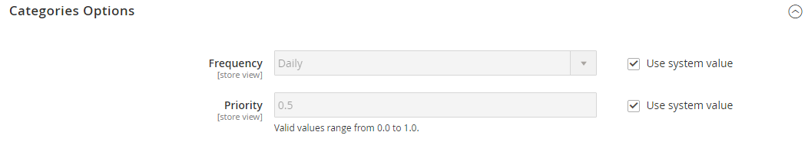

# Sitemap

Eine Sitemap verbessert die Indexierung Ihres Stores durch Suchmaschinen und dient dazu, Seiten zu finden, die von Webcrawlern möglicherweise übersehen werden. Eine Sitemap kann so konfiguriert werden, dass alle Seiten und Bilder indiziert werden.

Wenn diese Option aktiviert ist, erstellt Commerce eine Datei mit dem Namen `sitemap.xml` wird in der Installation an dem von Ihnen angegebenen Speicherort gespeichert. Die Konfiguration gibt Ihnen die Möglichkeit, die Aktualisierungshäufigkeit und die Priorität für jeden Inhaltstyp festzulegen. Ihre Sitemap sollte so häufig aktualisiert werden, wie sich der Inhalt auf Ihrer Site ändert, d. h. täglich, wöchentlich oder monatlich.

Während sich Ihre Site in der Entwicklung befindet, können Sie Anweisungen in die `robots.txt` -Datei für Webcrawler verwenden, um die Indizierung der Site zu vermeiden. Anschließend können Sie vor dem Start die Anweisungen ändern, damit die Site indiziert werden kann.

Technische Informationen finden Sie unter [Hinzufügen von sitemap und robots.txt][1] im _Benutzerhandbuch zu Commerce on Cloud Infrastructure_.

{width="700" zoomable="yes"}

## Schritt 1. Konfigurieren der Sitemap

Führen Sie die [XML-Sitemap-Konfiguration](#site-map-configuration) um zu bestimmen, was enthalten ist und wie häufig die Sitemap aktualisiert wird.

## Schritt 2. Erstellen der Sitemap

1. Im _Admin_ Menü, navigieren Sie zu **[!UICONTROL Marketing]** > _[!UICONTROL SEO & Search]_>**[!UICONTROL Site Map]**.

1. Klicken **[!UICONTROL Add Site Map]**.

   {width="700" zoomable="yes"}

1. Sitemap eingeben **[!UICONTROL Filename]**. Beispiel: `sitemap.xml`

1. Geben Sie die **[!UICONTROL Path]** , um zu bestimmen, wo sich die Sitemap-Datei auf dem Server befinden soll. Stellen Sie sicher, dass der Pfad schreibbar ist.

   - `/sitemap/` - Platziert die Siteübersichtsdatei in einem Verzeichnis mit dem Namen _sitemap_.

   - `/` - Platziert die Sitemap-Datei im Basispfad oder Stammverzeichnis Ihrer Commerce-Installation.

   {width="600" zoomable="yes"}

1. Wenn Sie fertig sind, klicken Sie auf **[!UICONTROL Save & Generate]**.

   Es kann einige Minuten dauern, bis die Sitemap im Raster angezeigt wird.

## Schritt 3. Konfigurieren und Aktivieren von robots.txt (optional)

Führen Sie die [Suchmaschinen-Roboter](seo-overview.md#search-engine-robots) -Konfiguration mit Anweisungen, die Suchmaschinen anweisen, die Teile Ihrer Site zu durchsuchen, die Sie indizieren möchten.

## Schritt 4. Übermitteln Ihrer Sitemap an Suchmaschinen

Sie können Ihre Sitemap an verschiedene Suchmaschinen senden, indem Sie ihnen den Link zum `sitemap.xml` -Datei in Ihrer Commerce-Installation. Gehen Sie wie folgt vor, um den Link zu kopieren:

1. Im _Site-Map_ auflisten, klicken Sie mit der rechten Maustaste auf die URL im **[!UICONTROL Link for Google]** Spalte.

1. Wählen Sie im Menü **[!UICONTROL Copy Link Address]**.

Weitere Informationen finden Sie in den Anweisungen für die jeweilige Suchmaschine. Hier finden Sie Links zu Anweisungen für zwei Top-Suchmaschinen:

- [Google][2]
- [Microsoft® Bing][3]

## Schritt 5: Wiederherstellen der vorherigen Roboteranweisungen (optional)

Sie können jetzt entweder die ursprünglichen (standardmäßigen) Einschränkungen wiederherstellen.

## Verwalten von Sitemaps und robots.txt für mehrere Websites

Wenn Sie mehrere Websites haben, können Sie die Erstellung und Übermittlung von Sitemaps vereinfachen. Einfach [erstellen](#site-map-configuration) eine oder mehrere Sitemaps, die URLs für alle Ihre verifizierten Stores enthalten, und speichern die Sitemaps an einem einzigen Ort. Alle Sites müssen in [Google-Suchkonsole](https://support.google.com/webmasters/answer/7451001).

Gehen Sie wie folgt vor, um Sitemaps für eine Multistore-Instanz zu erstellen:

1. Erstellen Sie einen Ordner mit dem Namen `sitemaps` Erstellen Sie im Stammverzeichnis Ihrer Website Unterordner für jede Domäne:

       /sitemaps/domain_1/
       /sitemaps/domain_2/
   
1. Im _Admin_ Seitenleiste, navigieren Sie zu **[!UICONTROL Marketing]** > _[!UICONTROL SEO & Search]_>**[!UICONTROL Site Map]**.

1. Erstellen oder bearbeiten Sie die Sitemap-Listen für jeden Store und legen Sie die **[!UICONTROL Path]** zu dem Ordner hinzu, den Sie für den Store erstellt haben:

   `/sitemaps/domain_1/`
   `/sitemaps/domain_2/`

1. Aktualisieren Sie bei Bedarf Ihre Datei robots.txt .

   Um sicherzustellen, dass die Suchmaschinen-Spider ordnungsgemäß zu den neuen Sitemaps weitergeleitet werden, können Sie die Datei robots.txt aktualisieren oder erstellen. Fügen Sie oben die folgenden Zeilen hinzu.

       Website-Sitemap
       Sitemap: https://www.domain_1.com/sitemaps/domain_1/sitemap.xml
       Sitemap: https://www.domain_2.com/sitemaps/domain_2/sitemap.xml
   
>[!NOTE]
>
>Wenn Ihre Site [Apache](https://experienceleague.adobe.com/docs/commerce-operations/installation-guide/prerequisites/web-server/apache.html) Webserver-Engine sollten Sie die [`.htaccess`](https://httpd.apache.org/docs/current/howto/htaccess.html) -Datei im Stammverzeichnis Ihrer Website, um alle anderen Sitemap-Anfragen an den richtigen Ort zu leiten.

## Spaltenbeschreibungen

| Spalte | Beschreibung |
|------|-----------|
| [!UICONTROL ID] | Die sequenzielle Datensatznummer der aktuellen Sitemap. |
| [!UICONTROL Filename] | Der Dateiname der Sitemap. |
| [!UICONTROL Path] | Der Speicherort, an dem sich die Sitemap auf dem Server befindet. Beispiel:  `/sitemap/` - Platziert die Siteübersichtsdatei in einem Verzeichnis mit dem Namen _sitemap_, eine Ebene unterhalb des Stammverzeichnisses der Commerce-Installation.  `/` - Platziert die Sitemap-Datei im Basispfad oder Stammverzeichnis der Commerce-Installation. |
| [!UICONTROL Link for Google] | Die URL der Sitemap, die an Google und andere Suchmaschinen gesendet werden soll. |
| [!UICONTROL Last Generated] | Gibt Datum und Uhrzeit der letzten Erstellung der Sitemap an. |
| [!UICONTROL Store View] | Die Store-Ansicht, für die die Sitemap gilt. |
| [!UICONTROL Generate] | Regeneriert die Sitemap. |

{style="table-layout:auto"}

## Sitemap-Konfiguration

Ihre Sitemap sollte so häufig aktualisiert werden, wie sich der Inhalt auf Ihrer Site ändert, was täglich, wöchentlich oder monatlich erfolgen kann. Mit der Konfiguration können Sie die Häufigkeit und Priorität für jeden Inhaltstyp festlegen.

### Schritt 1. Häufigkeit und Priorität von Inhaltsaktualisierungen festlegen

1. Im _Admin_ Seitenleiste, navigieren Sie zu **[!UICONTROL Stores]** > _[!UICONTROL Settings]_>**[!UICONTROL Configuration]**.

1. Erweitern Sie im linken Bereich **[!UICONTROL Catalog]** und wählen **[!UICONTROL XML Sitemap]**.

1. Erweitern  die **[!UICONTROL Categories Options]** und führen Sie folgende Schritte aus:

   >[!NOTE]
   >
   >Falls erforderlich, löschen Sie die **[!UICONTROL Use system value]** aktivieren, um diese Einstellungen zu ändern.

   - Satz **[!UICONTROL Frequency]** auf einen der folgenden Werte zu:

      - `Always`
      - `Hourly`
      - `Daily`
      - `Weekly`
      - `Monthly`
      - `Yearly`
      - `Never`

   - Für **[!UICONTROL Priority]**, geben Sie einen Wert zwischen `0.0` und `1.0`. Null hat die niedrigste Priorität.

   {width="600" zoomable="yes"}

   Eine detaillierte Liste dieser Optionen finden Sie unter [Kategorieoptionen](../configuration-reference/catalog/xml-sitemap.md#categories-options) im _Konfigurationsreferenz_.

1. Erweitern  die **[!UICONTROL Products Options]** und schließen Sie die **[!UICONTROL Frequency]** und **[!UICONTROL Priority]** nach Bedarf.

   Eine detaillierte Liste dieser Optionen finden Sie unter [Produktoptionen](../configuration-reference/catalog/xml-sitemap.md#products-options) im _Konfigurationsreferenz_.

1. Um zu bestimmen, in welchem Umfang Bilder in der Sitemap enthalten sind, legen Sie **[!UICONTROL Add Images into Sitemap]** auf einen der folgenden Werte zu:

   - `None`
   - `Base Only`
   - `All`

   {width="600" zoomable="yes"}

1. Erweitern  die **[!UICONTROL CMS Pages Options]** und schließen Sie die **[!UICONTROL Frequency]** und **[!UICONTROL Priority]** nach Bedarf.

   {width="600" zoomable="yes"}

   Eine detaillierte Liste dieser Optionen finden Sie unter [CMS-Seitenoptionen](../configuration-reference/catalog/xml-sitemap.md#cms-pages-options) im _Konfigurationsreferenz_.

1. Erweitern  die **[!UICONTROL Store Url Options]** und schließen Sie die **[!UICONTROL Frequency]** und **[!UICONTROL Priority]** nach Bedarf.

   {width="600" zoomable="yes"}

   Eine detaillierte Liste dieser Optionen finden Sie unter [Store-URL-Optionen](../configuration-reference/catalog/xml-sitemap.md#store-url-options) im _Konfigurationsreferenz_.

1. Wenn Sie fertig sind, klicken Sie auf **[!UICONTROL Save Config]**.

### Schritt 2. Erstellen Sie die Generierungseinstellungen.

1. Erweitern  die **[!UICONTROL Generation Settings]** Abschnitt.

   Falls erforderlich, löschen Sie die **Systemwert verwenden** aktivieren, um diese Einstellungen zu ändern.

   {width="600" zoomable="yes"}

   Eine detaillierte Liste dieser Optionen finden Sie unter [Generierungseinstellungen](../configuration-reference/catalog/xml-sitemap.md#generation-settings) im _Konfigurationsreferenz_.

1. Um eine Sitemap zu generieren, legen Sie **[!UICONTROL Enabled]** nach `Yes` und gehen Sie wie folgt vor:

   - Satz **[!UICONTROL Start Time]** in die Stunde, Minute und Sekunde, in der die Sitemap aktualisiert werden soll.

   - Satz **[!UICONTROL Frequency]** auf einen der folgenden Werte zu:

      - `Daily`
      - `Weekly`
      - `Monthly`

   - Für **[!UICONTROL Error Email Recipient]** eingeben, geben Sie die E-Mail-Adresse der Person ein, die eine Benachrichtigung erhalten soll, wenn bei einer Sitemap-Aktualisierung ein Fehler auftritt.

   - Satz **[!UICONTROL Error Email Sender]** an den Store-Kontakt, der als Absender der Fehlerbenachrichtigung erscheint.

   - Satz **[!UICONTROL Error Email Template]** der Vorlage, die für die Fehlerbenachrichtigung verwendet wird.

### Schritt 3. Festlegen der Dateibeschränkungen für Sitemap-Dateien

1. Erweitern  die **[!UICONTROL Sitemap File Limits]** Abschnitt.

   {width="600" zoomable="yes"}

   Eine detaillierte Liste dieser Optionen finden Sie unter [Dateibeschränkungen für Sitemap](../configuration-reference/catalog/xml-sitemap.md#sitemap-file-limits) im _Konfigurationsreferenz_.

1. Für **[!UICONTROL Maximum No of URLs per File]** Geben Sie die maximale Anzahl von URLs ein, die in die Sitemap aufgenommen werden können.

   Standardmäßig beträgt der Grenzwert 50.000.

1. Für **[!UICONTROL Maximum File Size]** Geben Sie die größte Größe in Byte ein, die für die Sitemap zugewiesen ist.

   Die Standardgröße beträgt 10.485.760 Bytes.

### Schritt 4. Suchmaschinen-Sendeeinstellungen festlegen

1. Erweitern  die **[!UICONTROL Search Engine Submission Settings]** Abschnitt.

   {width="600" zoomable="yes"}

1. Wenn Sie eine `robots.txt` -Datei, um Anweisungen für Suchmaschinen bereitzustellen, die Ihre Site durchsuchen, legen Sie **[!UICONTROL Enable Submission to Robots.txt]** nach `Yes`.

1. Wenn Sie fertig sind, klicken Sie auf **[!UICONTROL Save Config]**.

[1]: https://experienceleague.adobe.com/docs/commerce-cloud-service/user-guide/configure-store/robots-sitemap.html
[2]: https://support.google.com/webmasters/answer/183669?hl=en
[3]: https://www.bing.com/webmasters/help/Sitemaps-3b5cf6ed
