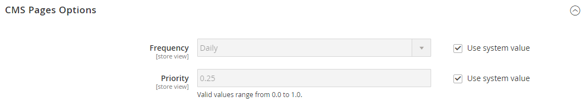

# Sitemaps

>[!TIP]
>
>Informationen zu Adobe Commerce as a Cloud Service finden Sie in den [SEO-Richtlinien](https://experienceleague.adobe.com/developer/commerce/storefront/setup/seo/indexing/?lang=de) in der Dokumentation zu Commerce Storefront

Eine Sitemap verbessert die Art und Weise, wie Ihr Store von Suchmaschinen indiziert wird, und ist so konzipiert, dass Seiten gefunden werden, die von Webcrawlern übersehen werden könnten. Eine Sitemap kann so konfiguriert werden, dass alle Seiten und Bilder indiziert werden.

Wenn diese Option aktiviert ist, erstellt Commerce eine Datei mit dem Namen `sitemap.xml`, die in Ihrer Installation an dem von Ihnen angegebenen Speicherort gespeichert wird. Die Konfiguration bietet Ihnen die Möglichkeit, die Häufigkeit der Aktualisierungen und die Priorität für jeden Inhaltstyp festzulegen. Ihre Sitemap sollte so oft aktualisiert werden, wie sich der Inhalt auf Ihrer Site ändert, was täglich, wöchentlich oder monatlich sein kann.

Während sich Ihre Site in Entwicklung befindet, können Sie in die `robots.txt`-Datei für Webcrawler Anweisungen einfügen, um die Indizierung der Site zu vermeiden. Vor dem Launch können Sie dann die Anweisungen ändern, damit die Site indiziert werden kann.

Technische Informationen finden Sie unter [Sitemap und robots.txt hinzufügen][1] im Handbuch zu _Commerce in Cloud-Infrastrukturen_.

{width="700" zoomable="yes"}

## Schritt 1. Konfigurieren der Sitemap

Schließen Sie die [XML-Sitemap-Konfiguration](#site-map-configuration) ab, um zu bestimmen, was enthalten ist und wie oft die Sitemap aktualisiert wird.

## Schritt 2. Erstellen der Sitemap

1. Gehen Sie _Menü_ Admin“ zu **[!UICONTROL Marketing]** > _[!UICONTROL SEO & Search]_>**[!UICONTROL Site Map]**.

1. Klicken Sie auf **[!UICONTROL Add Site Map]**.

   {width="700" zoomable="yes"}

1. Geben Sie die Sitemap-**[!UICONTROL Filename]** ein. Beispiel: `sitemap.xml`

1. Geben Sie die **[!UICONTROL Path]** ein, um zu bestimmen, wo sich die Siteübersichtsdatei auf dem Server befinden soll. Stellen Sie sicher, dass der Pfad beschreibbar ist.

   - `/sitemap/` - Platziert die Sitemap-Datei in einem Verzeichnis namens _sitemap_.

   - `/` - Platziert die Siteübersichtsdatei im Basispfad oder Stammverzeichnis der Commerce-Installation.

   {width="600" zoomable="yes"}

1. Klicken Sie abschließend auf **[!UICONTROL Save & Generate]**.

   Es kann einige Minuten dauern, bis die Sitemap im Raster angezeigt wird.

## Schritt 3. Konfigurieren und Aktivieren von robots.txt (optional)

Schließen Sie die Konfiguration [Suchmaschinenroboter](seo-overview.md#search-engine-robots) mit Anweisungen ab, die Suchmaschinen anweisen, die Teile Ihrer Site zu durchsuchen, die indiziert werden sollen.

## Schritt 4. Übermitteln der Sitemap an Suchmaschinen

Sie können Ihre Sitemap an verschiedene Suchmaschinen senden, indem Sie ihnen den Link zur `sitemap.xml` in Ihrer Commerce-Installation bereitstellen. Gehen Sie wie folgt vor, um den Link zu kopieren:

1. Klicken _in der Liste &quot;_&quot; mit der rechten Maustaste auf die URL in der Spalte **[!UICONTROL Link for Google]** .

1. Wählen Sie im Menü **[!UICONTROL Copy Link Address]** aus.

Weitere Informationen finden Sie in den Anweisungen für die jeweilige Suchmaschine. Im Folgenden finden Sie Links zu Anweisungen für zwei Top-Suchmaschinen:

- [Google][2]
- [Microsoft® Bing][3]

## Schritt 5: Wiederherstellen früherer Roboteranweisungen (optional)

Sie können jetzt entweder die ursprünglichen (Standard-) Einschränkungen wiederherstellen.

## Sitemaps und robots.txt für mehrere Websites verwalten

Wenn Sie über mehrere Websites verfügen, können Sie das Erstellen und Senden von Sitemaps vereinfachen. Erstellen [&#x200B; einfach &#x200B;](#site-map-configuration) oder mehrere Sitemaps, die URLs für alle verifizierten Stores enthalten, und speichern Sie die Sitemaps an einem einzigen Ort. Alle Websites müssen in der [Google Search Console](https://support.google.com/webmasters/answer/7451001) verifiziert werden.

Gehen Sie wie folgt vor, um Sitemaps für eine Multi-Store-Instanz zu erstellen:

1. Erstellen Sie im Stammverzeichnis Ihrer Website einen Ordner mit dem Namen `sitemaps` und erstellen Sie dann für jede Domain Unterordner:

       /sitemaps/domain_1/
       /sitemaps/domain_2/
   
1. Navigieren Sie in _Admin_-Seitenleiste zu **[!UICONTROL Marketing]** > _[!UICONTROL SEO & Search]_>**[!UICONTROL Site Map]**.

1. Erstellen oder bearbeiten Sie die Sitemap-Listen für jeden Store und legen Sie den **[!UICONTROL Path]** auf den Wert fest, den Sie für den Store erstellt haben:

   `/sitemaps/domain_1/`
   `/sitemaps/domain_2/`

1. Aktualisieren Sie bei Bedarf Ihre Datei „robots.txt“.

   Um sicherzustellen, dass die Suchmaschinen-Spider ordnungsgemäß zu den neuen Sitemaps weitergeleitet werden, können Sie die Datei robots.txt aktualisieren oder erstellen. Fügen Sie oben die folgenden Zeilen hinzu.

       Website-Sitemap
       Sitemap: https://www.domain_1.com/sitemaps/domain_1/sitemap.xml
       Sitemap: https://www.domain_2.com/sitemaps/domain_2/sitemap.xml
   
>[!NOTE]
>
>Wenn Ihre Site die [Apache](https://experienceleague.adobe.com/docs/commerce-operations/installation-guide/prerequisites/web-server/apache.html?lang=de)-Webserver-Engine verwendet, sollten Sie die [`.htaccess`](https://httpd.apache.org/docs/current/howto/htaccess.html)-Datei im Stammverzeichnis Ihrer Website aktualisieren, um alle anderen Sitemap-Anfragen an den richtigen Ort zu leiten.

## Spaltenbeschreibungen

| Spalte | Beschreibung |
|------|-----------|
| [!UICONTROL ID] | Die sequenzielle Datensatznummer der aktuellen Siteübersicht. |
| [!UICONTROL Filename] | Der Dateiname der Siteübersicht. |
| [!UICONTROL Path] | Der Speicherort, an dem sich die Sitemap auf dem Server befindet. Beispiel:  `/sitemap/` - Platziert die Siteübersichtsdatei in einem Verzeichnis mit dem Namen _Sitemap_, das eine Ebene unterhalb des Stammverzeichnisses der Commerce-Installation liegt.  `/` - Platziert die Siteübersichtsdatei im Basispfad oder Stammverzeichnis der Commerce-Installation. |
| [!UICONTROL Link for Google] | Die URL der Sitemap, die an Google und andere Suchmaschinen gesendet werden soll. |
| [!UICONTROL Last Generated] | Gibt das Datum und die Uhrzeit der letzten Erstellung der Siteübersicht an. |
| [!UICONTROL Store View] | Die Store-Ansicht, für die die Sitemap gilt. |
| [!UICONTROL Generate] | Erstellt die Sitemap neu. |

{style="table-layout:auto"}

## Sitemap-Konfiguration

Ihre Sitemap sollte so oft aktualisiert werden, wie sich der Inhalt auf Ihrer Site ändert, was täglich, wöchentlich oder monatlich sein kann. Die Konfiguration ermöglicht es Ihnen, die Häufigkeit und Priorität für jeden Inhaltstyp festzulegen.

### Schritt 1. Festlegen der Häufigkeit und Priorität von Inhaltsaktualisierungen

1. Navigieren Sie in _Admin_-Seitenleiste zu **[!UICONTROL Stores]** > _[!UICONTROL Settings]_>**[!UICONTROL Configuration]**.

1. Erweitern Sie im linken Bereich **[!UICONTROL Catalog]** und wählen Sie **[!UICONTROL XML Sitemap]**.

1. Erweitern Sie  den Abschnitt **[!UICONTROL Categories Options]** und führen Sie folgende Schritte aus:

   >[!NOTE]
   >
   >Deaktivieren Sie bei Bedarf das Kontrollkästchen **[!UICONTROL Use system value]** , um diese Einstellungen zu ändern.

   - Legen Sie **[!UICONTROL Frequency]** auf eine der folgenden Einstellungen fest:

      - `Always`
      - `Hourly`
      - `Daily`
      - `Weekly`
      - `Monthly`
      - `Yearly`
      - `Never`

   - Geben Sie **[!UICONTROL Priority]** einen Wert zwischen `0.0` und `1.0` ein. Null hat die niedrigste Priorität.

   {width="600" zoomable="yes"}

   Eine detaillierte Liste dieser Optionen finden Sie unter [Kategorienoptionen](../configuration-reference/catalog/xml-sitemap.md#categories-options) in _Konfigurationsreferenz_.

1. Erweitern Sie  den Abschnitt **[!UICONTROL Products Options]** und vervollständigen Sie die **[!UICONTROL Frequency]** und **[!UICONTROL Priority]** nach Bedarf.

   Eine detaillierte Liste dieser Optionen finden Sie unter [Produktoptionen](../configuration-reference/catalog/xml-sitemap.md#products-options) in _Konfigurationsreferenz_.

1. Legen Sie **[!UICONTROL Add Images into Sitemap]** auf einen der folgenden Werte fest, um zu bestimmen, inwieweit Bilder in der Sitemap enthalten sind:

   - `None`
   - `Base Only`
   - `All`

   {width="600" zoomable="yes"}

1. Erweitern Sie  den Abschnitt **[!UICONTROL CMS Pages Options]** und vervollständigen Sie die **[!UICONTROL Frequency]** und **[!UICONTROL Priority]** nach Bedarf.

   {width="600" zoomable="yes"}

   Eine detaillierte Liste dieser Optionen finden Sie unter [CMS Pages Options](../configuration-reference/catalog/xml-sitemap.md#cms-pages-options) in der _Konfigurationsreferenz_.

1. Erweitern Sie  den Abschnitt **[!UICONTROL Store Url Options]** und vervollständigen Sie die **[!UICONTROL Frequency]** und **[!UICONTROL Priority]** nach Bedarf.

   {width="600" zoomable="yes"}

   Eine detaillierte Liste dieser Optionen finden Sie unter [URL-Optionen speichern](../configuration-reference/catalog/xml-sitemap.md#store-url-options) in _Konfigurationsreferenz_.

1. Klicken Sie abschließend auf **[!UICONTROL Save Config]**.

### Schritt 2. Abschließen der Generierungseinstellungen

1. Erweitern Sie  den Abschnitt **[!UICONTROL Generation Settings]** .

   Deaktivieren Sie bei Bedarf das **Systemwert verwenden**, um diese Einstellungen zu ändern.

   {width="600" zoomable="yes"}

   Eine detaillierte Liste dieser Optionen finden Sie unter [Generierungseinstellungen](../configuration-reference/catalog/xml-sitemap.md#generation-settings) in _Konfigurationsreferenz_.

1. Um eine Sitemap zu generieren, legen Sie **[!UICONTROL Enabled]** auf `Yes` fest und führen Sie folgende Schritte aus:

   - Legen Sie **[!UICONTROL Start Time]** auf die Stunde, Minute und Sekunde fest, zu der die Sitemap aktualisiert werden soll.

   - Legen Sie **[!UICONTROL Frequency]** auf eine der folgenden Einstellungen fest:

      - `Daily`
      - `Weekly`
      - `Monthly`

   - Geben Sie **[!UICONTROL Error Email Recipient]** die E-Mail-Adresse der Person ein, die benachrichtigt werden soll, wenn während einer Sitemap-Aktualisierung ein Fehler auftritt.

   - Legen Sie **[!UICONTROL Error Email Sender]** auf den Store-Kontakt fest, der als Absender der Fehlerbenachrichtigung angezeigt wird.

   - Legen Sie **[!UICONTROL Error Email Template]** auf die Vorlage fest, die für die Fehlerbenachrichtigung verwendet wird.

### Schritt 3. Festlegen der Dateibeschränkungen für Siteübersichten

1. Erweitern Sie  den Abschnitt **[!UICONTROL Sitemap File Limits]** .

   {width="600" zoomable="yes"}

   Eine detaillierte Liste dieser Optionen finden Sie unter [Sitemap-Dateibeschränkungen](../configuration-reference/catalog/xml-sitemap.md#sitemap-file-limits) in _Konfigurationsreferenz_.

1. Geben Sie **[!UICONTROL Maximum No of URLs per File]** die maximale Anzahl an URLs ein, die in die Sitemap aufgenommen werden können.

   Standardmäßig beträgt der Grenzwert 50.000.

1. Geben Sie **[!UICONTROL Maximum File Size]** die größte Größe in Byte ein, die für die Sitemap zugewiesen ist.

   Die Standardgröße ist 10.485.760 Byte.

### Schritt 4. Suchmaschinen-Sendeeinstellungen festlegen

1. Erweitern Sie  den Abschnitt **[!UICONTROL Search Engine Submission Settings]** .

   {width="600" zoomable="yes"}

1. Wenn Sie eine `robots.txt`-Datei verwenden, um Suchmaschinen, die Ihre Site durchsuchen, Anweisungen zu geben, setzen Sie **[!UICONTROL Enable Submission to Robots.txt]** auf `Yes`.

1. Klicken Sie abschließend auf **[!UICONTROL Save Config]**.

[1]: https://experienceleague.adobe.com/docs/commerce-cloud-service/user-guide/configure-store/robots-sitemap.html?lang=de
[2]: https://support.google.com/webmasters/answer/183669?hl=en
[3]: https://www.bing.com/webmasters/help/Sitemaps-3b5cf6ed
