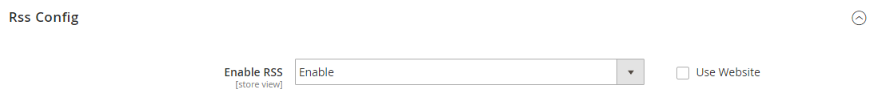

# Social Media- und RSS-Dienste

Viele Händler verwenden soziale Medien und andere digitale Werkzeuge, um Marken- und Produktbewusstsein zu schärfen. Sie können Ihren Store in Ihre sozialen Netzwerke integrieren, indem Sie eine Marketplace-Erweiterung installieren oder ein Plugin zu Ihren Inhaltsseiten hinzufügen. Verwenden Sie RSS-Dienste, um Ihre Produktinformationen auf Einkaufs-Aggregations-Sites zu veröffentlichen und sie sogar in Ihre Newsletter aufzunehmen. Kunden können sich für Ihre RSS-Dienste anmelden, um mehr über neue Produkte und Promotions zu erfahren.

## Soziale Netzwerke

Ihr Store kann über eine [Marketplace-Erweiterung](../getting-started/commerce-marketplace.md). Darüber hinaus können Sie auf einfache Weise soziale Plug-ins hinzufügen, wie z. B. die _liken_ -Schaltfläche in CMS-Blöcke, die in Ihrem gesamten Store in Seiten integriert werden können.

Social-Networking-Sites verfügen über eine Vielzahl von Plugins, die einfach zu Ihrem Store hinzugefügt werden können. Darüber hinaus gibt es viele Erweiterungen auf dem Commerce Marketplace, die zur Integration Ihres Stores in Social Media verwendet werden können. Das folgende Beispiel zeigt, wie Sie eine Facebook hinzufügen _liken_ in Ihren Store.

>[!NOTE]
>
>Adobe Commerce hat den nativen _Magento Social_ Facebook-Integration und unterstützt die -Erweiterung nicht mehr. Navigieren Sie zu [Commerce Marketplace](https://marketplace.magento.com/catalogsearch/result/?q=Facebook){:target=&quot;_blank&quot;}, um alternative Erweiterungen für die Facebook-Integration zu finden.

### Schritt 1. Button-Code abrufen

1. Gehen Sie auf der Meta-Entwickler-Website zur [Schaltflächeneinrichtung](https://developers.facebook.com/docs/plugins/like-button) Seite.

1. Für **[!UICONTROL URL to Like]** eingeben, geben Sie die URL der Seite in Ihrem Store ein, die die Besucher _liken_.

   Sie können beispielsweise die URL der Startseite Ihres Stores eingeben.

1. Wählen Sie die **[!UICONTROL Layout]** für die Schaltfläche.

1. Geben Sie die **[!UICONTROL Width]** in Pixeln, die auf Ihrer Site für die Schaltfläche und alle zugehörigen Textnachrichten verfügbar sind.

1. Satz **[!UICONTROL Action Type]** auf einen der folgenden Werte zu:

   - `Like`
   - `Recommend`

1. Klicks **[!UICONTROL Get Code]** , um den generierten Code in die Zwischenablage zu kopieren.

### Schritt 2. Inhaltsbaustein erstellen

1. Kehren Sie zu Ihrem Store-Administrator zurück.

1. Im _Admin_ Seitenleiste, navigieren Sie zu **[!UICONTROL Content]** > _[!UICONTROL Elements]_>**[!UICONTROL Blocks]**.

1. Klicken Sie oben rechts auf **[!UICONTROL Add New Block]**.

1. Beschreibende Eingabe **[!UICONTROL Block Title]** für interne Referenzzwecke.

   Beispiel: `Facebook Like Button`.

1. Zuweisen einer eindeutigen **[!UICONTROL Identifier]** in den Block, wobei alle Kleinbuchstaben und Unterstriche anstelle von Leerzeichen verwendet werden.

   Beispiel: `facebook_like_button`.

1. Wenn Ihre Commerce-Instanz über mehrere Store-Ansichten verfügt, wählen Sie jede **[!UICONTROL Store View]** wo der Block verfügbar sein soll.

1. Fügen Sie das Codefragment je nach Content-Tool zum Inhalt der Bausteine hinzu:

   - Bei Verwendung von [!DNL Page Builder], fügen Sie eine [HTML-Code](../page-builder/html-code.md) -Block auf die Bühne klicken und den Codeausschnitt einfügen, den Sie von der Facebook-Site kopiert haben. Fügen Sie andernfalls das Codefragment in die **[!UICONTROL Content]** ankreuzen.

   - Fügen Sie mit dem Editor das Codefragment, das Sie von der Facebook-Site kopiert haben, in die **[!UICONTROL Content]** ankreuzen.

1. Wenn der Baustein nicht zur Live-Schaltung bereit ist, legen Sie **[!UICONTROL Enable Block]** nach `No`.

1. Wenn Sie fertig sind, klicken Sie auf **[!UICONTROL Save Block]**.

### Schritt 3. Platzieren Sie den Block

1. Fügen Sie den Block je nach Inhalts-Tool hinzu:

   - Bei Verwendung von [!UICONTROL Page Builder]folgen Sie den Anweisungen unter [Baustein hinzufügen](../page-builder/block.md) auf die Bühne.

   - Im _Admin_ Seitenleiste, navigieren Sie zu **[!UICONTROL Content]** > _[!UICONTROL Elements]_>**[!UICONTROL Widgets]**.

1. Klicken Sie oben rechts auf **[!UICONTROL Add Widget]** und gehen Sie wie folgt vor:

   -  (Nur bei B2B für Adobe Commerce verfügbar) Im _Einstellungen_ Abschnitt, festlegen **[!UICONTROL Type]** nach `CMS Static Block` und klicken **[!UICONTROL Continue]**.

   - Stellen Sie sicher, dass **[!UICONTROL Design Theme]** auf das aktuelle Design eingestellt ist.

   - Klicken **[!UICONTROL Continue]**.

1. Im **[!UICONTROL Storefront Properties]** führen Sie folgende Schritte aus:

   - Für **[!UICONTROL Widget Title]**, geben Sie einen Titel für die interne Referenz ein.

   - Satz **[!UICONTROL Assign to Store Views]** nach `All Store Views`oder in die Ansicht, in der die App verfügbar sein soll. Um mehrere Ansichten auszuwählen, halten Sie die Strg-Taste (PC) oder die Befehlstaste (Mac) gedrückt und klicken Sie auf jede Option.

   - Geben Sie im Feld **[!UICONTROL Sort Order]** -Feld, um die Reihenfolge des Bausteins zu bestimmen, wenn er so zugeordnet ist, dass er an derselben Stelle auf der Seite wie andere Inhaltselemente angezeigt wird. Die oberste Position ist Null.

1. Im _[!UICONTROL Layout Updates]_Abschnitt, klicken Sie auf **[!UICONTROL Add Layout Update]**und **[!UICONTROL Display On]**in die Kategorie, das Produkt oder die Seite, auf der der Block erscheinen soll.

   Wenn Sie beispielsweise `All Pages` und den Baustein entweder in der Kopf- oder Fußzeile platzieren, wird der Baustein auf jeder Seite des Stores an derselben Stelle angezeigt.

   Gehen Sie wie folgt vor, um den Baustein auf einer bestimmten Seite zu platzieren:

   - Satz **[!UICONTROL Display On]** nach `Specified Page` und wählen Sie die **[!UICONTROL Page]** wo der Block erscheinen soll.

   - Wählen Sie die **[!UICONTROL Block Reference]** , um die Stelle auf der Seite zu identifizieren, an der der Block platziert werden soll.

   - Annehmen der Standardeinstellung für **[!UICONTROL Template]**, der auf `CMS Static Block Default Template`.

   - Klicken **[!UICONTROL Save and Continue Edit]**.

1. Wählen Sie im Bedienfeld auf der linken Seite **[!UICONTROL Widget Options]**.

1. Klicks **[!UICONTROL Select Block…]** und wählen Sie den gewünschten Block aus.

1. Wenn Sie fertig sind, klicken Sie auf **[!UICONTROL Save]**.

1. Befolgen Sie bei entsprechender Aufforderung die Anweisungen oben im Arbeitsbereich, um den Index- und Seiten-Cache zu aktualisieren.

   Das Widget wird jetzt im _[!UICONTROL Widgets]_Liste.

### Schritt 4. Überprüfen des Speicherorts im Store

Kehren Sie zu Ihrer Storefront zurück, um zu überprüfen, ob sich der Block an der richtigen Stelle befindet. Um den Block zu verschieben, können Sie das Widget erneut öffnen und eine andere Seite oder einen anderen Blockverweis ausprobieren.

## RSS-Feeds

RSS (Really Simple Syndication) ist ein XML-basiertes Datenformat, mit dem Informationen online verteilt werden. Ihre Kunden können sich für Ihre RSS-Dienste anmelden, um mehr über neue Produkte und Promotions zu erfahren. RSS-Dienste können auch verwendet werden, um Ihre Produktinformationen auf Shopping-Aggregations-Sites zu veröffentlichen, und können in Newslettern enthalten sein.

Wenn RSS-Dienste aktiviert sind, werden alle Ergänzungen zu Produkten, Sonderaktionen, Kategorien und Gutscheinen automatisch an die Abonnenten jedes Feeds gesendet. Ein Link zu allen RSS-Feeds, die Sie veröffentlichen, befindet sich in der Fußzeile Ihres Stores.

{width="100"} 

Die Software, die zum Lesen eines RSS-Dienstes erforderlich ist, wird als Feed-Reader bezeichnet und ermöglicht es Menschen, Überschriften, Blogs, Podcasts und vieles mehr zu abonnieren. Google Reader ist einer der vielen Feed-Leser, die online kostenlos verfügbar sind.

{width="700" zoomable="yes"}

### Vorteile der Einrichtung eines RSS-Dienstes

- Laden Sie das neueste Update von Ihrem Store oder Blog herunter
- Leuchtende Anzeigen
- Stammaktien
- SEO steigern
- Umsatzsteigerung

### Typen von RSS-Diensten

| RSS-Feed | Beschreibung |
|--- |--- |
| [!UICONTROL Wish List] | Wenn diese Option aktiviert ist, wird oben auf den Seiten mit der Kundenwunschliste ein RSS-Feed-Link angezeigt. Außerdem enthält die Seite zur Freigabe der Wunschliste ein Kontrollkästchen, mit dem Sie einen Link zum Feed aus freigegebenen Wunschlisten einfügen können. |
| [!UICONTROL New Products] | Veröffentlicht Benachrichtigungen über neue Produkte, die zum Katalog hinzugefügt wurden. |
| [!UICONTROL Special Products] | Veröffentlicht Benachrichtigungen über Produkte mit Sonderpreisen. |
| [!UICONTROL Coupons / Discounts] | Veröffentlicht Benachrichtigungen über spezielle Gutscheine oder Rabatte, die im Store verfügbar sind. |
| [!UICONTROL Top Level Category] | Veröffentlicht Benachrichtigungen über Änderungen an der Kategoriestruktur der obersten Ebene Ihres Katalogs, was im Hauptmenü angezeigt wird. |
| [!UICONTROL Customer Order Status] | Bietet Kunden die Möglichkeit, ihren Bestellstatus nach RSS-Feed zu verfolgen. Wenn diese Option aktiviert ist, wird in der Bestellung ein RSS-Feed-Link angezeigt. |

{style="table-layout:auto"}

### RSS-Dienste für Ihren Store einrichten

1. Im _Admin_ Seitenleiste, navigieren Sie zu **[!UICONTROL Stores]** > _[!UICONTROL Settings]_>**[!UICONTROL Configuration]**.

1. Legen Sie in der oberen rechten Ecke **[!UICONTROL Store View]** in die Ansichten, in denen die Feeds verfügbar sein sollen.

   Wenn Sie zur Bestätigung aufgefordert werden, klicken Sie auf **[!UICONTROL OK]**.

1. Erweitern Sie im linken Bereich **[!UICONTROL Catalog]** und wählen **[!UICONTROL RSS Feeds]**.

1. Erweitern  die **[!UICONTROL Rss Config]** Abschnitt und Satz **[!UICONTROL Enable RSS]** nach `Enable`.

   {width="600" zoomable="yes"}

   Falls erforderlich, löschen Sie die **[!UICONTROL Use Default]** zum Ändern des Standardwerts.

1. Erweitern  die **[!UICONTROL Wish List]** Abschnitt und Satz **[!UICONTROL Enable RSS]** nach `Enable`.

1. Erweitern  die **[!UICONTROL Catalog]** und legen Sie andere Feeds auf `Enable` nach Bedarf.

   - **[!UICONTROL New Products]**
   - **[!UICONTROL Special Products]**
   - **[!UICONTROL Coupons/Discounts]**
   - **[!UICONTROL Top Level Category]**

   {width="600" zoomable="yes"}

1. Erweitern  die **[!UICONTROL Order]** Abschnitt und Satz **[!UICONTROL Customer Order Status Notification]** nach `Enable`.

1. Wenn Sie fertig sind, klicken Sie auf **[!UICONTROL Save Config]**.

1. Ergebnis auf der Storefront anzeigen mit `/rss` am Ende der Seiten-URL.

