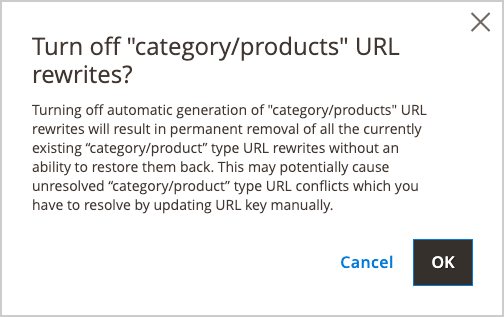

# Automatische Weiterleitungen

Ihr Store kann so konfiguriert werden, dass er automatisch eine permanente Weiterleitung generiert, wenn sich der URL-Schlüssel eines Produkts oder einer Kategorie ändert. Im Abschnitt Suchmaschinenoptimierung zeigt das Kontrollkästchen unter dem URL-Schlüssel an, ob dauerhafte Weiterleitungen aktiviert sind. Wenn Ihr Store bereits so konfiguriert ist, dass Katalog-URLs automatisch umgeleitet werden, ist eine Umleitung eine einfache Aktualisierung des URL-Schlüssels. Der Prozess zum Erstellen einer automatischen Umleitung ist für Produkte und Kategorien identisch.

>[!NOTE]
>
>Wenn automatische Weiterleitungen aktiviert sind und Sie eine Kategorie speichern, werden alle Produkt- und Kategorieumschreibungen in Echtzeit generiert und standardmäßig in Datenbanktabellen gespeichert. Dies kann bei Kategorien mit vielen zugewiesenen Produkten zu erheblichen Leistungsproblemen führen. Die Lösung besteht darin, diese Standardeinstellung zu ändern und die Generierung von Kategorie-/Produkt-URL-Neuschreibungen für Produkte beim Speichern der Kategorie zu überspringen. In diesem Fall werden Produktneuschreibungen nur für die kanonische Produkt-URL generiert.

## Einrichten automatischer Weiterleitungen

1. Navigieren Sie in _Admin_-Seitenleiste zu **[!UICONTROL Stores]** > _[!UICONTROL Settings]_>**[!UICONTROL Configuration]**.

1. Erweitern Sie im linken Bereich **[!UICONTROL Catalog]** und wählen Sie darunter **[!UICONTROL Catalog]**.

1. Erweitern Sie  den Abschnitt **[!UICONTROL Search Engine Optimization]** .

   {width="600" zoomable="yes"}

1. Legen Sie **[!UICONTROL Create Permanent Redirect for URLs if URL Key Changed]** auf `Yes` fest.

1. Klicken Sie abschließend auf **[!UICONTROL Save Config]**.

>[!NOTE]
>
> URL-Neuschreibungen können für die Store-Ansicht oder den Website-Umfang generiert werden. Legen Sie im Admin-Bereich unter **[!UICONTROL Stores]** > _[!UICONTROL Settings]_>**[!UICONTROL Configuration]****[!UICONTROL Catalog]**>**[!UICONTROL Catalog]**>**[!UICONTROL Search Engine Optimization]**den URL-Rewrite-Bereich fest. Wählen Sie den Bereich im Feld_[!UICONTROL Product URL Rewrite Scope]_ aus.

## Produkt-URLs automatisch umleiten

1. Navigieren Sie in der _Admin_-Seitenleiste zu **[!UICONTROL Catalog]** > **[!UICONTROL Products]**.

1. Suchen Sie das Produkt in der Liste und klicken Sie darauf, um den Datensatz zu öffnen.

1. Erweitern Sie  Abschnitt **[!UICONTROL Search Engine Optimization]** .

   {width="600" zoomable="yes"}

1. Gehen Sie **[!UICONTROL URL Key]** wie folgt vor:

   - Stellen Sie sicher, dass das Kontrollkästchen **[!UICONTROL Create Permanent Redirect for old URL]** aktiviert ist. Falls nicht, befolgen Sie die Anweisungen zum [Aktivieren automatischer Weiterleitungen](url-rewrite.md#configure-url-rewrites).

   - Aktualisieren Sie die **[!UICONTROL URL Key]** nach Bedarf, indem Sie alle Kleinbuchstaben und nicht nachfolgende Bindestriche anstelle von Leerzeichen zwischen diesen Zeichen verwenden.

1. Klicken Sie abschließend auf **[!UICONTROL Save]**.

1. Wenn Sie aufgefordert werden, den Cache zu aktualisieren, folgen Sie den Links in der Nachricht oben im Arbeitsbereich.

   Die permanente Umleitung ist jetzt für das Produkt und alle zugehörigen Kategorie-URLs aktiv.

## Kategorie-URLs automatisch umleiten

1. Navigieren Sie in der _Admin_-Seitenleiste zu **[!UICONTROL Catalog]** > **[!UICONTROL Categories]**.

1. Suchen Sie die Kategorie im Baum und klicken Sie, um den Datensatz zu öffnen.

1. Erweitern Sie  den Abschnitt **[!UICONTROL Search Engine Optimization]** .

1. Gehen Sie **[!UICONTROL URL Key]** wie folgt vor:

   - Stellen Sie sicher, dass das Kontrollkästchen **[!UICONTROL Create Permanent Redirect for old URL]** aktiviert ist. Falls nicht, befolgen Sie die Anweisungen zum [Aktivieren automatischer Weiterleitungen](url-rewrite.md#configure-url-rewrites).

   - Aktualisieren Sie die **[!UICONTROL URL Key]** nach Bedarf, indem Sie alle Kleinbuchstaben und nicht nachfolgende Bindestriche anstelle von Leerzeichen zwischen diesen Zeichen verwenden.

1. Klicken Sie abschließend auf **[!UICONTROL Save]**.

1. Wenn Sie aufgefordert werden, den Cache zu aktualisieren, folgen Sie den Links in der Nachricht oben im Arbeitsbereich.

   Die permanente Umleitung ist jetzt für die Kategorie und alle zugehörigen Produkt-URLs aktiv.

## Generierung der Neuschreibungen der Produkt-URLs zum Speichern der Kategorie überspringen {#skip-rewrite}

>[!WARNING]
>
>Wenn Sie die automatische Generierung von URL-Neuschreibungen für Kategorien/Produkte deaktivieren, werden alle vorhandenen URL-Neuschreibungen für Kategorien/Produkttypen dauerhaft entfernt, die nicht wiederhergestellt werden können. Dies kann zu ungelösten URL-Konflikten zwischen Kategorie und Produkttyp führen, die eine manuelle Aktualisierung des URL-Schlüssels erfordern, um gelöst zu werden.

1. Navigieren Sie in _Admin_-Seitenleiste zu **[!UICONTROL Stores]** > _[!UICONTROL Settings]_>**[!UICONTROL Configuration]**.

1. Erweitern Sie im linken Bereich **[!UICONTROL Catalog]** und wählen Sie darunter **[!UICONTROL Catalog]**.

1. Erweitern Sie  den Abschnitt **[!UICONTROL Search Engine Optimization]** .

1. Legen Sie **[!UICONTROL Generate "category/product" URL Rewrites]** auf `No` fest.

1. Klicken Sie im Bestätigungsdialogfeld auf **[!UICONTROL OK]** , um die Änderung und das Entfernen vorhandener URL-Neuschreibungen zu bestätigen.

   {width="350"}

1. Klicken Sie abschließend auf **[!UICONTROL Save Config]**.
