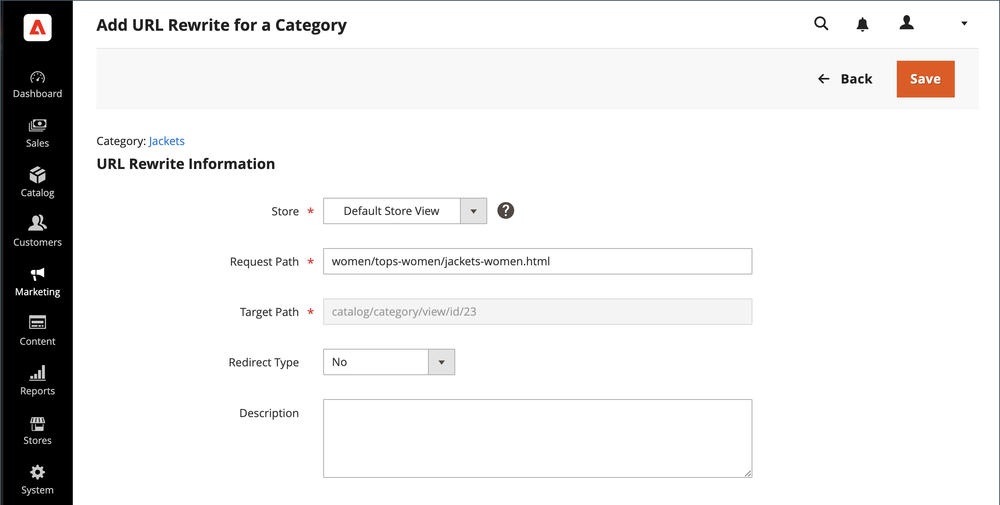

# Neuschreibungen der Kategorie-URL

Wenn eine Kategorie aus Ihrem Katalog entfernt wird, können Sie eine Kategorieumschreibung verwenden, um Links zur URL einer anderen Kategorie in Ihrem Store umzuleiten. Denken Sie an _target_ / _ursprüngliche Anfrage_ oder _umleiten zu_ / _umleiten von_. Obwohl Personen möglicherweise immer noch über Suchmaschinen oder veraltete Links zur vorherigen Seite navigieren, führt die Umleitung dazu, dass Ihr Store zum neuen Ziel wechselt.

Wenn [automatische Weiterleitungen](url-redirect-product-automatic.md) für Ihren Store aktiviert sind, müssen Sie keine Neuschreibungen erstellen, wenn eine Kategorie ([-Schlüssel](../catalog/catalog-urls.md) geändert wird.

{{url-rewrite-skip}}

## Schritt 1. Umschreiben planen

Um Fehler zu vermeiden, schreiben Sie den Pfad _umleiten zu_ und _umleiten von_ auf und fügen Sie den URL-Schlüssel und das Suffix (falls zutreffend) hinzu.

Wenn Sie sich nicht sicher sind, öffnen Sie jede Kategorieseite in Ihrem Store und kopieren Sie den Pfad aus der Adressleiste Ihres Browsers.

**Beispiel:**

Umleiten zu: `gear/backpacks-and-bags.html`

Umleiten von: `gear/bags.html`

## Schritt 2. Umschreiben erstellen

{{url-rewrite-params}}

1. Navigieren Sie in _Admin_-Seitenleiste zu **[!UICONTROL Marketing]** > _[!UICONTROL SEO & Search]_>**[!UICONTROL URL Rewrites]**.

1. Bevor Sie fortfahren, führen Sie folgende Schritte aus, um zu überprüfen, ob der Anfragepfad verfügbar ist:

   - Geben Sie im Suchfilter oben in der Spalte **[!UICONTROL Request Path]** den URL-Schlüssel der umzuleitenden Kategorie ein und klicken Sie auf **[!UICONTROL Search]**.

   - Wenn mehrere Umleitungsdatensätze für die Seite vorhanden sind, suchen Sie den entsprechenden Speichereintrag, der der entsprechenden Store-Ansicht entspricht, und öffnen Sie den Umleitungsdatensatz im Bearbeitungsmodus.

   - Klicken Sie oben rechts auf **[!UICONTROL Delete]**. Wenn Sie dazu aufgefordert werden, klicken Sie zur Bestätigung auf **[!UICONTROL OK]** .

1. Wenn Sie zur Seite _[!UICONTROL URL Rewrites]_&#x200B;zurückkehren, klicken Sie auf **[!UICONTROL Add URL Rewrite]**.

1. Legen Sie **[!UICONTROL Create URL Rewrite]** auf `For category` fest und wählen Sie die Zielkategorie in der Baumstruktur aus, die das Ziel der Umleitung ist.

   {width="700" zoomable="yes"}

1. Gehen Sie _Abschnitt_ URL-Umschreibung“ wie folgt vor:

   - Wenn Sie über mehrere Stores verfügen, wählen Sie die **[!UICONTROL Store]** aus, für die die Umschreibung gilt.

   - Geben Sie **[!UICONTROL Request Path]** den URL-Schlüssel der Kategorie ein, die der Kunde anfordert. Dies ist die Kategorie _Umleitung von_.

     >[!NOTE]
     >
     >Der Anfragepfad muss für den angegebenen Speicher eindeutig sein. Wenn bereits eine Umleitung vorhanden ist, die denselben Anfragepfad verwendet, erhalten Sie eine Fehlermeldung, wenn Sie versuchen, die Umleitung zu speichern. Die vorherige Umleitung muss gelöscht werden, bevor Sie eine erstellen können.

   - Legen Sie **[!UICONTROL Redirect]** auf eine der folgenden Einstellungen fest:

      - `Temporary (302)`
      - `Permanent (301)`

   - Geben Sie als Referenz eine kurze Beschreibung der Neufassung ein.

   {width="700" zoomable="yes"}

1. Bevor Sie die Umleitung speichern, überprüfen Sie Folgendes:

   - Der Link oben links zeigt den Namen der Zielkategorie an.
   - Der Anfragepfad enthält den Pfad für die ursprüngliche Kategorie _Umleitung von_.

1. Klicken Sie abschließend auf **[!UICONTROL Save]** Schaltfläche.

   Die neue Kategorie „Rewrite“ wird oben im Raster „URL-Rewrites“ angezeigt.

## Schritt 3. Testen des Ergebnisses

1. Navigieren Sie zur Startseite Ihres Geschäfts.

1. Führen Sie einen der folgenden Schritte aus:

   - Navigieren Sie zur ursprünglichen Kategorie _Umleitung von_.
   - Geben Sie in der Adressleiste des Browsers den Pfad zur ursprünglichen Kategorie _Umleiten von_ unmittelbar nach der Store-URL ein und drücken Sie **[!UICONTROL Enter]**.

   Die neue Zielkategorie wird anstelle der ursprünglichen Kategorieanfrage angezeigt.

## Feldbeschreibungen

| Feld | Beschreibung |
|--- |--- |
| [!UICONTROL Create URL Rewrite] | Gibt den Typ der Neuschreibung an. Der Typ kann nach dem Erstellen der Neuschreibung nicht mehr geändert werden. Optionen: `Custom` / `For category` / `For product` / `For CMS page` |
| [!UICONTROL Request Path] | Die Kategorie, die umgeleitet werden soll. Abhängig von Ihrer Konfiguration kann der Anfragepfad das Suffix &quot;.html“ oder &quot;.htm“ sowie die übergeordnete Kategorie enthalten. Der Anfragepfad muss eindeutig sein und kann nicht von einer anderen Umleitung verwendet werden. Wenn Sie eine Fehlermeldung erhalten, dass der Anfragepfad vorhanden ist, löschen Sie die vorhandene Umleitung und versuchen Sie es erneut. |
| [!UICONTROL Target Path] | Der interne Pfad, der vom System verwendet wird, um auf das Ziel der Umleitung zu verweisen. Der Zielpfad ist ausgegraut und kann nicht bearbeitet werden. |
| [!UICONTROL Redirect] | Bestimmt den Umleitungstyp. Optionen:  **[!UICONTROL No]**- Keine Umleitung angegeben. Viele Vorgänge erstellen Umleitungsanfragen dieses Typs. Jedes Mal, wenn Sie beispielsweise Produkte zu einer Kategorie hinzufügen, wird für jede Shop-Ansicht eine Umleitung des `No` erstellt. **[!UICONTROL Temporary (302)]** - Gibt Suchmaschinen an, dass die Neufassung für eine begrenzte Zeit erfolgt. Suchmaschinen speichern im Allgemeinen keine Seitenrangangaben für temporäre Neuschreibungen.  **[!UICONTROL Permanent (301)]**- Gibt Suchmaschinen an, dass die Neuschreibung dauerhaft ist. Suchmaschinen behalten im Allgemeinen Seitenrangangaben für permanente Neuschreibungen bei. |
| [!UICONTROL Description] | Beschreibt den Zweck der Neufassung für interne Referenzen. |

{style="table-layout:auto"}
