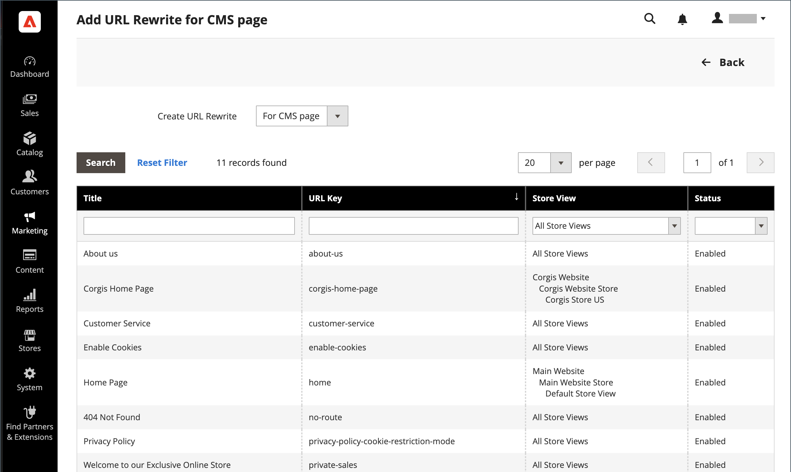

# Neuschreibungen der Inhaltsseite

Bevor Sie beginnen, stellen Sie sicher, dass Sie genau verstehen, was die Umleitung zu erreichen ist. Denken Sie an _target_ / _source_ oder _redirect to_ / _redirect from_. Obwohl Personen möglicherweise immer noch über Suchmaschinen oder veraltete Links zur vorherigen Seite navigieren, führt die Umleitung dazu, dass Ihr Store zum neuen Ziel wechselt.

{width="700" zoomable="yes"}

## Schritt 1. Umschreiben planen

Um Fehler zu vermeiden, schreiben Sie den URL-Schlüssel der Seite _Umleiten zu_ und _Umleiten von_ auf.

Wenn Sie sich nicht sicher sind, öffnen Sie jede Seite in Ihrem Store und kopieren Sie den Pfad aus der Adressleiste Ihres Browsers.

### CMS-Seitenpfad

Umleiten zu: `new-page`

Umleiten von: `old-page`

## Schritt 2. Umschreiben erstellen

{{url-rewrite-params}}

1. Navigieren Sie in _Admin_-Seitenleiste zu **[!UICONTROL Marketing]** > _[!UICONTROL SEO & Search]_>**[!UICONTROL URL Rewrites]**.

1. Bevor Sie fortfahren, gehen Sie wie folgt vor, um zu überprüfen, ob der Anfragepfad verfügbar ist.

   - Geben Sie im Suchfilter oben in der Spalte **[!UICONTROL Request Path]** den URL-Schlüssel der umzuleitenden Seite ein und klicken Sie auf **[!UICONTROL Search]**.

   - Wenn mehrere Umleitungsdatensätze für die Seite vorhanden sind, suchen Sie den entsprechenden Umleitungsdatensatz in der Store-Ansicht und öffnen Sie ihn im Bearbeitungsmodus.

   - Klicken Sie oben rechts auf **[!UICONTROL Delete]**. Wenn Sie dazu aufgefordert werden, klicken Sie zur Bestätigung auf **[!UICONTROL OK]** .

1. Wenn Sie zur Seite „URL-Neuschreibungen“ zurückkehren, klicken Sie auf **[!UICONTROL Add URL Rewrite]**.

1. Legen Sie **[!UICONTROL Create URL Rewrite]** auf `for CMS page` fest.

1. Suchen Sie Ihre neue Zielseite im Raster und öffnen Sie sie im Bearbeitungsmodus.

   {width="700" zoomable="yes"}

1. Gehen Sie unter „URL Rewrite Information“ wie folgt vor:

   - Wenn Sie über mehrere Store-Ansichten verfügen, wählen Sie die **[!UICONTROL Store]** aus, für die die Umschreibung gilt.

   - Geben Sie **[!UICONTROL Request Path]** den URL-Schlüssel der Originalseite ein, die der Kunde anfordert. Dies ist die Seite _Umleitung von_.

     >[!NOTE]
     >
     >Der Anfragepfad muss für den angegebenen Speicher eindeutig sein. Wenn bereits eine Umleitung vorhanden ist, die denselben Anfragepfad verwendet, erhalten Sie eine Fehlermeldung, wenn Sie versuchen, die Umleitung zu speichern. Die vorherige Umleitung muss gelöscht werden, bevor Sie eine erstellen können.

   - Legen Sie **[!UICONTROL Redirect]** auf eine der folgenden Einstellungen fest:

      - `Temporary (302)`
      - `Permanent (301)`

   - Geben Sie als Referenz eine kurze Beschreibung der Neufassung ein.

   {width="600" zoomable="yes"}

1. Bevor Sie die Umleitung speichern, überprüfen Sie Folgendes:

   - Der Link oben links zeigt den Namen der Zielseite an.
   - Der Anfragepfad enthält den Pfad für die ursprüngliche Seite _Umleitung von_.

1. Klicken Sie abschließend auf **[!UICONTROL Save]**.

   Die neue Umschreibung wird im Raster oben in der Liste angezeigt.

## Schritt 3. Testen des Ergebnisses

1. Navigieren Sie zur Startseite Ihres Geschäfts.

1. Führen Sie einen der folgenden Schritte aus:

   - Navigieren Sie zur ursprünglichen Seite _Umleitung von_.
   - Geben Sie in der Adressleiste des Browsers den Namen der ursprünglichen Seite _Umleitung von_ unmittelbar nach der Store-URL ein und drücken Sie **Eingabetaste**.

   Die neue Zielseite wird anstelle der ursprünglichen Seitenanfrage angezeigt.

## Feldbeschreibungen

| Feld | Beschreibung |
|--- |--- |
| [!UICONTROL Create URL Rewrite] | Gibt den Typ der Neuschreibung an. Der Typ kann nach dem Erstellen der Neuschreibung nicht mehr geändert werden. Optionen: `Custom` / `For category` / `For product` / `For CMS page` |
| [!UICONTROL Request Path] | Die CMS-Seite, die umgeleitet werden soll. Der Anfragepfad muss eindeutig sein und kann nicht von einer anderen Umleitung verwendet werden. Wenn Sie eine Fehlermeldung erhalten, dass der Anfragepfad vorhanden ist, löschen Sie die vorhandene Umleitung und versuchen Sie es erneut. |
| [!UICONTROL Target Path] | Der interne Pfad, der vom System zum Verweisen auf das Ziel verwendet wird. Der Zielpfad ist ausgegraut und kann nicht bearbeitet werden. |
| [!UICONTROL Redirect] | Bestimmt den Umleitungstyp. Optionen:  **[!UICONTROL No]**- Keine Umleitung angegeben. **[!UICONTROL Temporary (302)]** - Gibt Suchmaschinen an, dass die Neufassung für eine begrenzte Zeit erfolgt. Suchmaschinen speichern im Allgemeinen keine Seitenrangangaben für temporäre Neuschreibungen.  **[!UICONTROL Permanent (301)]**- Gibt Suchmaschinen an, dass die Neuschreibung dauerhaft ist. Suchmaschinen behalten im Allgemeinen Seitenrangangaben für permanente Neuschreibungen bei. |
| [!UICONTROL Description] | Beschreibt den Zweck der Neufassung für interne Referenzen. |

{style="table-layout:auto"}
