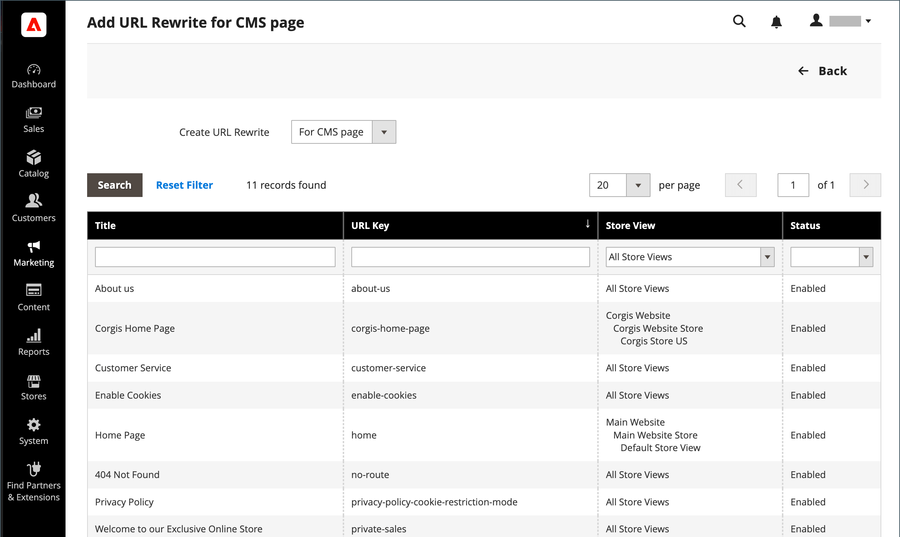

# URL-Neuschreibungen für Inhaltsseiten

Bevor Sie beginnen, sollten Sie genau wissen, was die Umleitung erreichen soll. Denken Sie an _target_ / _source_ oder _umleiten zu_ / _umleiten von_. Auch wenn Personen von Suchmaschinen oder veralteten Links aus zur ersten Seite navigieren, bewirkt die Umleitung, dass Ihr Store zum neuen Ziel wechselt.

{width="700" zoomable="yes"}

## Schritt 1. Neuschreiben planen

Um Fehler zu vermeiden, schreiben Sie den URL-Schlüssel des _umleiten zu_ und _umleiten von_ Seite.

Wenn Sie sich nicht sicher sind, öffnen Sie jede Seite in Ihrem Store und kopieren Sie den Pfad aus der Adressleiste Ihres Browsers.

### CMS-Seitenpfad

Umleiten zu: `new-page`

Umleiten von: `old-page`

## Schritt 2. Erstellen des Neuschreibens

{{url-rewrite-params}}

1. Im _Admin_ Seitenleiste, navigieren Sie zu **[!UICONTROL Marketing]** > _[!UICONTROL SEO & Search]_>**[!UICONTROL URL Rewrites]**.

1. Bevor Sie fortfahren, führen Sie die folgenden Schritte aus, um sicherzustellen, dass der Anfragepfad verfügbar ist.

   - Im Suchfilter oben im **[!UICONTROL Request Path]** eingeben, den URL-Schlüssel der Seite eingeben, die umgeleitet werden soll, und auf **[!UICONTROL Search]**.

   - Wenn mehrere Umleitungsdatensätze für die Seite vorhanden sind, suchen Sie den, der der entsprechenden Store-Ansicht entspricht, und öffnen Sie ihn im Bearbeitungsmodus.

   - Klicken Sie oben rechts auf **[!UICONTROL Delete]**. Klicken Sie bei Aufforderung auf **[!UICONTROL OK]** zur Bestätigung.

1. Wenn Sie zur Seite &quot;URL-Neuschreibungen&quot;zurückkehren, klicken Sie auf **[!UICONTROL Add URL Rewrite]**.

1. Satz **[!UICONTROL Create URL Rewrite]** nach `for CMS page`.

1. Suchen Sie Ihre neue Zielseite im Raster und öffnen Sie sie im Bearbeitungsmodus.

   {width="700" zoomable="yes"}

1. Führen Sie unter &quot;URL Rewrite Information&quot;die folgenden Schritte aus:

   - Wenn Sie mehrere Store-Ansichten haben, wählen Sie die **[!UICONTROL Store]** wobei die Neufassung gilt.

   - Für **[!UICONTROL Request Path]** Geben Sie den URL-Schlüssel der Originalseite ein, die der Kunde anfordert. Dies ist die _umleiten von_ Seite.

     >[!NOTE]
     >
     >Der Anfragepfad muss für den angegebenen Store eindeutig sein. Wenn bereits eine Weiterleitung vorhanden ist, die denselben Anfragepfad verwendet, erhalten Sie beim Speichern der Weiterleitung einen Fehler. Die vorherige Umleitung muss gelöscht werden, bevor Sie sie erstellen können.

   - Satz **[!UICONTROL Redirect]** auf einen der folgenden Werte zu:

      - `Temporary (302)`
      - `Permanent (301)`

   - Geben Sie als Referenz eine kurze Beschreibung des Neuschreibens ein.

   {width="600" zoomable="yes"}

1. Bevor Sie die Umleitung speichern, überprüfen Sie Folgendes:

   - Der Link oben links zeigt den Namen der Zielseite an.
   - Der Anfragepfad enthält den Pfad für das Original _umleiten von_ Seite.

1. Wenn Sie fertig sind, klicken Sie auf **[!UICONTROL Save]**.

   Das neue Neuschreiben wird im Raster oben in der Liste angezeigt.

## Schritt 3. Ergebnis testen

1. Gehen Sie zur Startseite Ihres Stores.

1. Führen Sie einen der folgenden Schritte aus:

   - Navigieren zum Original _umleiten von_ Seite.
   - Geben Sie in der Adressleiste des Browsers den Namen des Originals ein _umleiten von_ Seite direkt nach der Store-URL und drücken Sie **Eingabe**.

   Die neue Zielseite wird anstelle der ursprünglichen Seitenanforderung angezeigt.

## Feldbeschreibungen

| Feld | Beschreibung |
|--- |--- |
| [!UICONTROL Create URL Rewrite] | Gibt den Typ des Neuschreibens an. Der Typ kann nach der Erstellung des Neuschreibens nicht mehr geändert werden. Optionen: `Custom` / `For category` / `For product` / `For CMS page` |
| [!UICONTROL Request Path] | Die CMS-Seite, die umgeleitet werden soll. Der Anfragepfad muss eindeutig sein und kann nicht von einer anderen Umleitung verwendet werden. Wenn Sie eine Fehlermeldung erhalten, dass der Anfragepfad vorhanden ist, löschen Sie die vorhandene Umleitung und versuchen Sie es erneut. |
| [!UICONTROL Target Path] | Der interne Pfad, der vom System verwendet wird, um auf das Ziel zu verweisen. Der Zielpfad ist ausgegraut und kann nicht bearbeitet werden. |
| [!UICONTROL Redirect] | Bestimmt den Typ der Umleitung. Optionen:  **[!UICONTROL No]**- Es wird keine Umleitung angegeben. **[!UICONTROL Temporary (302)]** - Gibt Suchmaschinen an, dass das Neuschreiben für eine begrenzte Zeit erfolgt. Suchmaschinen speichern in der Regel keine Seiteneinstufungsinformationen für temporäre Neuschreibungen.  **[!UICONTROL Permanent (301)]**- Gibt Suchmaschinen an, dass das Neuschreiben dauerhaft ist. Suchmaschinen behalten in der Regel Seiteneinstufungsinformationen für permanente Neuschreibungen bei. |
| [!UICONTROL Description] | Beschreibt den Zweck des Neuschreibens für interne Verweise. |

{style="table-layout:auto"}
