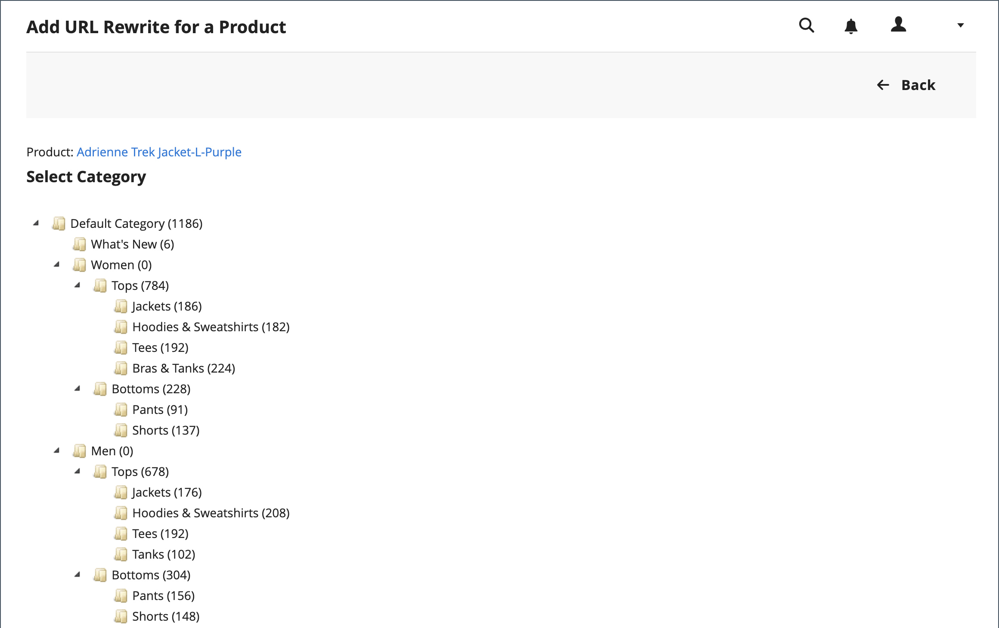

# Produkt-URL-Neuschreibungen

Bevor Sie beginnen, sollten Sie genau wissen, was die Umleitung erreichen soll. Denken Sie an die Werte _target_ / _original request_ oder _redirect to_ / _redirect from_. Auch wenn Personen von Suchmaschinen oder veralteten Links aus zur ersten Seite navigieren, bewirkt die Umleitung, dass Ihr Store zum neuen Ziel wechselt.

Wenn [automatische Umleitungen](url-redirect-product-automatic.md) für Ihren Store aktiviert sind, müssen Sie keine Umschreibungen erstellen, wenn ein Produkt [URL-Schlüssel](../catalog/catalog-urls.md) geändert wird.

{{url-rewrite-skip}}

## Schritt 1. Neuschreiben planen

Um Fehler zu vermeiden, schreiben Sie den Pfad _redirect to_ und den Pfad _redirect from_ auf und fügen Sie den URL-Schlüssel und das Suffix hinzu (falls zutreffend).

Wenn Sie sich nicht sicher sind, öffnen Sie jede Produktseite in Ihrem Store und kopieren Sie den Pfad aus der Adressleiste Ihres Browsers. Beim Erstellen einer Produktumleitung können Sie den [Kategoriepfad](../catalog/catalog-urls.md) entweder ein- oder ausschließen. In diesem Beispiel erstellen wir eine Produktumleitung ohne Kategoriepfad.

### Produkt mit Kategoriepfad

Umleiten zu: `gear/bags/impulse-duffle.html`

Umleiten von: `gear/bags/overnight-duffle.html`

### Produkt ohne Kategoriepfad

Umleiten zu: `impulse-duffle.html`

Umleiten von: `overnight-duffle.html`

## Schritt 2. Erstellen des Neuschreibens

{{url-rewrite-params}}

1. Wechseln Sie in der Seitenleiste _Admin_ zu **[!UICONTROL Marketing]** > _[!UICONTROL SEO & Search]_>**[!UICONTROL URL Rewrites]**.

1. Bevor Sie fortfahren, führen Sie die folgenden Schritte aus, um sicherzustellen, dass der Anfragepfad verfügbar ist.

   - Geben Sie im Suchfilter oben in der Spalte **[!UICONTROL Request Path]** den URL-Schlüssel der umzuleitenden Seite ein und klicken Sie auf **[!UICONTROL Search]**.

   - Wenn mehrere Umleitungsdatensätze für die Seite vorhanden sind, suchen Sie den, der der entsprechenden Store-Ansicht entspricht, und öffnen Sie ihn im Bearbeitungsmodus.

   - Klicken Sie in der oberen rechten Ecke auf **[!UICONTROL Delete]**. Klicken Sie nach Aufforderung zur Bestätigung auf **[!UICONTROL OK]** .

1. Klicken Sie in der rechten oberen Ecke der Seite &quot;URL-Neuschreibungen&quot;auf **URL-Neuschreibungen hinzufügen**.

1. Setzen Sie **[!UICONTROL Create URL Rewrite]** auf `For product`.

1. Suchen Sie im Raster das Produkt, das das Ziel (Ziel) der Umleitung ist, und klicken Sie auf die Zeile.

   {width="700" zoomable="yes"}

1. Klicken Sie unter der Kategorienstruktur auf **[!UICONTROL Skip Category Selection]**.

   In diesem Beispiel enthält die Umleitung keine Kategorie.

   {width="600" zoomable="yes"}

   Auf der Seite URL-Neufassung für ein Produkt hinzufügen wird links oben ein Link zum Ziel angezeigt. Im Feld Zielpfad wird die Systemversion des Pfads angezeigt, die nicht geändert werden kann. Zunächst zeigt das Feld Umleitungspfad auch den Zielpfad an.

   - Wenn Sie mehrere Store-Ansichten haben, setzen Sie &quot;**[!UICONTROL Store]**&quot;auf die Ansicht, für die das Neuschreiben gilt. Andernfalls wird für jede Ansicht ein Umschreiben erstellt.

   - Ersetzen Sie für **[!UICONTROL Request Path]** den Standardwert, indem Sie den URL-Schlüssel und das Suffix (falls zutreffend) der ursprünglichen Produktanfrage eingeben. Dies ist die _Umleitung von_ -Produkt, die Sie im Planungsschritt identifiziert haben.

     >[!NOTE]
     >
     >Der Anfragepfad muss für den angegebenen Store eindeutig sein. Wenn bereits eine Weiterleitung vorhanden ist, die denselben Anfragepfad verwendet, erhalten Sie beim Speichern der Weiterleitung einen Fehler. Die vorherige Umleitung muss gelöscht werden, bevor Sie sie erstellen können.

   - Setzen Sie **[!UICONTROL Redirect Type]** auf einen der folgenden Werte:

      - `Temporary (302)`
      - `Permanent (301)`

   - Geben Sie für Ihre eigene Referenz eine kurze **[!UICONTROL Description]** des Neuschreibens ein.

   {width="600" zoomable="yes"}

1. Bevor Sie die Umleitung speichern, überprüfen Sie Folgendes:

   - Der Link oben links zeigt den Namen des Zielprodukts an.
   - Der Anfragepfad enthält den Pfad für die ursprüngliche _Umleitung vom_ -Produkt.

1. Klicken Sie nach Abschluss des Vorgangs auf **[!UICONTROL Save]**.

   Das neue Produkt-Rewrite wird jetzt oben im Raster URL-Neuschreibungen angezeigt.

## Schritt 3. Ergebnis testen

1. Gehen Sie zur Startseite Ihres Stores.

1. Führen Sie einen der folgenden Schritte aus:

   - Navigieren Sie von der Seite mit der Produktanfrage _zur ursprünglichen_ Umleitung.
   - Geben Sie in der Adressleiste des Browsers den Pfad zur ursprünglichen _Umleitung vom_ -Produkt direkt nach der Store-URL ein und drücken Sie die **Eingabetaste**.

   Das neue Zielprodukt wird anstelle der ursprünglichen Produktanfrage angezeigt.

## Feldbeschreibungen

| Feld | Beschreibung |
|--- |--- |
| [!UICONTROL Create URL Rewrite] | Gibt den Typ des Neuschreibens an. Der Typ kann nach der Erstellung des Neuschreibens nicht mehr geändert werden. Optionen: `Custom` / `For category` / `For product` / `For CMS page` |
| [!UICONTROL Request Path] | Das Produkt, das umgeleitet werden soll. Je nach Konfiguration kann der Anfragepfad das Suffix `.html` oder das Suffix `.htm` und die Kategorie enthalten. Der Anfragepfad muss eindeutig sein und kann nicht von einer anderen Umleitung verwendet werden. Wenn Sie eine Fehlermeldung erhalten, dass der Anfragepfad vorhanden ist, löschen Sie die vorhandene Umleitung und versuchen Sie es erneut. |
| [!UICONTROL Target Path] | Der interne Pfad, der vom System verwendet wird, um auf das Ziel der Umleitung zu verweisen. Der Zielpfad ist ausgegraut und kann nicht bearbeitet werden. |
| [!UICONTROL Redirect] | Bestimmt den Typ der Umleitung. Optionen:  **[!UICONTROL No]**- Es wird keine Umleitung angegeben. Viele Vorgänge erstellen Umleitungsanfragen dieses Typs. Jedes Mal, wenn Sie beispielsweise Produkte zu einer Kategorie hinzufügen, wird für jede Store-Ansicht eine Umleitung vom Typ `No` erstellt. **[!UICONTROL Temporary (302)]** - Gibt Suchmaschinen an, dass das Neuschreiben für eine begrenzte Zeit erfolgt. Suchmaschinen speichern in der Regel keine Seiteneinstufungsinformationen für temporäre Neuschreibungen.  **[!UICONTROL Permanent (301)]**- Gibt Suchmaschinen an, dass das Neuschreiben dauerhaft ist. Suchmaschinen behalten in der Regel Seiteneinstufungsinformationen für permanente Neuschreibungen bei. |
| [!UICONTROL Description] | Beschreibt den Zweck des Neuschreibens für interne Verweise. |

{style="table-layout:auto"}

## Mehrere URL-Neuschreibungen

Mit den folgenden Schritten können Sie URL-Neuschreibungen für mehrere oder alle Produkte gleichzeitig aktualisieren.

1. Wechseln Sie in der Seitenleiste _Admin_ zu **[!UICONTROL Catalog]** > **[!UICONTROL Products]**.

1. Wählen Sie alle Produkte aus, für die Sie URL-Neuschreibungen aktualisieren möchten.

1. Wählen Sie unter _[!UICONTROL Actions]_**[!UICONTROL Update attributes]**aus, um mehrere oder alle Neuschreibungen zu aktualisieren.

1. Klicken Sie unter &quot;_[!UICONTROL PRODUCTS INFORMATION]_&quot;auf die Registerkarte &quot;**[!UICONTROL Websites]**&quot;.

1. Wählen Sie im Abschnitt _[!UICONTROL Add Product To Websites]_alle Websites aus, für die Sie URL-Neuschreibungen wiederherstellen möchten.

1. Klicken Sie, wenn Sie bereit zur Aktualisierung sind, auf **[!UICONTROL Save]**.

>[!NOTE]
>
>Alle ausgewählten Produkte werden auf den ausgewählten Websites angezeigt und URL-Neuschreibungen werden neu generiert.

{width="600" zoomable="yes"}
