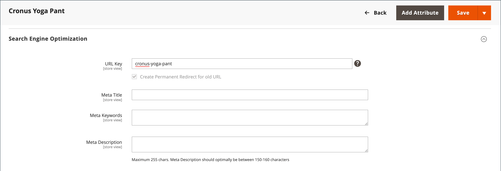
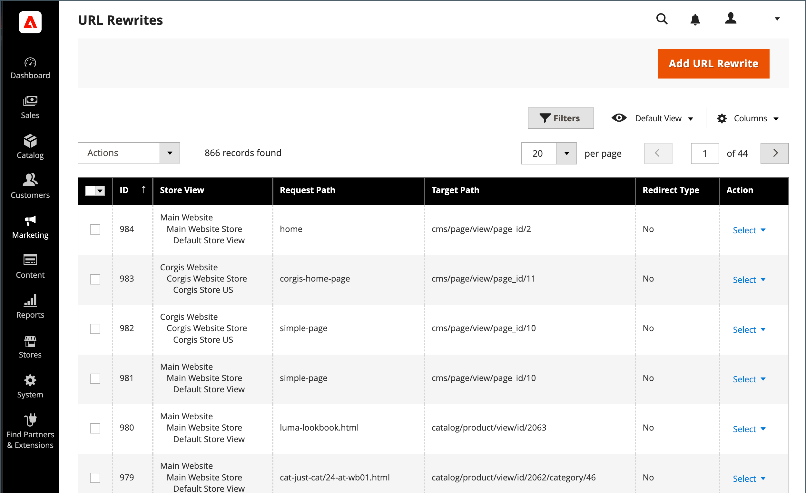
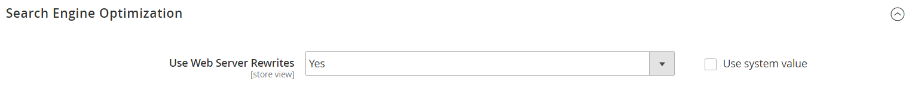

# URL-Neuschreibungen

>[!TIP]
>
>Informationen zu Adobe Commerce as a Cloud Service finden Sie in den [SEO-Richtlinien](https://experienceleague.adobe.com/developer/commerce/storefront/setup/seo/indexing/) in der Dokumentation zu Commerce Storefront

Mit dem Tool zum Neuschreiben von URLs können Sie jede URL ändern, die mit einem Produkt, einer Kategorie oder einer CMS-Seite verknüpft ist. Beim Erstellen einer URL-Umschreibung erstellt Commerce automatisch eine permanente Umleitung (301), sodass alle Links, die auf die alte URL verweisen, an die neue Adresse umgeleitet werden.

>[!NOTE]
>
>Informationen zum Aktualisieren von URL-Neuschreibungen für mehrere oder alle Produkte gleichzeitig finden Sie unter [Mehrere URL-Neuschreibungen](url-rewrite-product.md#multiple-url-rewrites).

>[!BEGINSHADEBOX „Grundlegendes zu Neuschreibungen und Weiterleitungen“]

Die Begriffe _umschreiben_ und _umleiten_ werden häufig synonym verwendet, es handelt sich jedoch um verschiedene Vorgänge:

* **URL Rewrite** - Ein Server-seitiger Prozess, der intern eine URL einer anderen zuordnet, ohne die Anzeige in der Adressleiste des Browsers zu ändern. Wenn ein Besucher eine URL anfordert, verarbeitet der Server sie im Hintergrund als andere URL, der Browser zeigt jedoch weiterhin die ursprüngliche URL an.

* **URL-Umleitung** - Sendet eine HTTP-Antwort an den Browser und weist ihn an, zu einer anderen URL zu navigieren. Die Adressleiste des Browsers wird aktualisiert und zeigt die neue URL an. Umleitungen können temporär (302) oder permanent (301) sein.

>[!ENDSHADEBOX]

## Funktionsweise des Tools „Neuschreibungen“

In Adobe Commerce erstellt das Tool zum Neuschreiben von URLs standardmäßig dauerhafte Weiterleitungen (301), um den SEO-Wert beizubehalten, wenn Sie den URL-Schlüssel eines Produkts, einer Kategorie oder einer Seite ändern. Dadurch wird sichergestellt, dass vorhandene Links weiterhin funktionieren und Suchmaschinen-Rankings beibehalten werden.

Standardmäßig sind [automatische URL-Umleitungen](url-redirect-product-automatic.md) für Ihren Store aktiviert und das Kontrollkästchen **Ständige Umleitung für alte URL erstellen** unter dem URL-Schlüsselfeld jedes Produkts ist aktiviert.

{{url-rewrite-skip}}

{width="600" zoomable="yes"}

{{url-rewrite-params}}

## Demo-URL-Neuschreibungen

Sehen Sie sich das folgende Video an, um mehr über die Verwaltung von URL-Neuschreibungen zu erfahren:

>[!VIDEO](https://video.tv.adobe.com/v/343751?quality=12&learn=on)

## URL-Neuschreibungen erstellen

Verwenden Sie das URL-Rewrites-Tool, um Produkt- und Kategorieumleitungen sowie benutzerdefinierte Umleitungen für jede Seite in Ihrem Store zu erstellen. Wenn die URL-Umschreibungskonfiguration angewendet wird, werden alle vorhandenen Links, die auf die vorherige URL verweisen, nahtlos an die neue Adresse umgeleitet.

Sie können URL-Umschreibungen erstellen für:

* Fügen Sie hochwertige Keywords hinzu, um die Art und Weise zu verbessern, wie das Produkt von Suchmaschinen indiziert wird.

* Fügen Sie zusätzliche URLs für eine temporäre saisonale oder permanente Änderung hinzu.

* Fügen Sie einen gültigen Pfad für eine Seite hinzu, einschließlich CMS-Inhaltsseiten. Sie können beispielsweise eine URL erstellen, um eine benutzerfreundlichere oder SEO-freundlichere URL zu einem System zu erstellen, das immer Produkte und Kategorien anhand ihrer internen ID referenziert.

Die neu geschriebenen URLs können zu vorhandenen Kategorien oder benutzerdefinierten Seiten umgeleitet werden, ohne die Site-Struktur zu ändern. So wird das Erstellen einprägsamer URLs für Marketing-Kampagnen vereinfacht.

{width="700" zoomable="yes"}

Commerce bietet die folgenden URL-Neuschreibungstypen:

* [Produktneuschreibungen](url-rewrite-product.md)
* [Neuschreibungen von Kategorien](url-rewrite-category.md)
* [CMS-Seitenumschreibungen](url-rewrite-cms-page.md)
* [Benutzerdefinierte Neuschreibungen](url-rewrite-custom.md)

### Anwendungsfälle und Beispiele

URL-Neuschreibungen werden in diesen Szenarien häufig verwendet:

#### Ändern einer internen System-URL in eine SEO-freundliche URL

Commerce verwendet intern ID-basierte URLs, aber Sie können SEO-freundliche URLs für Kunden erstellen:

**System-URL (intern):**

    http://www.example.com/catalog/category/id/6

**Kundenseitige URL:**

    http://www.example.com/peripherals/keyboard.html

#### Produkt-Rebranding oder URL-Optimierung

Wenn Sie ein Produkt umbenennen oder seine URL für SEO verbessern möchten, erstellen Sie eine Umleitung, um vorhandene Links beizubehalten:

**Ursprüngliche URL:**

    http://www.example.com/peripherals/keyboard.html

**Neue optimierte URL:**

    http://www.example.com/ergonomic-keyboard.html

Das Tool Rewrites erstellt automatisch eine 301-Umleitung von der alten zur neuen URL, sodass Kunden und Suchmaschinen nahtlos zur richtigen Seite weitergeleitet werden.

#### Landingpages zu Werbeaktionen

Erstellen Sie temporäre oder permanente benutzerdefinierte URLs für Marketing-Kampagnen:

**Werbe-URLs:**

    http://www.example.com/all-on-sale.html
    http://www.example.com/save-now/spring-sale

## Zusätzliche URL-Verwaltungskonfiguration

In den folgenden Abschnitten wird beschrieben, wie Sie Webserver-Neuschreibungen und kanonische URLs für Commerce konfigurieren.

### Konfigurieren von Webserver-Neuschreibungen

>[!NOTE]
>
>In diesem Abschnitt wird das Umschreiben von URLs auf Webserverebene beschrieben, das sich von der Funktion des URL Rewrite-Tools unterscheidet. Webserver-Neuschreibungen handhaben die technische URL-Formatierung (z. B. das Entfernen von `index.php`), während das URL-Neuschreibungs-Tool Weiterleitungen für Inhaltsänderungen verwaltet.

Die Aktivierung von Webserver-Neuschreibungen ist Teil der Ersteinrichtung von Commerce und wird normalerweise während der Installation konfiguriert. Wenn diese Option aktiviert ist, entfernt der Webserver (Apache oder Nginx) automatisch die `index.php` Dateinamen aus den URLs, wodurch sauberere, SEO-freundlichere Adressen entstehen.
Das folgende Beispiel zeigt, wie URLs mit und ohne aktivierten Webserver-Neuschreibungen angezeigt werden:

**URL ohne Umschreiben des Webservers**

    http://www.yourdomain.com/magento/index.php/storeview/url-identifier

**URL mit Webserver-Neuschreibung**

    http://www.yourdomain.com/magento/storeview/url-identifier

#### Webserver-Neuschreibungen aktivieren oder deaktivieren:

1. Navigieren Sie in _Admin_-Seitenleiste zu **[!UICONTROL Stores]** > _[!UICONTROL Settings]_>**[!UICONTROL Configuration]**.

1. Wählen Sie im linken Bedienfeld, in dem **[!UICONTROL General]** erweitert ist, **[!UICONTROL Web]** aus.

1. Erweitern Sie  den Abschnitt **[!UICONTROL Search Engine Optimization]** .

   {width="600" zoomable="yes"}

1. Legen Sie **[!UICONTROL Use Web Server Rewrites]** auf Ihre Voreinstellung fest.

1. Klicken Sie abschließend auf **[!UICONTROL Save Config]**.

### Kanonische URLs angeben

Für SEO-Zwecke sollte jede Ihrer Web-Seiten nur eine, unterschiedliche URL haben.

Wenn Sie über eine einzelne Seite verfügen, auf die über mehrere URLs zugegriffen werden kann, oder über verschiedene Seiten mit ähnlichem Inhalt, werden diese von Google als doppelte Versionen derselben Seite angezeigt. Google wählt eine URL als kanonische Version aus und crawlen dies, und alle anderen URLs werden als doppelte URLs betrachtet und seltener crawlen.

Wenn Sie Google nicht explizit mitteilen, welche URL kanonisch ist, trifft es die Entscheidung für Sie, oder beide werden als gleich wichtig erachtet. Dies kann zu unerwünschtem Verhalten führen und birgt das Risiko eines ineffektiven crawlen Budgets und geringer verteilter Backlinks.

Je nachdem, wie Sie Ihre Website einrichten, kann der Index mehrere Versionen Ihrer Website enthalten, z. B.:

    https://www.example.com
    https://www.example.com/
    http://www.example.com
    https://example.com
    https://www.example.com/index.html

Informationen zum Angeben einer kanonischen Seite finden Sie in der [Dokumentation zu Google Search Central](https://developers.google.com/search/docs/crawling-indexing/consolidate-duplicate-urls).
