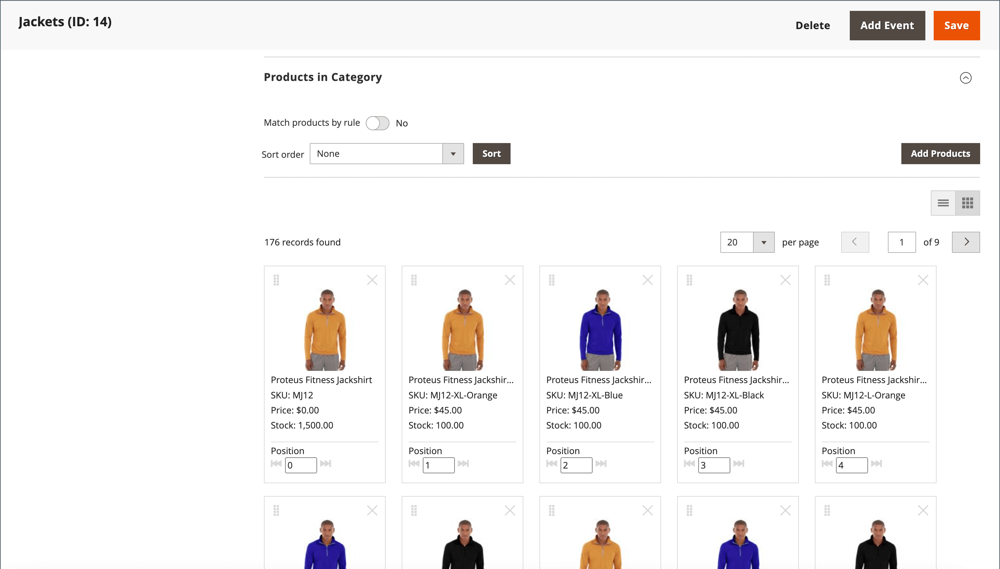
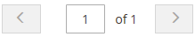

# Visual Merchandiser

{{ee-feature}}

Der _Visual Merchandiser_ ist ein Satz erweiterter Tools, mit denen Sie Produkte positionieren und Bedingungen anwenden können, die bestimmen, welche Produkte in der Kategorieliste angezeigt werden. Das Ergebnis kann eine dynamische Auswahl von Produkten sein, die sich an Änderungen im Katalog anpasst. Sie können im _visuellen Modus_ arbeiten, der jedes Produkt als Kachel auf einem Raster anzeigt, oder aus einer Liste von Produkten in der Kategorie arbeiten. In jedem Modus stehen die gleichen Tools zur Verfügung, und Sie können mit den Schaltflächen in der oberen rechten Ecke zwischen den verschiedenen Anzeigetypen wechseln.

{width="600" zoomable="yes"}

## Zugriff auf Visual Merchandiser

1. Navigieren Sie in der _Admin_-Seitenleiste zu **[!UICONTROL Catalog]** > **[!UICONTROL Categories]**.

1. Drilldown in der Kategoriestruktur durchführen und auf die Kategorie klicken, die Sie bearbeiten möchten.

1. Scrollen Sie nach unten und erweitern Sie  den Abschnitt **[!UICONTROL Products in Category]** .

1. Klicken Sie auf _Als Kacheln anzeigen_ (  ), um die Produkte als Raster anzuzeigen.

1. Klicken Sie abschließend auf **[!UICONTROL Save Category]**.

## Position eines Produkts ändern

1. Verwenden Sie die [Sortierreihenfolge](../catalog/navigation-product-listings.md), um das Produkt anzuzeigen, das Sie verschieben möchten.

   - **Methode 1: Drag-and-Drop**

     Greifen Sie das Steuerelement _Ziehen_ () in der oberen rechten Ecke der Produktkachel und legen Sie das Produkt in der Position ab. Die Anzahl der einzelnen Produkte wird entsprechend der neuen Position angepasst.

   - **Methode 2: Positionswert festlegen**

     Geben _im_-Controller () auf der Produktkachel die Nummer ein, unter der das Produkt angezeigt werden soll. Geben Sie `0` ein, um das Produkt an den Anfang der Liste zu setzen.

1. Klicken Sie abschließend auf **[!UICONTROL Save Category]**.

>[!NOTE]
>
>Bei einer Neuinstallation reserviert Adobe Commerce die Kategorie-ID `2` für den Stammkatalog des Standardspeichers. Visual Merchandiser kann nur Kategorien mit einer ID-Nummer von `3` oder höher verwenden.

## Workspace-Steuerelemente

| Kontrolle | Beschreibung |
|--- |--- |
|  | Als Liste anzeigen |
|  | Als Kacheln anzeigen |
|  | Übereinstimmung nach Regel - Nein |
|  | Übereinstimmung nach Regel - ja |
|  | Schleppen |
|  | Position |
|  | Aus Kategorie entfernen |
|  | Pro Seite anzeigen |
|  | Weiter/Zurück |

{style="table-layout:auto"}
