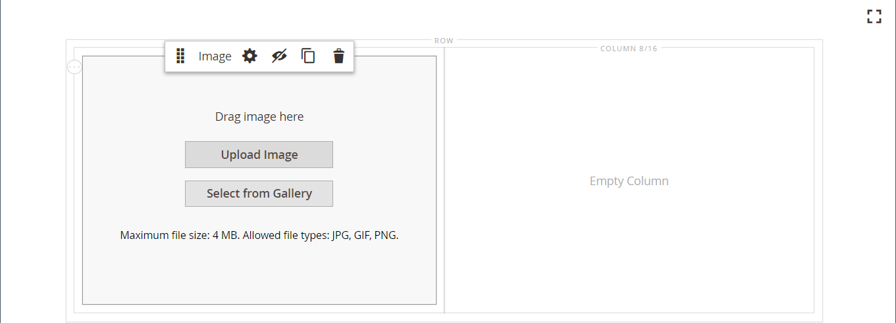

# [!DNL Page Builder] Exemplarische Vorgehensweise: Teil 1: einfache Seite

In dieser dreiteiligen Übung erfahren Sie mehr über den Arbeitsbereich [!DNL Page Builder], indem Sie eine einfache Seite erstellen, die veranschaulicht, wie einfach es ist, inhaltsreiche Seiten Ihres eigenen Designs zu erstellen.

{width="700" zoomable="yes"}

>[!NOTE]
>
>Diese exemplarischen Vorgehensweisen werden aktualisiert, um die jüngsten Änderungen am Arbeitsbereich [!DNL Page Builder] in Version 2.4.1 widerzuspiegeln.

## Bevor Sie beginnen

Bevor Sie mit dieser Übung beginnen, sollten Sie die [Lebensdauer der Admin-Sitzung](../systems/security-admin.md) erhöhen, um zu verhindern, dass die Sitzung während der Arbeit abläuft.

Überprüfen Sie die erforderlichen Content Management-Konfigurationseinstellungen:

- Der WYSIWYG-Editor ist in der Konfiguration [WYSIWYG-Optionen](../content-design/editor.md#configure-the-editor) aktiviert.

- [!DNL Page Builder] ist in der Konfiguration [Erweiterte Content Tools](setup.md) aktiviert.

### Herunterladen von exemplarischen Bild-Assets

1. Laden Sie die Datei [`simple-page-assets`](./assets/simple-page-assets.zip) herunter und speichern Sie sie auf Ihrem lokalen System.

1. Navigieren Sie zur heruntergeladenen Datei und extrahieren Sie die komprimierten Dateien.

   Klicken Sie auf einem Windows-System mit der rechten Maustaste und wählen Sie **[!UICONTROL Extract All]** Dateien aus. Wählen Sie dann den Zielordner aus und klicken Sie auf **[!UICONTROL Extract]**.

   Auf einem Mac-System können Sie einfach auf die ZIP-Datei doppelklicken und die extrahierten Dateien in den Zielordner verschieben.

   Der Ordner enthält die folgenden Bilddateien:

   ![[!DNL Page Builder] Exemplarische Vorgehensweisen - einfache Seiten-Assets](./assets/pb-tutorial-simple-page-assets.png){width="500"}

Folgen Sie den drei Teilen dieser exemplarischen Vorgehensweise.

## Teil 1: Zeile mit vollständigem Anschnitt mit Banner

In diesem Teil der Übung Einfache Seite erstellen Sie eine Seite mit einer vollständigen Blindzeile und einem Banner. Die Zeile enthält verschiedene Hintergrundbilder für Desktop- und Mobilgeräte.

![[!DNL Page Builder] volle Anschnitt-Zeile mit Banner](./assets/pb-tutorial1-full-bleed-with-banner.png){width="700" zoomable="yes"}

### Schritt 1: Erstellen einer Seite

1. Wechseln Sie in der Seitenleiste _Admin_ zu **[!UICONTROL Content]** > _[!UICONTROL Elements]_>**[!UICONTROL Pages]**.

1. Klicken Sie oben rechts auf **[!UICONTROL Add New Page]** und führen Sie folgende Schritte aus:

   - Um zu verhindern, dass diese Seite in Ihrem Store veröffentlicht wird, setzen Sie **[!UICONTROL Enable Page]** auf `No`.

   - Geben Sie für **[!UICONTROL Page Title]** den Wert `Simple Page` ein.

   {width="600" zoomable="yes"}

1. Erweitern Sie  im Abschnitt **[!UICONTROL Design]** .

   Beachten Sie, dass **[!UICONTROL Layout]** standardmäßig auf `Page -- Full Width` gesetzt ist. Zusätzlich zu den fünf standardmäßigen [layout](../content-design/page-layout.md) -Optionen fügt [!DNL Page Builder] Layouts mit voller Breite für Seiten, Kategorien und Produkte hinzu.

1. Wenn die Beispieldaten verfügbar sind, setzen Sie **[!UICONTROL New Theme]** auf `Magento Luma`. Andernfalls können Sie ein anderes verfügbares Design auswählen oder es leer lassen, um das Standarddesign zu verwenden.

   Mit der Einstellung _[!UICONTROL New Theme]_können Sie das Standarddesign überschreiben und ein anderes Design auf die Seite anwenden.

   >[!NOTE]
   >
   >Das Layout &quot;Vollbreite&quot;kann nur mit einem kompatiblen [Design](../content-design/themes.md) verwendet werden.

   {width="600" zoomable="yes"}

1. Klicken Sie in der oberen rechten Ecke auf **[!UICONTROL Save]**.

   Wenn die Seite gespeichert wird, wird der Name _Einfache Seite_ in der oberen linken Ecke der Seite angezeigt.

### Schritt 2: Zeile formatieren

1. Erweitern Sie  im Abschnitt **[!UICONTROL Content]** .

   Diese Aktion zeigt die Vorschau von [!DNL Page Builder] mit einer leeren Zeile an.

   >[!NOTE]
   >
   >Das Feld [Inhaltsüberschrift](workspace.md) ist optional. Er ist standardmäßig entsprechend dem Design als Überschriftenebene 1 (H1) formatiert. Für diese Übung bleibt die _Inhaltsüberschrift_ leer.

   {width="600" zoomable="yes"}

1. Klicken Sie auf **[!UICONTROL Edit with Page Builder]** oder im Inhaltsvorschaubereich.

   Im erweiterten Arbeitsbereich [!DNL Page Builder] [2} bietet das Bedienfeld auf der linken Seite die Inhaltswerkzeuge, die Sie zum Erstellen Ihres Inhalts in der Bühne verwenden können.](workspace.md)

1. Bewegen Sie den Mauszeiger über die leere Zeile, um die Toolbox anzuzeigen.

   Jeder Inhaltscontainer verfügt über eine Toolbox mit ähnlichen Optionen.

   ![[!DNL Page Builder] row toolbox](./assets/pb-layout-page-add-content-row-tools.png){width="600" zoomable="yes"}

1. Wählen Sie in der Zeilen-Symbolleiste das Symbol _Einstellungen_ ({width="20"}).

1. Wählen Sie unter _[!UICONTROL Appearance]_die Option **Vollständiger Anschnitt**.

   Mit der Einstellung für das vollständige Anschnitt-Erscheinungsbild wird der linke und rechte Rand des Inhaltsbereichs der Zeile und des Hintergrunds auf die gesamte Seitenbreite erweitert.

   {width="600" zoomable="yes"}

1. Scrollen Sie nach unten zum Abschnitt _[!UICONTROL Advanced]_und setzen Sie alle **[!UICONTROL Margins and Padding]**Einstellungen auf `0`.

   Mit dieser Einstellung wird sichergestellt, dass das Banner die gesamte Breite der Zeile erweitert.

   {width="600" zoomable="yes"}

1. Um die Einstellungen zu speichern und zum Arbeitsbereich [!DNL Page Builder] zurückzukehren, scrollen Sie nach oben auf der Seite und klicken Sie in der oberen rechten Ecke auf **[!UICONTROL Save]** .

### Schritt 3: Banner hinzufügen

>[!NOTE]
>
>[!DNL Page Builder] hat einen neuen Inhaltstyp namens _Banner_ , der in diesem Schritt vorgestellt wird. Zuvor bestand die Option _Banner_ im Menü &quot;Inhalt&quot;aus der Option &quot;Dynamischer Block&quot;_._

1. Erweitern Sie im Bedienfeld [!DNL Page Builder] den Eintrag **[!UICONTROL Media]** und ziehen Sie einen Platzhalter für **Banner** auf die Bühne.

   {width="600" zoomable="yes"}
1. Bewegen Sie den Mauszeiger über den Banner-Container, um die Toolbox anzuzeigen.

   >[!NOTE]
   >
   >Die Bühne verfügt jetzt über zwei Inhaltscontainer, von denen jeder über eine eigene Toolbox verfügt. Da das Banner in der Zeile verschachtelt ist, stellen Sie sicher, dass Sie in der richtigen Toolbox arbeiten.

   Zusätzlich zur Toolbox sind die Schaltflächen _Bild hochladen_ und _Aus Galerie auswählen_ enthalten, damit Sie das Banner direkt von der Bühne aus ändern können.

   {width="600" zoomable="yes"}

1. Wählen Sie in der Banner-Toolbox das Symbol _Einstellungen_ ( {width="20"} ).

1. Wählen Sie unter &quot;_[!UICONTROL Appearance]_&quot;die Option &quot;**[!UICONTROL Collage Right]**&quot;.

   Mit der Einstellung &quot;Rechts reduzieren&quot;wird Inhalt auf der rechten Seite des Banners positioniert.

   {width="600" zoomable="yes"}

1. Scrollen Sie nach unten zum Abschnitt _[!UICONTROL Background]_und legen Sie das Hintergrundbild für das Banner fest:

   - Klicken Sie für &quot;**[!UICONTROL Background Image]**&quot;auf &quot;**Hochladen**&quot;.

     {width="600" zoomable="yes"}

     Navigieren Sie zum Verzeichnis, in dem Sie die extrahierten einfachen Seiten-Assets gespeichert haben, und wählen Sie die Datei &quot;`wide-banner-background.jpg`&quot;.

     Das Bild wird hochgeladen und eine Miniaturansicht des hochgeladenen Bildes wird angezeigt. Dateiname, Bilddimensionen und Dateigröße sind unten aufgeführt.

     {width="600" zoomable="yes"}

   - Klicken Sie für &quot;**[!UICONTROL Background Mobile Image]**&quot;auf &quot;**Hochladen**&quot;.

     Wählen Sie im selben Dateiverzeichnis die Datei &quot;`wide-banner-background-mobile.jpg`&quot;.

     Das mobile Hintergrundbild wird für Mobilgeräte und immer dann verwendet, wenn die Größe eines Desktop-Browserfensters auf die Breite eines Mobilgeräts geändert wird.

     {width="600" zoomable="yes"}

   - Scrollen Sie zurück zum Anfang der Seite und klicken Sie auf **[!UICONTROL Save]** , um die Einstellungen zu speichern und zum Arbeitsbereich [!DNL Page Builder] zurückzukehren.

     Der Hintergrund wird auf der Bühne angezeigt und erweitert die gesamte Breite der Zeile.

     {width="600" zoomable="yes"}

   Beachten Sie den Platzhaltertext, der rechts in der Zeile angezeigt wird. Die Position dieses Textes spiegelt die Einstellung für das Erscheinungsbild von _Collage Right_ wider.

1. Klicken Sie auf den Platzhaltertext und geben Sie die folgende Meldung in zwei Zeilen ein:

   `Get fit and look fab in new seasonal styles.`

   `New LUMA yoga collection`

   Die Editor-Symbolleiste wird über dem Textfeld angezeigt. Text kann entweder direkt von der Bühne aus eingegeben und formatiert werden oder durch Auswahl von _Einstellungen_ in der Banner-Toolbox.

   {width="600" zoomable="yes"}

1. Formatieren Sie den Text:

   - Wählen Sie die erste Textzeile aus. Wählen Sie dann in der Editor-Symbolleiste unter **Formate** die Option `Heading 2`.

     {width="600" zoomable="yes"}

   - Wählen Sie die zweite Textzeile aus. Wählen Sie dann in der Editor-Symbolleiste unter **Formate** die Option `Paragraph`.

   Die Formateinstellungen wenden die Stile aus dem Stylesheet an, das dem aktuellen Design zugeordnet ist.

   {width="600" zoomable="yes"}
__

1. Um die Banner-Toolbox anzuzeigen, wählen Sie erneut das Symbol _Einstellungen_ ( {width="20"} ) und scrollen Sie dann zum Abschnitt _[!UICONTROL Content]_.

   Beachten Sie, dass Ihr Text im Feld _Nachrichtentext_ angezeigt wird. Text kann entweder in der Bühne oder im Abschnitt _[!UICONTROL Content]_der Bannereinstellungen eingegeben und bearbeitet werden.

   {width="600" zoomable="yes"}

1. Fahren Sie mit dem Abschnitt _[!UICONTROL Content]_fort und legen Sie den Bannerlink und die Schaltfläche fest:

   - Setzen Sie **Link** auf `Category` und klicken Sie dann auf **[!UICONTROL Select]**, um den Kategoriebaum anzuzeigen.

   - Wählen Sie `What's New` als verknüpfte Kategorie.

     {width="600" zoomable="yes"}

   - Setzen Sie **[!UICONTROL Show Button]** auf `Always`.

   - Geben Sie für **[!UICONTROL Button Text]** `Shop Now` als Text ein, der auf der Schaltfläche angezeigt wird.

   - Für **[!UICONTROL Button Type]** akzeptieren Sie den Standardwert `Primary` .

     Der Schaltflächenstil des aktuellen Designs bestimmt das Schaltflächenformat.

1. Bannerüberlagerung festlegen:

   Sie können eine Überlagerung verwenden, um eine Hintergrundfarbe auf den aktiven Inhaltsbereich anzuwenden, der durch die Einstellung Erscheinungsbild definiert wird. Das Hintergrundbild des Banners bleibt für die gesamte Breite des Banners sichtbar.

   - Setzen Sie **[!UICONTROL Show Overlay]** auf `Always`.

   - Führen Sie für **[!UICONTROL Overlay Color]** einen der folgenden Schritte aus:

      - Klicken Sie auf das Farbfeld und wählen Sie das weiße Farbfeld aus.
      - Klicken Sie in das Textfeld _Keine Farbe_ und geben Sie `White` oder den Hexadezimalwert `#ffffff` ein.

     Klicken Sie dann auf **[!UICONTROL Apply]**.

     {width="600" zoomable="yes"}

   - Scrollen Sie zurück zum Anfang der Seite und klicken Sie auf **[!UICONTROL Save]** , um die Einstellungen zu speichern und zum Arbeitsbereich [!DNL Page Builder] zurückzukehren.

     Die Schaltfläche wird auf der Bühne unter der Bannermeldung angezeigt.

     {width="600" zoomable="yes"}

1. Klicken Sie in der oberen rechten Ecke der Bühne auf das Symbol _Vollbild schließen_ ().

   Wenn Sie auf dieses Symbol klicken, gelangen Sie zum Abschnitt &quot;_[!UICONTROL Content]_&quot;für die Seite, in der die Vorschau angezeigt wird.

   Sie können jederzeit zwischen den beiden Arbeitsbereichsmodi wechseln.

1. Klicken Sie in der oberen rechten Ecke auf den Pfeil **[!UICONTROL Save]** und wählen Sie **[!UICONTROL Save & Close]**.

1. Wenn Sie dazu aufgefordert werden, klicken Sie oben auf der Seite in der Meldung auf den Link [Cache-Verwaltung](../systems/cache-management.md) und aktualisieren Sie den ungültigen Cache.

## Teil 2: Enthaltene Zeile mit zwei gleichen Spalten

In diesem Teil der Übung fügen Sie der Seite eine Zeile hinzu und teilen die Zeile in zwei gleiche Spalten. Anschließend fügen Sie jeder Spalte ein verknüpftes Bild hinzu. In den Anweisungen wird jede neue Zeile vor der ersten Zeile hinzugefügt, damit das Bedienfeld &quot;[!DNL Page Builder]&quot;mit der Bühne in Einklang gebracht wird. Am Ende der Übung ordnen Sie die Zeilen so an, dass sie dem Beispiel für einfache Seite entsprechen.

{width="600" zoomable="yes"}

### Schritt 1: Zeile hinzufügen

1. Suchen Sie im Raster Seiten die _einfache Seite_ , die Sie im ersten Teil dieser Übung erstellt haben, und wählen Sie **[!UICONTROL Edit]** in der Spalte _[!UICONTROL Action]_aus.

1. Erweitern Sie  im Abschnitt **[!UICONTROL Content]** .

1. Klicken Sie auf **[!UICONTROL Edit with Page Builder]** oder im Inhaltsvorschaubereich.

1. Ziehen Sie im Bedienfeld [!DNL Page Builder] unter _[!UICONTROL Layout]_einen Platzhalter **[!UICONTROL Row]**auf die Bühne und platzieren Sie ihn über dem Banner.

   Die rote Führungslinie markiert die Grenze zwischen den beiden Zeilen.

   {width="600" zoomable="yes"}

1. Bewegen Sie den Mauszeiger über die neue Zeile, um die Werkzeugleiste anzuzeigen, und wählen Sie das Symbol _Einstellungen_ ( {width="20"} ).

   {width="600" zoomable="yes"}

1. Akzeptieren Sie unter _[!UICONTROL Appearance]_die Standardeinstellung **Contained**.

   Diese Einstellung beschränkt den Inhaltsbereich der Zeile auf die Breite der Seite, wie vom Design definiert.

   {width="600" zoomable="yes"}

1. Klicken Sie oben rechts auf **[!UICONTROL Save]** , um die Einstellungen zu speichern und zum Arbeitsbereich [!DNL Page Builder] zurückzukehren.

### Schritt 2: Spalte hinzufügen

1. Ziehen Sie im Bedienfeld [!DNL Page Builder] unter _[!UICONTROL Layout]_einen **[!UICONTROL Column]**Platzhalter in die neue Zeile.

   {width="600" zoomable="yes"}

   Die Zeile ist nun in zwei Spalten mit gleicher Breite unterteilt. Jede Spalte ist ein separater Container für Inhalte mit einer eigenen dedizierten Toolbox mit Optionen.

   {width="600" zoomable="yes"}

1. Klicken Sie in der linken oberen Ecke der ersten Spalte auf das kreisförmige Steuerelement _Raster_ (), um die Rasterrichtlinien anzuzeigen.

   Das Raster stellt sicher, dass Inhalte konsistent ausgerichtet und auf Desktop- und Mobilgeräten korrekt dargestellt werden. Informationen zum Konfigurieren der Rastergröße finden Sie im Abschnitt [Konfigurieren [!DNL Page Builder]](setup.md#configure-page-builder) im Abschnitt [!DNL Page Builder] Setup .

   Die Zahlen in Klammern (6/12) am oberen Rand jedes Spaltenbehälters geben die Anzahl der Rasterdivisionen in jeder Spalte und die Gesamtzahl der Divisionen in der Zeile an.

   {width="600" zoomable="yes"}

### Schritt 3: Bilder mit Links hinzufügen

In diesem Schritt erfahren Sie, wie Sie ein Bild in das Banner hochladen.

1. Erweitern Sie im Bedienfeld [!DNL Page Builder] den Abschnitt **[!UICONTROL Media]** und ziehen Sie einen Platzhalter **[!UICONTROL Image]** in die erste Spalte.

   {width="600" zoomable="yes"}

1. Fügen Sie das Beispielbild in den Platzhalter ein.

   {width="600" zoomable="yes"}

   Für ein Bild, das sich auf Ihrem System befindet, können Sie eine der folgenden Methoden wählen:

   - **Laden Sie die Bilddatei hoch**: Klicken Sie in der ersten Spalte auf **[!UICONTROL Upload Image]**. Navigieren Sie dann zu dem Ordner, in dem Sie die extrahierten einfachen Seiten-Assets gespeichert haben, und wählen Sie die Datei &quot;`small-banner-1.jpg`&quot;.

     {width="600" zoomable="yes"}

     Wiederholen Sie diesen Vorgang, um die Datei `small-banner-2.jpg` zur zweiten Spalte hinzuzufügen.

   - **Ziehen Sie die Bilddatei in den Arbeitsbereich**: Öffnen Sie auf Ihrem Desktop den Ordner für einfache Seiten-Assets und positionieren Sie ihn neben dem Admin-Browserfenster, in dem Sie mit der [!DNL Page Builder] -Bühne arbeiten. Ziehen Sie dann die Datei &quot;`small-banner-1.jpg`&quot; aus dem Asset-Ordner der einfachen Seite und legen Sie sie in der ersten Spalte ab.

     {width="600" zoomable="yes"}

     Wiederholen Sie diesen Vorgang, um die Datei `small-banner-2.jpg` zur zweiten Spalte hinzuzufügen.

1. Bestimmen Sie, welche Seite aus Ihrem Katalog Sie mit jedem Bild verknüpfen möchten.

1. Bewegen Sie den Mauszeiger über das Bild in der ersten Spalte, um die Symbolleiste anzuzeigen, und wählen Sie das Symbol _Einstellungen_ ( {width="20"} ).

   {width="600" zoomable="yes"}

1. Verknüpfen Sie das Bild mit einer Kategorie:

   - Scrollen Sie nach unten und legen Sie **Link** auf `Category` fest.

   - Führen Sie im Kategoriebaum einen Drilldown durch und wählen Sie die Kategorie `Men's Hoodies & Sweatshirt` aus.

   - In der oberen rechten Ecke **[!UICONTROL Save]** die Einstellungen und kehren zum Arbeitsbereich [!DNL Page Builder] zurück.

1. Wiederholen Sie den vorherigen Schritt, um das Bild in der zweiten Spalte mit der Kategorie _Zahnrad_ zu verknüpfen.

1. Klicken Sie in der oberen rechten Ecke der Bühne auf das Symbol _Vollbild schließen_ ().

   Wenn Sie auf dieses Symbol klicken, gelangen Sie zum Abschnitt &quot;_[!UICONTROL Content]_&quot;für die Seite, in der die Vorschau angezeigt wird.

1. Klicken Sie in der oberen rechten Ecke auf den Pfeil **[!UICONTROL Save]** und wählen Sie **[!UICONTROL Save & Close]**.

1. Wenn Sie dazu aufgefordert werden, klicken Sie oben auf der Seite in der Meldung auf den Link [Cache-Verwaltung](../systems/cache-management.md) und aktualisieren Sie alle ungültigen Cache-Dateien.

## Teil 3: Zeile mit voller Breite mit ungleichen Spalten

Die letzte Zeile auf dieser Seite enthält Inhalte aus einer Produktübersicht. Fügen Sie eine Zeile mit voller Breite hinzu und teilen Sie sie in zwei Spalten mit unterschiedlichen Breiten. Der ersten Spalte wird ein Hintergrundbild mit einer übereinstimmenden Hintergrundfarbe hinzugefügt, die auf die Zeile angewendet wird, um einen einheitlichen Effekt zu erzielen.

{width="500"}

### Schritt 1: Zeile hinzufügen

1. Suchen Sie im Raster Seiten die _einfache Seite_ , die Sie im ersten Teil dieser Übung erstellt haben, und wählen Sie **[!UICONTROL Edit]** in der Spalte _[!UICONTROL Action]_aus.

1. Erweitern Sie  im Abschnitt **[!UICONTROL Content]** .

1. Klicken Sie auf **[!UICONTROL Edit with Page Builder]** oder im Inhaltsvorschaubereich.

1. Ziehen Sie im Bedienfeld [!DNL Page Builder] unter _[!UICONTROL Layout]_einen **[!UICONTROL Row]**Platzhalter auf die Bühne und platzieren Sie ihn über der Zeile, die im zweiten Teil dieser Übung erstellt wurde.

   Eine rote Führungslinie markiert die Grenze zwischen den beiden Zeilen.

   {width="600" zoomable="yes"}

1. Bewegen Sie den Mauszeiger über die neue Zeile, um die Werkzeugleiste anzuzeigen, und wählen Sie das Symbol _Einstellungen_ ({width="20"} ).

   {width="600" zoomable="yes"}

1. Wählen Sie auf der Seite &quot;Zeile bearbeiten&quot;unter _[!UICONTROL Appearance]_die Option **[!UICONTROL Full Width]**.

   Diese Einstellung beschränkt den Inhaltsbereich auf die maximale Seitenbreite, die vom Design definiert wird. Die Hintergrundfarbe und/oder das Bild sind nicht beschränkt und erweitern die gesamte Breite der Zeile.

   {width="600" zoomable="yes"}

1. Geben Sie im Abschnitt _[!UICONTROL Background]_den Wert `#f1f1f1` als den Wert **[!UICONTROL Background Color]**ein.

   {width="600" zoomable="yes"}

1. Scrollen Sie nach unten zum Abschnitt _[!UICONTROL Advanced]_und setzen Sie alle Werte für **Ränder und Abstand**auf `0`.

   {width="600" zoomable="yes"}

1. Scrollen Sie zurück zum Anfang der Seite und klicken Sie auf **[!UICONTROL Save]** , um die Einstellungen zu speichern und zum Arbeitsbereich [!DNL Page Builder] zurückzukehren.

   Die Hintergrundfarbe der Zeile ist jetzt hellbeige.

   {width="600" zoomable="yes"}

### Schritt 2: Spalten unterschiedlicher Breiten hinzufügen

1. Ziehen Sie im Bedienfeld [!DNL Page Builder] unter _[!UICONTROL Layout]_einen Platzhalter **[!UICONTROL Column]**in die oberste Zeile auf der Bühne.

   {width="600" zoomable="yes"}

1. Ziehen Sie den rechten Rand der ersten Spalte an die vier von 12 (`4/12`) Position auf dem Raster.

   Die Größe der zweiten Spalte wird auf acht von 12 (`8/12`) angepasst.

   {width="600" zoomable="yes"}

1. Bewegen Sie den Mauszeiger über den ersten Spaltenbehälter, um die Toolbox anzuzeigen, und wählen Sie das Symbol _Einstellungen_ ( {width="20"} ).

1. Scrollen Sie nach unten zum Abschnitt _[!UICONTROL Advanced]_und setzen Sie alle Werte für **Ränder und Abstand**auf `0`.

   {width="600" zoomable="yes"}

1. Scrollen Sie zurück zum Anfang der Seite und klicken Sie auf **[!UICONTROL Save]** , um die Einstellungen zu speichern und zum Arbeitsbereich [!DNL Page Builder] zurückzukehren.

### Schritt 3: Hinzufügen eines Bildes zur ersten Spalte

1. Erweitern Sie im Bedienfeld [!DNL Page Builder] den Wert **[!UICONTROL Media]** und ziehen Sie einen Inhaltstyp **[!UICONTROL Image]** in die erste Spalte.

   {width="600" zoomable="yes"}

1. Klicken Sie im Bild-Platzhalter auf **[!UICONTROL Upload Image]**.

   {width="600" zoomable="yes"}

1. Navigieren Sie zum Verzeichnis, in dem Sie die extrahierten einfachen Seiten-Assets gespeichert haben, und wählen Sie die Datei &quot;`review-image.jpg`&quot;.

   Das hochgeladene Bild wird in der ersten Spalte angezeigt und lässt sich nahtlos mit der Hintergrundfarbe der Zeile kombinieren.

   {width="600" zoomable="yes"}

### Schritt 4: Hinzufügen des Überprüfungsinhalts zur zweiten Spalte

Die zweite Spalte der Zeile sollte Inhalte aus einer Kundenüberprüfung enthalten, einschließlich des 5-Sterne-Bewertungsbilds und der formatierten Textnachricht.

1. Erweitern Sie im Bedienfeld [!DNL Page Builder] den Abschnitt **[!UICONTROL Elements]** und ziehen Sie den Inhaltstyp **[!UICONTROL Text]** in die zweite Spalte.

   {width="600" zoomable="yes"}

1. Klicken Sie in das Textelement, um die Editor-Symbolleiste anzuzeigen.

1. Klicken Sie in der Symbolleiste auf das Symbol _Bild einfügen_ () und führen Sie die folgenden Schritte aus:

   {width="600" zoomable="yes"}

   - Klicken Sie im Dialogfeld _[!UICONTROL Insert/edit image]_auf das Symbol_ Suchen _(  ) neben dem Feld_[!UICONTROL Source]_ .

     {width="600" zoomable="yes"}

   - Klicken Sie auf der Seite _[!UICONTROL Select Images]_auf **[!UICONTROL Choose Files]**.

   - Wählen Sie in dem Ordner, in dem Sie die einfachen Seiten-Assets gespeichert haben, `rating.png` aus.

   - Doppelklicken Sie auf der Seite auf die Bildkachel, um sie auszuwählen und die URL in das Source-Feld einzufügen.

     {width="600" zoomable="yes"}

   - Geben Sie für **[!UICONTROL Image Description]** den Wert `5-Star Rating` ein und klicken Sie auf **[!UICONTROL OK]** , um das Bild in die Spalte einzufügen.

   - Klicken Sie in der Editor-Symbolleiste auf **Zentrieren** (), um das Bild in der Spalte zu zentrieren.

     {width="600" zoomable="yes"}

1. Positionieren Sie den Einfügepunkt direkt nach dem 5-Sterne-Bild, drücken Sie die Eingabetaste, um eine neue Zeile zu beginnen, und geben Sie folgenden Text ein:

   `Awesome Tank!`

   `I'm a long distance runner and it keeps me pretty comfortable, although these companies always act like their shirts are magical and really it's just pretty basic stuff. Still it's a great shirt, and I would recommend it.`

   `Antonia Racer Tank – Reviewed by Allyson`

   Der Text wird bei der Eingabe zentriert.

   {width="600" zoomable="yes"}

1. Formatieren Sie den Text:

   - Klicken Sie an eine beliebige Stelle in der ersten Textzeile und wählen Sie in der Editor-Symbolleiste unter **Formate** die Option `Heading 2` aus.

   - Wählen Sie den verbleibenden Text aus und wählen Sie in der Editor-Symbolleiste unter **Formate** die Option `Paragraph`.

   Der Text wird entsprechend dem Stylesheet formatiert, das dem Design zugeordnet ist.

1. Rufen Sie die Abmessungen des Bildes ab, damit Sie den Inhalt vertikal in der Spalte zentrieren können:

   - Bewegen Sie den Mauszeiger über das Bild in der ersten Spalte, um die Symbolleiste anzuzeigen, und wählen Sie das Symbol _Einstellungen_ ({width="20"} ).

   - Beachten Sie unter der Miniaturansicht des Bildes die Abmessungen des Bildes.

     {width="600" zoomable="yes"}

   - Klicken Sie oben rechts auf **Schließen**.

1. Zentrieren Sie den Inhalt in der zweiten Spalte vertikal:

   - Bewegen Sie den Mauszeiger über die zweite Spalte, um die Toolbox anzuzeigen, und wählen Sie das Symbol _Einstellungen_ ({width="20"} ).

   >[!NOTE]
   >
   >Stellen Sie sicher, dass Sie den Spaltencontainer und nicht den Textcontainer auswählen, damit die richtige Toolbox angezeigt wird.

   - Geben Sie für &quot;**[!UICONTROL Minimum Height]**&quot;als Höhe in Pixel für das Bild in der ersten Spalte `450` ein.

   - Setzen Sie **[!UICONTROL Vertical Alignment]** auf `Center`.

   {width="600" zoomable="yes"}

1. Scrollen Sie nach unten zum Abschnitt _[!UICONTROL Advanced]_und setzen Sie alle **[!UICONTROL Margins and Padding]**-Werte auf null ( `0` ).

   {width="600" zoomable="yes"}

1. Scrollen Sie zurück zum oberen Seitenrand und klicken Sie oben rechts auf **[!UICONTROL Save]** , um die Einstellungen zu speichern und zum Arbeitsbereich [!DNL Page Builder] zurückzukehren.

   {width="600" zoomable="yes"}

### Schritt 5: Link zum Katalogprodukt einfügen

1. Wählen Sie den Text `Antonia Racer Tank` aus und klicken Sie in der Editor-Symbolleiste auf das Symbol _Link einfügen_ ().

1. Geben Sie im Dialogfeld _Link einfügen_ den Link zum Katalogprodukt an:

   - Geben Sie das Produkt **[!UICONTROL URL]** ein.

     Sie können entweder eine relative oder eine vollständig qualifizierte URL eingeben. Für dieses Beispiel wird der folgende relative Link eingegeben:

     `../antonia-racer-tank.html`

   - (Optional) Geben Sie für **Titel** den Produktnamen ein.

     Das Attribut Titel-Link wird von einigen Browsern als QuickInfo verwendet.

     {width="600" zoomable="yes"}

   - Klicken Sie nach Abschluss des Vorgangs auf **[!UICONTROL OK]** , um den Link zu speichern.

     Der verknüpfte Text wird jetzt im Banner hervorgehoben.

     {width="600" zoomable="yes"}

1. Klicken Sie in der oberen rechten Ecke der Bühne auf das Symbol _Vollbild schließen_ ().

   Wenn Sie auf dieses Symbol klicken, gelangen Sie zum Abschnitt &quot;_[!UICONTROL Content]_&quot;für die Seite, in der die Vorschau angezeigt wird.

1. Klicken Sie in der oberen rechten Ecke auf **[!UICONTROL Save]**.

### Schritt 6: Zeilen neu anordnen

Wenn alle drei Zeilen abgeschlossen sind, besteht der letzte Schritt darin, die Zeilen so anzuordnen, dass sie dem ursprünglichen Beispiel für _einfache Seite_ entsprechen. Um dem ursprünglichen Beispiel zu entsprechen, muss die erste Zeile nach unten verschoben und die letzte Zeile nach oben verschoben werden.

1. Erweitern Sie ggf. den Abschnitt  um den Abschnitt **[!UICONTROL Content]**.

1. Klicken Sie auf **[!UICONTROL Edit with Page Builder]** oder im Inhaltsvorschaubereich.

1. Bewegen Sie den Mauszeiger über die erste Zeile auf der Bühne, um die Werkzeugleiste anzuzeigen, und wählen Sie das Symbol _Verschieben_ ( ).

   {width="600" zoomable="yes"}

1. Halten Sie die Maustaste gedrückt, während Sie überprüfen, ob der gesamte Zeileninhalt ausgewählt ist, und ziehen Sie die Zeile unter der roten Führungslinie am unteren Rand der Seite an die gewünschte Position.

   >[!NOTE]
   >
   >Wenn Sie versehentlich nur einen Teil des Inhalts verschieben, z. B. das Bild, verschieben Sie den Inhalt einfach dorthin zurück, wo er hingehört, und versuchen Sie es erneut.

   {width="600" zoomable="yes"}

1. Wiederholen Sie diesen Vorgang, um die erste Zeile an die zweite Position zu verschieben.

   Die Reihenfolge der Zeilen auf Ihrer Seite entspricht nun dem Beispiel Einfache Seite .

1. Klicken Sie in der oberen rechten Ecke der Bühne auf das Symbol _Vollbild schließen_ ().

   Wenn Sie auf dieses Symbol klicken, gelangen Sie zum Abschnitt &quot;_[!UICONTROL Content]_&quot;für die Seite, in der die Vorschau angezeigt wird.

1. Klicken Sie in der oberen rechten Ecke auf den Pfeil **[!UICONTROL Save]** und wählen Sie **[!UICONTROL Save & Close]**.

1. Wenn Sie dazu aufgefordert werden, klicken Sie oben auf der Seite in der Meldung auf den Link [Cache-Verwaltung](../systems/cache-management.md) und aktualisieren Sie den ungültigen Cache.

Sie haben die Übung Einfache Seite abgeschlossen. Behalten Sie die von Ihnen erstellte Arbeit bei, damit Sie später darauf verweisen können.

Wenn Sie bereit sind, fahren Sie mit [Teil 2: Blöcke](2-blocks.md) fort.
