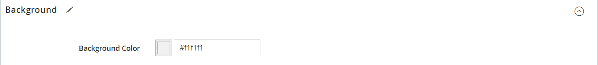

# [!DNL Page Builder] Exemplarische Vorgehensweise: Teil 1: Einfache Seite

Machen Sie sich mit dieser dreiteiligen Übung vertraut, um sich mit dem [!DNL Page Builder] Arbeitsbereich durch Erstellen einer einfachen Seite, die veranschaulicht, wie einfach es ist, inhaltsreiche Seiten Ihres eigenen Designs zu erstellen.

{width="700" zoomable="yes"}

>[!NOTE]
>
>Diese exemplarischen Vorgehensweisen werden aktualisiert, um die jüngsten Änderungen an der [!DNL Page Builder] Arbeitsbereich in Version 2.4.1. Wenn Sie eine frühere Adobe Commerce-Version verwenden, verwenden Sie die [!DNL Page Builder] In der [[!DNL Commerce] 2.3 Benutzerhandbuch](https://docs.magento.com/user-guide/v2.3/cms/page-builder-learn.html).

## Bevor Sie beginnen

Bevor Sie mit dieser Übung beginnen, sollten Sie die [Lebensdauer der Admin-Sitzung](../systems/security-admin.md) , um zu verhindern, dass die Sitzung während der Arbeit abläuft.

Überprüfen Sie die erforderlichen Content Management-Konfigurationseinstellungen:

- Der WYSIWYG-Editor ist im [WYSIWYG-Optionen](../content-design/editor.md#configure-the-editor) Konfiguration.

- [!DNL Page Builder] ist in der Variablen [Erweiterte Inhaltswerkzeuge](setup.md) Konfiguration.

### Herunterladen von exemplarischen Bild-Assets

1. Laden Sie die [`simple-page-assets`](./assets/simple-page-assets.zip) und speichern Sie die Datei auf Ihrem lokalen System.

1. Navigieren Sie zur heruntergeladenen Datei und extrahieren Sie die komprimierten Dateien.

   Klicken Sie auf einem Windows-System mit der rechten Maustaste und wählen Sie **[!UICONTROL Extract All]** -Dateien. Wählen Sie dann den Zielordner aus und klicken Sie auf **[!UICONTROL Extract]**.

   Auf einem Mac-System können Sie einfach auf die ZIP-Datei doppelklicken und die extrahierten Dateien in den Zielordner verschieben.

   Der Ordner enthält die folgenden Bilddateien:

   ![[!DNL Page Builder] Durchlaufen von Dateien - einfache Seiten-Assets](./assets/pb-tutorial-simple-page-assets.png){width="500"}

Folgen Sie den drei Teilen dieser exemplarischen Vorgehensweise.

## Teil 1: Zeile mit vollständigem Anschnitt mit Banner

In diesem Teil der Übung Einfache Seite erstellen Sie eine Seite mit einer vollständigen Blindzeile und einem Banner. Die Zeile enthält verschiedene Hintergrundbilder für Desktop- und Mobilgeräte.

![[!DNL Page Builder] vollständige Anschnittzeile mit Banner](./assets/pb-tutorial1-full-bleed-with-banner.png){width="700" zoomable="yes"}

### Schritt 1: Erstellen einer Seite

1. Im _Admin_ Seitenleiste, navigieren Sie zu **[!UICONTROL Content]** > _[!UICONTROL Elements]_>**[!UICONTROL Pages]**.

1. Klicken Sie oben rechts auf **[!UICONTROL Add New Page]** und gehen Sie wie folgt vor:

   - Um zu verhindern, dass diese Seite in Ihrem Store veröffentlicht wird, legen Sie **[!UICONTROL Enable Page]** nach `No`.

   - Für **[!UICONTROL Page Title]**, eingeben `Simple Page`.

   {width="600" zoomable="yes"}

1. Erweitern  die **[!UICONTROL Design]** Abschnitt.

   Beachten Sie Folgendes: **[!UICONTROL Layout]** auf `Page -- Full Width` Standardmäßig. Zusätzlich zu den fünf Standards [layout](../content-design/page-layout.md) Optionen, [!DNL Page Builder] fügt Layouts mit voller Breite für Seiten, Kategorien und Produkte hinzu.

1. Wenn die Beispieldaten verfügbar sind, legen Sie **[!UICONTROL New Theme]** nach `Magento Luma`. Andernfalls können Sie ein anderes verfügbares Design auswählen oder es leer lassen, um das Standarddesign zu verwenden.

   Die _[!UICONTROL New Theme]_kann verwendet werden, um das Standarddesign zu überschreiben und ein anderes Design auf die Seite anzuwenden.

   >[!NOTE]
   >
   >Das Layout &quot;Vollbreite&quot;kann nur mit einer kompatiblen [Design](../content-design/themes.md).

   {width="600" zoomable="yes"}

1. Klicken Sie oben rechts auf **[!UICONTROL Save]**.

   Wenn die Seite gespeichert wird, wird der Name _Einfache Seite_ in der oberen linken Ecke der Seite angezeigt.

### Schritt 2: Zeile formatieren

1. Erweitern  die **[!UICONTROL Content]** Abschnitt.

   Diese Aktion zeigt die [!DNL Page Builder] Vorschau mit einer leeren Zeile.

   >[!NOTE]
   >
   >Die [Inhaltsüberschrift](workspace.md) -Feld ist optional. Er ist standardmäßig entsprechend dem Design als Überschriftenebene 1 (H1) formatiert. Für diese Übung muss die Variable _Inhaltsüberschrift_ leer ist.

   {width="600" zoomable="yes"}

1. Klicks **[!UICONTROL Edit with Page Builder]** oder innerhalb des Inhaltsvorschaubereichs.

   Im erweiterten [!DNL Page Builder] [Arbeitsbereich](workspace.md)bietet das Bedienfeld auf der linken Seite die Inhaltswerkzeuge, die Sie zum Erstellen Ihres Inhalts in der Bühne verwenden können.

1. Bewegen Sie den Mauszeiger über die leere Zeile, um die Toolbox anzuzeigen.

   Jeder Inhaltscontainer verfügt über eine Toolbox mit ähnlichen Optionen.

   ![[!DNL Page Builder] Zeilen-Toolbox](./assets/pb-layout-page-add-content-row-tools.png){width="600" zoomable="yes"}

1. Wählen Sie in der Zeilen-Symbolleiste die _Einstellungen_ ({width="20"} Symbol.

1. under _[!UICONTROL Appearance]_auswählen **Vollständiger Anschnitt**.

   Mit der Einstellung für das vollständige Anschnitt-Erscheinungsbild wird der linke und rechte Rand des Inhaltsbereichs der Zeile und des Hintergrunds auf die gesamte Seitenbreite erweitert.

   {width="600" zoomable="yes"}

1. Scrollen Sie nach unten zum _[!UICONTROL Advanced]_und legen Sie alle fest **[!UICONTROL Margins and Padding]**Einstellungen zu `0`.

   Mit dieser Einstellung wird sichergestellt, dass das Banner die gesamte Breite der Zeile erweitert.

   {width="600" zoomable="yes"}

1. So speichern Sie die Einstellungen und kehren zum [!DNL Page Builder] Arbeitsbereich, scrollen Sie nach oben zum Anfang der Seite und klicken Sie auf **[!UICONTROL Save]** in der oberen rechten Ecke.

### Schritt 3: Banner hinzufügen

>[!NOTE]
>
>[!DNL Page Builder] hat einen neuen Inhaltstyp namens _Banner_, der in diesem Schritt vorgestellt wird. Was war zuvor der _Banner_ -Option im Menü &quot;Inhalt&quot;ist jetzt eine _Dynamischer Block_.

1. Im [!DNL Page Builder] Bedienfeld, erweitern **[!UICONTROL Media]** und ziehen Sie eine **Banner** Platzhalter zur Bühne.

   {width="600" zoomable="yes"}
1. Bewegen Sie den Mauszeiger über den Banner-Container, um die Toolbox anzuzeigen.

   >[!NOTE]
   >
   >Die Bühne verfügt jetzt über zwei Inhaltscontainer, von denen jeder über eine eigene Toolbox verfügt. Da das Banner in der Zeile verschachtelt ist, stellen Sie sicher, dass Sie in der richtigen Toolbox arbeiten.

   Zusätzlich zur Toolbox wird die _Bild hochladen_ und _Aus Galerie auswählen_ -Schaltflächen enthalten sind, damit Sie direkt von der Bühne aus schnelle Änderungen am Banner vornehmen können.

   {width="600" zoomable="yes"}

1. Wählen Sie in der Banner-Symbolleiste die _Einstellungen_ ( {width="20"} ).

1. under _[!UICONTROL Appearance]_auswählen **[!UICONTROL Collage Right]**.

   Mit der Einstellung &quot;Rechts reduzieren&quot;wird Inhalt auf der rechten Seite des Banners positioniert.

   {width="600" zoomable="yes"}

1. Scrollen Sie nach unten zum _[!UICONTROL Background]_und legen Sie das Hintergrundbild für das Banner fest:

   - Für **[!UICONTROL Background Image]** klicken **Hochladen**.

     {width="600" zoomable="yes"}

     Navigieren Sie zu dem Ordner, in dem Sie die extrahierten einfachen Seiten-Assets gespeichert haben, und wählen Sie die `wide-banner-background.jpg` -Datei.

     Das Bild wird hochgeladen und eine Miniaturansicht des hochgeladenen Bildes wird angezeigt. Dateiname, Bilddimensionen und Dateigröße sind unten aufgeführt.

     {width="600" zoomable="yes"}

   - Für **[!UICONTROL Background Mobile Image]** klicken **Hochladen**.

     Wählen Sie im selben Dateiverzeichnis die `wide-banner-background-mobile.jpg` -Datei.

     Das mobile Hintergrundbild wird für Mobilgeräte und immer dann verwendet, wenn die Größe eines Desktop-Browserfensters auf die Breite eines Mobilgeräts geändert wird.

     {width="600" zoomable="yes"}

   - Scrollen Sie zurück zum Anfang der Seite und klicken Sie auf **[!UICONTROL Save]** , um die Einstellungen zu speichern und zum [!DNL Page Builder] Arbeitsbereich.

     Der Hintergrund wird auf der Bühne angezeigt und erweitert die gesamte Breite der Zeile.

     {width="600" zoomable="yes"}

   Beachten Sie den Platzhaltertext, der rechts in der Zeile angezeigt wird. Die Position dieses Textes spiegelt die _Collage Right_ Erscheinungsbildeinstellung.

1. Klicken Sie auf den Platzhaltertext und geben Sie die folgende Meldung in zwei Zeilen ein:

   `Get fit and look fab in new seasonal styles.`

   `New LUMA yoga collection`

   Die Editor-Symbolleiste wird über dem Textfeld angezeigt. Text kann entweder direkt von der Bühne aus eingegeben und formatiert werden oder durch Auswahl von _Einstellungen_ in der Banner-Toolbox.

   {width="600" zoomable="yes"}

1. Formatieren Sie den Text:

   - Wählen Sie die erste Textzeile aus. Wählen Sie dann in der Editor-Symbolleiste unter **Formate** auswählen `Heading 2`.

     {width="600" zoomable="yes"}

   - Wählen Sie die zweite Textzeile aus. Wählen Sie dann in der Editor-Symbolleiste unter **Formate** auswählen `Paragraph`.

   Die Formateinstellungen wenden die Stile aus dem Stylesheet an, das dem aktuellen Design zugeordnet ist.

   {width="600" zoomable="yes"}
__

1. Bewegen Sie den Mauszeiger, um die Banner-Toolbox anzuzeigen, wählen Sie die _Einstellungen_ ( {width="20"} ) und scrollen Sie dann zum _[!UICONTROL Content]_Abschnitt.

   Beachten Sie, dass Ihr Text im _Nachrichtentext_ ankreuzen. Text kann entweder von der Bühne oder aus der _[!UICONTROL Content]_-Abschnitt der Bannereinstellungen.

   {width="600" zoomable="yes"}

1. Fortsetzung im _[!UICONTROL Content]_-Abschnitt, legen Sie den Bannerlink und die Schaltfläche fest:

   - Satz **Link** nach `Category`und klicken Sie anschließend auf **[!UICONTROL Select]** , um den Kategoriebaum anzuzeigen.

   - Auswählen `What's New` als verknüpfte Kategorie.

     {width="600" zoomable="yes"}

   - Satz **[!UICONTROL Show Button]** nach `Always`.

   - Für **[!UICONTROL Button Text]**, eingeben `Shop Now` als Text, der auf der Schaltfläche angezeigt wird.

   - Für **[!UICONTROL Button Type]**, akzeptieren Sie die `Primary` Standard.

     Der Schaltflächenstil des aktuellen Designs bestimmt das Schaltflächenformat.

1. Bannerüberlagerung festlegen:

   Sie können eine Überlagerung verwenden, um eine Hintergrundfarbe auf den aktiven Inhaltsbereich anzuwenden, der durch die Einstellung Erscheinungsbild definiert wird. Das Hintergrundbild des Banners bleibt für die gesamte Breite des Banners sichtbar.

   - Satz **[!UICONTROL Show Overlay]** nach `Always`.

   - Für **[!UICONTROL Overlay Color]** führen Sie einen der folgenden Schritte aus:

      - Klicken Sie auf das Farbfeld und wählen Sie das weiße Farbfeld aus.
      - Klicken Sie in der _Keine Farbe_ Textfeld und Eingabe `White` oder der Hexadezimalwert `#ffffff`.

     Klicken Sie anschließend auf **[!UICONTROL Apply]**.

     {width="600" zoomable="yes"}

   - Scrollen Sie zurück zum Anfang der Seite und klicken Sie auf **[!UICONTROL Save]** , um die Einstellungen zu speichern und zum [!DNL Page Builder] Arbeitsbereich.

     Die Schaltfläche wird auf der Bühne unter der Bannermeldung angezeigt.

     {width="600" zoomable="yes"}

1. Klicken Sie in der rechten oberen Ecke der Bühne auf die _Vollbild schließen_ ().

   Wenn Sie auf dieses Symbol klicken, kehren Sie zum _[!UICONTROL Content]_für die Seite, in der die Vorschau angezeigt wird.

   Sie können jederzeit zwischen den beiden Arbeitsbereichsmodi wechseln.

1. Klicken Sie oben rechts auf die **[!UICONTROL Save]** Pfeil und Auswahl **[!UICONTROL Save & Close]**.

1. Klicken Sie bei entsprechender Aufforderung auf das [Cacheverwaltung](../systems/cache-management.md) in der Nachricht oben auf der Seite ein und aktualisieren Sie alle ungültigen Zwischenspeicher.

## Teil 2: Enthaltene Zeile mit zwei gleichen Spalten

In diesem Teil der Übung fügen Sie der Seite eine Zeile hinzu und teilen die Zeile in zwei gleiche Spalten. Anschließend fügen Sie jeder Spalte ein verknüpftes Bild hinzu. In den Anweisungen wird jede neue Zeile vor der ersten Zeile hinzugefügt, um die [!DNL Page Builder] -Bedienfeld zur Bühne hinein. Am Ende der Übung ordnen Sie die Zeilen so an, dass sie dem Beispiel für einfache Seite entsprechen.

{width="600" zoomable="yes"}

### Schritt 1: Zeile hinzufügen

1. Suchen Sie im Raster Seiten die _Einfache Seite_ die Sie im ersten Teil dieser Übung erstellt haben, und wählen Sie **[!UICONTROL Edit]** im _[!UICONTROL Action]_Spalte.

1. Erweitern  die **[!UICONTROL Content]** Abschnitt.

1. Klicks **[!UICONTROL Edit with Page Builder]** oder innerhalb des Inhaltsvorschaubereichs.

1. Im [!DNL Page Builder] Bereich unter _[!UICONTROL Layout]_, ziehen Sie eine **[!UICONTROL Row]**Platzhalter auf die Bühne und platzieren Sie sie über dem Banner.

   Die rote Führungslinie markiert die Grenze zwischen den beiden Zeilen.

   {width="600" zoomable="yes"}

1. Bewegen Sie den Mauszeiger über die neue Zeile, um die Toolbox anzuzeigen und die _Einstellungen_ ( {width="20"} ).

   {width="600" zoomable="yes"}

1. under _[!UICONTROL Appearance]_, akzeptieren Sie die **Enthalten**Standardeinstellung.

   Diese Einstellung beschränkt den Inhaltsbereich der Zeile auf die Breite der Seite, wie vom Design definiert.

   {width="600" zoomable="yes"}

1. Klicken Sie oben rechts auf **[!UICONTROL Save]** , um die Einstellungen zu speichern und zum [!DNL Page Builder] Arbeitsbereich.

### Schritt 2: Spalte hinzufügen

1. Im [!DNL Page Builder] Bereich unter _[!UICONTROL Layout]_, ziehen Sie eine **[!UICONTROL Column]**Platzhalter für die neue Zeile.

   {width="600" zoomable="yes"}

   Die Zeile ist nun in zwei Spalten mit gleicher Breite unterteilt. Jede Spalte ist ein separater Container für Inhalte mit einer eigenen dedizierten Toolbox mit Optionen.

   {width="600" zoomable="yes"}

1. Klicken Sie in der linken oberen Ecke der ersten Spalte auf das kreisförmige _Raster_ control (), um die Rasterrichtlinien anzuzeigen.

   Das Raster stellt sicher, dass Inhalte konsistent ausgerichtet und auf Desktop- und Mobilgeräten korrekt dargestellt werden. Informationen zum Konfigurieren der Rastergröße finden Sie unter [Konfigurieren [!DNL Page Builder]](setup.md#configure-page-builder) im Abschnitt [!DNL Page Builder] Setup-Thema.

   Die Zahlen in Klammern (6/12) am oberen Rand jedes Spaltenbehälters geben die Anzahl der Rasterdivisionen in jeder Spalte und die Gesamtzahl der Divisionen in der Zeile an.

   {width="600" zoomable="yes"}

### Schritt 3: Bilder mit Links hinzufügen

In diesem Schritt erfahren Sie, wie Sie ein Bild in das Banner hochladen.

1. Im [!DNL Page Builder] Bereich, erweitern Sie die **[!UICONTROL Media]** und ziehen Sie **[!UICONTROL Image]** Platzhalter zur ersten Spalte.

   {width="600" zoomable="yes"}

1. Fügen Sie das Beispielbild in den Platzhalter ein.

   {width="600" zoomable="yes"}

   Für ein Bild, das sich auf Ihrem System befindet, können Sie eine der folgenden Methoden wählen:

   - **Hochladen der Bilddatei**: Klicken Sie in der ersten Spalte auf **[!UICONTROL Upload Image]**. Navigieren Sie dann zu dem Ordner, in dem Sie die extrahierten einfachen Seiten-Assets gespeichert haben, und wählen Sie die `small-banner-1.jpg` -Datei.

     {width="600" zoomable="yes"}

     Wiederholen Sie diese Aktion, um die `small-banner-2.jpg` in die zweite Spalte.

   - **Ziehen Sie die Bilddatei**: Öffnen Sie auf Ihrem Desktop den Ordner mit einfachen Seiten-Assets und positionieren Sie ihn neben dem Admin-Browser-Fenster, in dem Sie mit dem [!DNL Page Builder] Bühne. Ziehen Sie dann die Datei `small-banner-1.jpg` aus dem Ordner mit einfachen Seiten-Assets und legen Sie ihn in der ersten Spalte ab.

     {width="600" zoomable="yes"}

     Wiederholen Sie diese Aktion, um die `small-banner-2.jpg` in die zweite Spalte.

1. Bestimmen Sie, welche Seite aus Ihrem Katalog Sie mit jedem Bild verknüpfen möchten.

1. Bewegen Sie den Mauszeiger über das Bild in der ersten Spalte, um die Symbolleiste anzuzeigen und die _Einstellungen_ ( {width="20"} ).

   {width="600" zoomable="yes"}

1. Verknüpfen Sie das Bild mit einer Kategorie:

   - Scrollen Sie nach unten und legen Sie **Link** nach `Category`.

   - Führen Sie im Kategoriebaum einen Drilldown durch und wählen Sie die `Men's Hoodies & Sweatshirt` Kategorie.

   - In der oberen rechten Ecke **[!UICONTROL Save]** die Einstellungen und kehren Sie zur [!DNL Page Builder] Arbeitsbereich.

1. Wiederholen Sie den vorherigen Schritt, um das Bild in der zweiten Spalte mit der _Fanggerät_ Kategorie.

1. Klicken Sie in der rechten oberen Ecke der Bühne auf die _Vollbild schließen_ ().

   Wenn Sie auf dieses Symbol klicken, kehren Sie zum _[!UICONTROL Content]_für die Seite, in der die Vorschau angezeigt wird.

1. Klicken Sie oben rechts auf die **[!UICONTROL Save]** Pfeil und Auswahl **[!UICONTROL Save & Close]**.

1. Klicken Sie bei Aufforderung auf das [Cacheverwaltung](../systems/cache-management.md) in der Nachricht oben auf der Seite ein und aktualisieren Sie alle ungültigen Zwischenspeicher.

## Teil 3: Zeile mit voller Breite mit ungleichen Spalten

Die letzte Zeile auf dieser Seite enthält Inhalte aus einer Produktübersicht. Fügen Sie eine Zeile mit voller Breite hinzu und teilen Sie sie in zwei Spalten mit unterschiedlichen Breiten. Der ersten Spalte wird ein Hintergrundbild mit einer übereinstimmenden Hintergrundfarbe hinzugefügt, die auf die Zeile angewendet wird, um einen einheitlichen Effekt zu erzielen.

{width="500"}

### Schritt 1: Zeile hinzufügen

1. Suchen Sie im Raster Seiten die _Einfache Seite_ die Sie im ersten Teil dieser Übung erstellt haben, und wählen Sie **[!UICONTROL Edit]** im _[!UICONTROL Action]_Spalte.

1. Erweitern  die **[!UICONTROL Content]** Abschnitt.

1. Klicks **[!UICONTROL Edit with Page Builder]** oder innerhalb des Inhaltsvorschaubereichs.

1. Im [!DNL Page Builder] Bereich unter _[!UICONTROL Layout]_, ziehen Sie eine **[!UICONTROL Row]**-Platzhalter auf die Bühne und platzieren Sie sie über der Zeile, die im zweiten Teil dieser Übung erstellt wurde.

   Eine rote Führungslinie markiert die Grenze zwischen den beiden Zeilen.

   {width="600" zoomable="yes"}

1. Bewegen Sie den Mauszeiger über die neue Zeile, um die Toolbox anzuzeigen und die _Einstellungen_ ({width="20"} ).

   {width="600" zoomable="yes"}

1. Auf der Seite &quot;Zeile bearbeiten&quot;unter _[!UICONTROL Appearance]_auswählen **[!UICONTROL Full Width]**.

   Diese Einstellung beschränkt den Inhaltsbereich auf die maximale Seitenbreite, die vom Design definiert wird. Die Hintergrundfarbe und/oder das Bild sind nicht beschränkt und erweitern die gesamte Breite der Zeile.

   {width="600" zoomable="yes"}

1. Im _[!UICONTROL Background]_Abschnitt eingeben `#f1f1f1` als **[!UICONTROL Background Color]**.

   {width="600" zoomable="yes"}

1. Scrollen Sie nach unten zum _[!UICONTROL Advanced]_und legen Sie alle fest **Ränder und Abstände**Werte in `0`.

   {width="600" zoomable="yes"}

1. Scrollen Sie zurück zum Anfang der Seite und klicken Sie auf **[!UICONTROL Save]** , um die Einstellungen zu speichern und zum [!DNL Page Builder] Arbeitsbereich.

   Die Hintergrundfarbe der Zeile ist jetzt hellbeige.

   {width="600" zoomable="yes"}

### Schritt 2: Spalten unterschiedlicher Breiten hinzufügen

1. Im [!DNL Page Builder] Bereich unter _[!UICONTROL Layout]_, ziehen Sie eine **[!UICONTROL Column]**Platzhalter zur obersten Zeile auf der Bühne.

   {width="600" zoomable="yes"}

1. Ziehen Sie den rechten Rand der ersten Spalte auf die vier von 12 (`4/12`) im Raster.

   Die Größe der zweiten Spalte ändert sich in acht von 12 (`8/12`).

   {width="600" zoomable="yes"}

1. Bewegen Sie den Mauszeiger über den ersten Spaltenbehälter, um die Symbolleiste anzuzeigen und die _Einstellungen_ ( {width="20"} ).

1. Scrollen Sie nach unten zum _[!UICONTROL Advanced]_und legen Sie alle fest **Ränder und Abstände**Werte in `0`.

   {width="600" zoomable="yes"}

1. Scrollen Sie zurück zum Anfang der Seite und klicken Sie auf **[!UICONTROL Save]** , um die Einstellungen zu speichern und zum [!DNL Page Builder] Arbeitsbereich.

### Schritt 3: Hinzufügen eines Bildes zur ersten Spalte

1. Im [!DNL Page Builder] Bedienfeld, erweitern **[!UICONTROL Media]** und ziehen Sie **[!UICONTROL Image]** Inhaltstyp in die erste Spalte.

   {width="600" zoomable="yes"}

1. Klicken Sie im Bild-Platzhalter auf **[!UICONTROL Upload Image]**.

   {width="600" zoomable="yes"}

1. Navigieren Sie zu dem Ordner, in dem Sie die extrahierten einfachen Seiten-Assets gespeichert haben, und wählen Sie die `review-image.jpg` -Datei.

   Das hochgeladene Bild wird in der ersten Spalte angezeigt und lässt sich nahtlos mit der Hintergrundfarbe der Zeile kombinieren.

   {width="600" zoomable="yes"}

### Schritt 4: Hinzufügen des Überprüfungsinhalts zur zweiten Spalte

Die zweite Spalte der Zeile sollte Inhalte aus einer Kundenüberprüfung enthalten, einschließlich des 5-Sterne-Bewertungsbilds und der formatierten Textnachricht.

1. Im [!DNL Page Builder] Bereich, erweitern Sie die **[!UICONTROL Elements]** und ziehen Sie die **[!UICONTROL Text]** Inhaltstyp in die zweite Spalte.

   {width="600" zoomable="yes"}

1. Klicken Sie in das Textelement, um die Editor-Symbolleiste anzuzeigen.

1. Klicken Sie in der Symbolleiste auf die _Bild einfügen_ () und führen Sie die folgenden Schritte aus:

   {width="600" zoomable="yes"}

   - Im _[!UICONTROL Insert/edit image]_klicken Sie auf_ Suchen _(  ) neben dem_[!UICONTROL Source]_ -Feld.

     {width="600" zoomable="yes"}

   - Im _[!UICONTROL Select Images]_Seite, klicken **[!UICONTROL Choose Files]**.

   - Wählen Sie in dem Ordner, in dem Sie die einfachen Seiten-Assets gespeichert haben, `rating.png`.

   - Doppelklicken Sie auf der Seite auf die Bildkachel, um sie auszuwählen und die URL in das Feld Quelle einzufügen.

     {width="600" zoomable="yes"}

   - Für **[!UICONTROL Image Description]**, eingeben `5-Star Rating` und klicken **[!UICONTROL OK]** um das Bild in die Spalte einzufügen.

   - Klicken Sie in der Editor-Symbolleiste auf **Zentrieren** (), um das Bild in der Spalte zu zentrieren.

     {width="600" zoomable="yes"}

1. Positionieren Sie den Einfügepunkt direkt nach dem 5-Sterne-Bild, drücken Sie die Eingabetaste, um eine neue Zeile zu beginnen, und geben Sie folgenden Text ein:

   `Awesome Tank!`

   `I'm a long distance runner and it keeps me pretty comfortable, although these companies always act like their shirts are magical and really it's just pretty basic stuff. Still it's a great shirt, and I would recommend it.`

   `Antonia Racer Tank – Reviewed by Allyson`

   Der Text wird bei der Eingabe zentriert.

   {width="600" zoomable="yes"}

1. Formatieren Sie den Text:

   - Klicken Sie an eine beliebige Stelle in der ersten Textzeile und in der Editor-Symbolleiste unter **Formate** auswählen `Heading 2`.

   - Wählen Sie den verbleibenden Text und in der Editor-Symbolleiste unter **Formate** auswählen `Paragraph`.

   Der Text wird entsprechend dem Stylesheet formatiert, das dem Design zugeordnet ist.

1. Rufen Sie die Abmessungen des Bildes ab, damit Sie den Inhalt vertikal in der Spalte zentrieren können:

   - Bewegen Sie den Mauszeiger über das Bild in der ersten Spalte, um die Symbolleiste anzuzeigen und die _Einstellungen_ ({width="20"} ).

   - Beachten Sie unter der Miniaturansicht des Bildes die Abmessungen des Bildes.

     {width="600" zoomable="yes"}

   - Klicken Sie oben rechts auf **Schließen**.

1. Zentrieren Sie den Inhalt in der zweiten Spalte vertikal:

   - Bewegen Sie den Mauszeiger über die zweite Spalte, um die Toolbox anzuzeigen und die _Einstellungen_ ({width="20"} ).

   >[!NOTE]
   >
   >Stellen Sie sicher, dass Sie den Spaltencontainer und nicht den Textcontainer auswählen, damit die richtige Toolbox angezeigt wird.

   - Für **[!UICONTROL Minimum Height]**, eingeben `450` als Höhe in Pixel für das Bild in der ersten Spalte.

   - Satz **[!UICONTROL Vertical Alignment]** nach `Center`.

   {width="600" zoomable="yes"}

1. Scrollen Sie nach unten zum _[!UICONTROL Advanced]_und legen Sie alle fest **[!UICONTROL Margins and Padding]**Werte auf null ( `0` ).

   {width="600" zoomable="yes"}

1. Scrollen Sie zurück zum Anfang der Seite und klicken Sie oben rechts auf **[!UICONTROL Save]** , um die Einstellungen zu speichern und zum [!DNL Page Builder] Arbeitsbereich.

   {width="600" zoomable="yes"}

### Schritt 5: Link zum Katalogprodukt einfügen

1. Wählen Sie die `Antonia Racer Tank` Text und klicken Sie auf _Link einfügen_ () in der Editor-Symbolleiste.

1. Im _Link einfügen_ Geben Sie den Link zum Katalogprodukt an:

   - Produkt eingeben **[!UICONTROL URL]**.

     Sie können entweder eine relative oder eine vollständig qualifizierte URL eingeben. Für dieses Beispiel wird der folgende relative Link eingegeben:

     `../antonia-racer-tank.html`

   - (Optional) Für **Titel**, geben Sie den Produktnamen ein.

     Das Attribut Titel-Link wird von einigen Browsern als QuickInfo verwendet.

     {width="600" zoomable="yes"}

   - Wenn Sie fertig sind, klicken Sie auf **[!UICONTROL OK]** , um den Link zu speichern.

     Der verknüpfte Text wird jetzt im Banner hervorgehoben.

     {width="600" zoomable="yes"}

1. Klicken Sie in der rechten oberen Ecke der Bühne auf die _Vollbild schließen_ ().

   Wenn Sie auf dieses Symbol klicken, kehren Sie zum _[!UICONTROL Content]_für die Seite, in der die Vorschau angezeigt wird.

1. Klicken Sie oben rechts auf **[!UICONTROL Save]**.

### Schritt 6: Zeilen neu anordnen

Wenn alle drei Zeilen abgeschlossen sind, besteht der letzte Schritt darin, die Zeilen neu anzuordnen, um sie an das Original anzupassen _Einfache Seite_ Beispiel. Um dem ursprünglichen Beispiel zu entsprechen, muss die erste Zeile nach unten verschoben und die letzte Zeile nach oben verschoben werden.

1. Erweitern Sie ggf.  die **[!UICONTROL Content]** Abschnitt.

1. Klicks **[!UICONTROL Edit with Page Builder]** oder innerhalb des Inhaltsvorschaubereichs.

1. Bewegen Sie den Mauszeiger über die erste Zeile auf der Bühne, um die Toolbox anzuzeigen und die _Verschieben_ ( ).

   {width="600" zoomable="yes"}

1. Halten Sie die Maustaste gedrückt, während Sie überprüfen, ob der gesamte Zeileninhalt ausgewählt ist, und ziehen Sie die Zeile unter der roten Führungslinie am unteren Rand der Seite an die gewünschte Position.

   >[!NOTE]
   >
   >Wenn Sie versehentlich nur einen Teil des Inhalts verschieben, z. B. das Bild, verschieben Sie den Inhalt einfach dorthin zurück, wo er hingehört, und versuchen Sie es erneut.

   {width="600" zoomable="yes"}

1. Wiederholen Sie diesen Vorgang, um die erste Zeile an die zweite Position zu verschieben.

   Die Reihenfolge der Zeilen auf Ihrer Seite entspricht nun dem Beispiel Einfache Seite .

1. Klicken Sie in der rechten oberen Ecke der Bühne auf die _Vollbild schließen_ ().

   Wenn Sie auf dieses Symbol klicken, kehren Sie zum _[!UICONTROL Content]_für die Seite, in der die Vorschau angezeigt wird.

1. Klicken Sie oben rechts auf die **[!UICONTROL Save]** Pfeil und Auswahl **[!UICONTROL Save & Close]**.

1. Klicken Sie bei entsprechender Aufforderung auf das [Cacheverwaltung](../systems/cache-management.md) in der Nachricht oben auf der Seite ein und aktualisieren Sie alle ungültigen Zwischenspeicher.

Sie haben die Übung Einfache Seite abgeschlossen. Behalten Sie die von Ihnen erstellte Arbeit bei, damit Sie später darauf verweisen können.

Wenn Sie bereit sind, fahren Sie mit [Teil 2: Blöcke](2-blocks.md).
