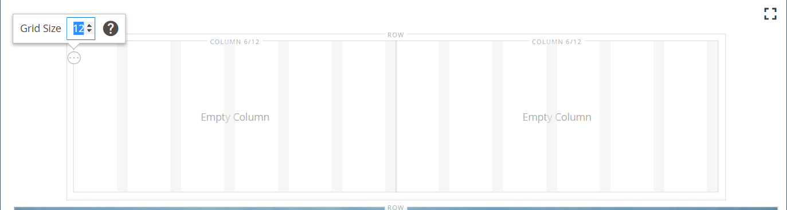
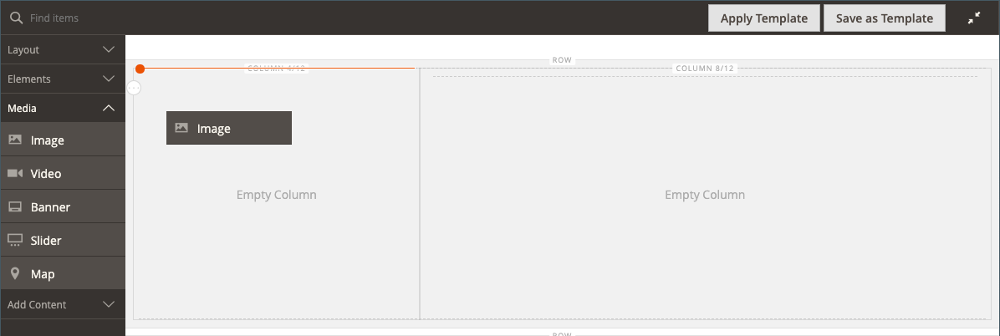
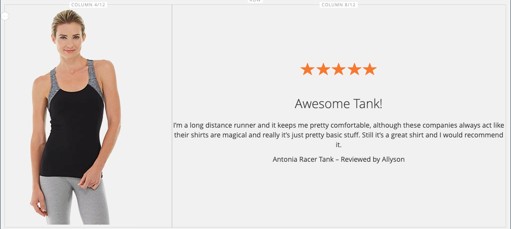

# [!DNL Page Builder] Anleitung Teil 1: Einfache Seite

In dieser dreiteiligen Übung machen Sie sich mit dem [!DNL Page Builder] Arbeitsbereich vertraut, indem Sie eine einfache Seite erstellen, die veranschaulicht, wie einfach es ist, inhaltsreiche Seiten Ihres eigenen Designs zu erstellen.

{width="700" zoomable="yes"}

>[!NOTE]
>
>Diese exemplarischen Übungen werden aktualisiert, um die jüngsten Änderungen am [!DNL Page Builder] Workspace in Version 2.4.1 widerzuspiegeln.

## Bevor Sie beginnen

Bevor Sie mit dieser Übung beginnen, sollten Sie die [Admin-Sitzungslebensdauer](../systems/security-admin.md) erhöhen, um zu verhindern, dass die Sitzung während der Arbeit abläuft.

Überprüfen Sie die erforderlichen Einstellungen für die Content-Management-Konfiguration:

- Der WYSIWYG-Editor ist in der Konfiguration [WYSIWYG-Optionen](../content-design/editor.md#configure-the-editor) aktiviert.

- [!DNL Page Builder] ist in der Konfiguration [Erweiterte Inhaltstools](setup.md) aktiviert.

### Herunterladen der schrittweisen Bild-Assets

1. Laden Sie die [`simple-page-assets`](./assets/simple-page-assets.zip)-Datei herunter und speichern Sie die Datei auf Ihrem lokalen System.

1. Navigieren Sie zur heruntergeladenen Datei und extrahieren Sie die komprimierten Dateien.

   Klicken Sie auf einem Windows-System mit der rechten Maustaste darauf und wählen Sie **[!UICONTROL Extract All]** Dateien. Wählen Sie dann den Zielordner aus und klicken Sie auf **[!UICONTROL Extract]**.

   Auf einem Mac-System können Sie einfach auf die ZIP-Datei doppelklicken und die extrahierten Dateien in den Zielordner verschieben.

   Der Ordner enthält die folgenden Grafikdateien:

   ![[!DNL Page Builder] Walkthrough-Dateien: Einfache Seiten-Assets](./assets/pb-tutorial-simple-page-assets.png){width="500"}

Befolgen Sie die drei Teile dieser Anleitung in der richtigen Reihenfolge.

## Teil 1: Vollständige Anschnittzeile mit Banner

In diesem Teil der einfachen Seitenübung erstellen Sie eine Seite mit einer vollständigen Zeile und einem Banner. Die Zeile enthält verschiedene Hintergrundbilder für Desktop- und Mobilgeräte.

![[!DNL Page Builder] vollständige Anschnittzeile mit Banner](./assets/pb-tutorial1-full-bleed-with-banner.png){width="700" zoomable="yes"}

### Schritt 1: Erstellen einer Seite

1. Navigieren Sie in _Admin_-Seitenleiste zu **[!UICONTROL Content]** > _[!UICONTROL Elements]_>**[!UICONTROL Pages]**.

1. Klicken Sie oben rechts auf **[!UICONTROL Add New Page]** und führen Sie folgende Schritte aus:

   - Um zu verhindern, dass diese Seite in Ihrem Store veröffentlicht wird, setzen Sie **[!UICONTROL Enable Page]** auf `No`.

   - Geben Sie **[!UICONTROL Page Title]** `Simple Page` ein.

   {width="600" zoomable="yes"}

1. Erweitern Sie  den Abschnitt **[!UICONTROL Design]** .

   Beachten Sie, dass **[!UICONTROL Layout]** standardmäßig auf `Page -- Full Width` festgelegt ist. Zusätzlich zu den fünf standardmäßigen [Layout](../content-design/page-layout.md)-Optionen fügt [!DNL Page Builder] Layouts für Seiten, Kategorien und Produkte in voller Breite hinzu.

1. Wenn die Beispieldaten verfügbar sind, setzen Sie **[!UICONTROL New Theme]** auf `Magento Luma`. Andernfalls können Sie ein anderes verfügbares Design auswählen oder es leer lassen, um das Standard-Design zu verwenden.

   Die _[!UICONTROL New Theme]_&#x200B;kann verwendet werden, um das Standarddesign zu überschreiben und ein anderes Design auf die Seite anzuwenden.

   >[!NOTE]
   >
   >Das Layout „Volle Breite“ kann nur mit einem kompatiblen (Design[&#x200B; verwendet &#x200B;](../content-design/themes.md).

   {width="600" zoomable="yes"}

1. Klicken Sie oben rechts auf **[!UICONTROL Save]**.

   Beim Speichern der Seite wird _Name „Einfache_&quot; oben links auf der Seite angezeigt.

### Schritt 2: Zeile formatieren

1. Erweitern Sie  den Abschnitt **[!UICONTROL Content]** .

   Diese Aktion zeigt die [!DNL Page Builder] Vorschau mit einer leeren Zeile an.

   >[!NOTE]
   >
   >Das [Inhaltsüberschrift](workspace.md) ist optional. Standardmäßig wird sie entsprechend dem Design als Überschriftenebene 1 (H1) formatiert. Für diese Übung wird die _Inhaltsüberschrift_ leer gelassen.

   {width="600" zoomable="yes"}

1. Klicken Sie **[!UICONTROL Edit with Page Builder]** oder in den Inhaltsvorschaubereich.

   Im erweiterten [!DNL Page Builder] [Arbeitsbereich](workspace.md) bietet das Bedienfeld auf der linken Seite die Inhalts-Tools, die Sie zum Erstellen von Inhalten in der Phase verwenden können.

1. Bewegen Sie den Mauszeiger über die leere Zeile, um die Toolbox anzuzeigen.

   Jeder Inhalts-Container verfügt über eine Toolbox mit einem ähnlichen Satz von Optionen.

   ![[!DNL Page Builder]-Toolbox](./assets/pb-layout-page-add-content-row-tools.png){width="600" zoomable="yes"}

1. Wählen Sie in der Toolbox „Zeile _das Symbol_ Einstellungen{width="20"}).

1. Wählen Sie unter _[!UICONTROL Appearance]_&#x200B;die Option **Vollständiger Anschnitt**.

   Mit der Einstellung Vollständiger Anschnitt werden der linke und rechte Rand des Inhaltsbereichs der Zeile und des Hintergrunds auf die gesamte Seitenbreite erweitert.

   {width="600" zoomable="yes"}

1. Scrollen Sie nach unten zum Abschnitt _[!UICONTROL Advanced]_&#x200B;und setzen Sie alle **[!UICONTROL Margins and Padding]**&#x200B;auf `0`.

   Durch diese Einstellung wird sichergestellt, dass das Banner die gesamte Breite der Zeile erweitert.

   {width="600" zoomable="yes"}

1. Um die Einstellungen zu speichern und zum Arbeitsbereich &quot;[!DNL Page Builder]&quot; zurückzukehren, scrollen Sie nach oben auf der Seite und klicken Sie oben rechts auf **[!UICONTROL Save]** .

### Schritt 3: Banner hinzufügen

>[!NOTE]
>
>[!DNL Page Builder] hat einen neuen Inhaltstyp mit dem Namen _Banner_, der in diesem Schritt verwendet wird. Was zuvor die Option _Banner_ im Menü „Inhalt“ war, ist jetzt ein _dynamischer Block_.

1. Erweitern Sie im [!DNL Page Builder] Bedienfeld **[!UICONTROL Media]** und ziehen Sie einen **Banner**-Platzhalter auf die Bühne.

   {width="600" zoomable="yes"}
1. Bewegen Sie den Mauszeiger über den Banner-Container, um die Toolbox anzuzeigen.

   >[!NOTE]
   >
   >Die Phase verfügt jetzt über zwei Inhalts-Container mit jeweils einer separaten Toolbox. Da das Banner in der Zeile verschachtelt ist, stellen Sie sicher, dass Sie mit der richtigen Toolbox arbeiten.

   Zusätzlich zur Toolbox sind die Schaltflächen _Bild hochladen_ und _Aus Galerie auswählen_ enthalten, sodass Sie direkt auf der Bühne schnelle Änderungen am Banner vornehmen können.

   {width="600" zoomable="yes"}

1. Wählen Sie in der Banner-Toolbox das Symbol _Einstellungen_ ( {width="20"} ) aus.

1. Wählen Sie unter _[!UICONTROL Appearance]_&#x200B;die Option **[!UICONTROL Collage Right]**&#x200B;aus.

   Mit der Einstellung „Collage Right“ werden Inhalte auf der rechten Seite des Banners positioniert.

   {width="600" zoomable="yes"}

1. Scrollen Sie nach unten zum Abschnitt _[!UICONTROL Background]_&#x200B;und legen Sie das Hintergrundbild für das Banner fest:

   - Klicken Sie **[!UICONTROL Background Image]** auf **Hochladen**.

     {width="600" zoomable="yes"}

     Navigieren Sie zu dem Verzeichnis, in dem Sie die extrahierten einfachen Seiten-Assets gespeichert haben, und wählen Sie die `wide-banner-background.jpg` aus.

     Das Bild wird hochgeladen und eine Miniaturansicht des hochgeladenen Bildes wird angezeigt. Der Dateiname, die Bildabmessungen und die Dateigröße werden unten angegeben.

     {width="600" zoomable="yes"}

   - Klicken Sie **[!UICONTROL Background Mobile Image]** auf **Hochladen**.

     Wählen Sie im selben Dateiverzeichnis die `wide-banner-background-mobile.jpg`.

     Das mobile Hintergrundbild wird für Mobilgeräte verwendet und auch immer dann, wenn ein Desktop-Browser-Fenster auf die Breite eines Mobilgeräts geändert wird.

     {width="600" zoomable="yes"}

   - Scrollen Sie zurück zum Anfang der Seite und klicken Sie auf **[!UICONTROL Save]** , um die Einstellungen zu speichern und zum Arbeitsbereich [!DNL Page Builder] zurückzukehren.

     Der Hintergrund wird auf der Bühne angezeigt und erstreckt sich über die gesamte Breite der Zeile.

     {width="600" zoomable="yes"}

   Beachten Sie den Platzhaltertext, der rechts in der Zeile angezeigt wird. Die Position dieses Textes entspricht der _Collage Right_ Erscheinungsbildeinstellung.

1. Klicken Sie auf den Platzhaltertext und geben Sie die folgende Nachricht in zwei Zeilen ein:

   `Get fit and look fab in new seasonal styles.`

   `New LUMA yoga collection`

   Die Editor-Symbolleiste wird über dem Textfeld angezeigt. Text kann entweder direkt über die Bühne eingegeben und formatiert werden oder durch Auswahl von _Einstellungen_ in der Banner-Toolbox.

   {width="600" zoomable="yes"}

1. Anwenden der Formatierung auf den Text:

   - Markieren Sie die erste Textzeile. Wählen Sie dann in der Editor-Symbolleiste unter **Formate** die Option `Heading 2` aus.

     {width="600" zoomable="yes"}

   - Wählen Sie die zweite Textzeile aus. Wählen Sie dann in der Editor-Symbolleiste unter **Formate** die Option `Paragraph` aus.

   Die Formateinstellungen wenden die Stile aus dem Stylesheet an, das mit dem aktuellen Design verknüpft ist.

   {width="600" zoomable="yes"}
__

1. Um die Banner-Toolbox anzuzeigen, wählen Sie erneut das Symbol _Einstellungen_ ( {width="20"} ) aus und scrollen Sie dann zum Abschnitt _[!UICONTROL Content]_.

   Beachten Sie, dass Ihr Text im Feld _Text_ angezeigt wird. Text kann entweder über die Bühne oder den _[!UICONTROL Content]_&#x200B;Abschnitt der Bannereinstellungen eingegeben und bearbeitet werden.

   {width="600" zoomable="yes"}

1. Legen Sie anschließend im Abschnitt _[!UICONTROL Content]_&#x200B;den Bannerlink und die Schaltfläche fest:

   - Legen Sie **Link** auf `Category` fest und klicken Sie dann auf **[!UICONTROL Select]**, um die Kategoriestruktur anzuzeigen.

   - Wählen Sie `What's New` als verknüpfte Kategorie aus.

     {width="600" zoomable="yes"}

   - Legen Sie **[!UICONTROL Show Button]** auf `Always` fest.

   - Geben Sie **[!UICONTROL Button Text]** `Shop Now` als Text ein, der auf der Schaltfläche angezeigt wird.

   - Akzeptieren Sie **[!UICONTROL Button Type]** den `Primary`.

     Der Schaltflächenstil des aktuellen Designs bestimmt das Schaltflächenformat.

1. Festlegen der Bannerüberlagerung:

   Sie können eine Überlagerung verwenden, um eine Hintergrundfarbe auf den aktiven Inhaltsbereich anzuwenden, der durch die Einstellung Erscheinungsbild definiert wird. Das Hintergrundbild des Banners bleibt für die gesamte Breite des Banners sichtbar.

   - Legen Sie **[!UICONTROL Show Overlay]** auf `Always` fest.

   - Führen Sie **[!UICONTROL Overlay Color]** einen der folgenden Schritte aus:

      - Klicken Sie auf das Farbfeld und wählen Sie das weiße Farbfeld aus.
      - Klicken Sie in das _Keine Farbe_ und geben Sie `White` oder den Hexadezimalwert `#ffffff` ein.

     Klicken Sie dann auf **[!UICONTROL Apply]**.

     {width="600" zoomable="yes"}

   - Scrollen Sie zurück zum Anfang der Seite und klicken Sie auf **[!UICONTROL Save]** , um die Einstellungen zu speichern und zum Arbeitsbereich [!DNL Page Builder] zurückzukehren.

     Die Schaltfläche wird unterhalb der Bannermeldung auf der Bühne angezeigt.

     {width="600" zoomable="yes"}

1. Klicken Sie oben rechts im Stadium auf das Symbol _Vollbild schließen_ ().

   Wenn Sie auf dieses Symbol klicken, kehren Sie zum _[!UICONTROL Content]_&#x200B;Abschnitt für die Seite mit der angezeigten Vorschau zurück.

   Sie können jederzeit zwischen den beiden Arbeitsbereichsmodi wechseln.

1. Klicken Sie oben rechts auf den **[!UICONTROL Save]** und wählen Sie **[!UICONTROL Save & Close]** aus.

1. Wenn Sie dazu aufgefordert werden[&#x200B; klicken Sie auf den Link &#x200B;](../systems/cache-management.md)Cache-Verwaltung“ in der Meldung oben auf der Seite und aktualisieren Sie alle ungültigen Cache-Einträge.

## Teil 2: Enthaltene Zeile mit zwei gleichen Spalten

In diesem Teil der Übung fügen Sie der Seite eine Zeile hinzu und teilen die Zeile in zwei gleiche Spalten. Anschließend fügen Sie jeder Spalte ein verknüpftes Bild hinzu. In den Anweisungen wird jede neue Zeile vor der ersten Zeile hinzugefügt, damit das [!DNL Page Builder] Bedienfeld an die Phase angepasst ist. Am Ende der Übung ordnen Sie die Zeilen so an, dass sie dem Beispiel Einfache Seite entsprechen.

{width="600" zoomable="yes"}

### Schritt 1: Zeile hinzufügen

1. Suchen Sie im Seitenraster nach der _einfachen Seite_ die Sie im ersten Teil dieser Übung erstellt haben, und wählen Sie **[!UICONTROL Edit]** in der Spalte _[!UICONTROL Action]_&#x200B;aus.

1. Erweitern Sie  den Abschnitt **[!UICONTROL Content]** .

1. Klicken Sie **[!UICONTROL Edit with Page Builder]** oder in den Inhaltsvorschaubereich.

1. Ziehen Sie im [!DNL Page Builder] Bedienfeld unter _[!UICONTROL Layout]_&#x200B;einen **[!UICONTROL Row]**&#x200B;Platzhalter auf die Bühne und platzieren Sie ihn über dem Banner.

   Die rote Richtlinie markiert die Grenze zwischen den beiden Zeilen.

   {width="600" zoomable="yes"}

1. Bewegen Sie den Mauszeiger über die neue Zeile, um die Toolbox anzuzeigen, und wählen _das Symbol_ Einstellungen{width="20"} ) aus.

   {width="600" zoomable="yes"}

1. Akzeptieren Sie unter _[!UICONTROL Appearance]_&#x200B;die Standardeinstellung **Enthalten**.

   Diese Einstellung beschränkt den Inhaltsbereich der Zeile auf die Breite der Seite, wie vom Design definiert.

   {width="600" zoomable="yes"}

1. Klicken Sie oben rechts auf **[!UICONTROL Save]** , um die Einstellungen zu speichern und zum Arbeitsbereich [!DNL Page Builder] zurückzukehren.

### Schritt 2: Spalte hinzufügen

1. Ziehen Sie im [!DNL Page Builder] unter _[!UICONTROL Layout]_&#x200B;einen **[!UICONTROL Column]**&#x200B;Platzhalter in die neue Zeile.

   {width="600" zoomable="yes"}

   Die Zeile ist jetzt in zwei Spalten gleicher Breite unterteilt. Jede Spalte ist ein separater Container für Inhalte mit einer eigenen Toolbox mit Optionen.

   {width="600" zoomable="yes"}

1. Klicken Sie oben links in der ersten Spalte auf das runde _Grid_-Steuerelement (), um die Rasterrichtlinien anzuzeigen.

   Das Raster stellt sicher, dass Inhalte konsistent ausgerichtet sind und auf Desktop- und Mobilgeräten korrekt gerendert werden. Informationen zum Konfigurieren der Rastergröße finden Sie [&#x200B; Abschnitt „Konfigurieren [!DNL Page Builder]](setup.md#configure-page-builder) im Thema [!DNL Page Builder].

   Die Zahlen in Klammern (6/12) am oberen Rand jedes Spaltencontainers geben die Anzahl der Rasteraufteilungen in jeder Spalte und die Gesamtzahl der Aufteilungen in der Zeile an.

   {width="600" zoomable="yes"}

### Schritt 3: Bilder mit Links hinzufügen

In diesem Schritt erfahren Sie, wie Sie ein Bild in das Banner hochladen.

1. Erweitern Sie im [!DNL Page Builder] den Abschnitt **[!UICONTROL Media]** und ziehen Sie einen **[!UICONTROL Image]** Platzhalter in die erste Spalte.

   {width="600" zoomable="yes"}

1. Fügen Sie das Beispielbild in den Platzhalter ein.

   {width="600" zoomable="yes"}

   Für ein Bild, das sich auf Ihrem System befindet, können Sie eine der folgenden Methoden wählen:

   - **Bilddatei hochladen**: Klicken Sie in der ersten Spalte auf **[!UICONTROL Upload Image]**. Navigieren Sie dann zu dem Verzeichnis, in dem Sie die extrahierten einfachen Seiten-Assets gespeichert haben, und wählen Sie die `small-banner-1.jpg` aus.

     {width="600" zoomable="yes"}

     Wiederholen Sie diese Aktion, um die `small-banner-2.jpg`-Datei zur zweiten Spalte hinzuzufügen.

   - **Ziehen Sie die Bilddatei**: Öffnen Sie auf Ihrem Desktop den Ordner Einfache Seiten-Assets und positionieren Sie ihn neben dem Admin-Browser-Fenster, in dem Sie mit dem [!DNL Page Builder] arbeiten. Ziehen Sie dann die Datei `small-banner-1.jpg` aus dem Ordner Einfache Seiten-Assets und legen Sie sie in der ersten Spalte ab.

     {width="600" zoomable="yes"}

     Wiederholen Sie diese Aktion, um die `small-banner-2.jpg`-Datei zur zweiten Spalte hinzuzufügen.

1. Bestimmen Sie, welche Seite aus Ihrem Katalog mit den einzelnen Bildern verknüpft werden soll.

1. Bewegen Sie den Mauszeiger über das Bild in der ersten Spalte, um die Toolbox anzuzeigen, und wählen Sie das Symbol _Einstellungen_ ( {width="20"} ) aus.

   {width="600" zoomable="yes"}

1. Verknüpfen des Bildes mit einer Kategorie:

   - Scrollen Sie nach unten und setzen Sie **Link** auf `Category`.

   - Gehen Sie in der Kategoriestruktur nach unten und wählen Sie die `Men's Hoodies & Sweatshirt` Kategorie aus.

   - **[!UICONTROL Save]** Sie oben rechts die Einstellungen aus und kehren Sie zum Arbeitsbereich [!DNL Page Builder] zurück.

1. Wiederholen Sie den vorherigen Schritt, um das Bild in der zweiten Spalte mit der Kategorie _Zahnrad_ zu verknüpfen.

1. Klicken Sie oben rechts im Stadium auf das Symbol _Vollbild schließen_ ().

   Wenn Sie auf dieses Symbol klicken, kehren Sie zum _[!UICONTROL Content]_&#x200B;Abschnitt für die Seite mit der angezeigten Vorschau zurück.

1. Klicken Sie oben rechts auf den **[!UICONTROL Save]** und wählen Sie **[!UICONTROL Save & Close]** aus.

1. Wenn Sie dazu aufgefordert werden[&#x200B; klicken Sie auf den Link &#x200B;](../systems/cache-management.md)Cache-Verwaltung“ in der Nachricht oben auf der Seite und aktualisieren Sie alle ungültigen Cache-Einträge.

## Teil 3: Zeile mit voller Breite und ungleichen Spalten

Die letzte Zeile auf dieser Seite enthält Inhalte aus einer Produktbewertung. Sie fügen eine Zeile mit voller Breite hinzu und teilen sie in zwei Spalten mit unterschiedlichen Breiten. Der ersten Spalte wird ein Hintergrundbild mit einer entsprechenden Hintergrundfarbe hinzugefügt, die auf die Zeile angewendet wird, um einen einheitlichen Effekt zu erzielen.

{width="500"}

### Schritt 1: Zeile hinzufügen

1. Suchen Sie im Seitenraster nach der _einfachen Seite_ die Sie im ersten Teil dieser Übung erstellt haben, und wählen Sie **[!UICONTROL Edit]** in der Spalte _[!UICONTROL Action]_&#x200B;aus.

1. Erweitern Sie  den Abschnitt **[!UICONTROL Content]** .

1. Klicken Sie **[!UICONTROL Edit with Page Builder]** oder in den Inhaltsvorschaubereich.

1. Ziehen Sie im [!DNL Page Builder] Bedienfeld unter _[!UICONTROL Layout]_&#x200B;einen **[!UICONTROL Row]**&#x200B;Platzhalter auf die Bühne und platzieren Sie ihn über der Zeile, die im zweiten Teil dieser Übung erstellt wurde.

   Eine rote Richtlinie markiert die Grenze zwischen den beiden Zeilen.

   {width="600" zoomable="yes"}

1. Bewegen Sie den Mauszeiger über die neue Zeile, um die Toolbox anzuzeigen, und wählen _das Symbol Einstellungen_ ({width="20"} ) aus.

   {width="600" zoomable="yes"}

1. Wählen Sie auf der Seite Zeile bearbeiten unter _[!UICONTROL Appearance]_&#x200B;die Option **[!UICONTROL Full Width]**&#x200B;aus.

   Diese Einstellung beschränkt den Inhaltsbereich auf die maximale Seitenbreite, die vom Design definiert wird. Die Hintergrundfarbe und/oder das Bild sind nicht beschränkt und erweitern die gesamte Breite der Zeile.

   {width="600" zoomable="yes"}

1. Geben Sie im Abschnitt _[!UICONTROL Background]_`#f1f1f1` als **[!UICONTROL Background Color]**&#x200B;ein.

   {width="600" zoomable="yes"}

1. Scrollen Sie nach unten zum Abschnitt _[!UICONTROL Advanced]_&#x200B;und legen Sie alle Werte **Ränder und Abstand**&#x200B;auf `0` fest.

   {width="600" zoomable="yes"}

1. Scrollen Sie zurück zum Anfang der Seite und klicken Sie auf **[!UICONTROL Save]** , um die Einstellungen zu speichern und zum Arbeitsbereich [!DNL Page Builder] zurückzukehren.

   Die Hintergrundfarbe der Zeile ist jetzt ein blasses Beige.

   {width="600" zoomable="yes"}

### Schritt 2: Spalten mit unterschiedlichen Breiten hinzufügen

1. Ziehen Sie im [!DNL Page Builder] Bedienfeld unter _[!UICONTROL Layout]_&#x200B;einen **[!UICONTROL Column]**&#x200B;Platzhalter in die oberste Zeile auf der Bühne.

   {width="600" zoomable="yes"}

1. Ziehen Sie den rechten Rand der ersten Spalte an die vier der 12 (`4/12`) -Positionen im Raster.

   Die Größe der zweiten Spalte wird auf acht von zwölf (`8/12`) angepasst.

   {width="600" zoomable="yes"}

1. Bewegen Sie den Mauszeiger über den ersten Spalten-Container, um die Toolbox anzuzeigen, und wählen _das Symbol_ Einstellungen{width="20"}) aus.

1. Scrollen Sie nach unten zum Abschnitt _[!UICONTROL Advanced]_&#x200B;und legen Sie alle Werte **Ränder und Abstand**&#x200B;auf `0` fest.

   {width="600" zoomable="yes"}

1. Scrollen Sie zurück zum Anfang der Seite und klicken Sie auf **[!UICONTROL Save]** , um die Einstellungen zu speichern und zum Arbeitsbereich [!DNL Page Builder] zurückzukehren.

### Schritt 3: Hinzufügen eines Bildes zur ersten Spalte

1. Erweitern Sie im [!DNL Page Builder] Bedienfeld **[!UICONTROL Media]** und ziehen Sie einen **[!UICONTROL Image]** Inhaltstyp in die erste Spalte.

   {width="600" zoomable="yes"}

1. Klicken Sie im Bildplatzhalter auf **[!UICONTROL Upload Image]**.

   {width="600" zoomable="yes"}

1. Navigieren Sie zu dem Verzeichnis, in dem Sie die extrahierten einfachen Seiten-Assets gespeichert haben, und wählen Sie die `review-image.jpg` aus.

   Das hochgeladene Bild wird in der ersten Spalte angezeigt und ist nahtlos mit der Hintergrundfarbe der Zeile vermischt.

   {width="600" zoomable="yes"}

### Schritt 4: Hinzufügen von Prüfungsinhalten zur zweiten Spalte

Die zweite Spalte der Zeile sollte Inhalte aus einer Kundenbewertung enthalten, einschließlich des Fünf-Sterne-Bewertungsbildes und der formatierten Textnachricht.

1. Erweitern Sie im [!DNL Page Builder] den Abschnitt **[!UICONTROL Elements]** und ziehen Sie den **[!UICONTROL Text]** Inhaltstyp in die zweite Spalte.

   {width="600" zoomable="yes"}

1. Klicken Sie auf das Textelement, um die Editor-Symbolleiste anzuzeigen.

1. Klicken Sie in der Symbolleiste auf _Bild einfügen_ () und führen Sie folgende Schritte aus:

   {width="600" zoomable="yes"}

   - Klicken Sie im _[!UICONTROL Insert/edit image]_&#x200B;auf das Symbol_ Suchen _(  ) neben dem Feld&#x200B;_[!UICONTROL Source]_.

     {width="600" zoomable="yes"}

   - Klicken Sie auf der _[!UICONTROL Select Images]_&#x200B;Seite auf **[!UICONTROL Choose Files]**.

   - Wählen Sie im Ordner, in dem Sie die einfachen Seiten-Assets gespeichert haben, `rating.png` aus.

   - Doppelklicken Sie auf der Seite erneut auf die Bildkachel, um sie auszuwählen und ihre URL in das Feld Source einzufügen.

     {width="600" zoomable="yes"}

   - Geben Sie **[!UICONTROL Image Description]** `5-Star Rating` ein und klicken Sie auf **[!UICONTROL OK]** , um das Bild in die Spalte einzufügen.

   - Klicken Sie in der Editor-Symbolleiste auf **Zentrieren** (), um das Bild in der Spalte zu zentrieren.

     {width="600" zoomable="yes"}

1. Positionieren Sie die Einfügemarke direkt nach dem Fünf-Sterne-Bild, drücken Sie die Eingabetaste, um eine neue Zeile zu beginnen, und geben Sie folgenden Text ein:

   `Awesome Tank!`

   `I'm a long distance runner and it keeps me pretty comfortable, although these companies always act like their shirts are magical and really it's just pretty basic stuff. Still it's a great shirt, and I would recommend it.`

   `Antonia Racer Tank – Reviewed by Allyson`

   Der Text wird während der Eingabe zentriert.

   {width="600" zoomable="yes"}

1. Formatieren Sie den Text:

   - Klicken Sie auf eine beliebige Stelle in der ersten Textzeile und wählen Sie in der Editor **Symbolleiste unter** Formate`Heading 2` die Option aus.

   - Wählen Sie den verbleibenden Text aus und klicken Sie in der Editor-Symbolleiste unter **Formate** auf `Paragraph`.

   Der Text wird entsprechend dem Stylesheet formatiert, das mit dem Design verknüpft ist.

1. Rufen Sie die Abmessungen des Bildes ab, damit Sie den Inhalt vertikal in der Spalte zentrieren können:

   - Bewegen Sie den Mauszeiger über das Bild in der ersten Spalte, um die Toolbox anzuzeigen, und wählen Sie _Symbol_ Einstellungen{width="20"}) aus.

   - Notieren Sie sich die Abmessungen des Bildes unter der Miniaturansicht des Bildes.

     {width="600" zoomable="yes"}

   - Klicken Sie oben rechts auf **Schließen**.

1. Inhalt vertikal in der zweiten Spalte zentrieren:

   - Bewegen Sie den Mauszeiger über die zweite Spalte, um die Toolbox anzuzeigen, und wählen _das Symbol Einstellungen_ ({width="20"} ) aus.

   >[!NOTE]
   >
   >Wählen Sie den Spalten-Container anstelle des Text-Containers aus, um die richtige Toolbox anzuzeigen.

   - Geben Sie **[!UICONTROL Minimum Height]** `450` als Höhe in Pixel für das Bild in der ersten Spalte ein.

   - Legen Sie **[!UICONTROL Vertical Alignment]** auf `Center` fest.

   {width="600" zoomable="yes"}

1. Scrollen Sie nach unten zum Abschnitt _[!UICONTROL Advanced]_&#x200B;und legen Sie alle **[!UICONTROL Margins and Padding]**&#x200B;auf null fest ( `0` ).

   {width="600" zoomable="yes"}

1. Scrollen Sie zurück zum Seitenanfang und klicken Sie oben rechts auf **[!UICONTROL Save]** , um die Einstellungen zu speichern und zum Arbeitsbereich [!DNL Page Builder] zurückzukehren.

   {width="600" zoomable="yes"}

### Schritt 5: Katalog-Produkt-Link einfügen

1. Wählen Sie den `Antonia Racer Tank` Text aus und klicken Sie auf das Symbol _Link einfügen_ ( einfügen) in der Editor-Symbolleiste.

1. Geben _im Dialogfeld „Link einfügen_ den Link zum Katalogprodukt an:

   - Geben Sie die **[!UICONTROL URL]** ein.

     Sie können entweder eine relative oder eine vollständig qualifizierte URL eingeben. Für dieses Beispiel wird folgender relativer Link eingegeben:

     `../antonia-racer-tank.html`

   - (Optional) Geben **unter &quot;**&quot; den Produktnamen ein.

     Das Link-Attribut Titel wird von einigen Browsern als QuickInfo verwendet.

     {width="600" zoomable="yes"}

   - Klicken Sie abschließend auf **[!UICONTROL OK]** , um den Link zu speichern.

     Der verknüpfte Text wird jetzt im Banner hervorgehoben.

     {width="600" zoomable="yes"}

1. Klicken Sie oben rechts im Stadium auf das Symbol _Vollbild schließen_ ().

   Wenn Sie auf dieses Symbol klicken, kehren Sie zum _[!UICONTROL Content]_&#x200B;Abschnitt für die Seite mit der angezeigten Vorschau zurück.

1. Klicken Sie oben rechts auf **[!UICONTROL Save]**.

### Schritt 6: Zeilen neu anordnen

Nachdem alle drei Zeilen abgeschlossen sind, besteht der letzte Schritt darin, die Zeilen neu anzuordnen, sodass sie dem ursprünglichen Beispiel _Einfache Seite_ entsprechen. Um dem ursprünglichen Beispiel zu entsprechen, muss die erste Zeile nach unten und die letzte Zeile nach oben verschoben werden.

1. Erweitern Sie bei Bedarf  den Abschnitt **[!UICONTROL Content]** .

1. Klicken Sie **[!UICONTROL Edit with Page Builder]** oder in den Inhaltsvorschaubereich.

1. Bewegen Sie den Mauszeiger über die erste Zeile auf der Bühne, um die Toolbox anzuzeigen, und wählen _das Symbol_ Verschieben) aus.

   {width="600" zoomable="yes"}

1. Halten Sie die Maustaste gedrückt, während Sie überprüfen, ob der gesamte Inhalt in der Zeile ausgewählt ist, und ziehen Sie die Zeile unter der roten Richtlinie am unteren Seitenrand an eine Position.

   >[!NOTE]
   >
   >Wenn Sie versehentlich nur einen Teil des Inhalts verschieben - z. B. das Bild - verschieben Sie den Inhalt einfach dorthin zurück, wo er hingehört, und versuchen Sie es erneut.

   {width="600" zoomable="yes"}

1. Wiederholen Sie diesen Vorgang, um die erste Zeile an die zweite Position zu verschieben.

   Die Reihenfolge der Zeilen auf der Seite stimmt jetzt mit dem Beispiel Einfache Seite überein.

1. Klicken Sie oben rechts im Stadium auf das Symbol _Vollbild schließen_ ().

   Wenn Sie auf dieses Symbol klicken, kehren Sie zum _[!UICONTROL Content]_&#x200B;Abschnitt für die Seite mit der angezeigten Vorschau zurück.

1. Klicken Sie oben rechts auf den **[!UICONTROL Save]** und wählen Sie **[!UICONTROL Save & Close]** aus.

1. Wenn Sie dazu aufgefordert werden[&#x200B; klicken Sie auf den Link &#x200B;](../systems/cache-management.md)Cache-Verwaltung“ in der Meldung oben auf der Seite und aktualisieren Sie alle ungültigen Cache-Einträge.

Sie haben die Übung „Einfache Seite“ abgeschlossen. Behalten Sie das von Ihnen erstellte Werk bei, damit Sie später darauf verweisen können.

Wenn Sie fertig sind, fahren Sie mit [Teil 2: Blöcke](2-blocks.md) fort.
